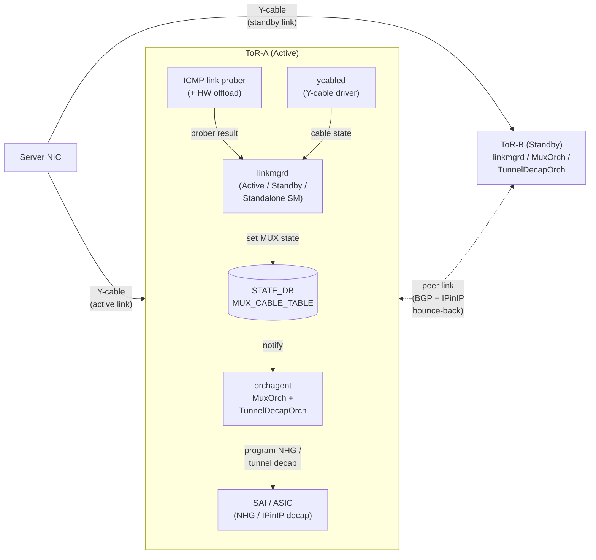

# Dual-ToR 関連

## 概要

**Dual-ToR** は、サーバを 2 つの ToR スイッチに **active-standby** または **active-active** で冗長接続し、片側 ToR の障害時にもサービス断を最小化するクラウド向けトポロジです。Microsoft Azure 由来で、現行 [SONiC](../reference/glossary.md#term-sonic) は **y-cable + [linkmgrd](../reference/glossary.md#term-linkmgrd)** ベースの active-standby と、**prefix-based neighbor + gRPC** ベースの active-active の 2 系統を実装しています。

このカテゴリは Dual-ToR に関わるページを area 横断でまとめます。**overlay**（active-active / active-standby の [HLD](../reference/glossary.md#term-hld)、トンネル [DSCP](../reference/glossary.md#term-dscp) リマップ）・**routing**（mux 連動デフォルトルート、multi-nexthop ループ回避、prefix-based mux neighbor）・**platform**（ICMP HW offload による link prober [NPU](../reference/glossary.md#term-npu) 化）・**management**（DualToR 用 gRPC client）・**reference**（`config muxcable` / `show muxcable` / `MUX_CABLE` テーブル）に分散しているのが特徴です。

Dual-ToR は **active-standby** のほうがマスター実装としては成熟しており、**active-active** は比較的新しく gRPC ベースのケーブル制御に依存します。Y-cable と SoC（Service-on-Cable）が混在する用語空間なので、最初に [`active-standby-dual-tor.md`](../overlay/active-standby-dual-tor.md) を読むと state machine の語彙が整理されます。

主要キーワード: `Dual-ToR`, `active-active`, `active-standby`, `MUX`, `linkmgrd`, `Y-cable`, `SoC`, `linkprober`

## コンポーネント関係図

active-standby Dual-ToR における主要コンポーネントとデータフローを俯瞰する。サーバは Y-cable で ToR-A / ToR-B の両方に接続され、片側のみが Active としてトラフィックを受ける。`linkmgrd` が ICMP link prober と Y-cable driver の状態を入力に state machine（Active / Standby / Standalone）を回し、`STATE_DB:MUX_CABLE_TABLE` を更新する。`orchagent` の `MuxOrch` がこれを購読し、`TunnelDecapOrch` と連動して [SAI](../reference/glossary.md#term-sai) に NHG / route を反映、Standby 側に届いたパケットは IPinIP tunnel で peer ToR にバウンスされる。

凡例: 実線はデータ／制御フロー、点線は peer ToR 間の BGP セッションと Standby → Active 側への IPinIP バウンスバックを表す。active-active 構成では Y-cable driver 部分が gRPC ベースの SoC 制御に置き換わり、両 ToR が同時に Active になる（[`active-active-dual-tor.md`](../overlay/active-active-dual-tor.md) 参照）。

参照ソース: `sonic-linkmgrd/src/link_manager/LinkManagerStateMachineActiveStandby.{h,cpp}`、`sonic-swss/orchagent/muxorch.{h,cpp}`、`sonic-swss/orchagent/tunneldecaporch.{h,cpp}`、`sonic-platform-daemons/sonic-ycabled/`。

## 関連ページ

### overlay（HLD 本体）

- [Active-Standby Dual ToR（y-cable + linkmgrd state machine + IPinIP tunnel）](../overlay/active-standby-dual-tor.md) (area: `overlay`, verification: `code-verified`) — まずこれ
- [Active-Active Dual ToR（gRPC ベース cable control + prefix-based neighbor）](../overlay/active-active-dual-tor.md) (area: `overlay`, verification: `code-verified`)
- [トンネルトラフィックの DSCP / TC リマップ（Dual-ToR PFC デッドロック回避）](../overlay/dscp-remapping-for-tunnel-traffic.md) (area: `overlay`, verification: `discrepancy-found`)

### architecture / management

- [DHCPv6 Relay Agent（Option 79 / dual ToR loopback）](../architecture/dhcpv6-relay-agent.md) (area: `architecture`, verification: `code-verified`)
- [gRPC client（active-active DualToR / ycabled ↔ SoC 連携）](../management/design-doc.md) (area: `management`, verification: `code-verified`)

### platform（HW offload）

- [ICMP Hardware Offload（DualToR link prober の NPU 化）](../platform/icmp-hardware-offload.md) (area: `platform`, verification: `code-verified`)

### routing（mux / nexthop）

- [linkmgrd のデフォルトルート連動（DualToR mux 制御）](../routing/default-route.md) (area: `routing`, verification: `code-verified`)
- [dual-tor mux 跨ぎの multi-nexthop route ループ回避（MuxOrch::updateRoute）](../routing/multiple-nexthop-route-hld.md) (area: `routing`, verification: `code-verified`)
- [プレフィックスルート方式の Mux ネイバ（Dual-ToR の状態遷移最適化）](../routing/prefix-based-mux-neighbors.md) (area: `routing`, verification: `code-verified`)

### reference（CLI / CONFIG_DB）

- [config muxcable サブコマンド](../reference/cli/config-muxcable.md) (area: `reference`, verification: `code-verified`)
- [show muxcable サブコマンド](../reference/cli/show-muxcable.md) (area: `reference`, verification: `code-verified`)
- [MUX_CABLE テーブル](../reference/config-db/mux-cable.md) (area: `reference`, verification: `code-verified`)

## 典型的な読み進め方

1. **active-standby 全体像** → `active-standby-dual-tor.md` で linkmgrd state machine と y-cable・[IPinIP](../reference/glossary.md#term-ipinip) tunnel を把握
2. **CLI / DB** → `config-muxcable.md` / `show-muxcable.md` / `mux-cable.md` で実機操作の語彙
3. **mux 経路制御** → `prefix-based-mux-neighbors.md` → `multiple-nexthop-route-hld.md` で routing 側の挙動
4. **active-active** → `active-active-dual-tor.md` で gRPC ベースの新方式
5. **運用上の落とし穴** → `dscp-remapping-for-tunnel-traffic.md` で [PFC](../reference/glossary.md#term-pfc) デッドロック回避
6. **オフロード最適化** → `icmp-hardware-offload.md` で linkprober の NPU 化

## 関連 Topics 章

- [Topics 05: Dual-ToR](../topics/05-dual-tor/index.md) — Dual-ToR を段階的に学ぶ章
- [Topics 02: BGP](../topics/02-bgp/index.md) — Dual-ToR の上流 [BGP](../reference/glossary.md#term-bgp) 構成
- [Topics 06: L2 VLAN / LAG](../topics/06-l2-vlan-lag/index.md) — [VLAN](../reference/glossary.md#term-vlan) 設計の前提

## verification ステータス注意点

- **discrepancy-found**: `dscp-remapping-for-tunnel-traffic.md`（実装と HLD で挙動差異）

## 関連カテゴリ

- [BGP / EVPN 関連](bgp-evpn.md)
- [gNMI / gNOI / OpenConfig 関連](gnmi-openconfig.md)

<!-- topics-back-ref -->
## 関連 Topics

- [Topics: Dual-ToR と Mux 制御](../topics/05-dual-tor/index.md)

<!-- /topics-back-ref -->

<!-- glossary-links-injected: f9445b5b4106 -->
