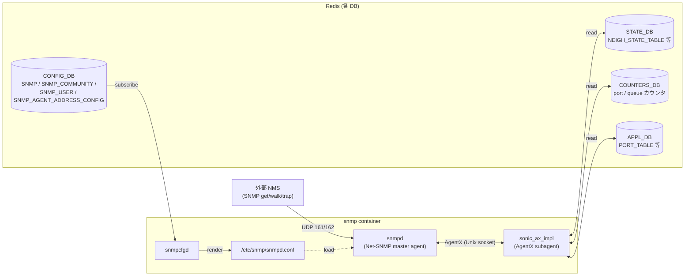

# MIB / SNMP 関連

## 概要

[SONiC](../reference/glossary.md#term-sonic) の [SNMP](../reference/glossary.md#term-snmp) エージェントは **Net-SNMP + sonic_ax_impl (AgentX subagent)** で構成され、`snmpd` が標準 MIB を提供し、Python ベースの subagent が SONiC 固有 MIB（ポート / インタフェース / 物理エンティティ / センサー / トランシーバ / [VRF](../reference/glossary.md#term-vrf) / Dot1agtm 等）を実装しています。設定は歴史的に `snmp.yml` で行っていましたが、現行マスターは [CONFIG_DB](../reference/glossary.md#term-config_db) の `SNMP` / `SNMP_COMMUNITY` / `SNMP_USER` / `SNMP_AGENT_ADDRESS_CONFIG` テーブルに移行済みです。

このカテゴリは MIB / SNMP に関わるページを area 横断でまとめます。**system**（snmp.yml → CONFIG_DB 移行、SNMP IPv6 対応、Entity / Sensor MIB 拡張、Transceiver Monitoring、SNMP TABLE スキーマ提案）・**switching**（L2 モードでの SNMP 検証）・**architecture**（ポート不正パケット用 MIB 拡張）・**reference**（`config snmp` / `snmpagentaddress` / `snmptrap` CLI）に分散しています。

SNMP IPv6 では応答 SRC IP が listening address と一致しない問題があり、`SNMP_AGENT_ADDRESS_CONFIG` で送信元 IP を縛る運用回避が標準です。Entity MIB はシャーシ・ラインカード・PSU / Fan / Sensor を `entPhysicalEntry` の階層に並べる構造で、chassis 環境で重要です。

[BGP](../reference/glossary.md#term-bgp) 監視では CiscoBgp4MIB（OID 1.3.6.1.4.1.9.9.187）が bgpd vty 直結から `bgpmon` daemon 経由で [STATE_DB](../reference/glossary.md#term-state_db) `NEIGH_STATE_TABLE` を読む形に再設計され、multi-[ASIC](../reference/glossary.md#term-asic) でも namespace を跨いで近隣状態を集約できるようになっています。

主要キーワード: `MIB`, `SNMP`, `Entity MIB`, `Sensor MIB`, `CiscoBgp4MIB`, `trap`, `community`, `IPv6`, `AgentX`

## カテゴリ構成図

`snmp` コンテナ内では Net-SNMP の `snmpd` (master agent) と sonic_ax_impl (AgentX subagent) が分離して動作し、SONiC 固有 MIB は subagent から [Redis](../reference/glossary.md#term-redis) 各 DB を読んで応答する。設定は `snmpcfgd` が CONFIG_DB の SNMP 系テーブルを watch して `snmpd.conf` を生成する。

## 関連ページ

### system（HLD 本体）

- [SNMP TABLE スキーマ提案（SNMP / SNMP_COMMUNITY / SNMP_USER）](../system/sonic-snmp-table-schema-proposal.md) (area: `system`, verification: `code-verified`) — CONFIG_DB スキーマの起点
- [SNMP 設定の snmp.yml → CONFIG_DB 移行](../system/snmp-migration-from-snmp-yml-to-configdb.md) (area: `system`, verification: `code-verified`)
- [SNMP IPv6 応答の SRC IP 不整合と SNMP_AGENT_ADDRESS_CONFIG による回避](../system/sonic-snmp-changes-to-support-ipv6.md) (area: `system`, verification: `code-verified`)
- [Entity MIB / Entity Sensor MIB 拡張（chassis 階層化と sensor / fan / PSU 追加）](../system/sonic-entity-mib-and-entity-sensor-mib-extension.md) (area: `system`, verification: `code-verified`)
- [SNMP Transceiver Monitoring テストプラン（Entity MIB / Entity Sensor MIB）](../system/snmp-transceiver-monitoring-testbed-test-plan.md) (area: `system`, verification: `code-verified`)

### routing（BGP MIB）

- [CiscoBgp4MIB の STATE_DB 経由化（bgpmon / NEIGH_STATE_TABLE）](../routing/ciscobgp4mib-implementation-changes.md) (area: `routing`, verification: `code-verified`) — CiscoBgp4MIB（OID 1.3.6.1.4.1.9.9.187）を bgpd vty 直結から STATE_DB `NEIGH_STATE_TABLE` 経由に切替え、multi-ASIC 対応

### architecture / switching

- [ポート不正パケットドロップ設計（Interface MIB / L3 カウンタ拡張）](../architecture/port-illegal-packets-drop-design.md) (area: `architecture`, verification: `hld-only`)
- [SONiC Basic L2 モードテストプラン（FDB / VLAN / SNMP の最小機能検証）](../switching/sonic-basic-l2-mode-test-plan.md) (area: `switching`, verification: `code-verified`)

### reference - CLI

- [config snmp / snmpagentaddress / snmptrap サブコマンド](../reference/cli/config-snmp.md) (area: `reference`, verification: `code-verified`)

## 典型的な読み進め方

1. **設定の基礎** → `sonic-snmp-table-schema-proposal.md` で CONFIG_DB のテーブル構造を把握
2. **移行** → `snmp-migration-from-snmp-yml-to-configdb.md` で snmp.yml ベース運用からの変更点
3. **IPv6 注意点** → `sonic-snmp-changes-to-support-ipv6.md`
4. **物理情報** → `sonic-entity-mib-and-entity-sensor-mib-extension.md` → `snmp-transceiver-monitoring-testbed-test-plan.md` でシャーシ / センサー / トランシーバ
5. **BGP MIB** → `ciscobgp4mib-implementation-changes.md` で multi-ASIC 対応の STATE_DB 経路
6. **CLI** → `config-snmp.md` で実機での設定変更
7. **テスト** → `sonic-basic-l2-mode-test-plan.md`（L2 mode + SNMP）

## 関連 Topics 章

- [Topics 09: Telemetry / SNMP](../topics/09-telemetry-snmp/index.md) — SNMP と telemetry を段階的に学ぶ章
- [Topics 12: Multi-ASIC / VOQ](../topics/12-multi-asic-voq/index.md) — Entity MIB の chassis 階層化の前提
- [Topics 14: Platform / Port / Optics](../topics/14-platform-port-optics/index.md) — Sensor MIB / Transceiver の前提

## verification ステータス注意点

このカテゴリの 9 ページ中 8 ページ（約 89%）が `code-verified` で、CONFIG_DB スキーマ (`sonic-buildimage` の `dockers/docker-snmp/`) と sonic_ax_impl のソース (`src/sonic-snmpagent/`) を直接参照済みです。残る 1 ページのみ [HLD](../reference/glossary.md#term-hld) 段階の提案で master 実装と乖離する可能性があります。

- **hld-only**: `port-illegal-packets-drop-design.md`（ポート不正パケットドロップ用 Interface MIB / L3 カウンタ拡張提案。master の `sonic-snmpagent` 側 OID 追加は未確認のため、運用前に該当 OID の実装有無を要確認）

## 関連カテゴリ

- [Multi-ASIC / VOQ chassis 関連](multi-asic.md)
- [gNMI / gNOI / OpenConfig 関連](gnmi-openconfig.md)

<!-- glossary-links-injected: 0f594312e2b7 -->
