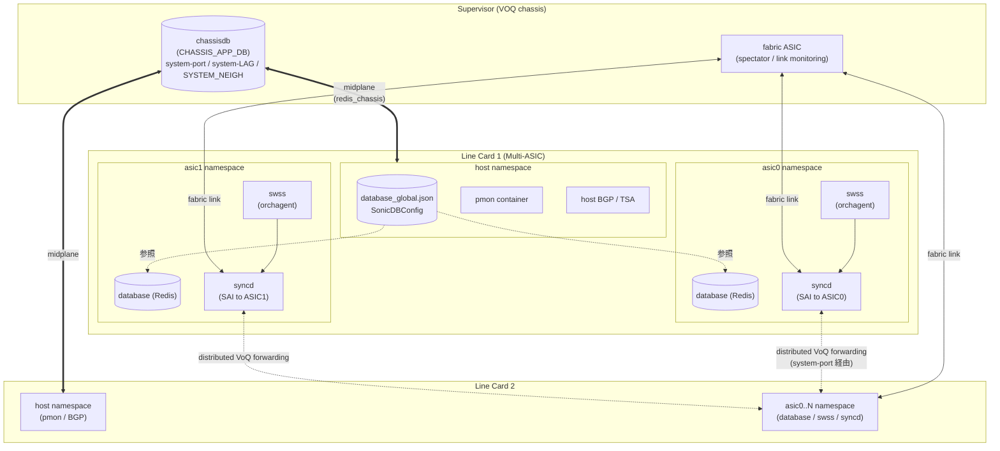

# Multi-ASIC / VOQ chassis 関連

## 概要

**[Multi-ASIC](../reference/glossary.md#term-multi-asic)** は、1 台のスイッチ内に複数の forwarding [ASIC](../reference/glossary.md#term-asic) を搭載するハードウェア構成で、[SONiC](../reference/glossary.md#term-sonic) では **Linux network namespace** ごとに per-ASIC の docker / [Redis](../reference/glossary.md#term-redis) / [orchagent](../reference/glossary.md#term-orchagent) / [BGP](../reference/glossary.md#term-bgp) インスタンスを動かすアーキテクチャを採用しています。

**[VOQ](../reference/glossary.md#term-voq) chassis** はこの考え方を **複数のライン カード + supervisor + fabric ASIC** に拡張した分散システムで、CHASSIS_APP_DB と system-port / system-[LAG](../reference/glossary.md#term-lag) / fabric port などの広域識別子を導入します。

このカテゴリは Multi-ASIC と VOQ chassis に関わるページを area 横断でまとめます。**platform**（VOQ / fabric / recirculation port サポート、provisiond、Golden Config）・**internals**（namespace ごとの Redis、VOQ counter aggregation）・**system**（Multi-ASIC warm-reboot、PMON、Entity MIB）・**routing**（VoQ 向け BGP、reliable TSA）・**switching**（system-LAG）・**acl-qos**（VOQ 分散転送）に分散しています。

VOQ シャシでは **CHASSIS_APP_DB** が新しい広域 DB として登場し、`SYSTEM_NEIGH` / `SYSTEM_LAG_TABLE` / `SYSTEM_PORT_TABLE` が含まれます。Multi-ASIC のもう一つの軸である **fabric ASIC** は fabric link monitoring / spectator role を持ち、ライン カード ASIC と区別されます。

主要キーワード: `Multi-ASIC`, `VOQ`, `chassis`, `namespace`, `fabric`, `line card`, `supervisor`, `CHASSIS_APP_DB`, `system-port`

## カテゴリ構成図

下図は Multi-ASIC プラットフォームと VOQ chassis の主要コンポーネント配置を示します。host namespace と各 ASIC namespace (`asic0` / `asic1` / ...) は同一物理スイッチ内に同居し、`database` / `swss` / `syncd` container がそれぞれ namespace ごとに動作します。VOQ chassis では複数の Line Card (LC) と Supervisor (SUP) が midplane で相互接続され、SUP 上の chassisdb が CHASSIS_APP_DB として system-port / system-LAG / SYSTEM_NEIGH を全 LC で共有します。

凡例:

- **host namespace**: `database_global.json` で各 ASIC namespace の Redis を束ね、PMON / 集約 CLI / host BGP / Reliable TSA を担当します
- **asicN namespace**: per-ASIC の `database` / `swss` / `syncd` container が動作します。orchagent は SAI 経由で対応する ASIC を直接プログラムします
- **chassisdb**: Supervisor 上の Redis で、全 LC が `redis_chassis` 経由で参照する CHASSIS_APP_DB を提供します
- **fabric ASIC**: Supervisor 側で line card ASIC 間の fabric link を監視します (spectator role)
- **distributed VoQ forwarding**: ingress LC が system-port ID で egress を識別し、fabric 経由で転送します

## 関連ページ

### platform（HW / VOQ / fabric / line card）

- [SONiC on Multi-ASIC platforms（namespace / per-asic Redis / sonic-net）](../platform/1-sonic-on-multi-asic-platforms.md) (area: `platform`, verification: `code-verified`) — まずこれ
- [VoQ SONiC（distributed VoQ chassis / system-port / fabric）](../platform/voq-sonic.md) (area: `platform`, verification: `code-verified`)
- [VOQ シャーシの Fabric ポート（fabric ASIC 管理 / link monitoring）](../platform/fabric-port-support-on-sonic.md) (area: `platform`, verification: `code-verified`)
- [VOQ シャシでの recirculation port サポート（Inb / Rec ポートロール）](../platform/recirculation-port-support-on-voq-chassis.md) (area: `platform`, verification: `code-verified`)
- [単一 ASIC VoQ 固定システム（chassisdb.conf による is_voq_chassis 分岐）](../platform/single-asic-voq-fixed-system-sonic.md) (area: `platform`, verification: `code-verified`)
- [VoQ Chassis での Everflow ミラー（recycle port 経由の rewrite）](../platform/everflow-support-on-voq-chassis.md) (area: `platform`, verification: `hld-only`)
- [Chassis Line Card 自動プロビジョニング（sonic-provisiond / provision_module）](../platform/automatic-module-provisioning-for-chassis.md) (area: `platform`, verification: `code-verified`)
- [multi-ASIC 用 Golden Config 単一 JSON フォーマット（localhost / asic0 / asic1 ...）](../platform/db-design-for-multi-asic-scenarios.md) (area: `platform`, verification: `code-verified`)
- [Multi-ASIC Single JSON Configuration（Golden Config に namespace layer）](../platform/multi-asic-single-json-configuration-design.md) (area: `platform`, verification: `code-verified`)
- [新 Platform API（sonic_platform / Chassis / PSU/Fan/Sfp の Python クラス階層）](../platform/global-platform-specific-psuutil-class-instance.md) (area: `platform`, verification: `code-verified`)

### internals（namespace / counter）

- [Multi-ASIC 名前空間の Redis（database_global.json と SonicDBConfig）](../internals/support-redis-databases-in-multiple-namespaces.md) (area: `internals`, verification: `code-verified`)
- [VOQ カウンタ集約（chassis supervisor からの aggregate 表示）](../internals/aggregate-voq-counters-in-sonic.md) (area: `internals`, verification: `code-verified`)

### system（warm-reboot / PMON / MIB）

- [Multi-ASIC warm reboot（namespace 横断の協調 shutdown / boot）](../system/multi-asic-warm-reboot.md) (area: `system`, verification: `code-verified`)
- [PMON の Multi-ASIC 対応（global DB と per-ASIC namespace の役割分担）](../system/platform-monitor-design-for-multi-asic-platforms.md) (area: `system`, verification: `code-verified`)
- [シャーシサブシステムにおける Platform Monitor 要件（Mandatory + Future）](../system/platform-monitor-requirement-for-chassis-subsystem.md) (area: `system`, verification: `code-verified`)
- [Entity MIB / Entity Sensor MIB 拡張（chassis 階層化と sensor / fan / PSU 追加）](../system/sonic-entity-mib-and-entity-sensor-mib-extension.md) (area: `system`, verification: `code-verified`)

### routing / switching / acl-qos

- [VoQ シャーシでの BGP 構成（iBGP フルメッシュ + addpath / multipath-relax）](../routing/bgp-setup-for-voq-chassis.md) (area: `routing`, verification: `code-verified`)
- [Reliable TSA（VoQ Chassis 全体での TSA を CHASSIS_APP_DB で同期）](../routing/reliable-tsa.md) (area: `routing`, verification: `code-verified`)
- [分散 VOQ シャシでの LAG（SYSTEM_LAG_TABLE と system_lag_id）](../switching/lag-on-distributed-voq-system.md) (area: `switching`, verification: `hld-only`)
- [VoQ アーキテクチャの分散転送（FSI/SSI と Chassis DB / redis_chassis）](../acl-qos/distributed-forwarding-in-a-virtual-output-queue-voq-architecture.md) (area: `acl-qos`, verification: `code-verified`)

## 典型的な読み進め方

1. **Multi-ASIC 基礎** → `1-sonic-on-multi-asic-platforms.md` で namespace / per-ASIC Redis / sonic-net の概要
2. **Redis 構造** → `support-redis-databases-in-multiple-namespaces.md` で `database_global.json` の役割
3. **VOQ chassis の全体像** → `voq-sonic.md` で distributed VoQ / system-port / fabric の概念
4. **fabric / recirculation** → `fabric-port-support-on-sonic.md` → `recirculation-port-support-on-voq-chassis.md`
5. **設定管理** → `multi-asic-single-json-configuration-design.md` → `db-design-for-multi-asic-scenarios.md`
6. **運用** → `multi-asic-warm-reboot.md`（reboot）、`platform-monitor-design-for-multi-asic-platforms.md`（PMON）、`automatic-module-provisioning-for-chassis.md`（line card 追加）
7. **ルーティング** → `bgp-setup-for-voq-chassis.md` → `reliable-tsa.md`
8. **データプレーン** → `distributed-forwarding-in-a-virtual-output-queue-voq-architecture.md` で VOQ 分散転送

## 関連 Topics 章

- [Topics 12: Multi-ASIC / VOQ](../topics/12-multi-asic-voq/index.md) — Multi-ASIC / VOQ を段階的に学ぶ章
- [Topics 14: Platform / Port / Optics](../topics/14-platform-port-optics/index.md) — PMON / platform API の前提
- [Topics 11: Reboot / Upgrade](../topics/11-reboot/index.md) — Multi-ASIC warm reboot の前提

## verification ステータス注意点

- **hld-only**: `everflow-support-on-voq-chassis.md`, `lag-on-distributed-voq-system.md`

## 関連カテゴリ

- [Warm-Reboot / Fast-Reboot 関連](reboot.md)
- [BGP / EVPN 関連](bgp-evpn.md)
- [MIB / SNMP 関連](mib-snmp.md)
- [Container / Build system 関連](container-build.md)

<!-- glossary-links-injected: 5c9b3765d470 -->

<!-- topics-back-ref -->
## 関連 Topics

- [Topics: Multi-ASIC / VOQ Chassis](../topics/12-multi-asic-voq/index.md)

<!-- /topics-back-ref -->
