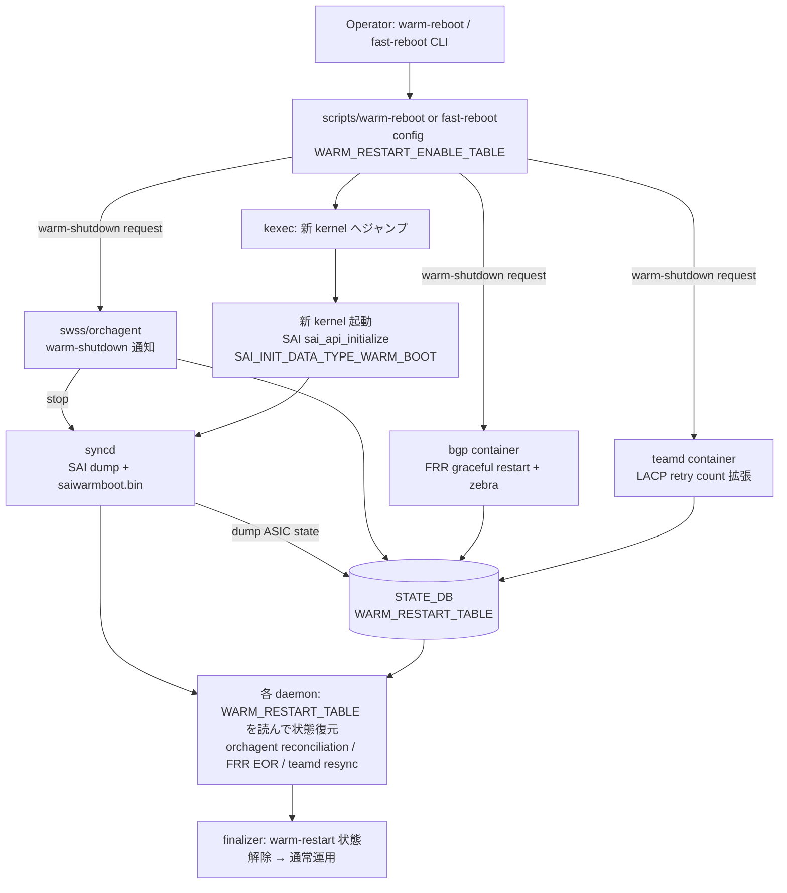

# Warm-Reboot / Fast-Reboot 関連

## 概要

**[Warm Reboot](../reference/glossary.md#term-warm-reboot)** はデータパス維持（無瞬断）を目標とした [SONiC](../reference/glossary.md#term-sonic) 再起動方式、**[Fast Reboot](../reference/glossary.md#term-fast-reboot)** は数十秒〜数分のサービス停止を許容しつつ通常 reboot より高速にイメージを切り替える方式です。両者とも `kexec` で新カーネルにジャンプし、SWSS / [syncd](../reference/glossary.md#term-syncd) / [orchagent](../reference/glossary.md#term-orchagent) / [BGP](../reference/glossary.md#term-bgp) / [LACP](../reference/glossary.md#term-lacp) などのプロセスを **warm restart モード** で再立ち上げして、[ASIC](../reference/glossary.md#term-asic) の状態を可能な限り再利用します。

このカテゴリは、warm/fast reboot に関わるページを area 横断でまとめます。**system**（warm-reboot 全体順序・SWSS docker warm restart・libsairedis idempotence・[Multi-ASIC](../reference/glossary.md#term-multi-asic) warm-reboot）・**switching**（LACP retry 拡張・[ProducerStateTable](../reference/glossary.md#term-producerstatetable) view switching）・**routing**（BGP テストプラン）・**reference**（`reboot` / `fast-reboot` / `warm-reboot` CLI）に分散しています。

歴史的に warm-reboot は「syncd view comparison 方式」と「libsairedis idempotence 方式」の 2 系統で発展しており、現行マスターは後者ベースです。設計の経緯は [`what-are-the-development-phases-and-scope-for-warm-reboot.md`](../system/what-are-the-development-phases-and-scope-for-warm-reboot.md) を参照すると理解しやすいです。

主要キーワード: `warm reboot`, `fast reboot`, `warm restart`, `kexec`, `SWSS`, `docker`, `libsairedis idempotence`

## カテゴリ内 component 関係図

warm-reboot / fast-reboot の主要 component と順序を 1 枚にまとめたものです。各ノードはおおむね `sonic-utilities/scripts/{warm-reboot,fast-reboot,reboot}` および swss/syncd の warm restart hook、`STATE_DB:WARM_RESTART_TABLE` を参照しています。

参考実装: `sonic-utilities/scripts/warm-reboot` / `fast-reboot` / `reboot`、`sonic-swss/orchagent/warmRestartHelper.*`、`sonic-sairedis/syncd/SaiSwitch.cpp`（`SAI_INIT_DATA_TYPE_WARM_BOOT`）、`fast-reboot-dump.py`（fast-reboot 用 [FDB](../reference/glossary.md#term-fdb)/[ARP](../reference/glossary.md#term-arp) dump）。

## 関連ページ

### system（HLD / 全体順序）

- [SONiC Warm Reboot（要件・順序・docker 別 warm restart）](../system/sonic-warm-reboot.md) (area: `system`, verification: `code-verified`) — まずこれ
- [Warm Reboot 開発フェーズと OID 復元戦略（idempotent libsairedis vs syncd view comparison）](../system/what-are-the-development-phases-and-scope-for-warm-reboot.md) (area: `system`, verification: `code-verified`)
- [Fast-reboot Flow Improvements（finalizer / reconciliation）](../system/fast-reboot-flow-improvements-hld.md) (area: `system`, verification: `hld-only`)
- [Multi-ASIC warm reboot（namespace 横断の協調 shutdown / boot）](../system/multi-asic-warm-reboot.md) (area: `system`, verification: `code-verified`)
- [SWSS docker warm restart（state restore / consistency / sync up）](../system/sonic-swss-docker-warm-restart.md) (area: `system`, verification: `code-verified`)
- [SWSS docker の Warm Restart 実装メモ（開発時リファレンス）](../system/swss-docker-warm-restart-code-reference.md) (area: `system`, verification: `discrepancy-found`)
- [libsairedis API idempotence（warm restart 用 OID キャッシュと duplicate 抑止）](../system/sonic-libsairedis-api-idempotence-support.md) (area: `system`, verification: `discrepancy-found`)
- [kdump（kexec ベース kernel crash dump / makedumpfile）](../system/kdump.md) (area: `system`, verification: `code-verified`)

### switching（LACP / view switching）

- [Warm-reboot 中の LACP retry count 拡張（LACP version 0xf1 / 新規 TLV）](../switching/increasing-lacp-pdu-timeout-during-warm-reboot.md) (area: `switching`, verification: `code-verified`)
- [ProducerStateTable の view switching（warm reboot 用の差分適用）](../switching/view-switching-in-producerstatetable.md) (area: `switching`, verification: `code-verified`)

### routing / reference

- [VRF Ansible テストプラン（T0 上で BGP/ACL/loopback/warm-reboot 含む E2E 検証）](../routing/vrf-feature-ansible-test-plan-omit-in-toc.md) (area: `routing`, verification: `hld-only`)
- [reboot / fast-reboot / warm-reboot コマンド](../reference/cli/reboot-fast-warm.md) (area: `reference`, verification: `code-verified`)

## 典型的な読み進め方

1. **全体像** → `sonic-warm-reboot.md` で warm reboot 全体の要件・順序・docker 別動作
2. **設計の経緯** → `what-are-the-development-phases-and-scope-for-warm-reboot.md` で idempotent libsairedis 方式の前提
3. **docker レベル** → `sonic-swss-docker-warm-restart.md` で state restore / consistency / sync up
4. **特殊ケース** → `multi-asic-warm-reboot.md`（Multi-ASIC）・`increasing-lacp-pdu-timeout-during-warm-reboot.md`（LACP）
5. **Fast Reboot** → `fast-reboot-flow-improvements-hld.md` で finalizer / reconciliation
6. **CLI** → `reboot-fast-warm.md` で実機での `warm-reboot` / `fast-reboot` コマンド

## 関連 Topics 章

- [Topics 11: Reboot / Upgrade](../topics/11-reboot/index.md) — Reboot 系を段階的に学ぶ章（`concept` → `setup` → `operations` → `internals` → `advanced` → `upgrade`）
- [Topics 12: Multi-ASIC / VOQ](../topics/12-multi-asic-voq/index.md) — Multi-ASIC warm reboot の前提
- [Topics 20: SWSS / SAI / Redis](../topics/20-swss-sai-redis/index.md) — libsairedis idempotence の前提

## verification ステータス注意点

- **hld-only**: `fast-reboot-flow-improvements-hld.md`, `vrf-feature-ansible-test-plan-omit-in-toc.md`
- **discrepancy-found**: `swss-docker-warm-restart-code-reference.md`, `sonic-libsairedis-api-idempotence-support.md`（[HLD](../reference/glossary.md#term-hld) と現行コードの差異）

## 関連カテゴリ

- [Multi-ASIC / VOQ chassis 関連](multi-asic.md)
- [Container / Build system 関連](container-build.md)
- [SmartSwitch 関連](smartswitch.md)
- [SAI 拡張属性追加系](sai-extensions.md)

<!-- topics-back-ref -->
## 関連 Topics

- [Topics: Reboot / Upgrade / Lifecycle](../topics/11-reboot/index.md)

<!-- /topics-back-ref -->

<!-- glossary-links-injected: e4b2e36fdb1e -->
