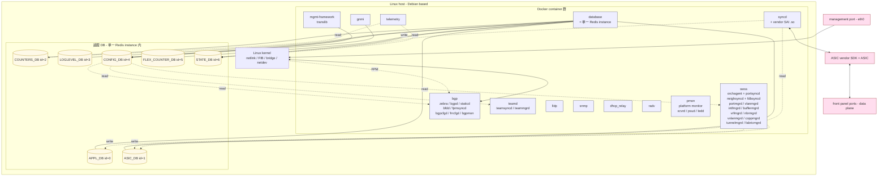
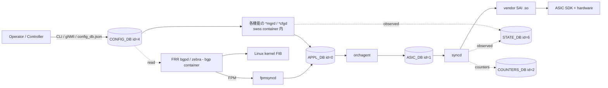

# 全体俯瞰と必読 10 (Essentials)

このページは **[SONiC](./reference/glossary.md#term-sonic) をこれから触る技術者が最初に開く 1 ページ** である。先に「Linux box の中で何が動いているか」「[Redis](./reference/glossary.md#term-redis) DB は何のためにあるか」「設定 1 行はどう [ASIC](./reference/glossary.md#term-asic) に届くか」を 1 枚図と 4 用語で固めてから、本サイト 1,000 ページの中で **最初に読むべき 10 ページ** に降りていく。

本ページ自体は curation ではなく入口だが、機能の具体仕様は引用元 commit SHA 付きでリンク先ページに置く方針なので、用語の壁を越えたあとはリンク先で裏取りを取ってほしい。

---

## SONiC の component 俯瞰 (1 枚)

SONiC は **Debian ベースの Linux の上に、機能ごとの Docker container と、単一 Redis instance 内に置かれた論理 DB 群と、[SAI](./reference/glossary.md#term-sai) (Switch Abstraction Interface) library が載った [syncd](./reference/glossary.md#term-syncd) container** で出来ている。下図は標準ビルドで起動される container と DB の対応関係をまとめたものである (vendor 固有 SDK / kernel driver は省略)。

**読み方の要点**:

- **container は機能で分かれている** (再起動 / upgrade 単位もこの境界で切れる)。標準ビルドの FEATURE 一覧は `init_cfg.json.j2` で定義され、`bgp / database / pmon / swss / syncd` に加えて `radv / lldp / snmp / teamd / dhcp_relay / mgmt-framework / nat / restapi / sflow / macsec / gnmi / telemetry / eventd / dhcp_server / mux / iccpd / p4rt / otel` がビルドフラグや device type で条件付きに足される (参照: `sonic-buildimage/files/build_templates/init_cfg.json.j2:67-98`)。
- **Redis instance は標準で 1 つ**。論理 DB id で役割を分けている。ID は `sonic-swss-common/common/database_config.json:14-114` で固定: `APPL_DB=0 / ASIC_DB=1 / COUNTERS_DB=2 / LOGLEVEL_DB=3 / CONFIG_DB=4 / FLEX_COUNTER_DB=5 / STATE_DB=6`。`SNMP_OVERLAY_DB=7`、`RESTAPI_DB=8`、Gearbox 用 `GB_*=9-11`、Chassis 用 `CHASSIS_APP_DB=12` / `CHASSIS_STATE_DB=13` (こちらは別 instance `redis_chassis`)、`APPL_STATE_DB=14`、[SmartSwitch](./reference/glossary.md#term-smartswitch) [DPU](./reference/glossary.md#term-dpu) 用 `DPU_*=15-18` も同ファイルで定義される。
- **SAI library は syncd container の中に vendor 固有 `.so` として置かれる**。`ASIC_DB` を読むのも ASIC vendor SDK を呼ぶのも syncd 1 プロセスである。
- **kernel と [FRR](./reference/glossary.md#term-frr) の [FPM](./reference/glossary.md#term-fpm) 経路** は SONiC 特有のパス: FRR は経路を Linux kernel に install しつつ、FPM 経由で `fpmsyncd` に渡し、`fpmsyncd` が `APPL_DB:ROUTE_TABLE` に書き込み、`orchagent` がそれを `ASIC_DB` に投影する。
- 図中の container 内訳 (`swss` 内の `*mgrd` 群、`bgp` 内の FRR daemon) は `dockers/docker-orchagent/critical_processes.j2:1-19` と `dockers/docker-fpm-frr/frr/supervisord/supervisord.conf.j2:1-50` から取った代表的なもので、ビルド条件で足し引きされる process は省略してある。

---

## 最初に押さえる 4 用語

ここを越えると以降のページがほぼ全部読めるようになる、という最小集合。

| 用語 | 1 行説明 | 「何の役割か」を最短で |
| --- | --- | --- |
| [CONFIG_DB](./reference/glossary.md#term-config_db) (Redis DB id=4) | 運用者 / controller の **意図** を保持する DB。`config_db.json` に永続化される | 「ここに書き込めば SONiC は反映を試みる」唯一の正解入口 |
| [orchagent](./reference/glossary.md#term-orchagent) (swss container 内) | `APPL_DB` を購読して **SAI 呼び出しに変換** する中心 daemon | 機能ごとの `*mgrd` の意図を 1 箇所で ASIC 投影に集約する |
| [syncd](./reference/glossary.md#term-syncd) (syncd container 内) | `ASIC_DB` を購読して **vendor SAI library 経由で [ASIC SDK](./reference/glossary.md#term-asic-sdk)** に流す daemon | vendor 依存を 1 プロセスに閉じ込める「アダプタ」 |
| [SAI](./reference/glossary.md#term-sai) (Switch Abstraction Interface) | ASIC vendor が実装する **C API 仕様**。`.so` として syncd にロード | NOS を vendor 非依存に保つための契約 |

この 4 つが理解できれば、本サイトのほぼ全ての機能ページの「設定 → 反映」フローが追える。

---

## 設定 1 行が ASIC に届くまで (典型フロー)

切り分けの基本姿勢は「**CONFIG_DB に値があるか / [APPL_DB](./reference/glossary.md#term-appl_db) に降りたか / [ASIC_DB](./reference/glossary.md#term-asic_db) まで届いたか / SAI 呼び出しが成功したか**」をホップごとに確認すること。詳細は [概念と読み始め方](topics/01-overview/concept.md) と [設定データフロー](topics/01-overview/architecture.md) で扱う。

---

## 推奨読破順 (Essentials 10)

上から順に読むと、SONiC の設定・データプレーン・制御プレーン・運用が一通り見える。各 entry に **そのページを読むと何が分かるか** を 1 文添えた。

### 1. [SONiC 全体像と設定基盤](topics/01-overview/index.md)

章扉。本ページの図をさらに「設定変更の選び方 / 安全な切り戻し」軸で深掘りする。**読了後**: SONiC 全機能を読むときに「どの daemon・どの DB を見るか」の見当が常に付く。

### 2. [概念と読み始め方](topics/01-overview/concept.md)

「CONFIG_DB と APPL_DB の違い」「orchagent と syncd の責務分担」「Kubernetes の desired/observed と SONiC の意図/観測 DB の対応」など、最初の数時間でつまずきやすい点を網羅。**読了後**: 用語の壁が消える。

### 3. [設定データフロー](topics/01-overview/architecture.md)

`DEVICE_METADATA` / `FEATURE` / 機能別テーブル → `*mgrd` → `APPL_DB` → `orchagent` → `ASIC_DB` → `syncd` → `SAI` の完全な 1 枚図。**読了後**: 設定 1 行が反映されない時に「どのホップを見るか」を即決できる。

### 4. [SWSS / SAI / Redis 内部実装](topics/20-swss-sai-redis/index.md)

`swss` / `sai` / `syncd` / Redis の関係を機能横断で再整理する章扉。**読了後**: 「どの daemon がどの DB を subscribe しているか」が頭に入り、以降の [HLD](./reference/glossary.md#term-hld) ページの読了速度が大幅に上がる。

### 5. [用語集 (Glossary)](reference/glossary.md)

固有用語・略語・コンポーネント名・DB 名・daemon 名の日本語用語集。**読了後**: 読書中に詰まった語をその場で引ける (常時開きを推奨)。

### 6. [BGP と FRR 制御プレーン](topics/02-bgp/index.md)

SONiC で最頻出の L3 制御プレーン。FRR が Linux kernel に経路を install しつつ FPM 経由で `fpmsyncd` → `APPL_DB` に流す独自モデルがここで明確になる。**読了後**: L3 全般のデータパスを抽象的に推測できる。

### 7. [L2 / VLAN / LAG](topics/06-l2-vlan-lag/index.md)

L2 スイッチング、[VLAN](./reference/glossary.md#term-vlan)、[LAG](./reference/glossary.md#term-lag) (ポートチャネル) の章扉。**読了後**: ToR / リーフ構成を組む時の必須テーブル (`VLAN` / `VLAN_MEMBER` / `PORTCHANNEL` 等) の役割が掴める。

### 8. [Telemetry / SNMP / Observability](topics/09-telemetry-snmp/index.md)

telemetry / [gNMI](./reference/glossary.md#term-gnmi) / [SNMP](./reference/glossary.md#term-snmp) / syslog の章扉。`COUNTERS_DB` / `STATE_DB` がどこから書かれ誰が読むかが整理される。**読了後**: 運用に入った時の「監視どう取るか」の選択肢が見える。

### 9. [Reboot / Upgrade / Lifecycle](topics/11-reboot/index.md)

cold / warm / fast / soft reboot の違い、image install、config 保持の境界。**読了後**: 「再起動したら設定が消えた」「warm reboot で経路断が出た」を事前に避けられる。

### 10. [Runbooks (症状逆引き)](reference/runbooks/index.md)

現場症状から切り分け手順を逆引きする索引。**読了後**: 障害発生時に検索すべきキーワードが頭に入り、Runbook の網がどこにあるかを覚えられる。

---

## 読み手別の次の一歩

10 ページを読んだあとの深掘り方向を職種別に置く (フル版は [読み手別ガイド](guides/index.md))。

- **ネットワークエンジニア**: [BGP](topics/02-bgp/index.md) → [L2 / VLAN / LAG](topics/06-l2-vlan-lag/index.md) → [VRF / ECMP](topics/04-vrf-ecmp/index.md) → [VXLAN / EVPN](topics/03-vxlan-evpn/index.md) → [ACL / CoPP / Mirror](topics/07-acl-copp-mirror/index.md) → [QoS / Buffer](topics/08-qos-buffer/index.md) の順で、L3 → L2 → オーバーレイ → ポリシーへ降りていく。
- **ソフトウェアエンジニア**: [SWSS / SAI / Redis 内部](topics/20-swss-sai-redis/internals.md) → [Build / Packaging](topics/19-build-packaging/index.md) → [Lab / vs / Developer](topics/21-lab-vs-developer/index.md) → [P4 / PINS](topics/18-p4-pins/index.md) → [DASH / SmartSwitch](topics/13-dash-smartswitch/index.md)。
- **運用エンジニア**: [Telemetry / SNMP](topics/09-telemetry-snmp/index.md) → [gNMI / OpenConfig](topics/10-gnmi-openconfig/index.md) → [Reboot / Upgrade](topics/11-reboot/index.md) → [Runbooks](reference/runbooks/index.md) → [Security / AAA](topics/15-security-aaa/index.md) → [Platform / Port / Optics](topics/14-platform-port-optics/index.md)。

## さらに先へ

- 機能横断の全章一覧: [Topics 目次](topics/index.md)
- HLD 単位の詳細: [Architecture](architecture/index.md) / [Routing](routing/index.md) / [Switching](switching/index.md) / [Overlay](overlay/index.md) / [ACL/QoS](acl-qos/index.md) / [System](system/index.md) / [Management](management/index.md) / [Platform](platform/index.md) / [Internals](internals/index.md)
- 辞書引き: [リファレンス横断索引](topics/22-reference-index/index.md) / [Reference 目次](reference/index.md)
- 本サイトの方針: [About](about.md)

本ページは `verification: meta` (curation + 自前裏取り)。図中の container 構成・FRR daemon 構成・Redis DB 番号は frontmatter `sources` の引用先で裏取り済み (commit SHA は `meta/index/repos.json` 管理)。誤りに気付いたら [GitHub Issues](https://github.com/aoki-taquan/sonic-unofficial-docs/issues/new/choose) へ。

<!-- glossary-links-injected: a28f57d3421b -->
