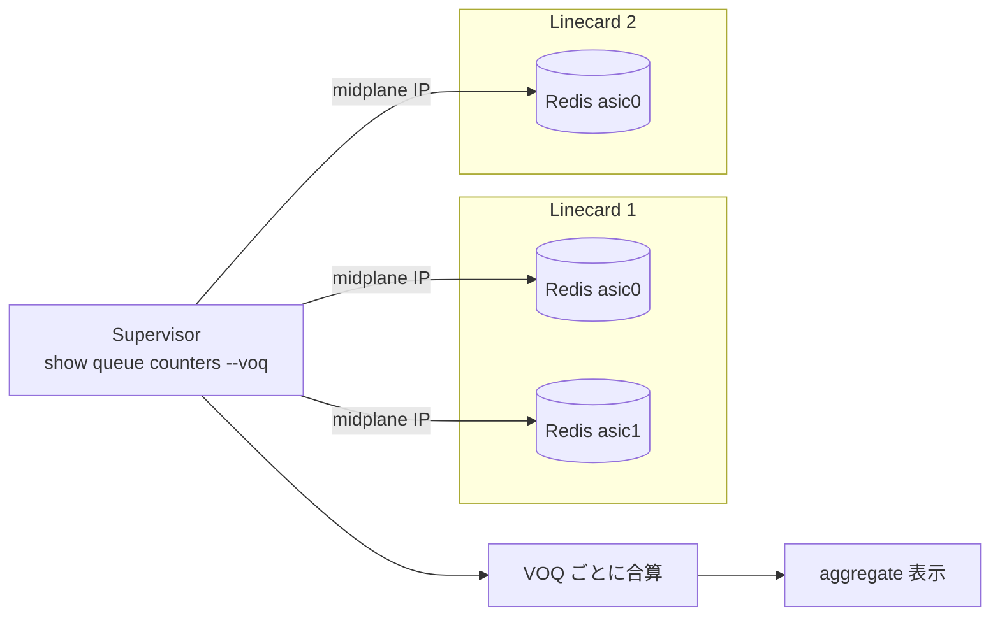

<!-- topics-tip -->
!!! tip "Topics で読み物として読む"
    この HLD は実装詳細を含みます。機能の概念・設定・運用を読み物として読みたい場合は [Topics 09 章: Telemetry / SNMP / ログ](../topics/09-telemetry-snmp/index.md) を参照。
<!-- /topics-tip -->

!!! note "裏取りステータス: code-verified"
    `sonic-buildimage/files/build_templates/docker_image_ctl.j2` で `midplane_ip` 取得（chassis 系）と `redis-cli ... config set bind "$bound_ips $midplane_ip"` (l.370-373) を確認。`sonic-utilities/scripts/queuestat` に `voq` モード（`QUEUE_TYPE_VOQ`, `voq_header`, `voq_counter_bucket_dict`）あり。`sonic-swss-common/common/dbconnector.h` に `DBConnector(int dbId, const std::string &hostname, int port, ...)` の hostname/port 引数コンストラクタが存在し、midplane IP 経由接続に使える。

# VOQ カウンタ集約（chassis supervisor からの aggregate 表示）

## 概要

distributed [VOQ](../reference/glossary.md#term-voq) アーキテクチャでは、ある **出力 VOQ** に対応する VOQ が **システム内のすべての ASIC** に存在する[^1]。各 ASIC の VOQ stats は独立した FSI に乗っており、ユーザは見たい 1 ポートのキュー深度や drop を把握するために **ASIC 単位の出力を手で足し合わせる** 必要があった。

この [HLD](../reference/glossary.md#term-hld) は chassis 系のシステムにおいて **supervisor から各 linecard / ASIC の [Redis](../reference/glossary.md#term-redis) に直接接続** し、`show queue counters --voq` で **VOQ 単位に sum を取った aggregate ビュー** を返せるようにする変更を定義している[^1]。アーキテクチャ自体は変えず、Redis を midplane IP 経由でも待ち受けさせる「アクセス経路の追加」と、それを使う CLI 改修だけで構成される[^1]。

## 動作仕様

### 既存の制約

multi-ASIC system（fixed もしくは linecard）では、各 namespace に対応する Redis インスタンスは **docker network 上の non-loopback IP に bind** されており、loopback IP でないため Redis は **unprotected mode** で起動している[^1]。これにより同一機内の他コンテナから接続できる構造になっているが、**chassis supervisor からは届かない**。

### 仕組み

`docker_image_ctl.j2` を改修し、chassis 系の linecard 上では **midplane IP も Redis の bind 対象に追加** する[^1]:

```bash
redis-cli -h $ip -p $port config set bind "$bound_ips $midplane_ip"
redis-cli -h $ip -p $port config rewrite
```

これで supervisor から midplane IP 経由で各 ASIC の Redis インスタンスに到達できる。あとは supervisor 上の `queuestat` / `show queue counters --voq` が全 ASIC の Redis を読み、ASIC 単位の VOQ カウンタを **system port 単位で sum** すれば aggregate 表示になる[^1]。



### 必要となる変更

HLD は以下のリポジトリ変更を列挙している[^1]:

| repo | 変更内容 | 関連 PR |
|------|---------|--------|
| `sonic-buildimage` | `docker_image_ctl.j2` を改修し linecard 上で namespace Redis を midplane IP に公開 | [PR 20803](https://github.com/sonic-net/sonic-buildimage/pull/20803) |
| `sonic-swss-common` | `sonicv2connector.cpp` に「db 名と host IP を引数に取る」新 API を追加 | [PR 1003](https://github.com/sonic-net/sonic-swss-common/pull/1003) |
| `sonic-py-swsssdk` | 同等の API を Python 側 `dbconnector.py` に追加 | [PR 147](https://github.com/sonic-net/sonic-py-swsssdk/pull/147) |
| `sonic-utilities` | supervisor 上で `show queue counters --voq` を全 ASIC fanout・合算 | [PR 3617](https://github.com/sonic-net/sonic-utilities/pull/3617) |

新 API が必要な理由は、既存 `sonicv2connector` API が **db_name から `database_config.json` を見て host IP / port を解決する** 設計で、**同一機内の namespace Redis 接続専用** になっているため[^1]。midplane IP 経由で外部の Redis に接続するには「IP を引数で受ける」インターフェースが必要になる。

### CLI の出力

既存 CLI は ASIC 単位の表示だけを返す。例えば linecard `cmp217-5` 上で[^1]:

```text
$ show queue counters -n asic0 "cmp217-5|asic1|Ethernet256" --voq
For namespace asic0:
   Port                       Voq    Counter/pkts    ...
   cmp217-5|asic1|Ethernet256 VOQ0   123             ...
$ show queue counters -n asic1 "cmp217-5|asic1|Ethernet256" --voq
For namespace asic1:
   ...
   cmp217-5|asic1|Ethernet256 VOQ0   1111            ...
```

supervisor では `-n` を取り除いた **同じコマンド形** で aggregate を出す[^1]:

```text
admin@cmp217:~$ show queue counters "cmp217-5|asic1|Ethernet256" --voq
   Port                       Voq    Counter/pkts   ...
   cmp217-5|asic1|Ethernet256 VOQ0   1234           ...   # = 123 + 1111
```

つまり **VOQ0 単位で全 ASIC の値を sum したもの** が表示される。コマンド形が既存と一致するため、ユーザは supervisor で打ったか linecard で打ったかを意識せずに済む[^1]。

<!-- evidence:
source: sonic-net/SONiC/doc/voq/aggregate_voq_counters.md#L34-L44 (sha: 49bab5b5ff0e924f1ea52b3d9db0dfa4191a7c06)
excerpt: |
  We can leverage this property to expose redis instances that correspond to each ASIC over midplane IP addresses
  redis-cli -h $ip -p $port config set bind "$bound_ips $midplane_ip"
  redis-cli -h $ip -p $port config rewrite
  Then queuestat script can access the counters data and provide the user an aggregated view of the VOQ counters.
reasoning: midplane IP に Redis を公開してから supervisor の queuestat が aggregate するという中核手順の根拠。
-->

<!-- evidence-rendered:start -->
??? note "📋 検証エビデンス: sonic-net/SONiC/doc/voq/aggregate_voq_counters.md#L34-L44 (sha: 49bab5b5ff0e924f1ea52b3d9db0dfa4191a7c06)"

    **出典**:

    `sonic-net/SONiC/doc/voq/aggregate_voq_counters.md#L34-L44 (sha: 49bab5b5ff0e924f1ea52b3d9db0dfa4191a7c06)`

    **抜粋**:

    ```text
    We can leverage this property to expose redis instances that correspond to each ASIC over midplane IP addresses
    redis-cli -h $ip -p $port config set bind "$bound_ips $midplane_ip"
    redis-cli -h $ip -p $port config rewrite
    Then queuestat script can access the counters data and provide the user an aggregated view of the VOQ counters.
    ```

    **判断根拠**: midplane IP に Redis を公開してから supervisor の queuestat が aggregate するという中核手順の根拠。

<!-- evidence-rendered:end -->

## 設定

このページの機能はビルド時のテンプレ変更と CLI 拡張で完結する。エンドユーザ向け設定インターフェースは HLD では定義されていない。

### 関連する CONFIG_DB

該当エントリは HLD 内で定義されていない。

### 関連する CLI

| Command | 用途 |
|---------|------|
| `show queue counters <port> --voq` | ASIC 単位（linecard）/ aggregate（supervisor）の VOQ 統計表示 |
| `show queue counters -n <namespace> <port> --voq` | 既存の ASIC 単位表示（namespace 指定）|

clear 系は **未対応**（後述の制限事項）[^1]。

## 制限事項

HLD が明示している制限[^1]:

1. **single ASIC linecard では Redis を midplane IP に公開しない**。single ASIC の場合 Redis は protected mode で動作しており、外部公開の改修対象外となっているため。
2. **aggregate VOQ カウンタの clear は未サポート**。supervisor 上での `sonic-clear queue counters` 相当の集約クリア機能はこの HLD のスコープ外。

加えて HLD には未明示だが運用上気にする点:

- midplane IP に Redis を unprotected で晒す形になるため、**midplane network のセキュリティ前提に依存** する。chassis 内クローズドネットワークでないと攻撃面になる。

## 干渉する機能

- **既存 `show queue counters` (linecard 上)**: 影響なし。`-n <ns>` 指定の ASIC 単位表示はそのまま残る。
- **`sonicv2connector` を使う他のスクリプト**: 既存 API は維持される。新 API（db 名 + host IP 引数）は midplane 接続用途専用。
- **chassis startup 順序**: midplane IP の bind は `docker_image_ctl.j2` のテンプレ展開時に行われるため、linecard 上の database docker 起動完了 → supervisor の CLI が叩ける、という依存関係が発生する。supervisor 側で繋がらなかった場合のフォールバック挙動は HLD には記述されていない。
- **distributed VOQ architecture**: 前提として `doc/voq/architecture.md` の VOQ アーキテクチャに従う chassis を対象とする。fixed multi-ASIC でも midplane IP の概念がない場合は本機能の対象外。

## トラブルシューティング

- supervisor で `show queue counters --voq` が空: midplane IP に Redis が bind されていない可能性。linecard 側で `redis-cli config get bind` を確認。
- 数値が ASIC 単位の合計と合わない: 集計対象の ASIC のうち一部の Redis に到達できていない可能性。supervisor から `redis-cli -h <midplane_ip>` で疎通確認。
- 単一 ASIC linecard で aggregate が出ない: HLD の制限事項に該当。supervisor からの aggregate 表示は対象外。
- aggregate 値を clear したい: 現状 unsupported。各 linecard / namespace で個別に `sonic-clear` する必要がある。

## 引用元

[^1]: `sonic-net/SONiC` `doc/voq/aggregate_voq_counters.md` @ `49bab5b5ff0e924f1ea52b3d9db0dfa4191a7c06`

<!-- evidence (verifier-batch-19):
- sonic-buildimage `files/build_templates/docker_image_ctl.j2` で `midplane_ip` 変数（l.196〜265）と `redis-cli -h $ip -p $port config set bind "$bound_ips $midplane_ip"` + `config rewrite` (l.370-373) を確認
- sonic-utilities `scripts/queuestat` に `QUEUE_TYPE_VOQ='VOQ'`, `SAI_QUEUE_TYPE_UNICAST_VOQ`, `COUNTERS_VOQ_NAME_MAP`, `voq_header` テーブル、`Queuestat(... voq=...)` 引数 (l.71-206)
- sonic-swss-common `common/dbconnector.h` に `DBConnector(int dbId, const std::string &hostname, int port, unsigned int timeout_ms);` (l.217) の hostname/port 直指定コンストラクタあり
-->

<!-- topics-back-ref -->
## 関連 Topics

- [Topics: Multi-ASIC / VOQ Chassis](../topics/12-multi-asic-voq/index.md)

<!-- /topics-back-ref -->

<!-- glossary-links-injected: 82f91cfcd8af -->
