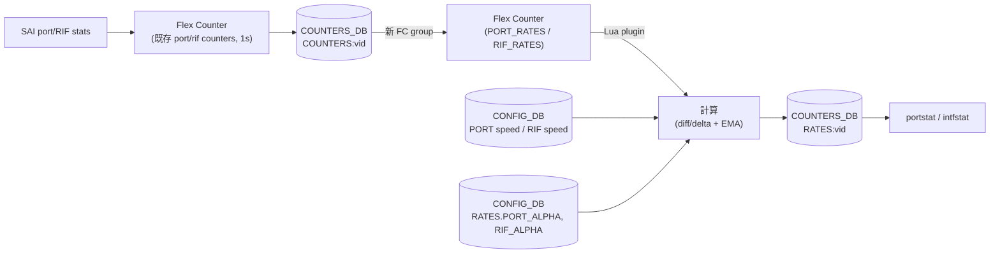
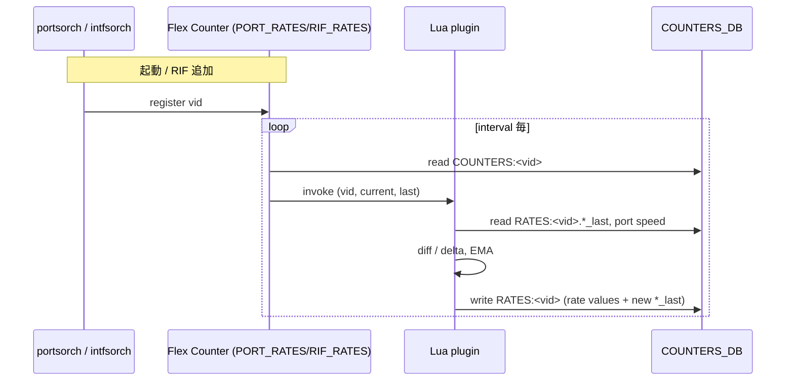

<!-- topics-tip -->
!!! tip "Topics で読み物として読む"
    この HLD は実装詳細を含みます。機能の概念・設定・運用を読み物として読みたい場合は [Topics 09 章: Telemetry / SNMP / ログ](../topics/09-telemetry-snmp/index.md) を参照。
<!-- /topics-tip -->

!!! success "裏取りステータス: Code-verified"
    `sonic-swss/orchagent/portsorch.h` L30 (`PORT_RATE_COUNTER_FLEX_COUNTER_GROUP`) と `intfsorch.h` L20 (`RIF_RATE_COUNTER_FLEX_COUNTER_GROUP`)、Lua プラグイン `port_rates.lua` / `rif_rates.lua` / `trap_rates.lua` / `tunnel_rates.lua`（`Makefile.am` L20-32）、`flexcounterorch.cpp` L73/L83 で `PORT_RATES` / `RIF_RATES` の counterpoll キー登録を確認。`sonic-utilities/config/main.py` L9586 `smoothing_interval` CLI が `RATES:PORT` / `RATES:RIF` / `RATES:TRAP` を `CONFIG_DB` に書き込み、`alpha = 2/(N+1)` で EMA 係数を計算（書き込み先は本文の mermaid 図 L63–64 と CONFIG_DB スキーマ表 L163–171 と整合） (verified at: 2026-05-09)。

# バイト/パケットレートとポート使用率（RATES テーブル + EMA）

## 概要

`portstat` / `intfstat` が表示する `RX_BPS` / `RX_PPS` / `RX_UTIL` 等のレート列は、長らく **CLI 側でカウンタの差分を計算する** 方式で実装されていた。問題は次の通り[^1]:

- ユーザが `sonic-clear counters` を打つとカウンタの基準点が動き、レート計算がガタつく。
- 「ユーザ毎に独立したカウンタ」アプローチと組み合わせるとレートの定義が揺れる。
- 計算間隔がユーザ操作に依存するため、ある瞬間のレートが固定的でない。

本機能は **Flex Counter インフラの上にレート計算用のグループ (`PORT_RATES`, `RIF_RATES`) を新設** し、Lua プラグインが固定インターバルで生レートを算出 → **指数移動平均 (EMA)** で平滑化したうえで `COUNTERS_DB` の **`RATES` テーブル** に保存する設計である。`portstat` / `intfstat` はそこを読むだけ。`sonic-clear counters` を打っても影響を受けない[^1]。

## 動作仕様

### 全体経路



要点[^1]:

- 既存の port / [RIF](../reference/glossary.md#term-rif) 用 Flex Counter は元の [SAI](../reference/glossary.md#term-sai) カウンタを `COUNTERS_DB:COUNTERS:vid` に書き続ける。
- 新規 `PORT_RATES` / `RIF_RATES` グループは独自インターバル（既定 1s、設定可）で動き、対応 Lua プラグインが計算を行う。
- 計算は `RATES:vid` というキーに保存される。`COUNTERS:vid` と同じ vid をキーに使うが、テーブル名で完全分離。
- Lua プラグインは前回値 (`*_last`) も `RATES:vid` 内に持ち、自分で更新する。

### SAI カウンタの選択

| 計算 | port 用 SAI カウンタ | RIF 用 SAI カウンタ |
|------|----------------------|---------------------|
| octets | `SAI_PORT_STAT_IF_IN/OUT_OCTETS` | `SAI_ROUTER_INTERFACE_STAT_IN/OUT_OCTETS` |
| packets | `SAI_PORT_STAT_IF_IN/OUT_UCAST_PKTS` + `SAI_PORT_STAT_IF_IN/OUT_NON_UCAST_PKTS` | `SAI_ROUTER_INTERFACE_STAT_IN/OUT_PACKETS` |

port の PPS は **UCAST と NON_UCAST の合算** を使う点が独特[^1]。RIF はもともと `IN/OUT_PACKETS` が両方を含むためそのまま。

### 計算式（生レート）

```text
[RX|TX]_BPS = (octets - octets_last) / delta
[RX|TX]_PPS = (packets - packets_last) / delta   # port は UCAST + NON_UCAST の合算
[RX|TX]_UTIL = [RX|TX]_BPS / [PORT|RIF]_RATE     # PORT_RATE はリンク速度
```

`delta` は **対応する FC グループのインターバル**。port の場合は `PORT_RATES` の `POLL_INTERVAL`、RIF の場合は `RIF_RATES` の `POLL_INTERVAL`[^1]。

### EMA による平滑化

瞬間値はマイクロバーストで揺れやすいため、EMA を適用する[^1]。

```text
N     = [PORT|RIF]_SMOOTH_INTERVAL  (CLI で設定可)
ALPHA = 2 / (N + 1)
EMA   = ALPHA * VALUE + (1 - ALPHA) * EMA_last
```

`ALPHA` は [CONFIG_DB](../reference/glossary.md#term-config_db) に **事前計算した値** を入れる設計。Lua プラグインから毎回計算しなくて済む。

`SMOOTH_INTERVAL` を変えると EMA の応答性が変わる: `N=1` で実質 EMA 無効、`N` を大きくすると遅延と引き換えに滑らかになる。

<!-- evidence:
source: sonic-net/SONiC/doc/rates-and-utilization/Rates_and_utilization_HLD.md#L137-L148 (sha: 49bab5b5ff0e924f1ea52b3d9db0dfa4191a7c06)
excerpt: |
  ALPHA (precalculated):
  N = [PORT|RIF]_SMOOTH_INTERVAL
  ALPHA = 2/(N+1)
  EMA = ALPHA * VALUE + (1 - ALPHA) * EMA_last
reasoning: EMA の係数決定式と「事前計算 ALPHA を CONFIG_DB に置く」設計の根拠。
-->

<!-- evidence-rendered:start -->
??? note "📋 検証エビデンス: sonic-net/SONiC/doc/rates-and-utilization/Rates_and_utilization_HLD.md#L137-L148 (sha: 49bab5b5ff0e924f1ea52b3d9db0dfa4191a7c06)"

    **出典**:

    `sonic-net/SONiC/doc/rates-and-utilization/Rates_and_utilization_HLD.md#L137-L148 (sha: 49bab5b5ff0e924f1ea52b3d9db0dfa4191a7c06)`

    **抜粋**:

    ```text
    ALPHA (precalculated):
    N = [PORT|RIF]_SMOOTH_INTERVAL
    ALPHA = 2/(N+1)
    EMA = ALPHA * VALUE + (1 - ALPHA) * EMA_last
    ```

    **判断根拠**: EMA の係数決定式と「事前計算 ALPHA を CONFIG_DB に置く」設計の根拠。

<!-- evidence-rendered:end -->

### COUNTERS_DB スキーマ

`RATES:port_vid` / `RATES:rif_vid` に下記を保持[^1]:

```text
RATES:<port_vid>
   # 前回値（Lua plugin が diff 計算に使う）
   SAI_PORT_STAT_IF_IN_UCAST_PKTS_last
   SAI_PORT_STAT_IF_IN_NON_UCAST_PKTS_last
   SAI_PORT_STAT_IF_OUT_UCAST_PKTS_last
   SAI_PORT_STAT_IF_OUT_NON_UCAST_PKTS_last
   SAI_PORT_STAT_IF_IN_OCTETS_last
   SAI_PORT_STAT_IF_OUT_OCTETS_last
   # 計算結果（CLI が参照）
   RX_BPS, TX_BPS, RX_PPS, TX_PPS, RX_UTIL, TX_UTIL

RATES:<rif_vid>
   SAI_ROUTER_INTERFACE_STAT_IN_OCTETS_last
   SAI_ROUTER_INTERFACE_STAT_IN_PACKETS_last
   SAI_ROUTER_INTERFACE_STAT_OUT_OCTETS_last
   SAI_ROUTER_INTERFACE_STAT_OUT_PACKETS_last
   RX_BPS, TX_BPS, RX_PPS, TX_PPS, RX_UTIL, TX_UTIL
```

CONFIG_DB 側は次のキーで設定が入る[^1]:

```text
RATES
   PORT_SMOOTH_INTERVAL
   RIF_SMOOTH_INTERVAL
   PORT_ALPHA       # 事前計算
   RIF_ALPHA        # 事前計算
```

### Flex Counter グループの動的登録

ポートと RIF はそれぞれ `portsorch` / `intfsorch` がライフサイクルを管理する。RIF 側は `addRifToFlexCounter()` / `removeRifFromFlexCounter()` メソッドで動的に登録/解除する[^1]。新しい RIF が増えたタイミングで自動で `RIF_RATES` の対象になり、削除時に外れる。



### CLI への影響

ユーザ向けの `show` 出力は **既存と同じ列** を返す。CLI は内部で `COUNTERS:vid` ではなく `RATES:vid` を参照するように切り替わるだけ[^1]。

`-p / --period` オプションを使うと「指定期間で計算したレート」を見せる必要があるが、その場合は **CLI 側でスナップショット差分を取る方式** に切り替えるとされている[^1]。常用は RATES テーブル、`-p` 指定時のみスナップショット計算という二系統。

### counterpoll 拡張

```text
counterpoll [port_rates|rif_rates] interval <seconds>
counterpoll [port_rates|rif_rates] [enable|disable]
```

ガード条件[^1]:

- 対応する **counter polling** (port / rif counters) が disable の状態で `port_rates` / `rif_rates` を enable しようとするとエラー。
- `port_rates` の interval を **counter polling の interval より短く** 設定しようとすると **警告** を出し、counter polling と同じ interval にそろえる。

EMA の窓だけは別 CLI で設定する:

```bash
config rate smoothing_interval [all|port|rif] <interval>
```

## 設定

### 関連する CONFIG_DB

| Table | Key | フィールド | 説明 |
|-------|-----|-----------|------|
| `RATES` | （単一エントリ）| `PORT_SMOOTH_INTERVAL` | EMA の N（port 用）|
| | | `RIF_SMOOTH_INTERVAL` | EMA の N（RIF 用）|
| | | `PORT_ALPHA` | 事前計算: `2/(N+1)` |
| | | `RIF_ALPHA` | 事前計算 |
| `FLEX_COUNTER_TABLE` | `PORT_RATES` | `FLEX_COUNTER_STATUS`, `POLL_INTERVAL` | port レート計算 FC group |
| `FLEX_COUNTER_TABLE` | `RIF_RATES` | 同上 | RIF レート計算 FC group |

### 関連する COUNTERS_DB

`RATES:<vid>` に上述の前回値 + レート結果。CLI / telemetry は基本的にこれを読む。

### 関連する CLI

| Command | 用途 |
|---------|------|
| `counterpoll port_rates {enable\|disable}` | PORT_RATES グループ ON/OFF |
| `counterpoll rif_rates {enable\|disable}` | RIF_RATES 同 |
| `counterpoll port_rates interval <sec>` | port レート計算間隔 |
| `counterpoll rif_rates interval <sec>` | RIF 同 |
| `config rate smoothing_interval {all\|port\|rif} <N>` | EMA の窓を変更 |
| `portstat` / `intfstat` | 既存の表示 CLI（バックエンドが RATES に切替）|

### 設定例

```bash
counterpoll port_rates enable
counterpoll port_rates interval 1
config rate smoothing_interval port 5    # EMA N=5
```

## 干渉する機能

- **`sonic-clear counters`**: 旧来は CLI 側で差分計算していたためカウンタクリアでレート初期化が起きていた。本機能では `RATES` テーブル経由となり **影響を受けない**。これは仕様上の意図。
- **counter polling との関係**: `port_rates` の interval を counter polling より短くしても意味がない（生カウンタが更新されないため）。CLI が警告して合わせる仕様[^1]。
- **EMA の応答性**: 瞬間ピークを見たいユースケースでは `smoothing_interval` を 1 にするのが直感的。スパイクを丸めたい運用では大きめの値を。
- **port speed**: `[RX|TX]_UTIL` は CONFIG_DB の `PORT.speed` を分母に使うため、`speed` 設定が誤っていると UTIL が % で歪む。
- **`-p` オプション**: 指定された期間で計算する場合は本機能の RATES テーブルではなく、CLI 内のスナップショット計算に切り替わる。意味的に別系統である点に注意。

## トラブルシューティング

- `portstat` で BPS / PPS が常に 0: `RATES:<port_vid>` が [COUNTERS_DB](../reference/glossary.md#term-counters_db) に書かれているか `redis-cli -n 2 keys 'RATES*'` で確認。Lua プラグインが回っていない、または Flex Counter group が disable の可能性。
- 値がガタつく: `smoothing_interval` を上げて EMA を効かせる。
- `RATES` の値と `COUNTERS` の差分が合わない: EMA で平滑化されているため、瞬時カウンタの素差分とは一致しない。これが意図。
- `counter poll port_rates enable` でエラー: 既存 `port` counter polling が disable の可能性。先にそちらを enable する。
- 新しい RIF を作ったのに RATES に反映されない: `intfsorch` の `addRifToFlexCounter` が呼ばれていない可能性。`syslog` で SWSS 起動エラーを確認。

## 参考リンク

- [CLI: show interfaces](../reference/cli/show-interfaces.md)
- [CLI: show flowcnt](../reference/cli/show-flowcnt.md)
- [Runbook: flex counter stuck](../reference/runbooks/flex-counter-stuck.md)
- [Topics: Telemetry / SNMP](../topics/09-telemetry-snmp/index.md)

## 引用元

[^1]: `sonic-net/SONiC` `doc/rates-and-utilization/Rates_and_utilization_HLD.md` @ `49bab5b5ff0e924f1ea52b3d9db0dfa4191a7c06`

<!-- topics-back-ref -->
## 関連 Topics

- [Topics: Telemetry / SNMP / Observability](../topics/09-telemetry-snmp/index.md)

<!-- /topics-back-ref -->

## 関連リファレンス

本ページに関連する参照ドキュメント:

- [`clear counters` CLI リファレンス](../reference/cli/clear-counters.md)
- [`FLEX_COUNTER_TABLE` CONFIG_DB スキーマ](../reference/config-db/flex-counter-table.md)
- [`PORT` CONFIG_DB スキーマ](../reference/config-db/port.md)
- [`PORT_STORM_CONTROL` CONFIG_DB スキーマ](../reference/config-db/port-storm-control.md)
- [`PORT_QOS_MAP` CONFIG_DB スキーマ](../reference/config-db/port-qos-map.md)

<!-- augmented-links: v1 -->

<!-- glossary-links-injected: 9cdd945b9162 -->
