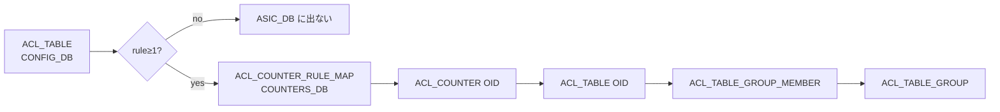

<!-- topics-tip -->
!!! tip "Topics で読み物として読む"
    この HLD は実装詳細を含む。機能の概念・設定・運用を読み物として読みたい場合は [Topics 20 章: SWSS / SAI / Redis](../topics/20-swss-sai-redis/index.md) を参照。
<!-- /topics-tip -->

!!! success "裏取りステータス: code-verified"
    `sonic-utilities/dump/` に `main.py` / `match_infra.py` / `helper.py` / `plugins/` を確認。`match_infra.py:35 MatchRequest` / `:346 MatchEngine` / `:454 MatchRequestOptimizer`、`plugins/executor.py:5 class Executor(ABC)` を確認（verified at: 2026-05-09）。

# `dump state` utility

## なぜ必要か

[SONiC](../reference/glossary.md#term-sonic) の機能は **複数 DB**（[CONFIG_DB](../reference/glossary.md#term-config_db) / [APPL_DB](../reference/glossary.md#term-appl_db) / [ASIC_DB](../reference/glossary.md#term-asic_db) / [STATE_DB](../reference/glossary.md#term-state_db) / [COUNTERS_DB](../reference/glossary.md#term-counters_db) / 設定 JSON）に状態が分散する。設定が [orchagent](../reference/glossary.md#term-orchagent) → [SAI](../reference/glossary.md#term-sai) → [ASIC](../reference/glossary.md#term-asic) まで伝播したかを見るには各 DB を個別に grep する必要があり、属人化していた[^1]。

`dump state <module> <id>` は、モジュール毎に「どの DB のどのキーを取れば良いか」を **プラグイン定義** で持ち、DB 横断で 1 view に集約する。

## コマンド

```text
dump state <module> <identifier> [options]
  --show           module 一覧
  --db <NAME>      DB / CONFIG_FILE フィルタ（複数可）
  --table | -t     表形式（既定 JSON）
  --key-map | -k   field-value を返さず key のみ
  --verbose | -v   MatchEngine の中間出力
  --namespace <n>  multi-asic
```

`<identifier>` はカンマ区切り、`all`（モジュールが認識する全 entry）、または単一値。

## プラグイン抽象

各モジュールは `Executor` を継承[^1]:

```python
class Executor(ABC):
    ARG_NAME = "id"
    CONFIG_FILE = ""
    @abstractmethod
    def execute(self, params): ...
    @abstractmethod
    def get_all_args(self, namespace): ...
```

`sonic-utilities/dump/plugins/{port,copp,acl_table,acl_rule,...}.py` に実装。`execute()` は次の JSON テンプレを返す[^1]:

```json
{ "<DB_NAME>": { "keys": ["<table-or-key>", ...], "tables_not_found": ["..."] } }
```

`<DB_NAME>` は `CONFIG_DB` / `APPL_DB` / `ASIC_DB` / `STATE_DB` / ... または `CONFIG_FILE`（例: COPP は `copp_cfg.json` 由来 entry を `CONFIG_FILE` キーで返す）。

## MatchRequest / MatchEngine

繰り返しの「DB → table → key_pattern マッチ」を抽象化[^1]:

| field | 必須 | 用途 |
|-------|------|------|
| `Table` | yes | テーブル名 |
| `key_pattern` | no (既定 `*`) | 正規表現マッチ |
| `field` / `value` | no | field-value フィルタ |
| `return_fields` | no | 部分 field のみ |
| `db` または `file` | yes (排他) | redis or JSON |
| `just_keys` | yes | true=key のみ |
| `match_entire_list` | no | カンマ区切り値の全体 vs 個別 |

戻り値: `{ "error", "keys": [...], "return_values": { "<key>": {...} } }`

## モジュール例: ACL Table の OID 辿り



[ACL](../reference/glossary.md#term-acl) は **rule が 1 件以上ある時のみ** ASIC 側に出る性質を反映し、`ACL_COUNTER_RULE_MAP` 経由で逆引きする[^1]。

## techsupport 統合

`Executor` 継承の全モジュールの `dump state <m> all -k` 出力が **techsupport に自動収録** される[^1]。multi-asic では `port.asic0` のように namespace suffix が付く:

```text
dump/unified_view_dump/
├── port, copp, acl_table, acl_rule, ...
└── port.asic0, ...
```

## 設定例

```bash
dump state --show                              # module 一覧
dump state port Ethernet0                      # 単一 port の全 DB 関連 key
dump state port Ethernet0,Ethernet4 -t         # 複数 port、表形式
dump state acl_table all -k --db ASIC_DB       # 全 ACL_TABLE の ASIC_DB key のみ
dump state copp all                            # CONFIG_FILE も含む
```

## 制限事項

- single-ASIC で `--namespace` を指定するとエラー終了[^1]
- COPP のように `/etc/sonic/copp_cfg.json` 経由のエントリは `CONFIG_FILE` キーで別扱い

## 干渉する機能

- **techsupport**: 全モジュールの dump が含まれるため、モジュール追加で techsupport が肥大化
- **multi-asic**: `--namespace` で対象 asic 切替

## 関連 Topics

- [09-telemetry-snmp/operations](../topics/09-telemetry-snmp/operations.md): techsupport / debug ツール
- [20-swss-sai-redis/internals](../topics/20-swss-sai-redis/internals.md): DB 構造（dump state が辿る対象）
- [12-multi-asic-voq/operations](../topics/12-multi-asic-voq/operations.md): namespace 切替

## 引用元

[^1]: [sonic-net/SONiC `doc/dump-utility/Dump-Utility.md` @ 49bab5b](https://github.com/sonic-net/SONiC/blob/49bab5b5ff0e924f1ea52b3d9db0dfa4191a7c06/doc/dump-utility/Dump-Utility.md)

<!-- topics-back-ref -->
## 関連 Topics

- [Topics: Telemetry / SNMP / Observability](../topics/09-telemetry-snmp/index.md)

<!-- /topics-back-ref -->

<!-- glossary-links-injected: 5dcfd4f70a30 -->
