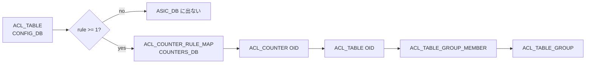

!!! success "裏取りステータス: Code-verified"
    `sonic-utilities/dump/` ディレクトリで `main.py` / `match_infra.py` / `helper.py` / `plugins/` を確認。`match_infra.py` L35 `class MatchRequest` / L346 `class MatchEngine` / L454 `class MatchRequestOptimizer`、`plugins/executor.py` L5 `class Executor(ABC)` を確認（verified 2026-05-09）。

# `dump utility`（モジュール単位で複数 DB から関連 key を集約する debug CLI）

## 概要

SONiC の機能はしばしば **複数 DB（CONFIG_DB / APPL_DB / ASIC_DB / STATE_DB / COUNTERS_DB / 設定 JSON ファイル）** に状態が分散して持たれており、設定が orchagent → SAI → ASIC まで伝播したかを確認するには各 DB を個別に grep する必要があった[^1]。

`dump state <module> <id>` コマンドは、モジュール毎に「どの DB のどのキーを取れば良いか」を **プラグイン定義** として持ち、関連 DB 横断でキー（および field-value）を 1 view に集約する CLI である[^1]。

## 動作仕様

### コマンド構造[^1]

```text
dump state <module> <identifier>
  --show         利用可能 module 一覧
  --db <NAME>    DB / CONFIG_FILE フィルタ（複数指定可）
  --table | -t   表形式表示（既定 JSON）
  --key-map | -k field-value を返さず key だけ
  --verbose | -v MatchEngine の中間出力
  --namespace <ns> multi-asic 用 namespace
```

`<identifier>` には:

- カンマ区切りリスト: `Ethernet0,Ethernet8,Ethernet12`
- `all`: モジュールが認識する全 entry
- 単一値: `port_name` / `trap_id` 等、モジュール側が解釈する任意キー

### プラグイン抽象（`Executor`）

各モジュールは `Executor` を継承し以下を実装する[^1]:

```python
class Executor(ABC):
    ARG_NAME = "id"
    CONFIG_FILE = ""
    @abstractmethod
    def execute(self, params): ...
    @abstractmethod
    def get_all_args(self, namespace): ...
```

ファイル配置:

```text
sonic-utilities/dump/
├── __init__.py
├── plugins/
│   ├── executor.py
│   ├── port.py
│   ├── copp.py
│   └── ...
```

`execute()` は次の JSON テンプレートを返す[^1]:

```json
{
  "<DB_NAME>": {
    "keys": ["<table-or-key>", ...],
    "tables_not_found": ["<table>", ...]
  }
}
```

`<DB_NAME>` は `CONFIG_DB` / `APPL_DB` / `ASIC_DB` / `STATE_DB` / ... または `CONFIG_FILE`。COPP は `copp_cfg.json` 由来 entry を `CONFIG_FILE` キーで返す。

### `MatchRequest` / `MatchEngine`

繰り返しの「DB → table → key_pattern マッチ」コードを抽象化。`MatchRequest` の主要フィールド[^1]:

| field | 必須 | 用途 |
|-------|-----|------|
| `Table` | yes | テーブル名 |
| `key_pattern` | no（既定 `*`） | `Table<sep>key_pattern` で正規表現マッチ |
| `field` / `value` | no | field-value 一致でフィルタ |
| `return_fields` | no | 部分 field のみ返す |
| `db` または `file` | yes（排他） | redis DB か JSON ファイル |
| `just_keys` | yes | true → field-value を返さず key のみ |
| `match_entire_list` | no | カンマ区切り値（例 `bgp,bgpv6,ospf`）を全体 vs 個別マッチ |

戻り値:

```json
{ "error": "<str>", "keys": [...], "return_values": { "<key>": { "<field>": "<value>" } } }
```

### モジュール例: ACL Table

`ACL_TABLE` から SAI 側 OID を辿るには **rule が 1 件以上ある場合**、`COUNTERS_DB` の `ACL_COUNTER_RULE_MAP` 経由で counter OID → table OID → table group member → table group の順に解決する[^1]:



ACL Rule モジュールも同様に `ACL_COUNTER_RULE_MAP` 経由で `ACL_ENTRY` / `ACL_RANGE` まで辿る[^1]。

### techsupport 統合[^1]

`Executor` を継承した全モジュールの `dump state <m> all -k` 出力が techsupport に自動収録される。multi-asic では `port.asic0` のように namespace suffix が付く:

```text
dump/unified_view_dump/
├── port
├── copp
├── acl_table
├── acl_rule
├── port.asic0
└── ...
```

## 関連 CLI

| Command | 用途 |
|---------|------|
| `dump state --show` | モジュール一覧 |
| `dump state <m> <id>` | 単一識別子の関連 key 集約 |
| `dump state <m> all -k` | 全 entry の key のみ |

## 制限事項

- single-ASIC デバイスで `--namespace` を指定するとエラー終了する[^1]
- COPP のように `CONFIG_DB` ではなく `/etc/sonic/copp_cfg.json` に entry がある場合は `CONFIG_FILE` キーで別扱い

## 干渉する機能

- **techsupport 取得**: 全モジュールの `dump state ... all -k` が含まれるため、モジュール追加で techsupport が肥大化する
- **multi-asic**: `--namespace` で対象 asic を切り替えるが、common logic 側で実装されている

## 引用元

[^1]: [sonic-net/SONiC doc/dump-utility/Dump-Utility.md @ 49bab5b](https://github.com/sonic-net/SONiC/blob/49bab5b5ff0e924f1ea52b3d9db0dfa4191a7c06/doc/dump-utility/Dump-Utility.md)
