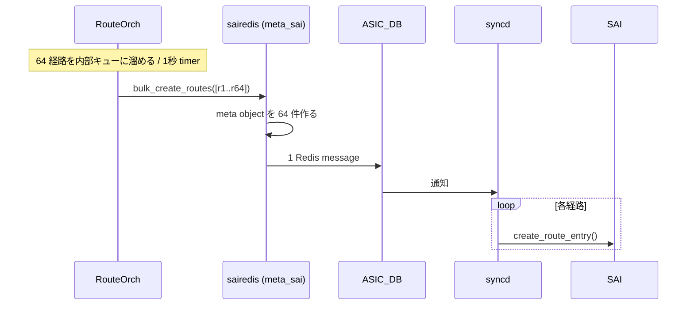
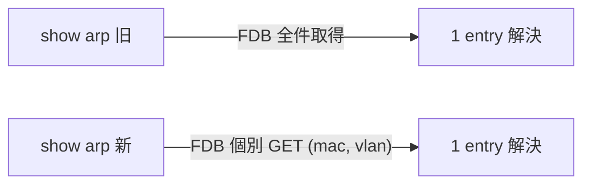

# L3 Scaling と Performance 強化 内部実装

このページは [L3 Scaling と Performance 強化（概要ハブ）](l3-scaling-and-performance-enhancements.md) の派生で、**`RouteOrch` / `fpmsyncd` / `sairedis` / CLI 改修の内部実装** に絞る。概念は [l3-scaling-and-performance-enhancements-concepts.md](l3-scaling-and-performance-enhancements-concepts.md)、CLI / sysctl 設定は [l3-scaling-and-performance-enhancements-operations.md](l3-scaling-and-performance-enhancements-operations.md)、制限事項と乖離は [l3-scaling-and-performance-enhancements-limitations.md](l3-scaling-and-performance-enhancements-limitations.md) を参照。

## 1. kernel ARP/ND の cache 拡大

旧 [SONiC](../reference/glossary.md#term-sonic) は ~2400 entry が上限だった。kernel [ARP](../reference/glossary.md#term-arp) cache の garbage collector 閾値を [HLD](../reference/glossary.md#term-hld) は次のように引き上げる提案[^1]:

| パラメータ | 既定 | 提案 (IPv4) | 提案 (IPv6) |
|-----------|------|------------|------------|
| `gc_thresh1` | 128 | 16000 | 8000 |
| `gc_thresh2` | 512 | 32000 | 16000 |
| `gc_thresh3` | 1024 | 48000 | 32000 |

burst 時の add/remove ループで entry が満杯にならない問題の解消が主眼。[CoPP](../reference/glossary.md#term-copp) では ARP/ND の最大 600 pps → **8000 pps** に引き上げる提案[^1]。

!!! warning "現行 master では未適用"
    上表の閾値および CoPP 8000 pps はいずれも HLD 提案段階で、現行 master の既定値は `gc_thresh{1,2,3} = 1024/2048/4096`、`queue4_group2` の `cir`/`cbs = 600` のまま。詳細は本ページ末尾の「実装との乖離」節を参照。

## 2. Route programming 時間短縮

旧時計値（AS7712 / Tomahawk 上）[^1]:

| 経路数 | IPv4 所要時間 | IPv6 所要時間 |
|--------|-------------|-------------|
| 10k | 11s | 11s |
| 30k | 30s | 30s |
| 60k | 48s | - |
| 90k | 68s | - |

### 2.1 sairedis bulk route API の利用

旧: `RouteOrch` は 1 経路ごとに sairedis API を呼ぶ。[Redis](../reference/glossary.md#term-redis) pipelining でいくらかバルク化はされるが **1 経路 = 1 Redis message**[^1]。

新:

- `RouteOrch` は 64 件まとめて bulk API に渡す
- meta_sai layer は内部で個別オブジェクトを作るが、**Redis に流れる message は 1 件** に集約
- [ASIC](../reference/glossary.md#term-asic) 側は bulk route create を実装していないため `syncd` は 1 件ずつ処理する → 純粋な節約は **Redis message 数の削減**

`RouteOrch` に **新 timer** を追加し、未送信のバッチを **1 秒ごとに flush**[^1]。

### 2.2 `fpmsyncd` の最適化

旧: 各経路の処理で **`rt_table` 属性から master device 名を kernel から取得**。VNET_ROUTE_TABLE 判定のため[^1]。

問題: [VNET](../reference/glossary.md#term-vnet) が無い環境でも lookup が **常に失敗 → cache 更新を毎経路で行う**。これが route 投入を遅くする。

修正: **`route.rt_table == 0`（global routing table）** なら lookup を **skip**。10k 経路の APP_DB 投入が **7-8s → 4-5s** に短縮[^1]。

### 2.3 sairedis 内 JSON ライブラリ更新

`nlohmann/json` ライブラリの **v2.0 → v3.6** への更新で `dump()` 系最適化を取り込む[^1]。

### 期待効果

上記合算で **route programming 時間 30% 削減** を目標[^1]。

## 3. `show arp` / `show ndp` の高速化

旧: [VLAN](../reference/glossary.md#term-vlan) L3 interface 上の ARP の **outgoing interface を求めるため [FDB](../reference/glossary.md#term-fdb) 全件を fetch**。エントリが大量だと show が秒〜分単位かかる[^1]。

修正: 該当 ARP/ND **特定エントリだけの FDB lookup** に変更。CLI スクリプト側の改修。

## 4. 現行 master 実装ファイル位置

| 項目 | ファイル / 行 |
|------|--------------|
| RouteOrch bulker | `sonic-swss/orchagent/routeorch.cpp:41` で `gRouteBulker(sai_route_api, gMaxBulkSize)`、L626-1116 で add/remove と flush |
| [fpmsyncd](../reference/glossary.md#term-fpmsyncd) master device lookup skip | `sonic-swss/fpmsyncd/routesync.cpp:2077-2082` |
| sysctl 適用 | `sonic-buildimage/files/image_config/sysctl/90-sonic.conf:21-26`（HLD 値ではなく 1024/2048/4096 が現行 default）|
| CoPP 設定 | `sonic-buildimage/files/image_config/copp/copp_cfg.j2`（ARP は `queue4_group2`、cir/cbs=600）|

詳細な行番号付きコード抜粋と乖離分析は [l3-scaling-and-performance-enhancements-limitations.md](l3-scaling-and-performance-enhancements-limitations.md) を参照。

## 関連ページ

- [L3 Scaling と Performance 強化（概要ハブ）](l3-scaling-and-performance-enhancements.md)
- [l3-scaling-and-performance-enhancements-concepts.md](l3-scaling-and-performance-enhancements-concepts.md)
- [l3-scaling-and-performance-enhancements-operations.md](l3-scaling-and-performance-enhancements-operations.md)
- [l3-scaling-and-performance-enhancements-limitations.md](l3-scaling-and-performance-enhancements-limitations.md)

<!-- phase-boundary -->
## 実装フェーズ境界

!!! info "Phase 別の実装済 / 未実装 サマリ"
    本ページは `monitor: partially_implemented` で、HLD で示された一連の機能
    が **段階的に取り込まれている** 状態を扱う。フェーズ毎の実装境界を
    1 枚の表に集約する (詳細は本ページ上部の `diff` admonition および
    [discrepancy-index](../reference/verification/discrepancy-index.md) を参照)。

    | Phase | 範囲 (機能 / 段階) | 実装済 (master 取り込み済) | 未実装 (HLD 提案のみ) |
    |---|---|---|---|
    | Phase 1 — 基本機能 | HLD §概要 / §設計の中核ユースケース | 取り込み済 — 本ページの「実装の概観」「実装詳細」節および `diff` admonition の現状側を参照 | — (Phase 1 は実装済) |
    | Phase 2 — 拡張機能 | HLD §拡張 / §追加要件 / §周辺統合 | 一部のみ取り込み済 — 本ページ「実装詳細」の補足参照 | 未実装 / 未マージ — HLD §未対応箇所、本ページ「制限事項」および `diff` admonition の差分側に列挙 |
    | Phase 3 — 将来拡張 | HLD §Future Work / §将来課題 | — | 未実装 — HLD 提案段階。対応 PR は確認されていない (last_verified 時点) |

    凡例: 「実装済」=現行 master で動作確認できる範囲 / 「未実装」=HLD には記載があるが対応 PR が未マージまたは設計のみで code が存在しない範囲。
<!-- /phase-boundary -->

## 実装との乖離

`monitor: partially_implemented` — `RouteOrch` bulk / `fpmsyncd` の `rt_table==0` skip / `show arp` の個別 [FDB](../reference/glossary.md#term-fdb) lookup は実装済み (§2.1 / §2.2 / §3 の citation 参照) だが、**HLD §1 が提案する kernel ARP/ND 閾値と CoPP pps の引き上げは現行 master に未適用** という点が本 split-child 固有の差分である。

!!! diff "本ページ固有の差分 (HLD 提案 vs 現行 master)"
    | 項目 | HLD 提案値[^1] | 現行 master 既定値 | 根拠 (master のソース) |
    |------|---------------|------------------|----------------------|
    | `net.ipv4.neigh.default.gc_thresh1` | 16000 | **1024** | `sonic-buildimage/files/image_config/sysctl/90-sonic.conf:21` |
    | `net.ipv4.neigh.default.gc_thresh2` | 32000 | **2048** | `sonic-buildimage/files/image_config/sysctl/90-sonic.conf:23` |
    | `net.ipv4.neigh.default.gc_thresh3` | 48000 | **4096** | `sonic-buildimage/files/image_config/sysctl/90-sonic.conf:25` |
    | `net.ipv6.neigh.default.gc_thresh{1,2,3}` | 8000 / 16000 / 32000 | **1024 / 2048 / 4096** | `sonic-buildimage/files/image_config/sysctl/90-sonic.conf:22,24,26` |
    | ARP/ND CoPP rate (`queue4_group2` の `cir`/`cbs`) | 8000 pps | **600 pps** | `sonic-buildimage/files/image_config/copp/copp_cfg.j2:6-9` (`queue4_group2` block L21-30、`arp` trap が L100-104 で参照) |

    影響: 大規模 L3 (数万 neigh) 環境では HLD が想定した burst 耐性 / GC 動作が得られない。実運用で必要な場合は `CONFIG_DB` / sysctl override で個別調整する必要がある (本ページの議論範囲外、運用詳細は [l3-scaling-and-performance-enhancements-operations.md](l3-scaling-and-performance-enhancements-operations.md) を参照)。

    その他の差分 (RouteOrch bulk timer の周期や `nlohmann/json` バージョンなど、複数 split-child 共通の項目) は親ページ [L3 Scaling と Performance 強化（概要ハブ）](l3-scaling-and-performance-enhancements.md) の `## 実装との乖離` を参照。

## 引用元

[^1]: `sonic-net/SONiC` `doc/l3-performance-scaling/L3_performance_and_scaling_enchancements_HLD.md` @ `49bab5b5ff0e924f1ea52b3d9db0dfa4191a7c06`

<!-- next-action -->
## このページを読んだ後の次アクション

!!! tip "読み手向け"
    - **本機能を実運用で使う場合**: 取り込み済の部分のみ運用可能。欠落部分の利用は不可なので本文「実装との乖離」を確認した上で適用範囲を限定する
    - **upstream 動向を追う場合**: 関連 issue / PR を [sonic-net/SONiC](https://github.com/sonic-net/SONiC) で検索（HLD タイトル / CONFIG_DB テーブル名 / Orch クラス名で grep するのが速い）
    - **代替手段 / 関連 reference**: frontmatter `related` に記載のテーブル / CLI / YANG、または [Reference 索引](../reference/index.md) を参照

!!! note "本ドキュメントの追跡"
    - monitor: `partially_implemented` / last_verified: `2026-05-11`
    - 次回再裏取りトリガ: quarterly。一覧は [discrepancy-index](../reference/verification/discrepancy-index.md) を参照（運用詳細は repo の `meta/discrepancy-operations.md`）

<!-- /next-action -->

<!-- glossary-links-injected: ec18b66e3507 -->
