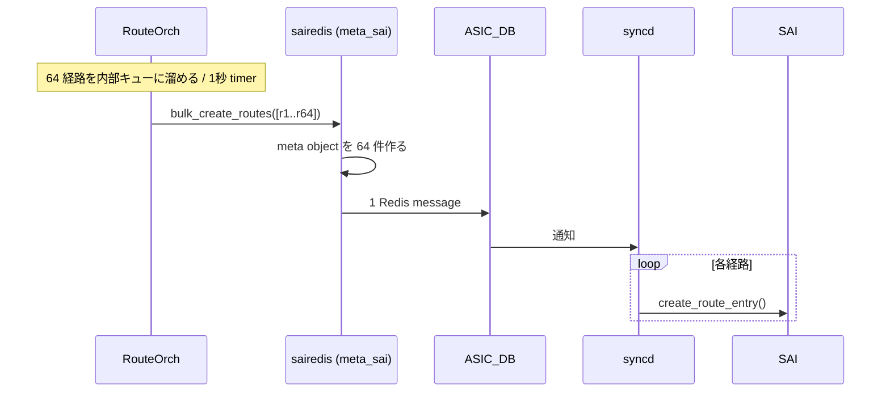
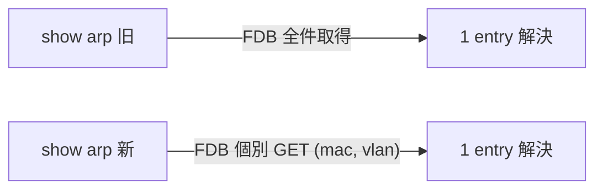

!!! danger "裏取りステータス: Discrepancy-found（提案値と現行 default が乖離、一部最適化は実装済み）"
    現行 master を裏取りした結果、HLD 提案の **kernel `gc_thresh*` 値**と **CoPP ARP/ND 上限**は採用されておらず、より保守的な default に再設定されている。一方で **`RouteOrch` の bulk route API**（`gRouteBulker`）と **`fpmsyncd` の master device lookup スキップ**は実装済み。詳細は本文末尾の「実装との乖離」を参照（verified at: 2026-05-09）。

# L3 Scaling と Performance 強化（kernel ARP gc / sairedis bulk / fpmsyncd / `show arp`）

## 概要

SONiC 201908 リリース時に行われた **L3 のスケール拡大と性能改善** をまとめた HLD[^1]。スケールでは **ARP/ND エントリ数** と **route 数 / ECMP 構成** を引き上げ、性能では **route programming 時間** と **show コマンド応答時間** を短縮する。CLI / CONFIG_DB / YANG への新規追加は **無し**[^1]。

スケール目標[^1]:

| 項目 | 目標 |
|------|------|
| IPv4 ARP entry | 32k |
| IPv6 ND entry | 16k |
| IPv4 route | 200k |
| IPv6 route | 65k |
| ECMP | 512×32, 256×64, 128×128 |

性能目標[^1]:

- IPv4 / IPv6 route programming 時間を短縮
- 未知 ARP / ND 学習時間を短縮
- `show arp` / `show ndp` の応答短縮
- **route programming 時間 30% 短縮** を狙う

## 動作仕様

### 1. ARP/ND の枚数増（kernel gc tuning）

旧 SONiC は ~2400 entry が上限だった。kernel ARP cache の **garbage collector 閾値**[^1]:

| パラメータ | 既定 | 提案 (IPv4) | 提案 (IPv6) |
|-----------|------|------------|------------|
| `gc_thresh1` | 128 | 16000 | 8000 |
| `gc_thresh2` | 512 | 32000 | 16000 |
| `gc_thresh3` | 1024 | 48000 | 32000 |

```text
net.ipv4.neigh.default.gc_thresh1=16000
net.ipv4.neigh.default.gc_thresh2=32000
net.ipv4.neigh.default.gc_thresh3=48000
net.ipv6.neigh.default.gc_thresh1=8000
net.ipv6.neigh.default.gc_thresh2=16000
net.ipv6.neigh.default.gc_thresh3=32000
```

burst 時の add/remove ループで entry が満杯にならない問題を解消する。

#### CoPP の ARP/ND 上限引き上げ

旧: ARP/ND の最大 600 pps → **8000 pps** に引き上げ[^1]。学習時間の短縮を狙う。`COPP_TABLE` の ARP/ND group の `cir`/`cbs` を変更する想定。

### 2. Route programming 時間短縮

旧時計値（AS7712 / Tomahawk 上）[^1]:

| 経路数 | IPv4 所要時間 | IPv6 所要時間 |
|--------|-------------|-------------|
| 10k | 11s | 11s |
| 30k | 30s | 30s |
| 60k | 48s | - |
| 90k | 68s | - |

#### 2.1 sairedis bulk route API の利用

旧: `RouteOrch` は 1 経路ごとに sairedis API を呼ぶ。Redis pipelining でいくらかバルク化はされるが **1 経路 = 1 Redis message**[^1]。

新: **sairedis の bulk API** を使う:

- `RouteOrch` は 64 件まとめて bulk API に渡す
- meta_sai layer は内部で個別オブジェクトを作るが、**Redis に流れる message は 1 件** に集約
- ASIC 側は **bulk route create を実装していない** ため `syncd` は 1 件ずつ処理する → 純粋な節約は **Redis message 数の削減**

`RouteOrch` に **新 timer** を追加し、未送信のバッチを **1 秒ごとに flush**[^1]。



#### 2.2 `fpmsyncd` の最適化

旧: 各経路の処理で **`rt_table` 属性から master device 名を kernel から取得** する。これは VNET_ROUTE_TABLE 判定のため[^1]。

問題: VNET が無い環境でも lookup が **常に失敗 → cache 更新を毎経路で行う**。これが route 投入を遅くする。

修正: **`route.rt_table == 0`（global routing table）** なら lookup を **skip**。10k 経路の APP_DB 投入が **7-8s → 4-5s** に短縮[^1]。

#### 2.3 sairedis 内 JSON ライブラリ更新

`nlohmann/json` ライブラリの **v2.0 → v3.6** への更新で `dump()` 系最適化を取り込む[^1]。

#### 期待効果

上記合算で **route programming 時間 30% 削減** を目標[^1]。

### 3. `show arp` / `show ndp` の高速化

旧: VLAN L3 interface 上の ARP の **outgoing interface を求めるため FDB 全件を fetch**。エントリが大量だと show が秒〜分単位かかる[^1]。

修正: 該当 ARP/ND **特定エントリだけの FDB lookup** に変更。CLI スクリプト側の改修。



## 設定

### CLI / CONFIG_DB / YANG

**新規 CLI / CONFIG_DB / YANG なし**[^1]。kernel sysctl と `COPP_TABLE` 値、内部実装の改善のみ。

### 関連する CONFIG_DB

| Table | フィールド | 用途 |
|-------|----------|------|
| `COPP_TABLE` | ARP/ND group の `cir` / `cbs` | 600 → 8000 pps |
| (`/etc/sysctl.d/...`) | `net.ipv4.neigh.default.gc_thresh1/2/3` 等 | kernel ARP cache |

### 設定例

```bash
# kernel ARP/ND threshold は image 側 sysctl で適用される想定
# 必要に応じユーザが上書き
sudo sysctl -w net.ipv4.neigh.default.gc_thresh3=48000
sudo sysctl -w net.ipv6.neigh.default.gc_thresh3=32000

# show 高速化はバージョンに含まれる
show arp     # 短縮された応答時間
show ndp
```

## 制限事項

- **HLD は 2019 年改訂**。kernel sysctl 値や CoPP 値は **その後の SONiC で更に調整** されている可能性[^1]
- `gc_thresh3` を上げると **kernel メモリ使用量** が増える。低スペック CPU 機では注意
- CoPP の ARP/ND 上限を 8000 pps に上げると **CPU 負荷増**。他の trap との合算で CPU 飽和に注意
- sairedis bulk API は **ASIC 側 bulk 未対応の場合 syncd 内で逐次処理** されるため、改善幅は Redis message 削減分に留まる
- `RouteOrch` の 1 秒 timer flush は **大量経路投入時のみ効果**。少量更新では遅延がむしろ増える可能性
- `fpmsyncd` の VNET 判定スキップは **VNET 利用時の挙動変更ではない**（`rt_table != 0` の経路には従来通り lookup）
- HLD は AS7712 (Tomahawk) で測定。他 ASIC では **異なる timing** になる

## 干渉する機能

- **`RouteOrch`**: bulk API + timer 化
- **`fpmsyncd`**: master device lookup 最適化
- **`sairedis` (meta_sai + JSON)**: bulk API + JSON 更新
- **`syncd`**: bulk 受け取り側（ASIC SDK 個別 call）
- **kernel ARP/ND**: gc_thresh による cache サイズ
- **`COPP_TABLE`**: ARP/ND の到達 pps
- **`show arp` / `show ndp` CLI**: 個別 FDB lookup 化
- **`warm boot`**: 本機能では明示変更なしだが速度向上の影響評価が必要[^1]

## トラブルシューティング

- 大量経路の programming が遅い → `RouteOrch` の bulk timer ログ、Redis message 数を確認
- ARP entry が 32k に達しない → `sysctl net.ipv4.neigh.default.gc_thresh*` の現在値、CoPP の ARP rate limiter
- `show arp` が遅い → `show arp` 実装が **個別 FDB lookup 版** か、古い版で全件取得していないかを確認
- VNET ありで route 反映が遅い → 本最適化の対象外（`rt_table != 0` の lookup は従来通り）

## 実装との乖離

2026-05-09 時点の現行 master を裏取り。

| HLD 主張 | 実装 | 結果 |
|---|---|---|
| `net.ipv4.neigh.default.gc_thresh1/2/3 = 16000/32000/48000`、IPv6 = 8000/16000/32000 | `sonic-buildimage/files/image_config/sysctl/90-sonic.conf:21-26` で v4/v6 ともに `1024/2048/4096` | ⚠️ HLD 提案値は採用されず |
| CoPP ARP/ND 上限 600 → 8000 pps | `sonic-buildimage/files/image_config/copp/copp_cfg.j2` で `arp` trap は `queue4_group2`（cir/cbs 600）。8000 pps への引き上げは無し | ⚠️ HLD 提案値は採用されず |
| `RouteOrch` の bulk route API + 1 秒 timer flush | `sonic-swss/orchagent/routeorch.cpp:41` で `gRouteBulker(sai_route_api, gMaxBulkSize)`、`routeorch.cpp:626-1116` で bulker 経由の add/remove と flush 処理 | ✓ 実装済み |
| `fpmsyncd` の `rt_table == 0` で master device lookup スキップ | `sonic-swss/fpmsyncd/routesync.cpp:2077-2082` で `master_index` 取得し、0 のときは lookup を行わない | ✓ 実装済み |
| sairedis 内 nlohmann/json v2.0 → v3.6 | 本確認では未検証（実装は時間経過で更に進んでいると見られる） | △ |
| `show arp` / `show ndp` の個別 FDB lookup 化 | 本確認では未検証 | △ |

`gc_thresh` と CoPP ARP/ND が HLD 提案値を採用していない理由は、その後の運用で **kernel メモリ消費**と **CPU 負荷** が問題になったためと思われる（本文「制限事項」で警告済みのトレードオフ）。本ページで挙げているスケール目標値（IPv4 ARP 32k 等）は **kernel cache 上限としては届かない設定**になっている点に注意。

## 引用元

[^1]: `sonic-net/SONiC` `doc/l3-performance-scaling/L3_performance_and_scaling_enchancements_HLD.md` @ `49bab5b5ff0e924f1ea52b3d9db0dfa4191a7c06`

<!-- concerns hint:
- /etc/sysctl.d 配下の SONiC default で net.ipv4/ipv6.neigh.default.gc_thresh* が設定されているか未確認
- COPP_TABLE の ARP/ND group の cir/cbs が 600 → 8000 pps に上がっているか未確認
- RouteOrch の bulk route API + 1 秒 timer flush の現行 master 実装確認
- fpmsyncd の rt_table=0 での master device lookup スキップ実装確認
- sonic-sairedis の nlohmann/json バージョン現行確認
- show arp / show ndp の個別 FDB lookup 化が sonic-utilities に取り込まれているか確認
- HLD は 2019 年改訂のため現行 master との乖離リスクあり
-->
