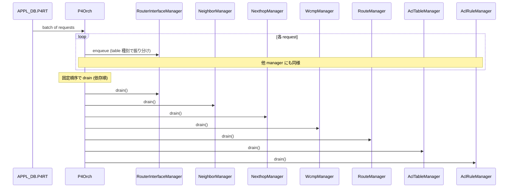
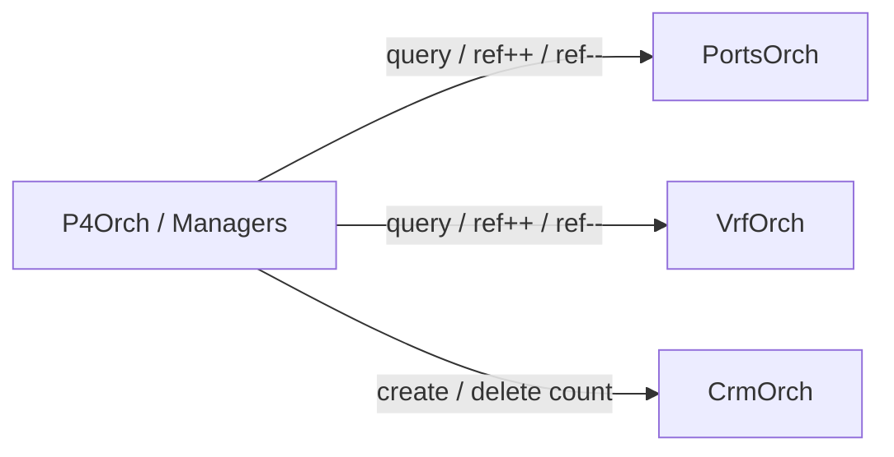
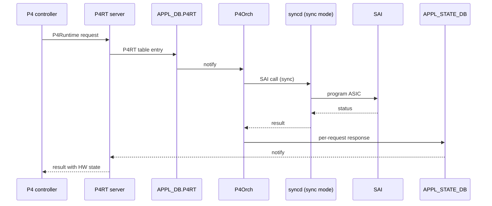

!!! success "裏取りステータス: code-verified"
    Verifier 2026-05-09 で `sonic-swss/orchagent/p4orch/` に `p4orch.cpp` 本体と各 Manager（`router_interface_manager`, `neighbor_manager`, `next_hop_manager`, `wcmp_manager`, `route_manager`, `acl_table_manager`, `acl_rule_manager`, `mirror_session_manager`, `l3_admit_manager`, `gre_tunnel_manager`, `tunnel_decap_group_manager`, `ext_tables_manager`, `tables_definition_manager`, `ip_multicast_manager`, `l3_multicast_manager`）が実装されていることを確認。`object_manager_interface.h` で `enqueue` / `drain` / `drainWithNotExecuted` 抽象が定義され、`p4oidmapper.h` の `P4OidMapper` クラスが `(sai_object_type_t, key) → (oid, ref_count)` を保持し、`getRefCount` 等の API を public 公開している。HLD 当初の 7 Manager から実装は更に拡張されている。

# P4Orch（PINS の P4Runtime 用 orchagent / 同期書き込み）

## 概要

PINS (P4 Integrated Network Stack) は SONiC を **P4 / P4Runtime で遠隔制御** するためのコンポーネント群を追加する。本 HLD は中核となる **`P4Orch`（orchagent 内の新クラス）** の設計を扱う[^1]。

P4Orch の役割[^1]:

- `APPL_DB` の **`P4RT` table** entry を購読
- 各 entry を SAI 呼び出しに変換し、ASIC_DB に書く
- 通常の SONiC orchagent と異なり **同期実行**: SAI からの応答を待ち、結果を **`APPL_STATE_DB`** 経由で application（P4RT server）に返す

通常 orchagent との差異[^1]:

| 観点 | 既存 orchagent | P4Orch |
|------|--------------|--------|
| 依存関係 | 後続再試行で解決 | **依存は前提条件**。未充足は **拒否** |
| 応答 | application 層に返さない | **完了通知を P4RT app に返す** |
| 公開 API | 他 orch から参照可能 | **限定的**（他 orch から P4RT object に触れない） |

## 動作仕様

### `P4RT` テーブル

`APPL_DB` に新規 sub-table 群を持つ[^1]。SAI Routing Pipeline の object model に対応:

| P4RT sub-table | SAI object |
|----------------|------------|
| `FIXED_ROUTER_INTERFACE_TABLE` | Router Interface |
| `FIXED_NEIGHBOR_TABLE` | Neighbor |
| `FIXED_NEXTHOP_TABLE` | Next Hop |
| `FIXED_WCMP_GROUP_TABLE` | Next Hop Group + Member |
| `FIXED_IPV4_TABLE` / `FIXED_IPV6_TABLE` | Route |
| `ACL_*` (DEFINITION + per-table 系) | ACL Table / Rule |

### Manager 構成

P4Orch は **複数の Manager** で構成され、各 Manager が 1 種類の SAI object を扱う。共通 interface[^1]:

```c++
class ObjectManagerInterface {
public:
  virtual void enqueue(...) = 0;   // 内部 queue に積む
  virtual void drain()    = 0;     // queue を処理
};
```

P4Orch::doTask() のフロー[^1]:



#### Manager 一覧（2021-11 リリース時点）[^1]

1. RouterInterfaceManager
2. NeighborManager
3. NexthopManager
4. WcmpManager
5. RouteManager
6. AclTableManager
7. AclRuleManager

drain 順序は **依存順** に固定（neighbor は router interface に依存、route は nexthop に依存、等）。

#### Manager 内の処理パターン

各 Manager の drain() の典型[^1]:

1. SET / DEL 判別
2. APPL_DB request の deserialize + validate
3. 解析済 request 処理（ローカル map 参照、create / modify を判別）
4. sairedis 経由で SAI 呼び出し → ASIC_DB

各 Manager は **ローカルキャッシュ map** を持つ:

- key: P4RT object id
- value: object 属性

これで SET 時に **create か modify かを区別** できる。

### Centralized Mapper

manager 横断で共有する情報を一箇所に集める[^1]:

```text
key   = (object type, P4RT object id)
value = { sai_object_id, ref_count }
```

機能:

- P4RT object id ↔ SAI object id の get/set/delete
- 別 manager で作られた object の存在検証
- ref_count の get / set / inc / dec
- object type 単位のエントリ数取得

### KeyGenerator

manager の local map と Centralized Mapper のキー生成を共通化[^1]:

| Manager | キー形式 |
|---------|---------|
| RouterInterfaceManager | `router_interface_id=<id>` |
| NeighborManager | `router_interface_id=<id>,neighbor_id=<id>` |
| NextHopManager | `next_hop_id=<id>` |
| RouteManager | `vrf_id=<id>,ipv4_dst=<id>` または `vrf_id=<id>,ipv6_dst=<id>` |

### 既存 orchagent との連携

P4Orch manager は **既存 orch の public method / グローバルポインタ** で SONiC object を参照する[^1]:

- `PortsOrch`: port 情報 + 参照カウント
- `VrfOrch`: VRF 情報 + 参照カウント（`RouterInterfaceManager` から）
- `CrmOrch`: SAI object 作成 / 削除時のリソースカウント更新



ただし **P4Orch 側は public method を最小限に** しており、既存 orch から P4RT object を参照することはできない。

### Application 応答経路

P4 SDN 要件として「programming 完了状態を controller に返す」必要がある。orchagent ↔ syncd を **synchronous mode** にし、SAI API の戻り値を確実に取得 → `APPL_STATE_DB` の通知チャネルで P4RT application に返す[^1]:



詳細は別 HLD（`appl_state_db_response_path_hld.md`）参照[^1]。

## 設定

### CLI / CONFIG_DB / YANG / SAI

本 HLD は **CLI / CONFIG_DB / YANG / SAI への変更を伴わない**[^1]。設定は P4Runtime controller 経由で行う。

### 設定例

ユーザレベルでの直接設定は無し。P4Runtime controller / gNMI 等を使う。確認のみ:

```bash
# orchagent が P4Orch を含むか
docker exec swss ps aux | grep orchagent

# APPL_DB の P4RT 系テーブル確認
sonic-db-cli APPL_DB keys 'FIXED_*_TABLE*'
sonic-db-cli APPL_DB keys 'P4RT_*'

# 応答チャネル
sonic-db-cli APPL_STATE_DB keys '*'
```

## 制限事項

- **依存未充足の request は再試行されず拒否**[^1]。Controller は依存順序を守って投入する責務
- 同じ key の request は **前回完了まで modify できない**[^1]
- **他 orch から P4RT object に触れない**（public method 限定）
- **warm boot / fast boot 未サポート**（次フェーズで予定）[^1]
- **orchagent restart 時に P4RT table が再 program されない**[^1]
- 2021-11 リリース時点の Manager 群。**新 Manager が追加され得る**

## 干渉する機能

- **PINS infrastructure**: P4RT server / response path / PacketIO / hostif 用 user-defined trap
- **既存 SONiC orchagent**: PortsOrch / VrfOrch / CrmOrch を参照
- **`APPL_STATE_DB` + 同期 syncd モード**: 応答経路の前提
- **既存 RouteOrch / NeighOrch / NexthopOrch / AclOrch**: P4Orch とは **資源分離**。P4RT object と既存 SDN 外オブジェクトは別管理
- **PortsOrch / VrfOrch / CrmOrch の参照カウント**: P4Orch が利用

## トラブルシューティング

- P4 request が反映されない → APPL_DB の P4RT entry 存在 / `APPL_STATE_DB` のエラーレスポンスを確認
- 依存エラーが多い → Controller 側の投入順序（router_interface → neighbor → nexthop → route）を確認
- restart 後に P4RT object が消える → 仕様（restart 時の再 program 未対応）。Controller が再投入する想定
- ref_count が想定と異なる → Centralized Mapper の値を debug log で確認、CrmOrch の対応カウンタを確認

## 引用元

[^1]: `sonic-net/SONiC` `doc/pins/p4orch_hld.md` @ `49bab5b5ff0e924f1ea52b3d9db0dfa4191a7c06`

<!-- concerns hint:
- P4Orch の orchagent への取り込み確認 (sonic-swss/orchagent/p4orch/)
- 7 つの Manager (RouterInterfaceManager 等) の現行実装と drain 順序確認
- ObjectManagerInterface (enqueue/drain) の現行クラス構成確認
- Centralized Mapper の object type → (sai_oid, ref_count) マップ実装確認
- PortsOrch / VrfOrch / CrmOrch の public method 経由 ref_count 連携実装確認
- 同期 syncd モード + APPL_STATE_DB 応答経路の現行確認
- warm boot / fast boot サポート (HLD は次フェーズと記載) の現行ステータス確認
-->

<!-- topics-back-ref -->
## 関連 Topics

- [Topics: P4 / PINS / Programmable Pipeline](../topics/18-p4-pins/index.md)
