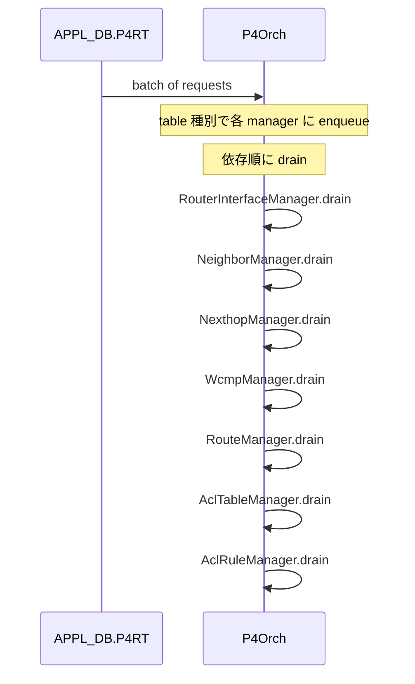
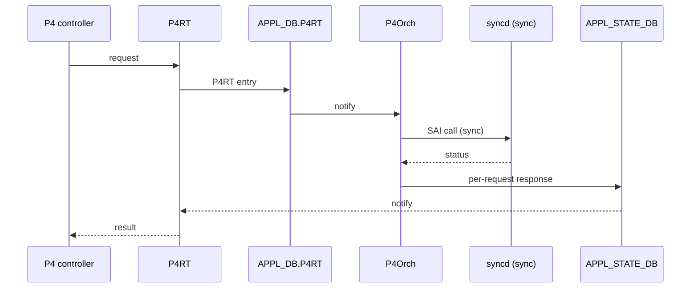

<!-- topics-tip -->
!!! tip "Topics で読み物として読む"
    この HLD は実装詳細を含みます。機能の概念・設定・運用を読み物として読みたい場合は [Topics 18 章: P4 / PINS](../topics/18-p4-pins/index.md) を参照。
<!-- /topics-tip -->

!!! success "裏取りステータス: code-verified"
    Verifier 2026-05-09 で `sonic-swss/orchagent/p4orch/` に `p4orch.cpp` 本体と各 Manager（`router_interface_manager`, `neighbor_manager`, `next_hop_manager`, `wcmp_manager`, `route_manager`, `acl_table_manager`, `acl_rule_manager`, `mirror_session_manager`, `l3_admit_manager`, `gre_tunnel_manager`, `tunnel_decap_group_manager`, `ext_tables_manager`, `tables_definition_manager`, `ip_multicast_manager`, `l3_multicast_manager`）が実装されていることを確認。`object_manager_interface.h` で `enqueue` / `drain` / `drainWithNotExecuted` 抽象を定義、`p4oidmapper.h` の `P4OidMapper` クラスが `(sai_object_type, key) → (oid, ref_count)` を保持。HLD 当初の 7 Manager から実装は更に拡張。

# P4Orch（PINS の P4Runtime 用 orchagent / 同期書き込み）

## なぜ必要か

[PINS](../reference/glossary.md#term-pins) (P4 Integrated Network Stack) は [SONiC](../reference/glossary.md#term-sonic) を **P4 / P4Runtime で遠隔制御** する。中核の **`P4Orch`** は `APPL_DB.P4RT` テーブルを購読し、[SAI](../reference/glossary.md#term-sai) 呼び出しに変換して [ASIC_DB](../reference/glossary.md#term-asic_db) に書く[^1]。

通常 [orchagent](../reference/glossary.md#term-orchagent) との差異[^1]:

| 観点 | 既存 orchagent | P4Orch |
|------|---------------|--------|
| 依存関係 | 後続再試行で解決 | **依存は前提**。未充足は拒否 |
| 応答 | application 層に返さない | **完了通知を [P4RT](../reference/glossary.md#term-p4rt) app に返す** |
| 公開 API | 他 orch から参照可 | **限定的**（他 orch から P4RT object 不可視） |

## `P4RT` テーブルと Manager 構成

`APPL_DB.P4RT` のサブテーブルが SAI Routing Pipeline オブジェクトに対応する[^1]:

| P4RT sub-table | SAI object |
|----------------|-----------|
| `FIXED_ROUTER_INTERFACE_TABLE` | Router Interface |
| `FIXED_NEIGHBOR_TABLE` | Neighbor |
| `FIXED_NEXTHOP_TABLE` | Next Hop |
| `FIXED_WCMP_GROUP_TABLE` | [Next Hop Group](../reference/glossary.md#term-next-hop-group) + Member |
| `FIXED_IPV4_TABLE` / `FIXED_IPV6_TABLE` | Route |
| `ACL_*` | [ACL](../reference/glossary.md#term-acl) Table / Rule |

各 Manager は共通インターフェイスを実装する[^1]:

```c++
class ObjectManagerInterface {
public:
  virtual void enqueue(...) = 0;   // queue へ
  virtual void drain()    = 0;     // queue を SAI に流す
};
```

### `doTask()` の流れ（依存順 drain）



[HLD](../reference/glossary.md#term-hld) 当初 (2021-11) の 7 Manager は **RouterInterface / Neighbor / Nexthop / Wcmp / Route / AclTable / AclRule**[^1]。drain 順は依存（neighbor は router interface 依存、route は nexthop 依存）。

各 Manager の drain は **SET/DEL 判別 → deserialize+validate → ローカル map 参照で create/modify 判別 → sairedis 経由で SAI 呼び出し** という共通パターン。ローカル map は `key=P4RT object id` で create/modify を判定する。

## Centralized Mapper

manager 横断で持つ共有情報[^1]:

```text
key   = (object type, P4RT object id)
value = { sai_object_id, ref_count }
```

機能: P4RT↔SAI ID マップ、別 manager が作った object の存在検証、ref_count 操作、object type ごとのエントリ数取得。

### KeyGenerator

local map / Centralized Mapper のキー生成を共通化[^1]:

| Manager | キー形式 |
|---------|---------|
| RouterInterfaceManager | `router_interface_id=<id>` |
| NeighborManager | `router_interface_id=<id>,neighbor_id=<id>` |
| NextHopManager | `next_hop_id=<id>` |
| RouteManager | `vrf_id=<id>,ipv4_dst=<id>` または `...,ipv6_dst=<id>` |

## 既存 orchagent との連携

P4Orch は **既存 orch の public method / グローバルポインタ** で SONiC object を参照する[^1]:

- `PortsOrch`: port 情報 + 参照カウント
- `VrfOrch`: [VRF](../reference/glossary.md#term-vrf) + 参照カウント（`RouterInterfaceManager` から）
- `CrmOrch`: SAI create/delete 時のリソースカウント更新

逆に他 orch は **P4Orch の public method 経由でしか P4RT object に触れない**（資源分離）。

## Application 応答経路

P4 SDN は「programming 完了を controller に返す」要件があるため、orchagent ↔ [syncd](../reference/glossary.md#term-syncd) を **synchronous mode** にし、SAI 戻り値を `APPL_STATE_DB` の通知チャネルで返す[^1]:



詳細は `appl_state_db_response_path_hld.md` 参照[^1]。

## 設定

CLI / [CONFIG_DB](../reference/glossary.md#term-config_db) / [YANG](../reference/glossary.md#term-yang) / SAI への変更は **無し**[^1]。設定は P4Runtime controller 経由。確認は:

```bash
docker exec swss ps aux | grep orchagent
sonic-db-cli APPL_DB keys 'FIXED_*_TABLE*'
sonic-db-cli APPL_STATE_DB keys '*'
```

## 制限事項

- **依存未充足の request は再試行されず拒否**[^1]。Controller が依存順序を守る責務
- 同じ key の request は **前回完了まで modify 不可**
- 他 orch から P4RT object に触れない
- **warm / fast boot 未サポート**（次フェーズ予定）
- **orchagent restart 時に P4RT table 再 program なし**（controller 側再投入想定）
- 2021-11 時点の 7 Manager。**追加 Manager** が入り得る（→ 裏取りで 15 Manager に拡張済を確認）

## 干渉する機能

- PINS infra: P4RT server / response path / PacketIO / hostif user-defined trap
- 既存 SONiC orchagent: PortsOrch / VrfOrch / CrmOrch を参照
- `APPL_STATE_DB` + 同期 syncd モード（応答経路の前提）
- 既存 RouteOrch / NeighOrch / NhgOrch / AclOrch とは **資源分離**

## トラブルシューティング

- P4 request が反映されない → [APPL_DB](../reference/glossary.md#term-appl_db) の P4RT entry、`APPL_STATE_DB` のエラーレスポンス
- 依存エラーが多い → Controller 投入順序（router_interface → neighbor → nexthop → route）
- restart 後に消える → 仕様。Controller が再投入
- ref_count 異常 → Centralized Mapper の値を debug log で確認、CrmOrch カウンタも対照

## 関連 Topics

- [18-p4-pins/concept](../topics/18-p4-pins/concept.md): PINS / P4Runtime の全体像
- [20-swss-sai-redis/internals](../topics/20-swss-sai-redis/internals.md): orchagent 同期モードと APPL_STATE_DB

## 引用元

[^1]: `sonic-net/SONiC` `doc/pins/p4orch_hld.md` @ `49bab5b5ff0e924f1ea52b3d9db0dfa4191a7c06`

<!-- topics-back-ref -->
## 関連 Topics

- [Topics: P4 / PINS / Programmable Pipeline](../topics/18-p4-pins/index.md)

<!-- /topics-back-ref -->

<!-- glossary-links-injected: 4702d64416ec -->
