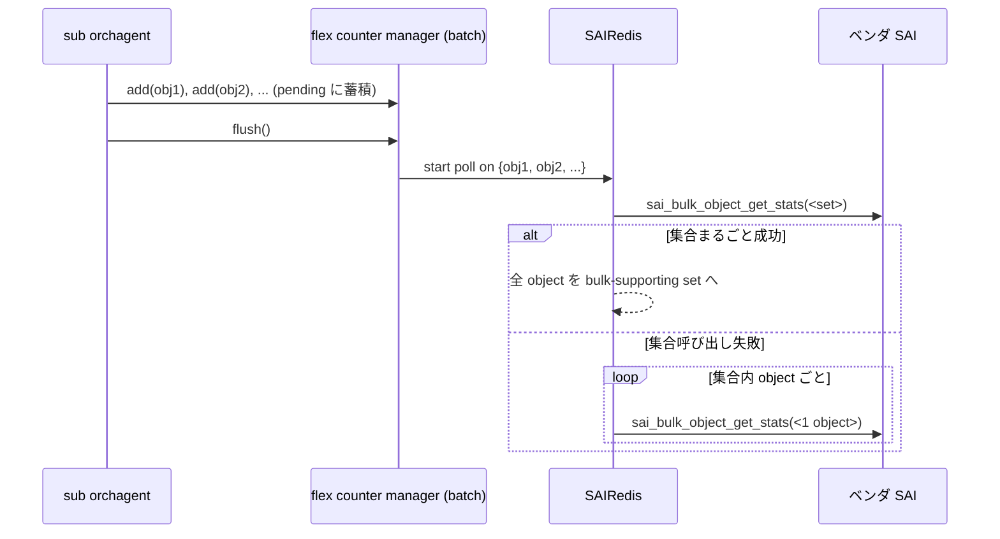

<!-- topics-tip -->
!!! tip "Topics で読み物として読む"
    この HLD は実装詳細を含みます。機能の概念・設定・運用を読み物として読みたい場合は [Topics 09 章: Telemetry / SNMP / ログ](../topics/09-telemetry-snmp/index.md) を参照。
<!-- /topics-tip -->

!!! success "裏取りステータス: Code-verified（命名は FlexCounterCachedManager）"
    `sonic-swss/orchagent/flex_counter/flex_counter_manager.h` で `FlexCounterCachedManager` テンプレート、`flush(group_name, cached_objects)` (L228, L233-235), `pending_sai_objects` 参照 (L190), 派生 `FlexCounterTaggedCachedManager` の `flush()` (L304, L345) を確認。`portsorch.h` L336 で `port_buffer_drop_stat_manager` が `FlexCounterTaggedCachedManager<void>` 型として実装。HLD の `batch_mode` 引数は実装上は専用クラス `FlexCounterCachedManager` で表現されており、構造設計は HLD どおり。queue UC/MC 分割や PG 系の cached 化も同ヘッダで対応 (verified at: 2026-05-09)。

# flex counter 初期化最適化（`pending_sai_objects` + バッチ `bulk_get_stats`）

## 読み手が知りたいこと

- なぜ counter 初期化に分単位の時間がかかっていたのか
- 何を「1 個ずつ」から「まとめて」に変えたのか
- sub [orchagent](../reference/glossary.md#term-orchagent) 側で何を意識する必要があるか
- 旧来の `batch_mode` 引数は実装でどうなっているのか

## なぜ初期化が遅いか（旧フローの問題）

SONiC の counter は **counter group**（port / port-drop / PG-drop / queue / watermark / [RIF](../reference/glossary.md#term-rif) 等）単位で flex counter が管理する。各 group は初期化時、object ごとに **`sai_bulk_object_get_stats`** を 1 件で呼び「この [SAI](../reference/glossary.md#term-sai) object で bulk polling できるか」を確認していた[^1]。

port 数が多い系（例: 257 ports）では port あたり 3 PG + 8 queue + 1 port = 12 object、これに counter group 数が掛かるため呼び出し回数が爆発する。確認完了までは orchagent が port up 通知を捌けず **ブロックする**。ベンチマークでは初期化時間の **98% がベンダ SAI 内** で消費されていた[^1]。

## 何を変えるか（新フロー）

「object を 1 つずつ確認」を **「同型 object をまとめて 1 回確認 → 失敗時のみ個別 fallback」** に変える。

ポイント[^1]:

- 集合まとめで叩いて成功すれば 1 回で済む
- 失敗時は **個別 fallback**。「ほとんどの object が同じ bulk サポート状態」になる ASIC で大幅短縮
- sub orchagent は **flush 時点を能動的に決める** 必要がある

## 実装変更点

### `flex_counter_manager` (`sonic-swss`)

| 追加要素 | 役割 |
|---------|------|
| コンストラクタ引数 `batch_mode` | batch モード有効化（実装では専用クラス `FlexCounterCachedManager` に分離） |
| `pending_sai_objects` | add 済だが SAIRedis 未通知の object 群 |
| `flush()` | `pending_sai_objects` を SAIRedis に一括通知 |
| 既存 add/remove | batch_mode では pending に積むのみ |

### `portsorch`

- `doTask` の中で `flex_counter_manager.flush()` を直接呼ぶ[^1]
- queue 系 flex counter manager を **unicast / multicast で 2 個に分割**（bulk API が uc には効くが mc では効かない ASIC への対策）[^1]
- PG flex counter group も `flex_counter_manager` 管轄に切替

### `sairedis`

オブジェクト集合に対して counter polling を開始する API を新設し、`sai_bulk_object_get_stats(<set>)` 呼び出しに対応[^1]。

## 効果（PoC ベンチマーク）

| 項目 | 数値 |
|------|------|
| 対象 | 257 ports |
| 旧フロー（counters ready + all ports up） | **6 分 10 秒** |
| 新フロー | **2 分 23 秒**（約 60% 短縮） |
| 旧フローの SAI API 時間占有率 | 全体の 98% がベンダ SAI 内 |

「ベンダ SAI が時間を支配しているので、呼び出し回数を減らすのが効く」が裏付けされた[^1]。

## 設定

ユーザインタフェース変更は **無し**[^1]。新規 SAI API も無し（既存 `sai_bulk_object_get_stats` を流用）。

## 制限事項

- **runtime polling の最適化はスコープ外**。本 [HLD](../reference/glossary.md#term-hld) は初期化のみ[^1]
- 集合呼び出し失敗時は object 数だけ個別 fallback が発生 → unsupported 混入で効果減
- queue 系 uc / mc 分割でテストも分割対応
- Warm boot / Fast boot への影響は無し[^1]

## 干渉する機能

- **`flex_counter_manager`**: 主要変更箇所
- **`portsorch` / `bufferorch`**: `flush()` 呼び出し位置を意識
- **`sonic-sairedis`**: 集合 polling API 追加
- **port up イベント**: 初期化高速化で通知遅延が短縮

## トラブルシューティング

- 初期化が遅い → `flush()` 呼び出し位置と `pending_sai_objects` サイズを確認
- bulk-unsupporting set が想定以上 → ベンダ SAI が集合 polling を返さない理由（mc queue, port-drop 等）を切り分け
- queue uc / mc 片方だけ動かない → 新分割の manager 単位で確認

## 関連 Topics

- [Topic 20 SWSS/SAI/Redis - internals](../topics/20-swss-sai-redis/internals.md)
- [Topic 09 Telemetry/SNMP - internals](../topics/09-telemetry-snmp/internals.md)

## 既知の問題

### PFC とキューカウンターが負の値を示す問題（sonic-buildimage#5206）

[PFC](../reference/glossary.md#term-pfc) とキューカウンターが負の値を示す問題。カウンターのオーバーフローまたは初期化前の読み取りが原因。`sonic-clear` で初期化してから再度確認すること

- 参照: [sonic-net/sonic-buildimage#5206](https://github.com/sonic-net/sonic-buildimage/issues/5206)

## 引用元

[^1]: `sonic-net/SONiC` `doc/flex_counter/optimize-counter-initialization.md` @ `49bab5b5ff0e924f1ea52b3d9db0dfa4191a7c06`

<!-- topics-back-ref -->
## 関連 Topics

- [Topics: Telemetry / SNMP / Observability](../topics/09-telemetry-snmp/index.md)

<!-- /topics-back-ref -->

<!-- glossary-links-injected: a09c09b48079 -->
