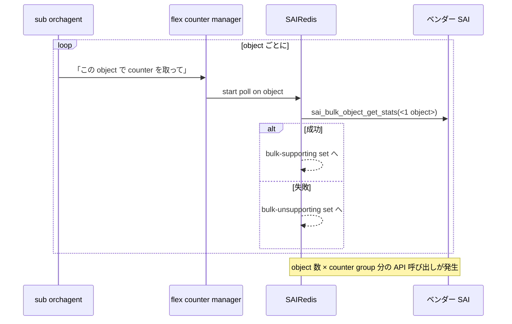
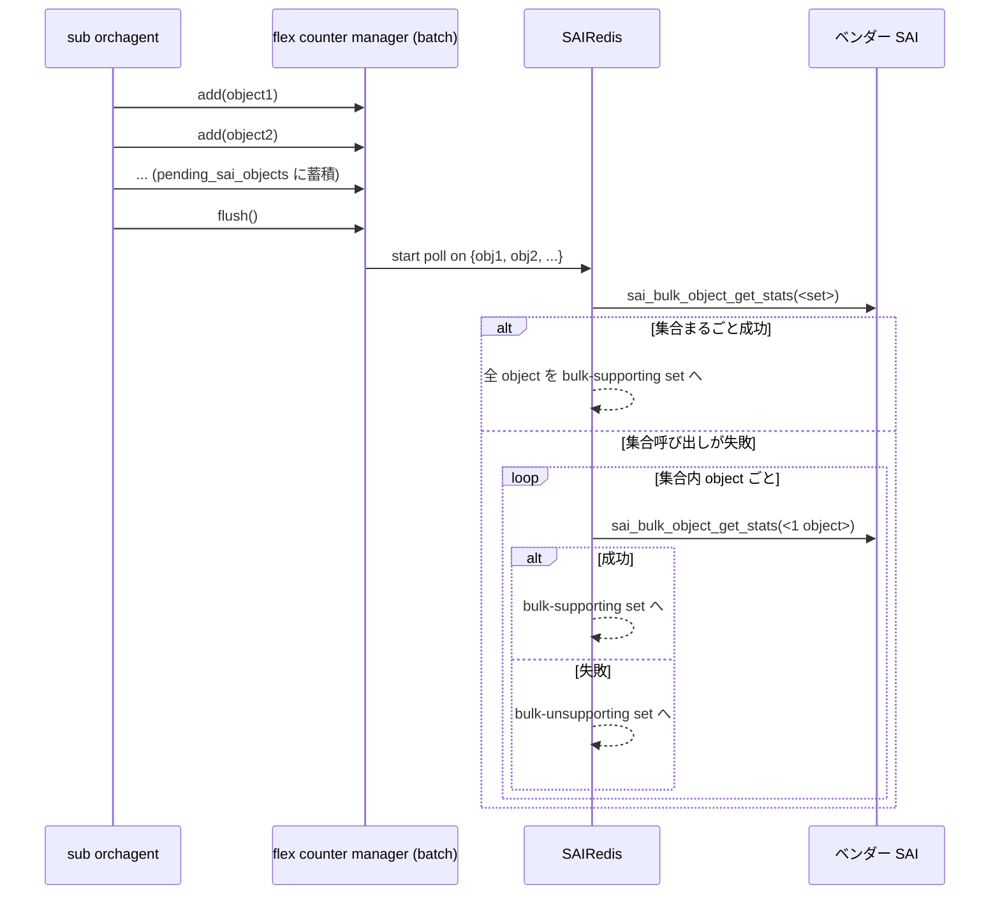

!!! success "裏取りステータス: Code-verified（命名は FlexCounterCachedManager）"
    `sonic-swss/orchagent/flex_counter/flex_counter_manager.h` で `FlexCounterCachedManager` テンプレートと `flush(group_name, cached_objects)` (L228, L233-235), `pending_sai_objects` 参照 (L190), 派生クラス `FlexCounterTaggedCachedManager` の `flush()` (L304, L345) を確認。`portsorch.h` L336 で `port_buffer_drop_stat_manager` が `FlexCounterTaggedCachedManager<void>` 型として実装。**HLD で言及される `batch_mode` 引数は実装上は専用クラス `FlexCounterCachedManager` で表現** されており、構造設計は HLD どおり。queue UC/MC 分割や PG 系の cached 化も同ヘッダで対応 (verified at: 2026-05-09)。

# flex counter 初期化最適化（`pending_sai_objects` + バッチ `bulk_get_stats`）

## 概要

SONiC の counter は **counter group** 単位で **flex counter** が管理する（port / port-drop / PG-drop / queue / watermark / RIF など）[^1]。各 group は初期化時に「この SAI object でその counter を bulk polling できるか？」を **`sai_bulk_object_get_stats`** を呼んで確認していた。

問題は **port 数が多い系（例: 257 ports）でこの確認に膨大な時間がかかる** 点。port あたり 3 PG + 8 queue + 1 port = 12 object、各 object に複数 counter group が紐づくため、object 数が爆発する。さらにこの確認が完了するまで orchagent は port up 通知を捌けない（ブロックする）。ベンチマークでは初期化中の **98% の時間がベンダ SAI 実装内** で消費されていた[^1]。

本 HLD は **「object を 1 つずつ確認」を「同型 object をまとめて 1 回確認」** に変える。SAIRedis 側は bulk API を **オブジェクト集合** に対して一発呼び、失敗時のみ個別フォールバックする。これで **257 port 系で初期化を 6:10 → 2:23 と約 60% 短縮** した PoC 結果が示されている[^1]。

## 動作仕様

### 用語

| 用語 | 説明 |
|------|------|
| PG | priority group。port の ingress queue 表現 |
| 単一 polling API | `get_<obj>_stats(_ext)` 系。1 object 単位 |
| bulk polling API | `sai_bulk_object_get_stats`。複数 object の同種 counter を一発取得 |
| counter group | counter の論理分類（port, queue, watermark 等） |
| flex counter | SONiC で counter polling を管理するコンポーネント |
| sub orchagent | `sonic-swss/orchagent/` 配下の portsorch / bufferorch 等 |

### 旧フロー（current）

問題:

- N 個の object に対し N 回の `sai_bulk_object_get_stats` 呼び出し
- ベンダ SAI の bulk API が「N 個まとめて」を意識して書かれているのに、**1 個ずつ叩いて bulk_supporting 判定だけに使う** のは無駄
- 初期化が orchagent の port up 処理をブロックする

### 新フロー（optimized）

ポイント[^1]:

- まず **集合まとめ** で叩いて成功すれば 1 回で済む
- 集合呼び出しが失敗（ある object が unsupported）なら **個別 fallback**
- 期待値として「ほとんどの object が同じ bulk サポート状態」になる ASIC では大幅短縮

### 設計上の課題

「sub orchagent が object を 1 つずつ追加するタイミング」と「SAIRedis に bulk で投げるタイミング」が分離するため、**いつ flush するか** を sub orchagent が能動的に決める必要がある[^1]。

### `flex_counter_manager` の変更

`sonic-swss/orchagent/flex_counter/flex_counter_manager.cpp` のクラスに次を追加[^1]:

| 追加要素 | 役割 |
|---------|------|
| コンストラクタ引数 `batch_mode` | batch モード有効化フラグ |
| メンバ `pending_sai_objects` | sub orchagent から add されたが、まだ SAIRedis に通知していない object 群 |
| メソッド `flush()` | `pending_sai_objects` を SAIRedis に一括通知 |
| 既存 add/remove API | batch_mode の場合 pending に積むだけ |

sub orchagent が `flush()` を **明示的に呼ぶ** 必要がある。

### `portsorch` の変更

port / PG / queue の counter group は `portsorch` が管理する。`doTask` が orchagent の main loop である[^1]:

- `doTask` の中で `flex_counter_manager.flush()` を直接呼ぶ
- queue 系 flex counter manager を **unicast / multicast で 2 個に分割**。bulk API は uc には効くが mc では効かない ASIC があるため[^1]
- PG flex counter group も `flex_counter_manager` 管轄に切替（コード簡素化）

### `sairedis` の変更

オブジェクト集合に対して counter polling を開始する API を新設し、上記 flow の `sai_bulk_object_get_stats(<set>)` 呼び出しに対応する[^1]。

<!-- evidence:
source: sonic-net/SONiC/doc/flex_counter/optimize-counter-initialization.md#L107-L124 (sha: 49bab5b5ff0e924f1ea52b3d9db0dfa4191a7c06)
excerpt: |
  2. The flex counter manager caches and groups objects of the same type together and notifies SAIRedis to initialize the counters for a set of objects.
  3. SAIRedis calls `sai_bulk_object_get_stats` with the set of objects, and counter IDs as the arguments.
     1. SAIRedis adds the object to `bulk-supporting object set` if the call succeeds.
     2. SAIRedis calls `sai_bulk_object_get_stats` for each object in the set if step 3 fails, and ...
reasoning: 「集合一発 → 失敗時のみ個別 fallback」という新フローの根拠。
-->

### Benchmark

HLD 末尾に PoC 結果あり[^1]:

| 項目 | 数値 |
|------|------|
| 対象システム | 257 ports |
| 旧フロー | counters ready + all ports up まで **6 分 10 秒** |
| 新フロー | 同 **2 分 23 秒** |
| SAI API 呼び出し時間の割合（旧フロー）| 全体時間の 98% がベンダ SAI 内 |
| サンプル: 84 回 SAI 呼び出し | 累積 5.67s に対し E2E 5.78s |

「ベンダ SAI が時間を支配しているので、API 呼び出し回数を減らすのが効く」という HLD の前提を裏付ける。

## 設定

### 関連する CLI / CONFIG_DB / YANG

ユーザインタフェース変更は **無し**[^1]。"The change shall not introduce any user interface change."

### 関連する SAI API

新 SAI API は無し[^1]。既存 `sai_bulk_object_get_stats` をそのまま使う。

## 制限事項

- **runtime polling の最適化はスコープ外**[^1]。本 HLD は初期化のみ
- 集合呼び出し失敗時は object 数だけ個別フォールバックが発生するため、**unsupported object が混じると効果が薄れる**
- queue 系で uc / mc の manager を分けるため、関連テストが分割対応必要
- Warm boot / Fast boot への影響は無し（HLD 明記）[^1]

## 干渉する機能

- **`flex_counter_manager`**: 主要変更箇所。batch_mode 引数と `flush()` の追加で API 形が変わる
- **`portsorch` / `bufferorch` などの sub orchagent**: `flush()` を呼ぶ位置を意識する必要
- **`sonic-sairedis`**: 集合 polling API の追加
- **port up イベント処理**: 初期化が高速化することで port up 通知の遅延が短縮

## トラブルシューティング

- counter 初期化に時間がかかる場合、`flush()` 呼び出し位置と `pending_sai_objects` のサイズを確認
- bulk-unsupporting set が予想以上に多い場合、ベンダ SAI が集合 polling を返さない理由（mc queue, port-drop 等）を切り分ける
- queue 関連 counter のうち unicast だけ動く / multicast が動かない、というケースは新規分割の manager 単位で確認

## 引用元

[^1]: `sonic-net/SONiC` `doc/flex_counter/optimize-counter-initialization.md` @ `49bab5b5ff0e924f1ea52b3d9db0dfa4191a7c06`

<!-- concerns hint:
- flex_counter_manager の batch_mode 引数と pending_sai_objects 実装
- portsorch doTask での flush() 呼び出し位置
- queue 系 flex counter manager の uc / mc 分割
- PG flex counter manager 化の現行コード
- sonic-sairedis 側の集合 polling API 追加
- 集合一発成功 → 失敗時 fallback の判定ロジック
-->
