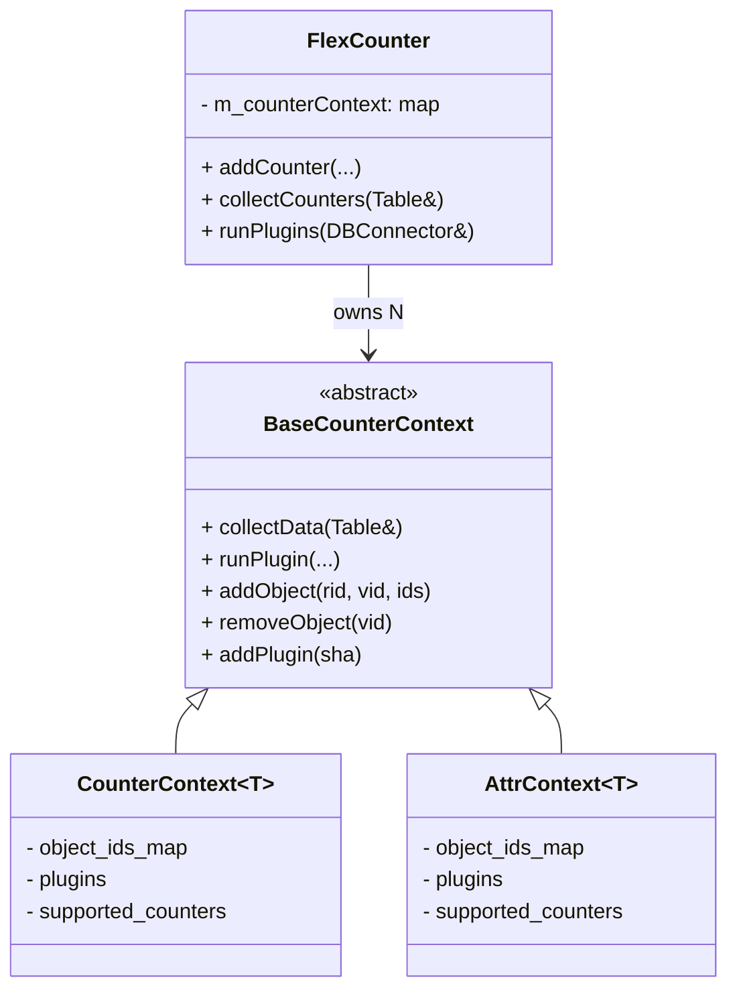

!!! warning "裏取りステータス: HLD-only"
    このページは公式 HLD のみを根拠にしている。`sonic-sairedis` 内 `syncd/FlexCounter.{h,cpp}` の現行コード構造（CounterContext / AttrContext テンプレートの導入状況、`if constexpr` の使用、`m_counterContext` マップの存在）は未裏取り。

# FlexCounter リファクタ（CounterContext テンプレート化）

## 概要

`syncd` の `FlexCounter` クラスは、port / queue / buffer pool / priority group など **多数の統計・属性タイプ** を扱う巨大クラスである。port counter / queue counter / queue attribute… ごとに `setXXXCounterList`, `removeXXX`, `collectXXXCounters`, `collectXXXAttr` といった **ほぼ同じロジックの関数群** が独立して実装されており、`FlexCounter.cpp` だけで約 4000 行・`FlexCounter.h` で約 600 行に膨らんでいる[^1]。

この HLD は、SAI 側の型が異なる（`sai_port_stat_t` / `sai_queue_stat_t` / `sai_port_attr_t` ...）ため一見テンプレ化しにくいこの構造を、**`CounterContext<T>` / `AttrContext<T>` というテンプレートクラス** に集約してコードを大幅に圧縮するリファクタを定義している。POC では `FlexCounter.cpp` が 1000 行・`.h` が 200 行まで縮み、新しい統計タイプを追加する際の手数が劇的に減るとされる[^1]。

公開 API（`FlexCounter` の interface）は **不変** とすることが要件。他コンポーネントから見るとリファクタは透過[^1]。

## 動作仕様

### スコープと要件

HLD が明示する制約[^1]:

- 変更は **`FlexCounter` クラス内** に閉じる。
- **public interface の機能は同一** に保つ。
- 他のクラス・コンポーネントから見て **透過** であること。

つまり呼び出し側コードに手を入れない。リファクタ対象は `sonic-sairedis` の `FlexCounter.cpp` / `FlexCounter.h` のみ[^1]。

### 旧構造の問題

旧来は統計種別ごとに 3 系統のデータを別々に持っていた[^1]:

| データ種別 | 旧メンバ例 |
|------------|------------|
| Counter IDs map（vid + rid + 取得する counter ID の集合）| `m_portCounterIdsMap`, `m_queueCounterIdsMap` ... |
| Plugins（Redis 側で実行する Lua の SHA）| `m_portPlugins`, `m_queuePlugins` ... |
| Supported counters（SAI が対応している counter ID の集合）| `m_supportedPortCounters`, `m_supportedQueueCounters` ... |

加えて種別ごとの構造体（`PortCounterIds`, `QueueCounterIds`, `BufferPoolCounterIds` ...）と関数群（`setXXXCounterList`, `collectXXXCounters` ...）も一式存在。**ロジックはほぼ同一だが SAI 統計型が違うので C++ の同じコンテナに入れられない** という制約が、重複を温存していた[^1]。

### 新構造: CounterContext テンプレート

新設計では各統計/属性タイプは **`CounterContext<T>` / `AttrContext<T>` のインスタンス** で代表され、`FlexCounter` 内では **`counter_context_map`（種別 → context のマップ）** に格納される[^1]。先述の 3 系統のデータは context のメンバに移動する:

| 旧 | 新（context 内）|
|----|----------------|
| `m_XXXCounterIdsMap` | `object_ids_map` |
| `m_XXXPlugins` | `plugins` |
| `m_supportedXXXCounters` | `supported_counters` |



### CounterIds 構造のテンプレ化

旧来 `PortCounterIds` / `QueueCounterIds` / `BufferPoolCounterIds` などが個別定義されていたところを、**型パラメータ付き 1 つの `CounterIds<StatType>`** に集約する。`buffer_pool` のみ per-instance の `stats_mode` を持つので、SFINAE / `enable_if` で **specialization** を使い分ける[^1]:

```cpp
template <typename StatType, typename Enable = void>
struct CounterIds {
    sai_object_id_t rid;
    std::vector<StatType> counter_ids;
};

// buffer_pool は instance 単位の stats_mode を持つので
// 特殊化で stats_mode を増やす
template <typename StatType>
struct CounterIds<StatType,
                  typename std::enable_if<std::is_same<StatType,
                                                       sai_buffer_pool_stat_t>::value>::type> {
    sai_object_id_t rid;
    std::vector<StatType> counter_ids;
    sai_stats_mode_t stats_mode;
};
```

これで「instance 単位の stats_mode 有無」がコードベースで一元管理される[^1]。

### 統計種別ごとの差異の吸収

統計種別ごとにフローは似ていても **完全に同一ではない** ため、`BaseCounterContext` にフラグを置いて差異を吸収する[^1]:

| 差異 | 吸収方法 |
|------|---------|
| SAI 経由で statistic capability を query するか否か | `BaseCounterContext` 内 flag |
| capability query を毎回行うか初回のみか | `BaseCounterContext` 内 flag |
| `getStats` か `getStatsExt` か | `BaseCounterContext` 内 flag |
| per-object の stats_mode をサポートするか | `if constexpr` で型に応じて分岐 |

これにより派生クラスは振る舞い flag を設定するだけで、共通実装が分岐する形になる[^1]。

### Add/Update カウンタオブジェクト

旧フロー[^1]:

```text
FlexCounterManager → FlexCounter::addCounter
   → setXXXCounterList
       → updateXXXSupportedCounters (SAI capability query)
           → 失敗時 fallback: getXXXSupportedCounters (実値で query)
       → supported が空でなければ XXXCounterIdsMap に登録
```

新フロー: 上の `setXXXCounterList` 以降が **`CounterContext` に丸ごと移動**。`FlexCounter::addCounter` は対応する context を引いて context 側のメソッドを呼ぶだけになる[^1]。フロー自体は同じだが、**実装が context 内に閉じる** のが核心。

### Remove カウンタオブジェクト

旧来は `FlexCounter` が直接 `m_XXXCounterIdsMap` から消していた。新設計では `CounterContext` / `AttrContext` の `removeObject(vid)` に委譲する[^1]。

### Plugin 追加

Lua plugin の SHA を `m_XXXPlugins` に積む処理も `BaseCounterContext::addPlugin` に移動する[^1]。

### 統計収集ループの簡略化

旧来は `collectXXXCounters` の関数ポインタをマップに登録してループする構造だった。新設計では `m_counterContext` を素朴に走査して各 context の `collectData` を呼ぶだけになる[^1]:

```cpp
void FlexCounter::collectCounters(swss::Table &countersTable)
{
    for (const auto &it : m_counterContext) {
        it->second->collectData(countersTable);
    }
    countersTable.flush();
}

void FlexCounter::runPlugins(swss::DBConnector& counters_db)
{
    const std::vector<std::string> argv = {
        std::to_string(counters_db.getDbId()),
        COUNTERS_TABLE,
        std::to_string(m_pollInterval)
    };
    for (const auto &it : m_counterContext) {
        it->second->runPlugin(counters_db, argv);
    }
}
```

関数ポインタマップが不要になるのと、新統計タイプの追加が **`CounterContext<NewType>` の登録 1 行** で済むのが効果。

<!-- evidence:
source: sonic-net/SONiC/doc/flex_counter/flex_counter_refactor.md#L36-L42 (sha: 49bab5b5ff0e924f1ea52b3d9db0dfa4191a7c06)
excerpt: |
  Code lines of FlexCounter.cpp change from ~4000 to ~1000
  Code lines of FlexCounter.h change from ~600 to ~200
  Supporting new flex counter would requires only change a few places instead of implementing all those setXXXCounterList/removeXXX/collectXXXCounter and so on
reasoning: 行数削減と「新統計タイプ追加コスト低減」が本リファクタの主要動機である根拠。
-->

### 効果（POC）

POC レベルでの効果[^1]:

- `FlexCounter.cpp`: 約 4000 行 → 約 1000 行
- `FlexCounter.h`: 約 600 行 → 約 200 行
- 新しい flex counter タイプを追加する際の改修箇所が **数か所** に削減

## 設定

このリファクタはユーザ可視の振る舞いを変えない。CONFIG_DB / CLI / YANG への影響は HLD 上 **N/A**[^1]。

### 関連する CONFIG_DB

該当なし。`FLEX_COUNTER_TABLE` 自体のスキーマは変わらず、syncd 内部実装のみが変わる。

### 関連する CLI

該当なし。

## 制限事項

HLD は `Restrictions/Limitations` を **N/A** と明記している[^1]。  
ただし C++ テンプレートと SFINAE / `if constexpr` を多用するため、コンパイラ要件（C++17 以降相当）が事実上の前提となる点に注意。HLD には言及がない。

## 干渉する機能

- **`FlexCounterManager`**: 呼び出し側として変更不要。`FlexCounter::addCounter` の signature と意味は維持されるため、上位ロジックの改修なし[^1]。
- **既存の Lua plugin (Watermark / RATES / WRED 等)**: plugin の SHA 登録経路と `runPlugins` の挙動は同等。Plugin 側の Lua スクリプトには変更不要。
- **warmboot / fastboot**: HLD は影響を **N/A** と記載している[^1]。public interface 不変が前提なので、起動再構成のセマンティクスは変わらない想定。
- **新規 SAI 統計の追加**: 拡張容易性が向上する側面。`CounterContext<NewSaiStatType>` を登録すれば既存ロジックを継承できる。

## トラブルシューティング

リファクタは振る舞い不変が要件のため、新たに増えるトラブル類型は基本的に無い。観点としては:

- リファクタ後の syncd で **特定種別の counter だけ取れない** 事象が起きた場合、`BaseCounterContext` の差異吸収 flag（capability query 有無、`getStats` / `getStatsExt` 切替）の設定誤りを疑う。
- POC コードと production コードの差分。HLD 内のコード断片は **デモンストレーション用** と明記されており、最終実装と完全一致は保証されない[^1]。

## 引用元

[^1]: `sonic-net/SONiC` `doc/flex_counter/flex_counter_refactor.md` @ `49bab5b5ff0e924f1ea52b3d9db0dfa4191a7c06`
