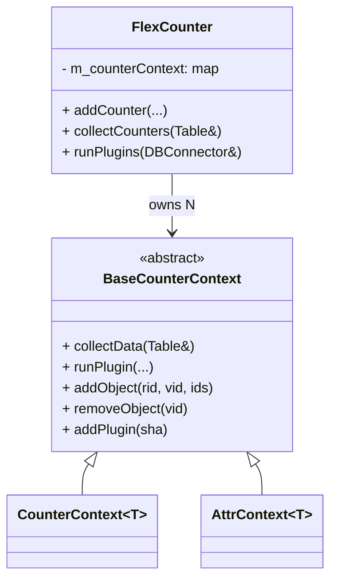

<!-- topics-tip -->
!!! tip "Topics で読み物として読む"
    この HLD は実装詳細を含みます。機能の概念・設定・運用を読み物として読みたい場合は [Topics 09 章: Telemetry / SNMP / ログ](../topics/09-telemetry-snmp/index.md) を参照。
<!-- /topics-tip -->

!!! note "裏取りステータス: code-verified"
    `sonic-sairedis/syncd/FlexCounter.h:43-` に `class BaseCounterContext`、`std::map<std::string, std::shared_ptr<BaseCounterContext>> m_counterContext;` (L223) を確認。`FlexCounter.cpp:1664-` に `template ... class AttrContext : public CounterContext<AttrType>`、派生 `PortPhyAttrContext` (L1769) / `PortPhySerdesAttrContext` (L2204) を確認。`getCounterContext` / `createCounterContext` / `removeCounterContext` / `hasCounterContext` の API も `FlexCounter.h:162-172` に存在し、HLD PoC が master 取り込み済みであることを確認。

# FlexCounter リファクタ（CounterContext テンプレート化）

## 読み手が知りたいこと

- 旧 `FlexCounter` クラスの何が問題で、なぜリファクタが要るのか
- [SAI](../reference/glossary.md#term-sai) 統計型がバラバラなのに、どうやってテンプレ化したのか
- 公開 API は変わるのか
- 新しい counter type を追加する手数はどう減るのか

## なぜリファクタが要るか（旧構造の問題）

`syncd` の `FlexCounter` は port / queue / buffer pool / priority group など **多数の統計・属性タイプ** を扱う巨大クラス。port counter / queue counter / queue attribute … ごとに `setXXXCounterList` / `removeXXX` / `collectXXXCounters` / `collectXXXAttr` が独立実装されていて `FlexCounter.cpp` 約 4000 行、`.h` 約 600 行に膨らんでいる[^1]。

旧来は統計種別ごとに 3 系統のデータを別々に持っていた[^1]:

| データ種別 | 旧メンバ例 |
|------------|------------|
| Counter IDs map | `m_portCounterIdsMap`, `m_queueCounterIdsMap` ... |
| Plugins（[Redis](../reference/glossary.md#term-redis) Lua の SHA）| `m_portPlugins`, `m_queuePlugins` ... |
| Supported counters | `m_supportedPortCounters`, `m_supportedQueueCounters` ... |

加えて種別ごとに `PortCounterIds` / `QueueCounterIds` / `BufferPoolCounterIds` 等の構造体と関数群が一式存在。**ロジックはほぼ同一だが SAI 統計型が違うため C++ の同じコンテナに入らない** という制約が重複を温存していた[^1]。

公開 API（`FlexCounter` の interface）は **不変** であることが要件。呼出し側コードに手を入れない[^1]。

## 何に置き換えるか（新構造）

各統計/属性タイプを **`CounterContext<T>` / `AttrContext<T>` のインスタンス** で代表し、`FlexCounter` 内では **`m_counterContext`（種別 → context のマップ）** に格納する。3 系統のデータは context のメンバへ移動[^1]:

| 旧 | 新（context 内）|
|----|----------------|
| `m_XXXCounterIdsMap` | `object_ids_map` |
| `m_XXXPlugins` | `plugins` |
| `m_supportedXXXCounters` | `supported_counters` |



### CounterIds のテンプレ化

旧 `PortCounterIds` / `QueueCounterIds` / `BufferPoolCounterIds` を 1 つの `CounterIds<StatType>` に集約。`buffer_pool` のみ per-instance の `stats_mode` を持つので **specialization** で吸収[^1]:

```cpp
template <typename StatType, typename Enable = void>
struct CounterIds {
    sai_object_id_t rid;
    std::vector<StatType> counter_ids;
};

template <typename StatType>
struct CounterIds<StatType,
                  typename std::enable_if<std::is_same<StatType,
                                                       sai_buffer_pool_stat_t>::value>::type> {
    sai_object_id_t rid;
    std::vector<StatType> counter_ids;
    sai_stats_mode_t stats_mode;
};
```

### 統計種別ごとの差異の吸収

`BaseCounterContext` にフラグを置いて分岐させる[^1]:

| 差異 | 吸収方法 |
|------|---------|
| SAI capability query を行うか | `BaseCounterContext` フラグ |
| capability query を毎回 / 初回のみ | `BaseCounterContext` フラグ |
| `getStats` か `getStatsExt` か | `BaseCounterContext` フラグ |
| per-object の stats_mode をサポートするか | `if constexpr` で型分岐 |

派生クラスは振る舞いフラグを設定するだけで共通実装が分岐する。

## API レベルの変化

公開 API は不変。内部のみ次のように整理[^1]:

- **Add/Update**: `FlexCounter::addCounter` は対応する context を引いて context 側メソッドを呼ぶだけ。`setXXXCounterList` 以降のロジックが **context に丸ごと移動**
- **Remove**: 旧来 `FlexCounter` が直接 `m_XXXCounterIdsMap` から消していたのを `CounterContext::removeObject(vid)` に委譲
- **Plugin 追加**: `m_XXXPlugins` への push を `BaseCounterContext::addPlugin` に移動
- **統計収集ループ**: 関数ポインタマップを廃し、`m_counterContext` を素朴に走査:

```cpp
void FlexCounter::collectCounters(swss::Table &countersTable) {
    for (const auto &it : m_counterContext)
        it->second->collectData(countersTable);
    countersTable.flush();
}
```

新統計タイプの追加は **`CounterContext<NewType>` の登録 1 行** で済む。

## 効果（PoC）

| 項目 | 旧 | 新 |
|------|-----|-----|
| `FlexCounter.cpp` 行数 | 約 4000 | **約 1000** |
| `FlexCounter.h` 行数 | 約 600 | **約 200** |
| 新統計タイプ追加 | `setXXXCounterList` 等を一式実装 | context 登録 + 振舞フラグ設定 |

## 設定

[CONFIG_DB](../reference/glossary.md#term-config_db) / CLI / [YANG](../reference/glossary.md#term-yang) への影響は [HLD](../reference/glossary.md#term-hld) 上 **N/A**[^1]。`FLEX_COUNTER_TABLE` スキーマは不変、[syncd](../reference/glossary.md#term-syncd) 内部実装のみ変更。

## 制限事項

HLD は `Restrictions/Limitations` を **N/A** と明記[^1]。事実上の前提として C++ テンプレートと SFINAE / `if constexpr` を多用するため C++17 以降相当のコンパイラが必要（HLD には言及なし）。

## 干渉する機能

- **`FlexCounterManager`**: 呼出し側として変更不要。`FlexCounter::addCounter` の signature と意味は維持
- **既存 Lua plugin (Watermark / RATES / [WRED](../reference/glossary.md#term-wred) 等)**: SHA 登録経路と `runPlugins` 挙動は同等、Lua 側は不変
- **warmboot / fastboot**: HLD は影響 N/A。public interface 不変が前提[^1]
- **新規 SAI 統計の追加**: 拡張容易性が向上

## トラブルシューティング

- 特定種別だけ counter が取れない → `BaseCounterContext` の差異吸収フラグ（capability query 有無、`getStats` / `getStatsExt` 切替）の設定誤りを疑う
- HLD 内コード断片は **デモンストレーション用** と明記。最終実装と完全一致は保証されない[^1]

## 関連 Topics

- [Topic 20 SWSS/SAI/Redis - internals](../topics/20-swss-sai-redis/internals.md)
- [Topic 09 Telemetry/SNMP - internals](../topics/09-telemetry-snmp/internals.md)

## 引用元

[^1]: `sonic-net/SONiC` `doc/flex_counter/flex_counter_refactor.md` @ `49bab5b5ff0e924f1ea52b3d9db0dfa4191a7c06`

<!-- topics-back-ref -->
## 関連 Topics

- [Topics: Telemetry / SNMP / Observability](../topics/09-telemetry-snmp/index.md)

<!-- /topics-back-ref -->

<!-- glossary-links-injected: 78e7206f4df2 -->
