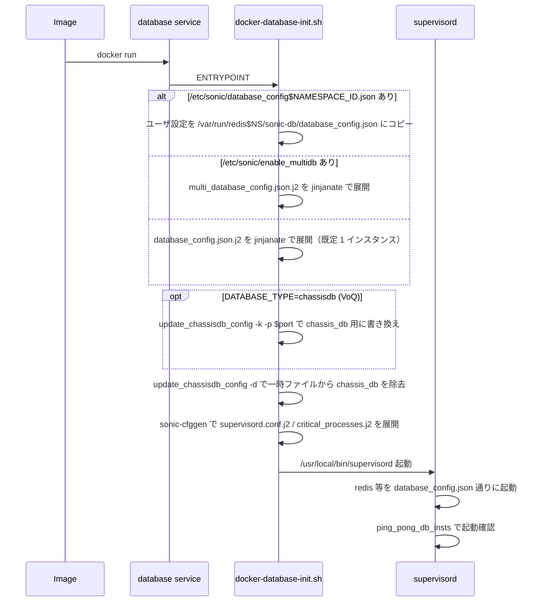

<!-- topics-tip -->
!!! tip "Topics で読み物として読む"
    この HLD は実装詳細を含む。機能の概念・設定・運用を読み物として読みたい場合は [Topics 20 章: SWSS / SAI / Redis](../topics/20-swss-sai-redis/index.md) を参照。
<!-- /topics-tip -->

!!! success "裏取りステータス: code-verified"
    `sonic-buildimage/dockers/docker-database/docker-database-init.sh` L55-63 で `/etc/sonic/database_config$NAMESPACE_ID.json` を最優先で `/var/run/redis$NAMESPACE_ID/sonic-db/database_config.json` にコピーし、不在時は **`/etc/sonic/enable_multidb` フラグの有無** で `multi_database_config.json.j2` (フラグあり) か `database_config.json.j2` (フラグなし) を `jinjanate` で展開する 3 分岐を確認。L84-101 で `DATABASE_TYPE=chassisdb` (VoQ chassis) 時は `update_chassisdb_config` で chassis_db エントリを操作し、L120-128 で通常 line-card / standalone は `update_chassisdb_config -d` で chassis_db を一旦除去した一時ファイルから `sonic-cfggen` で `supervisord.conf` を生成する点も確認。`sonic-buildimage/dockers/docker-database/` 配下に `database_config.json.j2` / `multi_database_config.json.j2` / `supervisord.conf.j2` / `database_global.json.j2` を確認。`sonic-swss-common/common/dbconnector.h` L90 `DEFAULT_SONIC_DB_CONFIG_FILE = "/var/run/redis/sonic-db/database_config.json"`、`sonic-swss-common/common/database_config.json` で INSTANCES + DATABASES セクション仕様を、`tests/redis_multi_db_ut_config/database_config[0-5].json` で複数インスタンス UT 設定を確認（verified at: 2026-06-06）。詳細な C++ / Python API シグネチャは原文 HLD §New Design of {C++,Python} Interface を参照。

# 複数 Redis インスタンスのユーザ定義（database_config.json で DB を分散）

## 概要

従来の [SONiC](../reference/glossary.md#term-sonic) は **単一の [Redis](../reference/glossary.md#term-redis) インスタンス** に [APPL_DB](../reference/glossary.md#term-appl_db) / [ASIC_DB](../reference/glossary.md#term-asic_db) / [CONFIG_DB](../reference/glossary.md#term-config_db) / [STATE_DB](../reference/glossary.md#term-state_db) 等をすべて載せていた。短時間に大量の書き込み（数百万ルート学習等）が発生すると **この 1 インスタンスがホットスポット** になる。[HLD](../reference/glossary.md#term-hld) の実測では Redis を 2 インスタンスに分割して負荷を分散するだけで **20〜30% の性能改善** が得られた[^1]。

本機能は[^1]:

1. **ユーザが `database_config.json` で Redis インスタンス数と DB の割当を任意定義できる** ようにする
2. 起動経路を `docker-database-init.sh` に切り替え、`supervisord.conf` を **j2 テンプレ生成** に変更
3. ユーザ設定は `/etc/sonic/database_config$NAMESPACE_ID.json` に置き、起動時に `/var/run/redis$NAMESPACE_ID/sonic-db/database_config.json` にコピーされる。ユーザ設定が無い場合は **`/etc/sonic/enable_multidb` フラグ** の有無で `multi_database_config.json.j2` か `database_config.json.j2` のどちらかを `jinjanate` でランタイム展開する[^2]

> このページは [Multi-namespace Redis HLD](support-redis-databases-in-multiple-namespaces.md) の **基礎となる先行 HLD**。[Multi-ASIC](../reference/glossary.md#term-multi-asic) 拡張は別ページを参照。

## 動作仕様

### `database_config.json`

```json
{
  "INSTANCES": {
    "redis":  { "hostname": "127.0.0.1", "port": 6379, "unix_socket_path": "/var/run/redis/redis.sock" }
  },
  "DATABASES": {
    "APPL_DB":         { "id": 0, "separator": ":", "instance": "redis" },
    "ASIC_DB":         { "id": 1, "separator": ":", "instance": "redis" },
    "COUNTERS_DB":     { "id": 2, "separator": ":", "instance": "redis" },
    "LOGLEVEL_DB":     { "id": 3, "separator": ":", "instance": "redis" },
    "CONFIG_DB":       { "id": 4, "separator": "|", "instance": "redis" },
    "PFC_WD_DB":       { "id": 5, "separator": ":", "instance": "redis" },
    "FLEX_COUNTER_DB": { "id": 5, "separator": ":", "instance": "redis" },
    "STATE_DB":        { "id": 6, "separator": "|", "instance": "redis" },
    "SNMP_OVERLAY_DB": { "id": 7, "separator": "|", "instance": "redis" }
  },
  "VERSION": "1.0"
}
```

`INSTANCES` セクションを増やせば **複数 Redis** を立てられる。各 `DATABASES` エントリの `instance` フィールドでそれを参照する形で DB をインスタンスに割り付ける[^1]。

### 2 インスタンス分散の例

```json
{
  "INSTANCES": {
    "redis":  { "hostname": "127.0.0.1", "port": 6379, "unix_socket_path": "/var/run/redis/redis.sock" },
    "redis2": { "hostname": "127.0.0.1", "port": 6380, "unix_socket_path": "/var/run/redis/redis2.sock" }
  },
  "DATABASES": {
    "APPL_DB":      { "id": 0, "separator": ":", "instance": "redis"  },
    "ASIC_DB":      { "id": 1, "separator": ":", "instance": "redis2" },
    "STATE_DB":     { "id": 6, "separator": "|", "instance": "redis"  }
  }
}
```

「APPL_DB / STATE_DB は redis、ASIC_DB は redis2」のように **頻度の高い DB を分離** することで競合を緩和できる[^1]。

### 起動シーケンス



要点:

- 優先順位は **(1) `/etc/sonic/database_config$NAMESPACE_ID.json` (ユーザ配置)** → **(2) `/etc/sonic/enable_multidb` フラグあり → `multi_database_config.json.j2`** → **(3) フラグなし → `database_config.json.j2`**[^2]
- `supervisord.conf` は **`sonic-cfggen`** が `supervisord.conf.j2` と一時用 `database_config.json` (`update_chassisdb_config -d` で chassis_db を抜いたもの) から生成する[^2]
- VoQ chassis (`DATABASE_TYPE=chassisdb`) は別経路で、`update_chassisdb_config -k -p $chassis_db_port` を通った設定で `redis_chassis` インスタンスのみを起動し、CHASSIS_APP_DB の公開可否は `chassisdb.conf` の `start_chassis_db` で決まる[^2]
- マルチ [ASIC](../reference/glossary.md#term-asic) / [SmartSwitch](../reference/glossary.md#term-smartswitch) ホスト namespace では追加で `database_global.json` (`/etc/sonic/database_global.json` があればコピー、無ければ `database_global.json.j2`) も配置される[^2]
- 各 redis の起動健全性は **`ping_pong_db_insts`** スクリプトで確認[^1]

### Python / C++ API

`SonicV2Connector` / `ConfigDBConnector` (Python)、`DBConnector` (C++) は `database_config.json` を読み、DB 名から該当インスタンス（hostname / port / unix_socket_path）を引いて接続する[^1]。具体的なクラス定義・新引数は原文 HLD の §New Design of {Python,C++} Interface を参照。

主要 API 動作:

- `connect(<DB_NAME>)` で `database_config.json` の `instance` を辿って Unix socket / TCP を選ぶ
- 既存コードは設定で 1 インスタンス構成を継続する限り **無改修で動く**[^1]

<!-- evidence:
source: sonic-net/SONiC/doc/database/multi_database_instances.md#L4-L6 (sha: 49bab5b5ff0e924f1ea52b3d9db0dfa4191a7c06)
excerpt: |
  We tried to create two database instances and separate the huge write into two database instances.
  The test result shows the performance (time) improved 20-30%.
reasoning: 2 インスタンス分割の実測効果の根拠。
-->

<!-- evidence-rendered:start -->
??? note "📋 検証エビデンス: sonic-net/SONiC/doc/database/multi_database_instances.md#L4-L6 (sha: 49bab5b5ff0e924f1ea52b3d9db0dfa4191a7c06)"

    **出典**:

    `sonic-net/SONiC/doc/database/multi_database_instances.md#L4-L6 (sha: 49bab5b5ff0e924f1ea52b3d9db0dfa4191a7c06)`

    **抜粋**:

    ```text
    We tried to create two database instances and separate the huge write into two database instances.
    The test result shows the performance (time) improved 20-30%.
    ```

    **判断根拠**: 2 インスタンス分割の実測効果の根拠。

<!-- evidence-rendered:end -->

### Upgrade / Downgrade

- **Upgrade**: 旧イメージ → 新イメージで、ユーザが `/etc/sonic/database_config.json` を置いていれば反映、なければ既定（単一インスタンス）。挙動は後方互換[^1]。
- **Downgrade**: 旧イメージは複数インスタンス設定を理解できない。事前にユーザカスタム設定を退避することが推奨される（HLD 詳述）[^1]。

## 設定

### 関連する CONFIG_DB / CLI / YANG

該当なし。設定は **JSON ファイル** ベース。

### 設定例（カスタム配置）

```bash
# DUT 上で
sudo cp my-database_config.json /etc/sonic/database_config.json
sudo systemctl restart database
```

中身は前述の 2 インスタンス例を参考。書き換えたら database service の再起動が必要[^1]。

## 制限事項

- **DB id の競合に注意**: 上記既定例で `PFC_WD_DB` と `FLEX_COUNTER_DB` が同じ id=5 を共有しているように、Redis の同一インスタンス内 db index を共用する書き方が許される。インスタンスを分けるなら id 衝突は問題ないが、命名・運用上は注意[^1]。
- **`supervisord.conf` を直接編集しない**: j2 テンプレ展開で毎回再生成される[^1]。
- **詳細仕様は原文必読**: 1000 行超の HLD のうち、本ページは起動・JSON フォーマット・性能根拠に絞っている。Python / C++ API の細部は原文を参照[^1]。
- **新 docker entrypoint `docker-database-init.sh` の前後互換**: 既存運用スクリプトが `/usr/bin/supervisord` を直接想定していた場合、調整が必要。

## 干渉する機能

- **[Multi-namespace Redis](support-redis-databases-in-multiple-namespaces.md)**: 本 HLD の上位拡張。[NPU](../reference/glossary.md#term-npu) 別 namespace で本 JSON フォーマットを **複数枚** 持つ構造になる。マルチ ASIC / SmartSwitch のホスト namespace では `database_global.json` で各 namespace の `database_config.json` を束ねる[^2]。
- **VoQ chassis (`DATABASE_TYPE=chassisdb`)**: chassis_db 用に `update_chassisdb_config` が `database_config.json` から chassis_db エントリを抜き差しし、`redis_chassis` インスタンスのみ起動する別経路。`chassisdb.conf` の `start_chassis_db` で発火[^2]。
- **`ping_pong_db_insts`**: 起動シーケンスで全 redis の生存確認に使う健全性チェッカ。
- **`/etc/sonic/old_config`** バックアップ経路: イメージ更新時の `/etc/sonic/` バックアップ・リストアを通る。`database_config.json` もユーザ配置なら同じ経路で保全[^1]。

## トラブルシューティング

- redis インスタンスが起動しない: `supervisord.conf` 生成結果（`/etc/supervisor/conf.d/`）と `database_config.json` の `INSTANCES` 整合を確認。
- DB が想定と違うインスタンスに接続される: アプリが正しい SDK API（`SonicV2Connector`）を使っているか、JSON の `instance` フィールドが意図どおりか。
- `ping_pong_db_insts` が fail: redis の `unix_socket_path` パーミッション、port 重複を確認。

## 引用元

[^1]: `sonic-net/SONiC` `doc/database/multi_database_instances.md` @ `49bab5b5ff0e924f1ea52b3d9db0dfa4191a7c06`
[^2]: `sonic-net/sonic-buildimage` `dockers/docker-database/docker-database-init.sh` L55-128 @ `9ea932ec2e18f35e58268ec2e4456b1d4afd65cd`

<!-- glossary-links-injected: ea4ed4580191 -->
