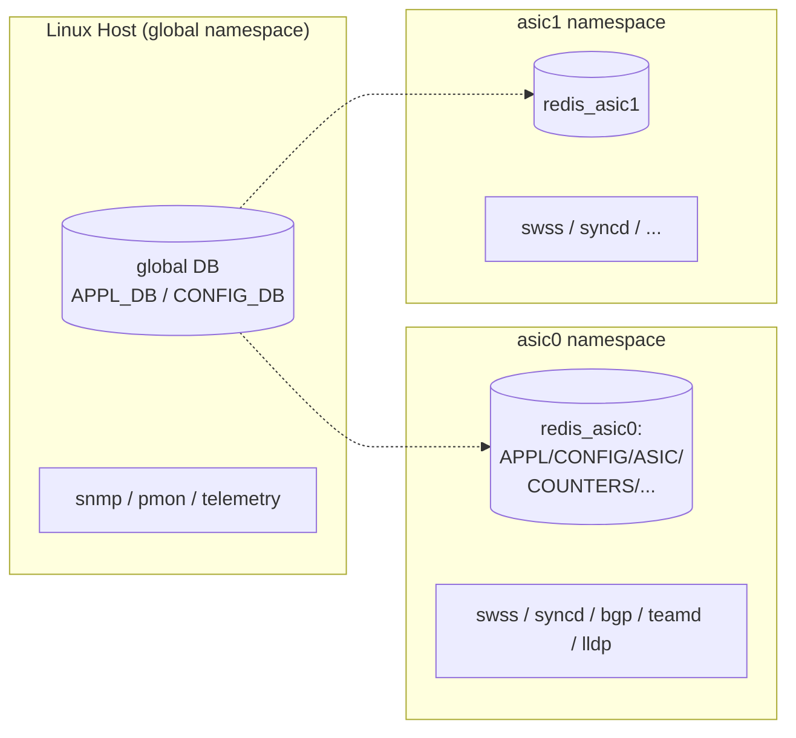

<!-- topics-tip -->
!!! tip "Topics で読み物として読む"
    この HLD は実装詳細を含みます。機能の概念・設定・運用を読み物として読みたい場合は [Topics 20 章: SWSS / SAI / Redis](../topics/20-swss-sai-redis/index.md) を参照。
<!-- /topics-tip -->

!!! success "裏取りステータス: Code-verified"
    `sonic-swss-common/common/dbconnector.h` L44-49 で「namespace でコンテナ群を一意識別、空文字なら default(host) namespace」のコメント、L107 で `load_sonic_global_db_config(global_db_file_path=DEFAULT_SONIC_DB_GLOBAL_CONFIG_FILE, namespace=None, ignore_nonexistent=False)` Python API、L149/L151 で `{containerName, namespace}` キーの instance / database マップ実装を確認。`sonic-swss-common/common/dbconnector.cpp` L225 で `database_global.json` 未ロード時 `initializeGlobalConfig` を要請するエラー処理を確認。`sonic-swss-common/tests/redis_multi_db_ut_config/database_global.json` L4-28 で `include` ディレクティブによる per-namespace `database_config*.json` の集約形式を、`sonic-buildimage/dockers/docker-database/database_global.json.j2` テンプレ存在を確認（verified at: 2026-05-09）。

# Multi-ASIC 名前空間の Redis（database_global.json と SonicDBConfig）

## 概要

[Multi-ASIC](../reference/glossary.md#term-multi-asic) [SONiC](../reference/glossary.md#term-sonic)（複数 [NPU](../reference/glossary.md#term-npu) を持つデバイス）では、各 NPU を **Linux network namespace** で隔離し、その中で `swss` / `syncd` / `database` 等のコンテナを別個に動かす。これにより 1 デバイス内に複数の [Redis](../reference/glossary.md#term-redis) インスタンスが並走することになる[^1]。

本 [HLD](../reference/glossary.md#term-hld) は次を定義する:

1. グローバル Redis（host 側）と NPU 別 Redis の **2 階層構成**
2. 名前空間ごとに独立した `database_config.json`
3. 全名前空間を辿るための **`database_global.json`**
4. Python / C++ クライアントの **`namespace=` 引数** による接続先切替

### サービス分類



- **Global namespace**: [AAA](../reference/glossary.md#term-aaa) / syslog / [ASIC](../reference/glossary.md#term-asic)↔interface マッピングのような **システム共通属性** を持つ
- **NPU namespace**: その NPU 配下のインタフェース・カウンタ・state 等を持つ

Single-ASIC の SONiC は「Global = host = 唯一の Redis」として後方互換が取れる[^1]。

## 動作仕様

### ファイル配置

| 役割 | ファイル | 場所 |
|------|---------|------|
| Global config | `/etc/sonic/config_db.json` | host |
| NPU config | `/etc/sonic/config_db<NS>.json` | host |
| Global Redis 設定 | `/var/run/redis/sonic-db/database_config.json` | host |
| NPU Redis 設定 | `/var/run/redis<N>/sonic-db/database_config.json` | NS 内 |
| **Global の名前空間目録** | `/var/run/redis/sonic-db/database_global.json` | host |

### `database_global.json` の例

```json
{
  "INCLUDES": [
    { "include": "../redis/sonic-db/database_config.json" },
    { "namespace": "asic0", "include": "../redis0/sonic-db/database_config.json" },
    { "namespace": "asic1", "include": "../redis1/sonic-db/database_config.json" },
    { "namespace": "asic2", "include": "../redis2/sonic-db/database_config.json" }
  ],
  "VERSION": "1.0"
}
```

namespace 属性が無い entry は **host (global)** を意味する[^1]。

### `database_config.json`（NPU 用）

NPU 名前空間 `asic3` の例:

```json
{
  "INSTANCES": {
    "redis": {
      "hostname": "127.0.0.1",
      "port": 6379,
      "unix_socket_path": "/var/run/redis3/redis.sock"
    }
  },
  "DATABASES": {
    "APPL_DB": { "id": 0, "separator": ":", "instance": "redis" },
    "ASIC_DB": { "id": 1, "separator": ":", "instance": "redis" },
    "COUNTERS_DB": { "id": 2, "separator": ":", "instance": "redis" },
    "LOGLEVEL_DB": { "id": 3, "separator": ":", "instance": "redis" },
    "CONFIG_DB": { "id": 4, "separator": "|", "instance": "redis" },
    "PFC_WD_DB": { "id": 5, "separator": ":", "instance": "redis" },
    "FLEX_COUNTER_DB": { "id": 5, "separator": ":", "instance": "redis" },
    "STATE_DB": { "id": 6, "separator": "|", "instance": "redis" },
    "SNMP_OVERLAY_DB": { "id": 7, "separator": "|", "instance": "redis" }
  },
  "VERSION": "1.0"
}
```

### Jinja テンプレート変数

`database_global.json` / `database_config.json` は j2 テンプレ。`/usr/bin/database.sh` の起動スクリプトが docker create 時に環境変数で渡す[^1]:

| 変数 | 意味 |
|------|------|
| `{NS}` | namespace ID（`""` / `"0"` / ... / `"n"`、host は空文字）|
| `{NS_PREFIX}` | namespace prefix（既定 `asic`）|
| `{NS_REF_CNT}` | global DB が見るべき外部 DB 参照数（NPU 数と一致）|

NPU 用の `database_config.json` では `{NS != ""}` 条件で **`ASIC_DB` / `COUNTERS_DB` / `LOGLEVEL_DB`** を含める分岐が入る（Global には不要）[^1]。

### Python: `SonicDBConfig`

`SONIC_DB_GLOBAL_CONFIG_FILE = /var/run/redis/sonic-db/database_global.json`、`SONIC_DB_CONFIG_FILE = /var/run/redis/sonic-db/database_config.json`。`load_sonic_global_db_config()` で全 namespace を `_sonic_db_config[ns]` に展開する。`namespace=''` は **local** を意味する[^1]:

```python
class SonicDBConfig(object):
    @staticmethod
    def load_sonic_global_db_config(global_db_file_path=...): ...
    @staticmethod
    def load_sonic_db_config(sonic_db_file_path=...): ...
    @staticmethod
    def namespace_validation(namespace): ...
    @staticmethod
    def db_name_validation(db_name, namespace=''): ...
```

### Python: `SonicV2Connector`

`namespace=` 引数を受け取って指定 NS の Redis に繋ぐ[^1]:

```python
class SonicV2Connector(DBInterface):
    def __init__(self, use_unix_socket_path=False, namespace='', **kwargs):
        ...
        # 別 namespace の Redis には TCP では繋げない（Unix socket 必須）
        if namespace != '' and use_unix_socket_path == False:
            raise NotImplementedError("TCP connectivity to ... different namespace is not implemented!")
```

**他 NS への TCP 接続は未対応**。Unix socket 経由のみ[^1]。

`ConfigDBConnector` も同様に `namespace=` を受け取り、内部で `SonicV2Connector` を構成する。

### sonic-utilities への波及

`sonic-db-cli` / `sonic-cfggen` / `db_migrator` / `portconfig` 等が `--namespace <NS>` 引数を取るように改修される[^1]:

```python
if args.namespace is None:
    dbconn = swsssdk.SonicV2Connector()
else:
    dbconn = swsssdk.SonicV2Connector(use_unix_socket_path=True, namespace=args.namespace)
dbconn.connect(args.database)
```

### C++ `DBConnector`

C++ 側にも `database_global.json` パーサを追加し、namespace → `database_config.json` のマッピングを内部に持たせる[^1]。

<!-- evidence:
source: sonic-net/SONiC/doc/database/multi_namespace_db_instances.md#L341-L372 (sha: 49bab5b5ff0e924f1ea52b3d9db0dfa4191a7c06)
excerpt: |
  class SonicV2Connector(DBInterface):
    def __init__(self, use_unix_socket_path=False, namespace='', **kwargs):
      ...
      if namespace != '' and use_unix_socket_path == False:
        raise NotImplementedError("TCP connectivity to ... different namespace is not implemented!")
reasoning: 異 namespace への接続が Unix socket 必須であることの根拠。
-->

<!-- evidence-rendered:start -->
??? note "📋 検証エビデンス: sonic-net/SONiC/doc/database/multi_namespace_db_instances.md#L341-L372 (sha: 49bab5b5ff0e924f1ea52b3d9db0dfa4191a7c06)"

    **出典**:

    `sonic-net/SONiC/doc/database/multi_namespace_db_instances.md#L341-L372 (sha: 49bab5b5ff0e924f1ea52b3d9db0dfa4191a7c06)`

    **抜粋**:

    ```text
    class SonicV2Connector(DBInterface):
      def __init__(self, use_unix_socket_path=False, namespace='', **kwargs):
        ...
        if namespace != '' and use_unix_socket_path == False:
          raise NotImplementedError("TCP connectivity to ... different namespace is not implemented!")
    ```

    **判断根拠**: 異 namespace への接続が Unix socket 必須であることの根拠。

<!-- evidence-rendered:end -->

## 設定

### 関連する CONFIG_DB / CLI / YANG

外部設定スキーマは無い。本機能は **Redis 配備とクライアントライブラリ** の話[^1]。

### 関連する CLI

| CLI | 改修内容 |
|-----|---------|
| `sonic-db-cli` | `--namespace` 引数追加 |
| `sonic-cfggen` | 同上 |
| `db_migrator` | 同上 |
| `portconfig` 等 | 同上 |

### 設定例

```bash
# asic0 namespace の COUNTERS_DB を見る
sonic-db-cli COUNTERS_DB --namespace asic0 KEYS '*'

# Python から
from swsssdk import SonicV2Connector
db = SonicV2Connector(use_unix_socket_path=True, namespace='asic0')
db.connect('CONFIG_DB')
```

## 制限事項

- **異 namespace への TCP 接続は不可**: Unix socket 経由のみ。スクリプト改修時にこの制約を踏まえる必要がある[^1]。
- **`{NS_REF_CNT}` は NPU 数と等価前提**: 1 NPU 1 namespace の前提が組み込まれている。[SmartSwitch](../reference/glossary.md#term-smartswitch) 等の [DPU](../reference/glossary.md#term-dpu) では別の整理が必要[^1]。
- **single-ASIC 互換性**: `database_global.json` を作らない（または `INCLUDES` が 1 entry のみ）構成で旧来動作を維持する。改修されたクライアントは旧構成でも壊れないこと。
- **j2 テンプレで static に展開**: 起動時に NPU 数が確定する前提。動的 NPU 追加は本 HLD のスコープ外。

## 干渉する機能

- **Multi-ASIC swss / [syncd](../reference/glossary.md#term-syncd)**: 各 namespace で独立に走る。本 HLD は彼らが触る Redis の置き場を整える基盤。
- **`is_multi_asic` 系判定**: `sonic-py-common.device_info` の関数群と組み合わせて、CLI 各処理が namespace ループを回す。
- **VoQ Chassis（[Chassis DB](../acl-qos/distributed-forwarding-in-a-virtual-output-queue-voq-architecture.md)）**: 別レイヤの「Chassis DB」概念とは混同しないこと。本ページは 1 デバイス内 multi-NPU、Chassis DB はシャーシ全体の supervisor↔linecards。
- **[gNMI](../reference/glossary.md#term-gnmi) / REST**: クライアントが host で動くなら `database_global.json` 経由で全 namespace を辿る必要がある。

## トラブルシューティング

- 別 namespace の DB に繋がらない: `use_unix_socket_path=True` を渡しているか確認。TCP では接続不可[^1]。
- `SonicV2Connector` が `RuntimeError`: `database_global.json` と `database_config<NS>.json` の存在 / namespace 名綴りを確認。
- `database_global.json` 不在: single-ASIC として動くべき構成かを確認。multi-ASIC なら `database.sh` の起動経路を確認。

## 引用元

[^1]: `sonic-net/SONiC` `doc/database/multi_namespace_db_instances.md` @ `49bab5b5ff0e924f1ea52b3d9db0dfa4191a7c06`

<!-- topics-back-ref -->
## 関連 Topics

- [Topics: Multi-ASIC / VOQ Chassis](../topics/12-multi-asic-voq/index.md)

<!-- /topics-back-ref -->

<!-- glossary-links-injected: 5c9b3765d470 -->
