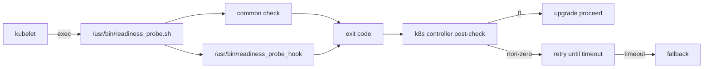

<!-- topics-tip -->
!!! tip "Topics で読み物として読む"
    この HLD は実装詳細を含む。機能の概念・設定・運用を読み物として読みたい場合は [Topics 20 章: SWSS / SAI / Redis](../topics/20-swss-sai-redis/index.md) を参照。
<!-- /topics-tip -->

!!! info "裏取りステータス: code-verified"
    `sonic-buildimage/src/sonic-ctrmgrd/ctrmgr/readiness_probe.sh` を master で確認。各コンテナへの readiness probe 投入は ctrmgrd 経由で実装。

# コンテナ health-check（k8s readiness probe）

## 概要

[SONiC](../reference/glossary.md#term-sonic) の k8s 連携では、コンテナそのものが起動しているかどうかは `kubelet` が把握しているが、**コンテナ内の supervisor 配下サービスが本当に正常か** は外から見えない。`docker ps` で running でも、内部の `swss` が落ちっぱなしという状況がある[^1]。

この [HLD](../reference/glossary.md#term-hld) は **k8s の readiness probe を使ってコンテナ内サービスの健全性を外部に見せる** ための仕組みを定義している。アップグレード時の post-check で readiness probe の終了コードを参照し、healthy なら次に進み、unhealthy ならタイムアウトまで再試行→fallback、という運用に乗せる[^1]。

## 動作仕様

### probe の選択

k8s が提供する 3 種類のプローブ（liveness / readiness / startup）の中で、**readiness probe** を採用する[^1]。

- **startup probe を使わない理由**: startup probe が一定回数失敗すると k8s がコンテナを再起動してしまう。SONiC 側はその挙動を望まず、独自の fallback で扱いたいため[^1]。
- **liveness probe を使わない理由**: 既に supervisor の `exit-listener` サービスが critical service の異常終了を検知してコンテナごと kill する責務を持っており、そこと役割が重複するため[^1]。
- **readiness probe** は「準備完了か」を表す。アップグレードの post-check ロジックがここを見るのに都合が良い[^1]。

probe の type は **command** を使う。コンテナ内のスクリプトを k8s が呼び、終了コードを記録する。**非ゼロ終了コードを問題種別ごとに使い分けることで原因特定に使える** という設計意図[^1]。



### readiness_probe.sh の責務

スクリプトのパスは **`/usr/bin/readiness_probe.sh`** に固定する[^1]。中身は二段構成:

1. **common check** — 全コンテナで共通の確認。現状は `supervisor start.sh` が exit code 0 で終了していることのみ。critical service の状態は **見ない**（`exit-listener` の領分）[^1]。
2. **container-specific check** — `/usr/bin/readiness_probe_hook` というスクリプトが存在すれば呼ぶ。各機能オーナーが必要に応じて Python 等で実装する。終了コードは healthy=0、それ以外は **意味を明確に定義した非ゼロ** を返す約束[^1]。

`readiness_probe_hook` が無いコンテナは common check のみで判定する。

### controller 側の動作

k8s controller はアップグレードの post-check 段階で readiness probe の終了コードを参照する[^1]:

| 終了コード | controller の判断 |
|------------|-------------------|
| `0` | healthy。post-check 続行 |
| 非ゼロ | unhealthy。タイムアウトまで再チェック |
| タイムアウト到達 | fallback 起動 |

非ゼロコードを **問題種別ごとに割り振る** のは、fallback 発動時の原因切り分けを容易にするため[^1]。

### `start.sh` を確認する理由

common check が `start.sh` の終了状態を確認するのは、`start.sh` が **サービス初期化と k8s 起動スクリプト呼び出しの両方** を担うため[^1]:

- 初期化が終わっていないと当然サービスは応答しない。
- k8s 起動スクリプトはアップグレード手順に組み込まれており、これが完了するまで「次工程に進む」と判断してはいけない。

つまり `start.sh` の正常終了 = 「アップグレードを進めて良い前提条件が揃った」という意味付けになっている[^1].

<!-- evidence:
source: sonic-net/SONiC/doc/kubernetes/health-check.md#L21-L33 (sha: 49bab5b5ff0e924f1ea52b3d9db0dfa4191a7c06)
excerpt: |
  Script path and name
      /usr/bin/readiness_probe.sh
  Health-Check logic in the script(two steps for now)
      Do common checks which are same for all containers
          Currently, one common check is that if the supervisor start.sh exists, we need to ensure that it exits with code 0.
      Call container self-related specific executable script if exists
          /usr/bin/readiness_probe_hook
reasoning: スクリプトのパスと二段階チェック構成の根拠。
-->

<!-- evidence-rendered:start -->
??? note "📋 検証エビデンス: sonic-net/SONiC/doc/kubernetes/health-check.md#L21-L33 (sha: 49bab5b5ff0e924f1ea52b3d9db0dfa4191a7c06)"

    **出典**:

    `sonic-net/SONiC/doc/kubernetes/health-check.md#L21-L33 (sha: 49bab5b5ff0e924f1ea52b3d9db0dfa4191a7c06)`

    **抜粋**:

    ```text
    Script path and name
        /usr/bin/readiness_probe.sh
    Health-Check logic in the script(two steps for now)
        Do common checks which are same for all containers
            Currently, one common check is that if the supervisor start.sh exists, we need to ensure that it exits with code 0.
        Call container self-related specific executable script if exists
            /usr/bin/readiness_probe_hook
    ```

    **判断根拠**: スクリプトのパスと二段階チェック構成の根拠。

<!-- evidence-rendered:end -->

## 設定

このページの機能はコンテナ内の固定パススクリプトと k8s 設定で完結する。[CONFIG_DB](../reference/glossary.md#term-config_db) / CLI のエンドユーザ向けインターフェースは HLD では定義されていない。

### 関連する CONFIG_DB

該当エントリは HLD 内で定義されていない。

### 関連する CLI

該当 CLI は HLD で定義されていない。状態確認は `kubectl describe pod` 等の k8s 標準コマンドや `docker exec <container> /usr/bin/readiness_probe.sh; echo $?` での直接実行で行う想定。

## 制限事項

- この仕組みは **k8s 管理下のコンテナにのみ意味がある**。スタンドアロン SONiC で k8s を使わない構成では readiness probe は呼ばれない。
- common check は `start.sh` の終了確認のみ。**critical service の生死までは判定しない** ため、`exit-listener` 機構と組み合わせて初めてコンテナの健全性監視が完結する[^1]。
- `readiness_probe_hook` の終了コード設計は機能オーナー任せ。コード値の競合や意味の重複を防ぐ仕組みは HLD では定義されていない。

## 干渉する機能

- **`exit-listener` (supervisor)**: critical service の落下時にコンテナを self-kill する。readiness probe はここを置き換えない。役割分担は「致死的な異常 = exit-listener、準備完了の判定 = readiness probe」[^1]。
- **アップグレード制御**: controller の post-check が readiness probe を見ることで、コンテナ単位のロールアウト制御が成立する。fallback の挙動は controller 側設定に依存する。
- **`start.sh`**: SONiC の各 docker で初期化と k8s startup を実行する起点。ここが exit code 0 で抜けないと readiness probe は通らない。

## トラブルシューティング

- readiness probe が常に non-zero: コンテナに入って `/usr/bin/readiness_probe.sh` を直接実行し、`echo $?` で終了コードを確認。コードに対応する原因を機能オーナーの hook 実装にあわせて切り分ける。
- `readiness_probe_hook` 未配備のコンテナ: common check のみで判定される。意図したカバレッジになっているか hook の実装有無を確認する。
- アップグレードが post-check でループする: controller のタイムアウト前に readiness probe が安定しないケース。`start.sh` がまだ走っている場合は単に時間が足りていない。サービス初期化が遅いコンテナで起こりやすい。
- `start.sh` が exit していない: supervisor の他サービスが起動失敗している可能性。`supervisorctl status` と `/var/log/supervisor/` を確認。

## 参考リンク

- [CLI: show system-health](../reference/cli/show-system-health.md)
- [HLD: sonic-system-health-monitor](../system/sonic-system-health-monitor-high-level-design.md)
- [Topics: Reference index](../topics/22-reference-index/index.md)

## 関連 reference

- [Reference index](../reference/index.md)

## 引用元

[^1]: `sonic-net/SONiC` `doc/kubernetes/health-check.md` @ `49bab5b5ff0e924f1ea52b3d9db0dfa4191a7c06`

<!-- glossary-links-injected: 8ba32e5aa69d -->
