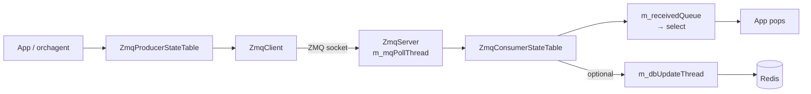

!!! success "裏取りステータス: Code-verified"
    `sonic-swss-common/common/zmq{client,server,producerstatetable,consumerstatetable}.{h,cpp}` を確認。`ZmqProducerStateTable : public ProducerStateTable` と `ZmqClient&` メンバ、コンストラクタ既定 `dbPersistence = true` (Producer) / `false` (Consumer)、フラグに応じた DB 書き込み分岐を確認。Python は `pyext/swsscommon.i` L296-346 で `ZmqProducerStateTable` director 化と `zmqWait` ヘルパを確認 (verified at: 2026-05-09)。

# ZMQ ProducerStateTable / ConsumerStateTable 設計

## 読み手が知りたいこと

- Redis 版 `ProducerStateTable` / `ConsumerStateTable` と何が違うのか
- なぜ ZMQ に置き換えるのか、何を犠牲にして何を得るのか
- `dbPersistence` フラグを off にしたとき、データはどこに残るのか
- 既存 orchagent のループに統合する際の前提

## なぜ ZMQ 版が必要か

通常の `ProducerStateTable` / `ConsumerStateTable` は Redis 経由でメッセージを運ぶ。永続化・観測性は得られるが **書き込みコストが Redis に縛られる**。本 HLD は API シグネチャを保ったまま **ZMQ をトランスポートに使う** バリエーションを定義する[^1]:

- Redis を経由せず低レイテンシで直接プロセス間メッセージング
- Consumer 側で **DB 更新を on/off できる**（メモリ削減 / 高性能ユースケース向け）
- API は `ProducerStateTable` / `ConsumerStateTable` と同形でアプリ側コードを共通化可能

## 全体像

要点[^1]:

- `ZmqClient` は **複数の `ZmqProducerStateTable` から共有** 可能。`sendMsg()` は thread safe & async
- `ZmqServer` は `m_mqPollThread` 1 本で受信し、payload に含まれる **DB 名 + テーブル名** で対応する `ZmqConsumerStateTable` に振り分け
- `ZmqConsumerStateTable` は select 通知用 `m_receivedQueue` と Redis 書込み用 `m_dbUpdateThread` の二系統。後者は構築時フラグで on/off

## Producer 側 API

既存 `ProducerStateTable` と **同形シグネチャ**[^1]:

| 操作 | シグネチャ |
|------|-----------|
| Set | `set(key, values, op = SET_COMMAND, prefix = EMPTY_PREFIX)` |
| Delete | `del(key, op = DEL_COMMAND, prefix = EMPTY_PREFIX)` |
| Batch Set | `set(vector<KeyOpFieldsValuesTuple>)` |
| Batch Delete | `del(vector<string>)` |

内部で `ZmqClient::sendMsg` を叩くだけ。送信失敗時のリトライポリシー[^1]:

| 失敗ケース | 対応 |
|------------|------|
| socket connection broken | 再接続 → 再送 |
| 送信キュー満杯 | 後で再送 |
| signal 割り込み | 再送 |

リトライ後も失敗、もしくは connection が完全切断のままなら **例外を投げる**。アプリ側で握りつぶす設計ではない[^1]。

## Server 側ディスパッチ

`(db_name, table_name) → ZmqConsumerStateTable` のマップを持ち、payload から両者を取り出して該当 Consumer に投げる。Consumer は最初に Server に自分を register することでマップに載る[^1]。Handler 内では長時間ブロックせず、ディスパッチ後すぐ次の受信に戻る。

## Consumer 側の二系統通知

受信メッセージは 2 か所に流れる[^1]:

1. **select event 通知** — `m_receivedQueue` に積み、アプリは `pops()` で取り出す（Redis 版と同じ抽象）
2. **DB 更新スレッド** — `m_DbUpdateDataQueue` に積み、`m_dbUpdateThread` が Redis に書く。**configurable で off 可**

> "This is a configurable feature, could turn on/off this feature in use cases requiring less memory consumption or higher performance." [^1]

DB 更新を切ると Redis に痕跡が残らない。観測性は失うが Redis を完全に外せるため最速。

## 設定

ライブラリレベル API のため CONFIG_DB / CLI による直接の制御点は HLD に無い。DB 更新 on/off は **コード側で `ZmqConsumerStateTable` 構築時に指定**。

## 制限事項

- `ZmqClient::sendMsg` はリトライ失敗で **例外**。呼出し側で握る前提
- ZMQ は **永続化・観測性が無い**。DB 更新 off では `redis-cli` でも覗けない
- HA / failover や複数 ZmqServer のロードバランシングは HLD 範囲外（1:1 ないし 1:多の単純トポロジ）
- select 通知と DB 書き込みの **順序保証** は HLD で明示されていない

## 干渉する機能

- **既存 `ProducerStateTable` / `ConsumerStateTable`**: API 互換だが、DB 更新 off で Redis に乗らないテーブルが混ざると他コンポーネントとの食い違いが起き得る
- **orchagent 起動順序**: ZMQ は永続化されないため、Producer 起動前に Consumer が立っていないとメッセージ落ち
- **select イベントループ**: `m_receivedQueue` / `m_DbUpdateDataQueue` のバックプレッシャ挙動は要確認

## トラブルシューティング

- Producer 例外 → Server `m_mqPollThread` の停止 / 対向プロセス生存を確認
- Consumer に到達しない → `(db_name, table_name)` の register 漏れ。未登録メッセージは Server で行き場を失う
- 期待値が Redis に無い → DB 更新が off の可能性。`ZmqConsumerStateTable` 構築時フラグを確認
- 順序が乱れる → 複数 Producer が同じ Client を共有する場合、ネットワーク側キューと dispatch ループで Consumer 視点の順序が変わり得る

## 関連 Topics

- [Topic 20 SWSS/SAI/Redis - internals](../topics/20-swss-sai-redis/internals.md)
- [Topic 20 SWSS/SAI/Redis - architecture](../topics/20-swss-sai-redis/architecture.md)

## 引用元

[^1]: `sonic-net/SONiC` `doc/sonic-swss-common/ZMQ producer-consumer state table design.md` @ `49bab5b5ff0e924f1ea52b3d9db0dfa4191a7c06`
