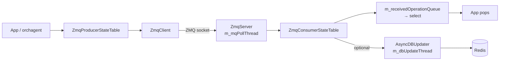

<!-- topics-tip -->
!!! tip "Topics で読み物として読む"
    この HLD は実装詳細を含む。機能の概念・設定・運用を読み物として読みたい場合は [Topics 20 章: SWSS / SAI / Redis](../topics/20-swss-sai-redis/index.md) を参照。
<!-- /topics-tip -->

!!! success "裏取りステータス: Code-verified"
    `sonic-swss-common/common/zmq{client,server,producerstatetable,consumerstatetable}.{h,cpp}` と `asyncdbupdater.{h,cpp}` を確認。`ZmqProducerStateTable : public ProducerStateTable` と `ZmqClient&` メンバ、コンストラクタ既定 `dbPersistence = true` (Producer) / `false` (Consumer)、フラグに応じた DB 書き込み分岐を確認。Python は `pyext/swsscommon.i` で `ZmqProducerStateTable` director 化と `zmqWait` ヘルパを確認。HLD 公開時の「DB 更新スレッド」(`m_dbUpdateThread` / `m_DbUpdateDataQueue`) は master では `AsyncDBUpdater` クラス (`asyncdbupdater.{h,cpp}`) に分離されており、`ZmqConsumerStateTable` は `std::unique_ptr<AsyncDBUpdater> m_asyncDBUpdater` を保持する形に refactor 済み (機能等価)。

# ZMQ ProducerStateTable / ConsumerStateTable 設計

## 読み手が知りたいこと

- [Redis](../reference/glossary.md#term-redis) 版 `ProducerStateTable` / `ConsumerStateTable` と何が違うのか
- なぜ ZMQ に置き換えるのか、何を犠牲にして何を得るのか
- `dbPersistence` フラグを off にしたとき、データはどこに残るのか
- 既存 [orchagent](../reference/glossary.md#term-orchagent) のループに統合する際の前提

## なぜ ZMQ 版が必要か

通常の `ProducerStateTable` / `ConsumerStateTable` は Redis 経由でメッセージを運ぶ。永続化・観測性は得られるが **書き込みコストが Redis に縛られる**。本 [HLD](../reference/glossary.md#term-hld) は API シグネチャを保ったまま **ZMQ をトランスポートに使う** バリエーションを定義する[^1]:

- Redis を経由せず低レイテンシで直接プロセス間メッセージング
- Consumer 側で **DB 更新を on/off できる**（メモリ削減 / 高性能ユースケース向け）
- API は `ProducerStateTable` / `ConsumerStateTable` と同形でアプリ側コードを共通化可能

## 全体像



要点[^1]:

- `ZmqClient` は **複数の `ZmqProducerStateTable` から共有** 可能。`sendMsg()` は thread safe & async
- `ZmqServer` は `m_mqPollThread` 1 本で受信し、payload に含まれる **DB 名 + テーブル名** で対応する `ZmqConsumerStateTable` に振り分け
- `ZmqConsumerStateTable` は select 通知用 `m_receivedOperationQueue` と Redis 書込み用 `AsyncDBUpdater` の二系統。後者は構築時フラグで on/off

## Producer 側 API

既存 `ProducerStateTable` と **同形シグネチャ**[^1]:

| 操作 | シグネチャ |
|------|-----------|
| Set | `set(key, values, op = SET_COMMAND, prefix = EMPTY_PREFIX)` |
| Delete | `del(key, op = DEL_COMMAND, prefix = EMPTY_PREFIX)` |
| Batch Set | `set(vector<KeyOpFieldsValuesTuple>)` |
| Batch Delete | `del(vector<string>)` |

内部で `ZmqClient::sendMsg` を叩くだけ。送信失敗時のリトライポリシー[^1]:

| 失敗ケース | 対応 |
|------------|------|
| socket connection broken | 再接続 → 再送 |
| 送信キュー満杯 | 後で再送 |
| signal 割り込み | 再送 |

リトライ後も失敗、もしくは connection が完全切断のままなら **例外を投げる**。アプリ側で握りつぶす設計ではない[^1]。

## Server 側ディスパッチ

`(db_name, table_name) → ZmqConsumerStateTable` のマップを持ち、payload から両者を取り出して該当 Consumer に投げる。Consumer は構築時に `ZmqServer::registerMessageHandler(dbName, tableName, this)` を呼んでマップに登録される[^2]。Handler 内では長時間ブロックせず、ディスパッチ後すぐ次の受信に戻る[^1]。

## Consumer 側の二系統通知

受信メッセージは `ZmqConsumerStateTable::handleReceivedData()` で次の順序で処理される[^2]:

1. （DB 永続化が有効な場合のみ）受信した `KeyOpFieldsValuesTuple` を `std::make_shared` で **複製**。これはアプリが pops 後に値を破壊的に変更しうるため、DB 書込み側が独立した snapshot を持つ必要があるからである
2. **`m_receivedOperationQueue` に push**（`m_receivedQueueMutex` で保護）。アプリは `pops()` で取り出す（Redis 版と同じ抽象）
3. （DB 永続化が有効な場合のみ）`m_asyncDBUpdater->update(clone)` で **`AsyncDBUpdater::m_dbUpdateDataQueue` に push** し、condition variable で `dbUpdateThread` を起こす[^3]
4. 全件処理後に `m_selectableEvent.notify()` で epoll を起こす

> "This is a configurable feature, could turn on/off this feature in use cases requiring less memory consumption or higher performance." [^1]

DB 更新を切ると Redis に痕跡が残らない。観測性は失うが Redis を完全に外せるため最速。

### select 通知と DB 書込みの順序

実装上 `m_receivedOperationQueue` への push は `m_asyncDBUpdater->update()` より **先に行われる**[^2]。つまり、`m_selectableEvent.notify()` が走った時点で:

- アプリは `pops()` 可能 (受信キュー側は push 完了)
- 対応する Redis 書込みは **まだ完了していない可能性が高い**。`AsyncDBUpdater::dbUpdateThread` は別スレッドかつ `sched_get_priority_min(policy) + 1` という最低クラスの優先度で動くため、ポーリングスレッドを阻害しない代わりに DB 反映は遅延しうる[^3]

このため、`ZmqConsumerStateTable` 経由で受け取った値を直後に `redis-cli` で検証してもまだ反映されていないことがある。一貫性が必要なら `dbUpdaterQueueSize()` で残件を確認するか、アプリ層で完了同期を取る。

### バックプレッシャと pop バッチ

`m_receivedOperationQueue` と `m_dbUpdateDataQueue` はいずれも **`std::queue` で上限を持たない**[^2][^3]。フロー制御は ZMQ socket の送信キュー側のみで、Consumer 側にはバックプレッシャ機構がない。

`pops()` は `m_popBatchSize`（既定 128、コンストラクタ引数で変更可）件ずつ返す。キュー残量がバッチサイズを超えていれば、最後に再度 `m_selectableEvent.notify()` を発行してアプリにループ再エントリを促す[^2]。

## 設定

ライブラリレベル API のため [CONFIG_DB](../reference/glossary.md#term-config_db) / CLI による直接の制御点は HLD に無い。DB 更新 on/off は **コード側で `ZmqConsumerStateTable` 構築時の `dbPersistence` 引数で指定**（Consumer の既定は `false`）[^2]。

## 既知の問題

### docker-sonic-vs: /zmq_swss ディレクトリ不在による orchagent crash

**症状**: `docker-sonic-vs` で起動した orchagent が即座に crash し大半のサービスが起動しない。ログに以下が出る:
```
zmq_bind failed on endpoint: ipc:///zmq_swss/p4orch_zmq_swss_ep, zmqerrno: 2
```

**原因**: 実機では `/zmq_swss` が `docker-orchagent.mk` の `-v /zmq_swss:/zmq_swss:rw` bind-mount で提供されるが、[VS](../reference/glossary.md#term-vs) docker はスタンドアロン起動のためホスト側マウントが存在しない。[sonic-swss](../reference/glossary.md#term-sonic-swss)#4243（2026-04-01 merge）以降に顕在化。

**回避策**:
```bash
docker exec <container> mkdir -p /zmq_swss
```

**参照**: sonic-net/[sonic-buildimage](../reference/glossary.md#term-sonic-buildimage)#26776（Triaged）

---

### CrmOrch が reboot 時に ZMQ タイムアウトで crash する

**症状**: reboot コマンドは [syncd](../reference/glossary.md#term-syncd)/[SAI](../reference/glossary.md#term-sai) を先に shutdown するが orchagent は終了しない。CrmOrch が SAI に対して ZMQ 経由でカウンタ要求を送り続け、SAI 側キューが消滅していると ZMQ タイムアウトが発生して orchagent が crash する。

**対象条件**: [SmartSwitch](../reference/glossary.md#term-smartswitch) など firmware update により reboot が 1 分超になるケースで特に問題になる。SmartSwitch のロングリブートは HA による redundancy でカバーされる設計のため、機能影響は限定的とされている。

**参照**: sonic-net/sonic-buildimage#26300（Bug, Triaged, Medium severity）

---

### orchagent route download 性能劣化（ZMQ 有効時）

**症状**: Northbound ZMQ を有効化した環境で 500k route の download が約 72 秒かかる。ZMQ 無効時は大幅に高速。

**原因**: sonic-swss PR#3910 で `table->pops(entries)` のループが削除された。ZMQ 有効時はこの変更がボトルネックとなる。

**参照**: sonic-net/sonic-buildimage#27098（Performance Regression, Triaged、Nokia・内部 Nokia チームで revert 効果確認済み）

## 制限事項

- `ZmqClient::sendMsg` はリトライ失敗で **例外**。呼出し側で握る前提
- ZMQ は **永続化・観測性が無い**。DB 更新 off では `redis-cli` でも覗けない
- HA / failover や複数 ZmqServer のロードバランシングは HLD 範囲外（1:1 ないし 1:多の単純トポロジ）
- Consumer 側のキュー（`m_receivedOperationQueue` / `m_dbUpdateDataQueue`）は **上限なし**。長時間消費が滞ると常駐メモリが増える。フロー制御は ZMQ socket 側のみ[^2][^3]

## 干渉する機能

- **既存 `ProducerStateTable` / `ConsumerStateTable`**: API 互換だが、DB 更新 off で Redis に乗らないテーブルが混ざると他コンポーネントとの食い違いが起き得る
- **orchagent 起動順序**: ZMQ は永続化されないため、Producer 起動前に Consumer が立っていないとメッセージ落ち
- **select イベントループ**: 受信通知は `pops()` ですぐ取れるが、対応する Redis 書込みは `AsyncDBUpdater` スレッド側で遅延しうる（select 通知時点で DB は古い）

## トラブルシューティング

- Producer 例外 → Server `m_mqPollThread` の停止 / 対向プロセス生存を確認
- Consumer に到達しない → `(db_name, table_name)` の register 漏れ。未登録メッセージは Server で行き場を失う
- 期待値が Redis に無い → DB 更新が off の可能性。`ZmqConsumerStateTable` 構築時 `dbPersistence` 引数を確認。on でも `AsyncDBUpdater` が低優先度スレッドのため `dbUpdaterQueueSize()` に残っている可能性
- 順序が乱れる → 複数 Producer が同じ Client を共有する場合、ネットワーク側キューと dispatch ループで Consumer 視点の順序が変わり得る

## 関連 Topics

- [Topic 20 SWSS/SAI/Redis - internals](../topics/20-swss-sai-redis/internals.md)
- [Topic 20 SWSS/SAI/Redis - architecture](../topics/20-swss-sai-redis/architecture.md)

## 引用元

[^1]: `sonic-net/SONiC` `doc/sonic-swss-common/ZMQ producer-consumer state table design.md` @ `49bab5b5ff0e924f1ea52b3d9db0dfa4191a7c06`
[^2]: `sonic-net/sonic-swss-common` `common/zmqconsumerstatetable.cpp` L20-L110 (`ZmqConsumerStateTable` ctor / `handleReceivedData` / `pops`) および `common/zmqconsumerstatetable.h` L20-L88 (`DEFAULT_POP_BATCH_SIZE = 128` / `m_receivedOperationQueue` 型 / `m_asyncDBUpdater` メンバ)
[^3]: `sonic-net/sonic-swss-common` `common/asyncdbupdater.cpp` L36-L119 (`update()` で `m_dbUpdateDataQueue` への push、`dbUpdateThread` での `pthread_setschedprio(.., min_priority + 1)` と Table::set/del 反映)

<!-- glossary-links-injected: 9fb3fca99a59 -->
