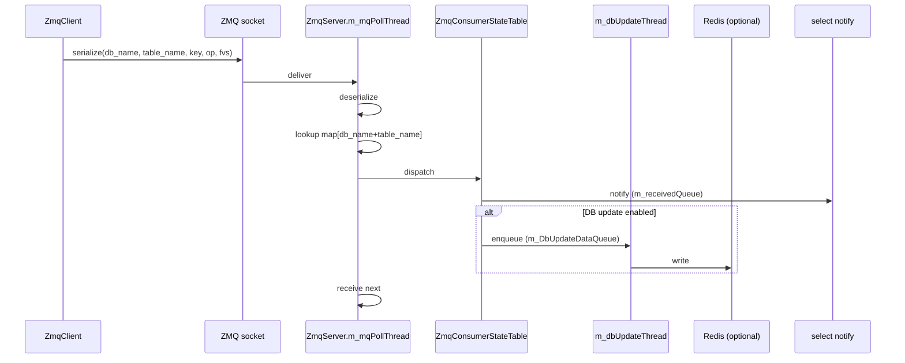

!!! success "裏取りステータス: Code-verified"
    `sonic-swss-common/common/` 配下に `zmqclient.{h,cpp}` / `zmqserver.{h,cpp}` / `zmqproducerstatetable.{h,cpp}` / `zmqconsumerstatetable.{h,cpp}` の実体を確認。`zmqproducerstatetable.h` L16-49 で `ZmqProducerStateTable : public ProducerStateTable` 継承と `ZmqClient&` メンバ、コンストラクタ引数 `bool dbPersistence = true` を確認。`zmqconsumerstatetable.h` L22 / cpp L20-36 で Consumer 側コンストラクタ既定 `dbPersistence = false`、フラグに応じた DB 書き込み分岐を確認（DB 書き込みのオプション化）。Python バインディングは `pyext/swsscommon.i` L296-346 で `ZmqProducerStateTable` の director 化と `zmqWait` ヘルパを確認（verified at: 2026-05-09）。

# ZMQ ProducerStateTable / ConsumerStateTable 設計

## 概要

SONiC の orchagent と他プロセス間の通知は基本的に **Redis (ProducerStateTable / ConsumerStateTable)** で行われている。Redis 経由は永続化・観測性に優れる一方、**書き込みコストが Redis に縛られる**。

この HLD は同等のインターフェースを保ったまま **ZMQ をトランスポートに使う** バリエーション (`ZmqProducerStateTable` / `ZmqConsumerStateTable`) を定義している[^1]。Redis を経由せずに直接プロセス間でメッセージを飛ばせるため、低レイテンシかつ DB 書き込みを **オプション化** できる。Consumer 側に「DB 更新スレッドを ON/OFF できるフラグ」が用意されているのが特徴で、`より少ないメモリ` または `より高い性能` が必要なユースケース向けに割り切れる[^1]。

## 動作仕様

### 全体像

```mermaid
flowchart LR
    subgraph Producer Side
        APP1[App / orchagent] --> ZPST[ZmqProducerStateTable]
        ZPST --> ZC[ZmqClient]
    end
    ZC -->|ZMQ socket\n(serialized msg)| ZS[ZmqServer m_mqPollThread]
    subgraph Consumer Side
        ZS --> ZCST[ZmqConsumerStateTable]
        ZCST --> SEL[select event\nm_receivedQueue]
        ZCST -->|optional| DBT[m_dbUpdateThread]
        DBT --> REDIS[(Redis)]
        SEL --> APP2[App consume via pops]
    end
```

要点[^1]:

- `ZmqClient` は **複数の `ZmqProducerStateTable` から共有** できる。送信は `sendMsg()` 一本で thread safe & async。
- `ZmqServer` は受信専用スレッド `m_mqPollThread` を持ち、来たメッセージを **DB 名 + テーブル名** で `ZmqConsumerStateTable` に振り分ける。
- `ZmqConsumerStateTable` は select 通知用の `m_receivedQueue` と、Redis への書き込みを行う `m_dbUpdateThread` の二系統を管理する。後者は **on/off できる**。

### Producer 側の API

`ZmqProducerStateTable` がアプリケーションに見せる API は **既存の `ProducerStateTable` と同形** に揃えてある[^1]:

| 操作 | シグネチャ |
|------|-----------|
| Set | `void set(const std::string &key, const std::vector<FieldValueTuple> &values, const std::string &op = SET_COMMAND, const std::string &prefix = EMPTY_PREFIX)` |
| Delete | `void del(const std::string &key, const std::string &op = DEL_COMMAND, const std::string &prefix = EMPTY_PREFIX)` |
| Batch Set | `void set(const std::vector<KeyOpFieldsValuesTuple>& values)` |
| Batch Delete | `void del(const std::vector<std::string>& keys)` |

呼び出すだけで内部で `ZmqClient::sendMsg` を叩く構造。Redis 版とコードを共通化しやすいよう **シグネチャを意図的に維持** している[^1]。

### ZmqClient のリトライポリシー

`sendMsg()` は async で即 return するが、送信失敗時には次のケースで **再試行** が走る[^1]:

| 失敗ケース | 対応 |
|------------|------|
| ZMQ socket connection broken | 再接続→再送 |
| ZMQ 送信キュー満杯 | 後で再送 |
| signal 割り込みで send が失敗 | 再送 |

リトライしても失敗した場合と、connection が完全に切れたままの場合は **例外を投げる**。アプリケーション側で握りつぶす設計にはなっていない[^1]。

### Server 側のディスパッチ



`ZmqServer` がメッセージを受けるとき、シリアライズ済み payload には **DB 名とテーブル名が含まれる**[^1]。これを使って自前で持っている `(db_name, table_name) -> ZmqConsumerStateTable` のマップを引き、対応する Consumer に投げる。Consumer 側は最初に `ZmqServer` に対して自分を register することでこのマップに載る[^1]。

ディスパッチ後は **次のメッセージの受信を即座に再開** する。Handler 内で長時間ブロックする設計にはなっていない[^1]。

### Consumer 側の二系統通知

`ZmqConsumerStateTable` は受け取ったメッセージを 2 か所に流す[^1]:

1. **select event 通知** — `m_receivedQueue` に積む。アプリケーション側は通常の Producer/Consumer 同様 `pops()` で取り出す。
2. **DB 更新スレッド通知** — `m_DbUpdateDataQueue` に積み、`m_dbUpdateThread` が Redis に書き込む。**この経路は configurable で off にできる**。

> "This is a configurable feature, could turn on/off this feature in use cases requiring less memory consumption or higher performance." [^1]

DB 更新を切ると **Redis に痕跡が残らない**。観測性は失うが、send → Consumer のデータパスから Redis を完全に外せるため最速になる。

### `pops()` でアプリ側に渡す

select で wake したアプリケーションは `ZmqConsumerStateTable::pops()` を呼んで `m_receivedQueue` から操作を取り出す。既存の `ConsumerStateTable::pops()` と同じ抽象を維持しているため、呼び出し側はトランスポートが ZMQ か Redis かを意識せずに書ける[^1]。

<!-- evidence:
source: sonic-net/SONiC/doc/sonic-swss-common/ZMQ producer-consumer state table design.md#L49-L55 (sha: 49bab5b5ff0e924f1ea52b3d9db0dfa4191a7c06)
excerpt: |
  When consumer table receive message from ZmqServer, consumer table will:
    Send notification to select to handle received operation.
    Send notification to DB update thread for write received operation to database.
      This is a configurable feature, could turn on/off this feature in use cases requiring less memory consumption or higher performance.
reasoning: DB 書き込みが optional であるという中核仕様の根拠。
-->

## 設定

このページの機能はライブラリレベルの API であり、CONFIG_DB / CLI による直接の制御点は HLD で定義されていない。DB 更新の on/off は **コード側で `ZmqConsumerStateTable` 構築時に指定する** 想定。

### 関連する CONFIG_DB

該当エントリは HLD 内で定義されていない。

### 関連する CLI

該当 CLI は HLD では未定義。

## 制限事項

- `ZmqClient::sendMsg` はリトライしても失敗した場合に **例外を投げる**。呼び出し側でハンドリングしないとプロセスが落ちる前提[^1]。
- ZMQ ベースの transport は **Redis のような永続化・観測性が無い**。DB 更新を off にすると `redis-cli` で状態を覗けないため、デバッグは別系統（ログ・メッセージダンプ）に依存する。
- HLD は HA / failover や複数 ZmqServer のロードバランシングに触れていない。前提は **1 対 1 ないしは 1 対多の単純トポロジ**。
- `m_dbUpdateThread` を有効にした場合でも、**select 通知と DB 書き込みの順序保証** については HLD では明示されていない。アプリ側が DB を読む前提で設計する場合は実装の挙動を確認する必要がある。

## 干渉する機能

- **既存 `ProducerStateTable` / `ConsumerStateTable`**: API シグネチャは互換。同じアプリ内で両方使うことは可能だが、`ZmqConsumerStateTable` の DB 更新を off にするとそのテーブルだけ Redis に乗らなくなるため、`redis` を見ている他コンポーネントとの食い違いが起きる可能性がある。
- **orchagent 起動順序**: ZMQ は永続化されないため、Producer 起動前に Consumer が起動していないと送信メッセージが落ちる。Redis 版にあった「あとから ConsumerStateTable を立ち上げて溜まりを読む」が成立しない点に注意。
- **swssloglevel / select イベントループ**: Consumer 側のイベントは select に乗るので、既存の orchagent ループ構造との統合は容易だが、`m_receivedQueue` と `m_DbUpdateDataQueue` のバックプレッシャ挙動は確認が必要。

## トラブルシューティング

- Producer 側で例外: ZMQ socket / 送信キュー満杯のいずれか。Server 側の `m_mqPollThread` が止まっていないか、対向プロセスが生きているかを確認。
- Consumer に到達しない: `(db_name, table_name)` の register が走っているかを確認。マップ未登録のメッセージは Server 側で行き場を失う。
- 期待した値が Redis に無い: DB 更新が off になっている可能性。コード上の `ZmqConsumerStateTable` 構築時のフラグを確認。
- 送信は成功するが順序が乱れる: `ZmqClient` は async で、複数 Producer が同じ Client を共有している場合、送信順は呼び出し順と同じだがネットワーク側でのキューイングと Server の dispatch ループの兼ね合いで Consumer 視点の順序が変わる可能性がある。

## 引用元

[^1]: `sonic-net/SONiC` `doc/sonic-swss-common/ZMQ producer-consumer state table design.md` @ `49bab5b5ff0e924f1ea52b3d9db0dfa4191a7c06`
