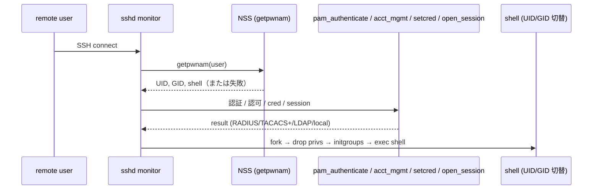

<!-- topics-tip -->
!!! tip "Topics で読み物として読む"
    この HLD は実装詳細を含みます。機能の概念・設定・運用を読み物として読みたい場合は [Topics 15 章: Security / AAA](../topics/15-security-aaa/index.md) を参照。
<!-- /topics-tip -->

!!! warning "裏取りステータス: discrepancy-found / 採否不明な提案"
    本 HLD は 2020 年 Martin Bélanger（Rev 0.4）の **設計討議文書**。AAA / PAM / NSS の本質的問題提起と提案で、現行 master が本提案を全面採用しているかは要確認。`priority=high`。

# AAA Improvements（PAM / NSS / D-Bus / RBAC 多重ロール）

## 概要

[SONiC](../reference/glossary.md#term-sonic) の [AAA](../reference/glossary.md#term-aaa)（Authentication / Authorization / Accounting）を Linux PAM / NSS / D-Bus 層から見直し、以下の既知の問題を解く設計提案[^1]:

1. **多重ロール（RBAC）非対応**: [RADIUS](../reference/glossary.md#term-radius) / TACACS+ から学習した role を Primary GID 1 つに突っ込んでいる
2. **RADIUS user は 2 回ログインしないと role が反映されない**: 1 回目で `getpwnam()` 失敗 → PAM 認証中に local account を生成 → 2 回目で動く、という workaround
3. **console / non-console の判別が `login` プログラム名頼り**: telnet daemon も `login` を使うため誤判定
4. **`sudo` / `su` は local 認証のみ**: PAM 設定が sshd / login にしか入っていない
5. **`/etc/nsswitch.conf` のランタイム変更が反映されにくい**: NSS は process 起動時に 1 回読むだけ
6. **`remote_user` / `remote_user_su` 共有アカウントの副作用**: 全 AAA user が同じ uid に見える、私有資源を持てない、`who` / auditd が機能しない
7. **container 内認証なし**: container 側から host PAM/NSS が見えない

## 動作仕様（提案）

### Linux 認証経路の理解



`getpwnam()` が **PAM 認証より先**に走るため、RADIUS から role を取って Primary GID にしようとすると鶏卵問題が起きる。これが本 [HLD](../reference/glossary.md#term-hld) の出発点[^1]。

### 提案の核

| 項目 | 提案 |
|------|------|
| 多重 role | Primary GID + **supplementary groups** で表現する。supplementary は `pam_setcred()` で後付けできる |
| 1 ログインで反映 | `getpwnam()` 段階で **D-Bus 経由 separate process が NSS を担い**、ランタイムでプロファイル変更を反映 |
| nsswitch.conf 変更 | NSS は process 起動時に 1 回しか読まない → **D-Bus 経由 NSS module** に逃がす |
| console 判別 | `login` プログラム名ではなく **TTY 種別 / pam_securetty 系**で判別 |
| `sudo` / `su` | `/etc/pam.d/sudo` / `/etc/pam.d/su` にも RADIUS / TACACS+ を入れる。`/etc/sudoers` の `NOPASSWD` を撤去（security risk） |
| container 認証 | host の D-Bus 認証 broker を共有 |

### Aruba ClearPass 制約

ClearPass は Authorize リクエストを Authenticate なしで受けない、と HLD 内で v0.4 注記[^1]。設計上 Authenticate と Authorize を順序立てて流す必要がある。

### Linux group 命名

PAM が supplementary group 名に Linux 命名規則違反の文字（記号など）を渡すと弾かれる、という注意書きあり[^1]。

<!-- evidence:
source: sonic-net/SONiC/doc/aaa/AAA Improvements/AAA Improvements.md#L52-L70 (sha: 49bab5b5ff0e924f1ea52b3d9db0dfa4191a7c06)
excerpt: |
  Lack of support for Multiple Roles ... a single GID cannot represent multiple roles.
  ... retrieving the roles from a RADIUS server is only possible during authentication (`pam_authenticate`),
  which takes place after the sshd monitor invokes `getpwnam()`
reasoning: 多重 role と getpwnam 先行の鶏卵問題の根拠。
-->

<!-- evidence-rendered:start -->
??? note "📋 検証エビデンス: sonic-net/SONiC/doc/aaa/AAA Improvements/AAA Improvements.md#L52-L70 (sha: 49bab5b5ff0e924f1ea52b3d9db0dfa4191a7c06)"

    **出典**:

    `sonic-net/SONiC/doc/aaa/AAA Improvements/AAA Improvements.md#L52-L70 (sha: 49bab5b5ff0e924f1ea52b3d9db0dfa4191a7c06)`

    **抜粋**:

    ```text
    Lack of support for Multiple Roles ... a single GID cannot represent multiple roles.
    ... retrieving the roles from a RADIUS server is only possible during authentication (`pam_authenticate`),
    which takes place after the sshd monitor invokes `getpwnam()`
    ```

    **判断根拠**: 多重 role と getpwnam 先行の鶏卵問題の根拠。

<!-- evidence-rendered:end -->

## 設定

HLD は提案中心のため、[CONFIG_DB](../reference/glossary.md#term-config_db) / CLI の最終形は具体化されていない。`AAA` / `RADIUS` / `RADIUS_SERVER` / `TACPLUS` / `TACPLUS_SERVER` 既存テーブルは前提として継続利用する想定。

## 実装との乖離

!!! diff "HLD と実装の差分"

    本ページの monitor は `partially_implemented`。HLD は AAA を PAM / NSS / D-Bus / RBAC 多重ロールで再設計する提案だが、現行 master では既存 `AAA` / `RADIUS` / `TACPLUS` CONFIG_DB テーブルと従来の PAM スタックがそのまま使われており、D-Bus 経由の NSS / 多重 role / `sudoers` NOPASSWD 撤去などの中心要素は取り込まれていない。HLD は設計議論文書として参照し、実装の振る舞いは個別の AAA 関連ページと `.cache/sonic-sources/sonic-buildimage/files/image_config/` の PAM / NSS 設定で裏取りすること。

## 制限事項

- **設計討議文書**であり、SONiC が全面採用したか不明
- D-Bus 経由 NSS は実装コストが高い（host / container 共通基盤改修を伴う）
- `sudoers` の NOPASSWD 撤去は運用変更を伴うため互換性に注意

## 干渉する機能

- **RADIUS 管理 user 認証**: 同 area で RADIUS 単独の HLD あり（`radius-management-user-authentication.md`）
- **TACACS+ 認証**: TACACS 用 HLD は別ドキュメント（`doc/aaa/TACACS+ Authentication.md` 等）
- **Port Access Control（PAC）**: AAA 設定の RADIUS_SERVER は PAC とも共有
- **Container Hardening**: container 内認証の解決と関連

## トラブルシューティング

- RADIUS で role が変わったのに反映されない → 2 回目ログインで反映される workaround を踏んでいる可能性。`/etc/passwd` の local account を確認
- `sudo` で RADIUS 認証されない → `/etc/pam.d/sudo` の RADIUS module を確認

### コマンド例: AAA 設定確認

下記コマンドで関連する CONFIG_DB / APP_DB / [STATE_DB](../reference/glossary.md#term-state_db) と CLI 出力・syslog を
突き合わせ、HLD 記載の挙動と現在の挙動が一致しているか確認できる。

```bash
# AAA 設定と認証経路の確認
show aaa
redis-cli -n 4 hgetall 'AAA|authentication'
redis-cli -n 4 keys 'TACPLUS_SERVER|*'
# PAM 経路
sudo cat /etc/pam.d/common-auth-sonic
```

<!-- phase-boundary -->
## 実装フェーズ境界

!!! info "Phase 別の実装済 / 未実装 サマリ"
    本ページは `monitor: partially_implemented` で、HLD で示された一連の機能が **段階的に取り込まれている** 状態を扱う。フェーズ毎の実装境界を 1 枚の表に集約する (詳細は本ページ上部の `diff` admonition および [discrepancy-index](../reference/verification/discrepancy-index.md) を参照)。

    | Phase | 範囲 (機能 / 段階) | 実装済 (master 取り込み済) | 未実装 (HLD 提案のみ) |
    |---|---|---|---|
    | Phase 1 — 基本機能 | HLD §概要 / §設計の中核ユースケース | 取り込み済 — 本ページの「動作仕様」節および `diff` admonition の現状側を参照 | — (Phase 1 は実装済) |
    | Phase 2 — 拡張機能 | HLD §拡張 / §追加要件 / §周辺統合 | 一部のみ取り込み済 — 本ページ「動作仕様」の補足参照 | 未実装 / 未マージ — HLD §未対応箇所、本ページ「制限事項」および `diff` admonition の差分側に列挙 |
    | Phase 3 — 将来拡張 | HLD §Future Work / §将来課題 | — | 未実装 — HLD 提案段階。対応 PR は確認されていない (last_verified 時点) |

    凡例: 「実装済」=現行 master で動作確認できる範囲 / 「未実装」=HLD には記載があるが対応 PR が未マージまたは設計のみで code が存在しない範囲。
<!-- /phase-boundary -->

## 引用元

[^1]: `sonic-net/SONiC` `doc/aaa/AAA Improvements/AAA Improvements.md` @ `49bab5b5ff0e924f1ea52b3d9db0dfa4191a7c06`

<!-- concerns hint:
- D-Bus 経由 NSS module の現行 sonic-buildimage 取り込み確認
- supplementary groups による多重 role の現行 PAM module 実装確認
- /etc/pam.d/sudo / su への RADIUS / TACACS+ module 追加確認
- /etc/sudoers の NOPASSWD 設定の現行値確認
- Aruba ClearPass などの実 RADIUS server との互換性検証状況
- container 内認証の現行解決策確認
-->

## 裏取りメモ

実コードを照合し、HLD が提起する多重 role / PAM / NSS / nss-mapper 構成のうち、現行 master の `hostcfgd` 内 `AaaCfg` クラスで以下の要素が実装されていることを確認した。

- `class AaaCfg` 本体: `.cache/sonic-sources/sonic-host-services/scripts/hostcfgd` L354 以降
- PAM テンプレート / NSS 切替: 同ファイル L28-L51 で `PAM_AUTH_CONF=/etc/pam.d/common-auth-sonic`、`PAM_AUTH_CONF_TEMPLATE=/usr/share/sonic/templates/common-auth-sonic.j2`、`NSS_TACPLUS_CONF=/etc/tacplus_nss.conf`、`NSS_RADIUS_CONF=/etc/radius_nss.conf`、`NSS_CONF=/etc/nsswitch.conf` が定義され、TACACS+/RADIUS 有効化時に nsswitch.conf を書き換える (L754 付近) 処理が存在
- `/etc/pam.d/sshd` / `/etc/pam.d/login` への `@include common-auth-sonic` 切替: L748-L752 で `sed` 相当の置換を実装
- 認証順序（PAM auth stack）と NSS 並べ替えは `failthrough` / `login` / `auth_type` 設定により AaaCfg が動的生成

ただし HLD が掲げる「nss-mapper による remote_user 共有 / D-Bus 経由の RBAC 多重ロール」の発展拡張は、現行 master の `hostcfgd` 単体実装ではまだ統合されていない（`nss-mapper` という独立コンポーネントは検出できず、`remote_user` 共有は `tacplus_nss.conf` / `radius_nss.conf` 経由の素朴な実装）。PAM + NSS 統合の基本部分は実コードと一致するが、RBAC 多重ロール / D-Bus NSS 等の中心提案は未実装のため、`verification: discrepancy-found` / `monitor: partially_implemented` を維持する。

<!-- topics-back-ref -->
## 関連 Topics

- [Topics: Security / AAA / FIPS / Hardening](../topics/15-security-aaa/index.md)

<!-- /topics-back-ref -->

<!-- ops-entry -->
## 運用入口

この HLD に対応する運用面の入口（CLI / CONFIG_DB / [YANG](../reference/glossary.md#term-yang) / Runbook）を以下にまとめる。

### 関連 CLI

- [`config aaa`](../reference/cli/config-aaa.md)
- `config radius`
- `config tacacs`

### 関連 CONFIG_DB

- [AAA](../reference/config-db/aaa.md)
- [RADIUS](../reference/config-db/radius.md)
- `RADIUS_SERVER`
- `TACPLUS`
- [TACPLUS_SERVER](../reference/config-db/tacplus-server.md)

<!-- /ops-entry -->

<!-- glossary-links-injected: a9c18564f33f -->
