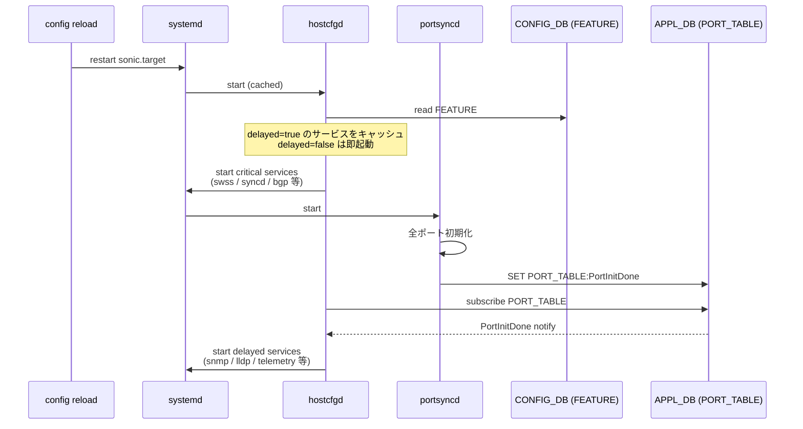

<!-- topics-tip -->
!!! tip "Topics で読み物として読む"
    この HLD は実装詳細を含みます。機能の概念・設定・運用を読み物として読みたい場合は [Topics 11 章: Reboot / Upgrade / Lifecycle](../topics/11-reboot/index.md) を参照。
<!-- /topics-tip -->

!!! success "裏取りステータス: code-verified"
    現行 master の `sonic-host-services/scripts/featured`（`delayed` フィールド処理 / `enable_delayed_services` / PORT_TABLE 購読 + PortInitDone ハンドラ / `handle_port_table_timeout` / `waitAdvancedBootDone`）、`sonic-utilities/scripts/db_migrator.py:719-726` の `has_timer`→`delayed` 移行、`sonic-buildimage/src/sonic-yang-models/yang-models/sonic-feature.yang:67` の `delayed` leaf、`sonic-swss/portsyncd/portsyncd.cpp:134` の `PortInitDone` publish を確認済み（verified at: 2026-05-09）。

# config reload の event-driven 化（FEATURE.delayed + PortInitDone）

## 概要

従来の `config reload` は `systemctl restart sonic.target` で **`sonic.target` 配下の全サービスをまとめて再起動** する実装だった[^1]。systemd ファイルの順序定義に従ってほぼ同時に各 daemon が立ち上がるため、CPU 競合が大きく、スイッチ初期化と続くポート生成が遅れる。実害として `syncd` の SDK 側で「`create:SAI_OBJECT_TYPE_SWITCH` に 30 秒以上かかった」系のエラーログが出て、誤った印象を与える事象が報告されている[^1]:

```text
syncd#SDK: setEndTime: event 'create:SAI_OBJECT_TYPE_SWITCH:oid:0x21000000000000' took 32913 ms to execute
```

reboot 経路では既に **systemd の固定 timer** で snmp / telemetry 等の **非クリティカルサービスを意図的に遅らせる** 対策があるが、これは時間ベースで event-driven ではない。本 [HLD](../reference/glossary.md#term-hld) は **「ポート初期化完了を待ってから非クリティカルサービスを起動する」イベント駆動方式** を `config reload` と各種 reboot に共通で適用する設計を定義する[^1]。

## 動作仕様

### 要件

[^1]:

- クリティカルサービスは config reload 直後に起動する。
- 非クリティカルサービスは **全ポート初期化完了後** に起動する。
- サービスの「即時 / 遅延」は **`FEATURE` テーブルのフィールド** で構成する。
- 既存の systemd 固定 timer は **本機構で置き換えて廃止**。
- 適用範囲は **config reload + warm/fast/cold reboot 全般**。

### `FEATURE` テーブルのフィールド変更

旧フィールド `has_timer` → 新フィールド `delayed` に変更する[^1]。型は boolean、既定 `false`。

[YANG](../reference/glossary.md#term-yang) model の対応定義[^1]:

```yang
leaf delayed {
    description "This configuration indicates if the feature needs to be
                 delayed until system initialization";
    type stypes:boolean_type;
    default "false";
}
```

`db_migrator` が **既存設定の `has_timer` を `delayed` に書き換える** マイグレーションを担う[^1]。これがないと旧 image からアップグレードしたシステムで非クリティカルサービスが「即起動」扱いになって元の競合に逆戻りする。

### `hostcfgd` の役割

中核ロジックは `hostcfgd` に集約される[^1]:



ポイント[^1]:

1. `hostcfgd` 起動時に `FEATURE` テーブルを読み、**`delayed=true` のサービスをキャッシュ**。
2. クリティカルサービスは即起動。
3. [APPL_DB](../reference/glossary.md#term-appl_db) の `PORT_TABLE` を購読し、`portsyncd` が出す **`PortInitDone` キー** を待つ。
4. `PortInitDone` 受信時、キャッシュした delayed サービスをまとめて enable。
5. `PortInitDone` が **タイムアウト時間以内に来ない場合の保険** として、固定タイムアウトを別途定義し、その時点で delayed サービスも上げる。これは「スイッチ初期化が失敗しても管理系サービスだけは生かす」ための fail-safe[^1]。

### クリティカル / 非クリティカルの分類例

HLD 内の例[^1]:

| 区分 | 例 |
|------|----|
| critical（即起動）| `swss`, `syncd`, `bgp` |
| delayed（PortInitDone 待ち）| `snmp`, `lldp`, `telemetry` |

実際の運用では `FEATURE.<name>.delayed` を見て判定する。HLD は具体例を示すのみ[^1]。

### warm boot / fast boot 連携

通常 boot とは別系統で、warm/fast boot 時には `hostcfgd` 自身が **timer で遅らせて起動される** 既存挙動があった。これも本 HLD で **`waitAdvancedBootDone` を待つ** 形に置き換える[^1]:

- `hostcfgd` の起動 timer を撤廃。代わりに warm/fast boot 完了確認の API（`waitAdvancedBootDone`）を呼んで待機する。
- `warm-reboot` コマンド側に「**delayed サービスを含む全サービスが起動完了するのを待ってから先に進む**」チェックを追加する[^1]。warm boot 完了判定の信頼性を上げるための補強。

### 既存 timer の廃止

systemd で固定的に挿入されていた `*.timer` 定義は **撤去** される[^1]。これにより:

- 起動シーケンスが時間ベースから **event-driven へ完全に移行**。
- 各サービスを個別に「N 秒遅らせる」設定をしなくて済む。
- 起動時間は **実際にポート初期化が終わった瞬間** に依存し、シナリオに応じて短縮される。

### 設定 / CLI / YANG / DB Migrator まとめ

| 項目 | 変更内容 |
|------|---------|
| Config command | **新規追加なし**[^1] |
| Show command | **新規追加なし**[^1] |
| DB Migrator | `FEATURE.has_timer` → `FEATURE.delayed` への移行[^1] |
| YANG model | `feature` モデルに `delayed` leaf を追加（`has_timer` を置換）[^1] |
| [SAI](../reference/glossary.md#term-sai) API | 影響なし[^1] |

ユーザ可視の CLI は変わらない。中身が timer ベースから event-driven に切り替わるだけ。

<!-- evidence:
source: sonic-net/SONiC/doc/config_reload/config_reload_enhancement.md#L66-L68 (sha: 49bab5b5ff0e924f1ea52b3d9db0dfa4191a7c06)
excerpt: |
  Currently hostcfgd controls the services based on the feature table. The feature table has a specific field 'has_timer' for the non essential services which needs to be delayed during the reboot flow. This field will be now replaced by new field called "delayed". These services will controlled by hostcfgd.
  ... The hostcfgd will also subscribe to PORT_TABLE in the APPL_DB. Once the switch is initialized and all the ports are created in ASIC and Kernel the PortSyncd will publish PortInitDone key in the APPL_DB. On receiving this key the hostcfgd will go through the delayed services list and enables them.
reasoning: has_timer→delayed のスキーマ変更と PortInitDone 駆動の中核フローの根拠。
-->

<!-- evidence-rendered:start -->
??? note "📋 検証エビデンス: sonic-net/SONiC/doc/config_reload/config_reload_enhancement.md#L66-L68 (sha: 49bab5b5ff0e924f1ea52b3d9db0dfa4191a7c06)"

    **出典**:

    `sonic-net/SONiC/doc/config_reload/config_reload_enhancement.md#L66-L68 (sha: 49bab5b5ff0e924f1ea52b3d9db0dfa4191a7c06)`

    **抜粋**:

    ```text
    Currently hostcfgd controls the services based on the feature table. The feature table has a specific field 'has_timer' for the non essential services which needs to be delayed during the reboot flow. This field will be now replaced by new field called "delayed". These services will controlled by hostcfgd.
    ... The hostcfgd will also subscribe to PORT_TABLE in the APPL_DB. Once the switch is initialized and all the ports are created in ASIC and Kernel the PortSyncd will publish PortInitDone key in the APPL_DB. On receiving this key the hostcfgd will go through the delayed services list and enables them.
    ```

    **判断根拠**: has_timer→delayed のスキーマ変更と PortInitDone 駆動の中核フローの根拠。

<!-- evidence-rendered:end -->

## 設定

### 関連する CONFIG_DB

| Table | Key | フィールド | 用途 |
|-------|-----|-----------|------|
| `FEATURE` | `<feature_name>` | `delayed` (`true` / `false`、既定 `false`) | true なら PortInitDone まで起動を遅延 |

### 関連する CLI

新規 CLI は無し[^1]。既存の `config reload` / `warm-reboot` / `fast-reboot` / `reboot` がそのまま使える。

### 設定例

```bash
# CONFIG_DB 直接編集
sonic-db-cli CONFIG_DB HSET 'FEATURE|snmp' delayed true
sonic-db-cli CONFIG_DB HSET 'FEATURE|telemetry' delayed true

# config reload を実行（critical だけ即起動、delayed は PortInitDone 後）
sudo config reload -y
```

## 制限事項

- `delayed=true` のサービスは **`PortInitDone` の publish に依存**。`portsyncd` が何らかの理由でこのキーを書けないと、フォールバックタイムアウトまで起動を待つことになる[^1]。
- `delayed=true` のサービス起動順は HLD で厳密には規定されていない。`hostcfgd` 内のキャッシュ順かもしくは `FEATURE` 列挙順依存になる可能性。順序が要件のサービス間では追加の依存関係定義が必要。
- 既存 systemd timer の撤去によって、**timer に暗黙的に依存していた他コンポーネント** がある場合は影響が出る可能性。HLD では単純化として timer を消すが、第三者プラグインまでは網羅していない。
- `db_migrator` 変更が前提。古い `has_timer` フィールドを保持したままでは、新 `hostcfgd` が delayed 判定を誤る可能性[^1]。
- HLD 内には Config / Show CLI 変更が **新規無し** と明記されている[^1]ため、ユーザは `delayed` を直接見るためには `redis-cli` / `sonic-db-cli` で `FEATURE` を覗く必要がある。

## 干渉する機能

- **`hostcfgd`**: 本機構の中心。`FEATURE` 購読・`PORT_TABLE` 購読・`waitAdvancedBootDone` 利用が同時に追加される[^1]。
- **`portsyncd`**: `PortInitDone` を APPL_DB に publish する責務[^1]。本 HLD はこの publish に依存している。`portsyncd` 側の挙動変化があれば本機構も追従が必要。
- **systemd unit / timer**: 既存 `*.timer` の撤去。残存していると本機構と二重に起動制御がかかってタイミングがズレる[^1]。
- **warm-reboot / fast-reboot コマンド**: warm boot 完了判定に「全 delayed サービス起動完了」を含める拡張[^1]。warm reboot のスクリプト経路に新たな wait が増える。
- **db_migrator**: 旧 `has_timer` を新 `delayed` に書き換える[^1]。`config_db.json` のバージョン管理上のマイルストーンとなる。
- **YANG (`sonic-feature` モジュール)**: `delayed` leaf の追加。CLI / GNMI 経由でこの値を扱う場合は YANG モデルとの整合確認が必要[^1]。

## トラブルシューティング

- `config reload` 後に snmp / telemetry が起動しない: `FEATURE.<name>.delayed` が `true` で、`PortInitDone` が出ていない可能性。`sonic-db-cli APPL_DB HGETALL PORT_TABLE:PortInitDone` で確認[^1]。
- `PortInitDone` が来ないまま長時間止まる: フォールバックタイムアウト到達まで delayed サービスは起動しない（HLD はタイムアウト後に起動すると規定）[^1]。`portsyncd` のログを確認。
- 旧 image からアップグレード後に動作が変: `has_timer` のまま残っている可能性。`db_migrator` が走ったかを確認[^1]。
- warm reboot がいつまでも完了しない: 全 delayed サービスの起動を待つ拡張により、待ちが長くなっている可能性[^1]。`hostcfgd` のログで未起動サービスを特定する。
- [syncd](../reference/glossary.md#term-syncd) の SDK タイムアウトログ（30 秒超）が出る: 本 HLD はこのログ自体を `config reload` の同時起動による CPU 競合のせいと指摘している[^1]。本機構が有効なら起動順分散により解消が期待される。解消していないならクリティカルサービス自体（swss/syncd/bgp）の競合が残っている可能性。

### コマンド例: config reload 動作確認

下記コマンドで関連する CONFIG_DB / APP_DB / [STATE_DB](../reference/glossary.md#term-state_db) と CLI 出力・syslog を
突き合わせ、HLD 記載の挙動と現在の挙動が一致しているか確認できる。

```bash
# config reload の実行ログとサービス再起動状況
sudo config reload -y -f
sudo journalctl -u config-setup -n 100 --no-pager
show services
```

## 引用元

[^1]: `sonic-net/SONiC` `doc/config_reload/config_reload_enhancement.md` @ `49bab5b5ff0e924f1ea52b3d9db0dfa4191a7c06`

<!-- ops-entry -->
## 運用入口

この HLD に対応する運用面の入口（CLI / [CONFIG_DB](../reference/glossary.md#term-config_db) / YANG / Runbook）を以下にまとめる。

### 関連 CONFIG_DB

- [FEATURE](../reference/config-db/feature.md)

### 関連 YANG

- [sonic-feature](../reference/yang/sonic-feature.md)

### 関連 Runbook

- [config-reload-stuck](../reference/runbooks/config-reload-stuck.md)
- [config-save-load](../reference/runbooks/config-save-load.md)

<!-- /ops-entry -->

<!-- glossary-links-injected: 50471caccd14 -->
