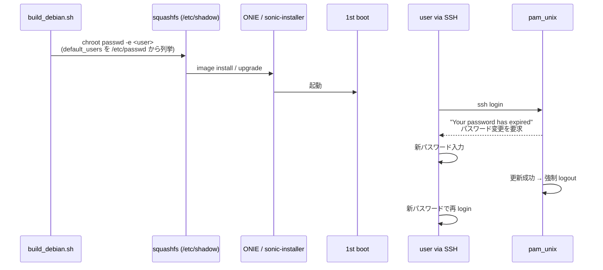

<!-- topics-tip -->
!!! tip "Topics で読み物として読む"
    この HLD は実装詳細を含む。機能の概念・設定・運用を読み物として読みたい場合は [Topics 15 章: Security / AAA](../topics/15-security-aaa/index.md) を参照。
<!-- /topics-tip -->

!!! warning "裏取りステータス: discrepancy-found (evolved_beyond_hld)"
    本機能は **CONFIG_DB / CLI / YANG / SAI のいずれも持たない** ビルド時オプション機能であり、frontmatter の `related.*` は全て空（`_no_related: true` で明示 opt-out）。
    HLD は「1st boot の `/etc/rc.local` から `chage -d 0` を default user に発行する」設計を提案しているが、master 実装はそれとは **異なる経路** を採用している。`sonic-buildimage` (`9ea932e`) では、ビルド時に `build_debian.sh` が `CHANGE_DEFAULT_PASSWORD == "y"` 分岐で `chroot $FILESYSTEM_ROOT passwd -e <user>` を default user に発行し、squashfs 化前のイメージで `/etc/shadow` の `lastchg` を 0 化している。`/etc/rc.local` への 1st boot hook は master では確認できない。`pam_unix` の expire 検知で初回 login 時にパスワード変更を強制する **最終的な挙動は HLD と同じ** だが、トリガ経路が build-time に前倒しされている点が evolved。

# 既定パスワードの初回ログイン強制変更（California SB-327 準拠）

## 概要

[California SB-327](https://leginfo.legislature.ca.gov/faces/billTextClient.xhtml?bill_id=201720180SB327) は IoT 機器の既定パスワード使用を制限する州法であり、**初回ログイン時にユーザに強制でパスワード変更させる** ことが代表的な準拠手段である[^1]。本 [HLD](../reference/glossary.md#term-hld) はこれを [SONiC](../reference/glossary.md#term-sonic) OS で実装する設計を定める。

要件[^1]:

- 初回ログイン時に既定パスワードの変更を強制
- 複数の既定ユーザに対応
- **イメージ更新後** にも再度強制
- [Password Hardening](https://github.com/sonic-net/SONiC/blob/master/doc/passw_hardening/hld_password_hardening.md) 機能と独立に動作（aging を干渉させない）
- 対象は **login shell が `/bin/bash` または `/bin/sh` のユーザ** のみ

## 動作仕様

### 利用する Linux 標準ツール

DB / CLI / [SAI](../reference/glossary.md#term-sai) 変更なし。**Linux 既存機構** で実装する[^1]:

| ツール | HLD 案での役割 | master 実装での役割 |
|--------|----------------|---------------------|
| `chage -d 0` | 1st boot 時に `/etc/rc.local` から発行（HLD 提案） | 採用されず |
| `passwd -e` | （HLD では言及なし） | ビルド時に `chroot` 内で発行し `/etc/shadow` を expired 化[^2] |
| `pam_unix` (`pam_unix_account.so` 相当) | login 時に expire を検知して変更を要求 | 同じ（最終挙動は一致）[^1] |

### Build flag

ビルド時 flag で機能 on/off。`rules/config` で定義され、default は disable[^3]:

```makefile
# rules/config
# CHANGE_DEFAULT_PASSWORD - enforce default user/users to change password on 1st login
CHANGE_DEFAULT_PASSWORD ?= n
```

<!-- evidence: sonic-net/sonic-buildimage rules/config L71-L72 @ 9ea932e -->

有効化はビルド時に `y` を渡す（HLD 例は `=true` だが、`build_debian.sh` は **文字列リテラル `"y"` でのみ分岐する** ため `=true` では効かない）[^2]:

```bash
make CHANGE_DEFAULT_PASSWORD=y target/sonic.bin
```

### 1st boot 〜 初回 login フロー（master 実装）



master 実装ポイント[^2]:

- ビルド時に `build_debian.sh` が `$FILESYSTEM_ROOT/etc/passwd` を走査し、`/home` を持ち login shell が `/bin/bash` または `/bin/sh` のユーザを `default_users` として抽出
- 各ユーザに `chroot $FILESYSTEM_ROOT passwd -e <user>` を発行（`/etc/shadow` の `lastchg` フィールドを 0 化、`chage -d 0` と同等の効果）
- 同じビルドステップで `password_expire` env を `true`/`false` に設定し、`files/build_templates/default_users.json.j2` 経由で `/etc/sonic/default_users.json` にも書き出す[^4]
- 次回 SSH login 時に `pam_unix` が expired を検知し change を要求
- 変更後はユーザが **強制 logout** され、新パスワードで再 login

HLD と異なる点[^1][^2]:

- HLD: 1st boot で `/etc/rc.local` から `chage -d 0` を実行 → master: ビルド時に `passwd -e` で済ませる
- HLD: 1st boot marker file での判定 → master: 不要（イメージに焼き込み済み）

### password hardening との独立性

password hardening (`passw_hardening` 機能) には **aging 期間** があるが、本機能はそれに **干渉しない**[^1]。`passwd -e` / `chage -d 0` は last_change を 0 化して即時 expire を起こすだけで、最大 age（`-M`）を変えないため。

### upgrade フロー

`sonic-installer` で新イメージをインストールすると、新イメージ内の `/etc/shadow` がビルド時に expired 化されているため、upgrade 後も **初回 login で再度パスワード変更が強制** される[^2]。HLD の「1st boot 扱い」とは異なる経路だが結果として要件を満たす。

### warm / fast boot

機能は **トラフィックに影響を与えず**[^1]、warm/fast boot 後の挙動は新イメージ側の `/etc/shadow` の状態次第（CHANGE_DEFAULT_PASSWORD で焼かれていれば強制される）。

## 実装との乖離

HLD と master 実装の差分を `monitor: evolved_beyond_hld` として記録する。

| 項目 | HLD の記述[^1] | master 実装[^2][^3] | 評価 |
|------|----------------|---------------------|------|
| トリガ経路 | 1st boot の `/etc/rc.local` で `chage -d 0` を発行 | ビルド時に `chroot $FILESYSTEM_ROOT passwd -e <user>` で `/etc/shadow` を expired 化 | evolved（最終効果は同等） |
| build flag 値 | 例として `CHANGE_DEFAULT_PASSWORD=true` | `build_debian.sh` は `[[ "$CHANGE_DEFAULT_PASSWORD" == "y" ]]` で **`y` のみ** 分岐 | HLD 例は誤りまたは古い |
| 1st boot marker | marker file（具体名未指定） | 不要（イメージに焼き込み済み） | 簡略化 |
| 対象ユーザ抽出 | `/etc/passwd` を grep（`/bin/bash` / `/bin/sh`） | 同左（`build_debian.sh` 内で `grep "/home"` + `grep ":/bin/bash\|:/bin/sh"`） | 一致 |
| `default_users.json` | HLD 言及なし | `files/build_templates/default_users.json.j2` 経由で `/etc/sonic/default_users.json` も書き出し[^4] | 追加実装 |
| 最終挙動（`pam_unix` で初回 login 時に強制変更） | 規定どおり | 同左 | 一致 |

「機能としては存在するが、トリガの経路・有効化フラグ値が HLD と一致しない」ため `evolved_beyond_hld` と分類している。

## 設定

### CONFIG_DB / CLI / YANG / SAI

**いずれも変更なし**[^1]。DB との対話を持たないビルド時固定機能。frontmatter で `related._no_related: true` を付けてあるのはこの理由による。

### 設定例

通常運用は不要。SSH login 時にプロンプトで操作する例[^1]:

```text
$ ssh admin@sonic-switch
admin@sonic-switch's password:
You are required to change your password immediately (administrator enforced).
WARNING: Your password has expired.
You must change your password now and login again!
Changing password for admin.
Current password: ****
New password:     ****
Retype new password: ****
passwd: password updated successfully
Connection to sonic-switch closed.

$ ssh admin@sonic-switch     # 新パスワードで再 login
```

ビルド時に有効化（master 実装の正しい記法）:

```bash
make CHANGE_DEFAULT_PASSWORD=y target/sonic.bin
```

## 制限事項

- **Remote [AAA](../reference/glossary.md#term-aaa) (LDAP / [RADIUS](../reference/glossary.md#term-radius) / TACACS+) では動作しない**[^1]。リモート認証はカスタマー責務
- **build flag が必須**。runtime に有効化する CLI / DB は無い
- HLD 例の `CHANGE_DEFAULT_PASSWORD=true` は **そのままでは動かない**。`build_debian.sh` は `== "y"` で判定するため `=y` を渡す必要がある[^2]
- 機能は **Linux native ツール (`passwd -e` + `pam_unix`) に依拠**。これらの挙動が変わると同期が必要
- HLD で言及される `/etc/rc.local` での 1st boot 検知ロジックは master には存在しない（build-time に前倒しされている）
- ユーザ unit test は **login と 1st boot を直接カバーしない**（system test に依存）[^1]
- パスワード変更後に **強制 logout** されるユーザ体験上の制約[^1]

## 干渉する機能

- **既存の `passw_hardening` 機能**: aging とは独立。両機能を併用しても干渉しない設計
- **PAM stack**: `pam_unix` の expire 検知に依存
- **SSH / login shell**: ログイン経路に依存
- **`sonic-installer` (image upgrade)**: upgrade 時に新イメージ側の `/etc/shadow` が expired 化されているため間接的に再強制

## トラブルシューティング

- 初回 login で expire が起きない → `CHANGE_DEFAULT_PASSWORD=y` でビルドされたか確認、`chage -l <user>` で `Last password change: never` 等になっているか確認
- `=true` を渡したのに効かない → `=y` でないと `build_debian.sh` の `[[ "$CHANGE_DEFAULT_PASSWORD" == "y" ]]` 分岐に入らない
- LDAP user で動かない → 仕様通り（remote AAA 非対応）
- 強制 logout 後ループ → password hardening 側の policy（最低長 / 複雑度）にひっかかっているか syslog を確認
- upgrade 後に再強制されない → 新イメージも `CHANGE_DEFAULT_PASSWORD=y` でビルドされていたか確認

### コマンド例: デフォルト認証情報強制変更確認

```bash
# 対象ユーザの shadow 期限状態（Last password change が 1970-01-01 / Jan 01, 1970 等になっていれば expired 化済）
sudo chage -l admin

# ビルド時に書き出される default_users の json（参考。CHANGE_DEFAULT_PASSWORD=y のとき expire: true）
sudo cat /etc/sonic/default_users.json
```

## 引用元

[^1]: `sonic-net/SONiC` `doc/California-SB237/California-SB237.md` @ `49bab5b5ff0e924f1ea52b3d9db0dfa4191a7c06`
[^2]: `sonic-net/sonic-buildimage` `build_debian.sh` L576, L859-L865 @ `9ea932ec2e18f35e58268ec2e4456b1d4afd65cd`
[^3]: `sonic-net/sonic-buildimage` `rules/config` L71-L72 @ `9ea932ec2e18f35e58268ec2e4456b1d4afd65cd`
[^4]: `sonic-net/sonic-buildimage` `files/build_templates/default_users.json.j2` @ `9ea932ec2e18f35e58268ec2e4456b1d4afd65cd`

<!-- topics-back-ref -->
## 関連 Topics

- [Topics: Security / AAA / FIPS / Hardening](../topics/15-security-aaa/index.md)

<!-- /topics-back-ref -->

<!-- glossary-links-injected: db62d2100cef -->
