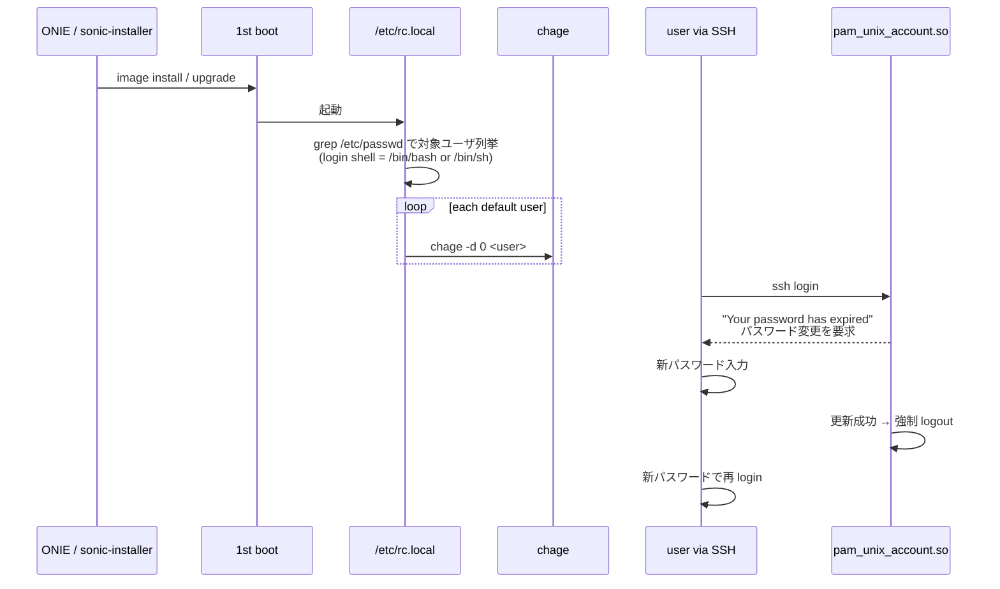

<!-- topics-tip -->
!!! tip "Topics で読み物として読む"
    この HLD は実装詳細を含みます。機能の概念・設定・運用を読み物として読みたい場合は [Topics 15 章: Security / AAA](../topics/15-security-aaa/index.md) を参照。
<!-- /topics-tip -->

!!! info "裏取りステータス: code-verified"
    `sonic-buildimage/rules/config` に `CHANGE_DEFAULT_PASSWORD ?= n` のオプション、`build_debian.sh` に `[[ "$CHANGE_DEFAULT_PASSWORD" == "y" ]]` 分岐と `password_expire="$( ... && echo true || echo false )"` の export 処理を確認。`Makefile.work` / `slave.mk` でも flag を伝搬。HLD で要求された build flag の sonic-buildimage 取り込みは master で確認できた。

# 既定パスワードの初回ログイン強制変更（California SB-327 準拠）

## 概要

[California SB-327](https://leginfo.legislature.ca.gov/faces/billTextClient.xhtml?bill_id=201720180SB327) は IoT 機器の既定パスワード使用を制限する州法であり、**初回ログイン時にユーザに強制でパスワード変更させる** ことが代表的な準拠手段である[^1]。本 [HLD](../reference/glossary.md#term-hld) はこれを [SONiC](../reference/glossary.md#term-sonic) OS で実装する設計を定める。

要件[^1]:

- 初回ログイン時に既定パスワードの変更を強制
- 複数の既定ユーザに対応
- **イメージ更新後** にも再度強制
- [Password Hardening](https://github.com/sonic-net/SONiC/blob/master/doc/passw_hardening/hld_password_hardening.md) 機能と独立に動作（aging を干渉させない）
- 対象は **login shell が `/bin/bash` または `/bin/sh` のユーザ** のみ

## 動作仕様

### 利用する Linux 標準ツール

DB / CLI / [SAI](../reference/glossary.md#term-sai) 変更なし。**Linux 既存機構** で実装する[^1]:

| ツール | 役割 |
|--------|------|
| `chage` | パスワード aging。`-d 0` で **last password change を 0 化** = 強制 expired |
| `pam_unix_account.so` | login 時に password / account の expire を検査し change を要求 |

### Build flag

ビルド時 flag で機能 on/off[^1]:

```bash
CHANGE_DEFAULT_PASSWORD=true make target/sonic.bin
```

**default は disable**[^1]。runtime にこの flag を見て動作分岐する。

### 1st boot フロー



実装ポイント[^1]:

- 1st boot 検知は `/etc/rc.local` 上で行う（specific marker file 等で判定する想定）
- 対象ユーザは **`/etc/passwd` を grep して login shell が `/bin/bash` / `/bin/sh` のもの** のみ
- 各ユーザに `chage -d 0 <user>` を発行
- 次回 SSH login 時に `pam_unix_account.so` が expired を検知し change を要求
- 変更後はユーザが **強制 logout** され、新パスワードで再 login

### password hardening との独立性

password hardening (`passw_hardening` 機能) には **aging 期間** があるが、本機能はそれに **干渉しない**[^1]。`chage` の `-d 0` は last_change を 0 化して即時 expire を起こすだけで、最大 age（`-M`）を変えないため。

### upgrade フロー

`sonic-installer` で新イメージをインストールすると **1st boot 扱い** になり、再度パスワード変更が強制される[^1]。

### warm / fast boot

機能は **トラフィックに影響を与えず** 、warm/fast boot 後にも triggered され得る[^1]。

## 設定

### CONFIG_DB / CLI / YANG / SAI

**いずれも変更なし**[^1]。DB との対話を持たない設計。

### 設定例

通常運用は不要。SSH login 時にプロンプトで操作する例[^1]:

```text
$ ssh admin@sonic-switch
admin@sonic-switch's password:
You are required to change your password immediately (administrator enforced).
WARNING: Your password has expired.
You must change your password now and login again!
Changing password for admin.
Current password: ****
New password:     ****
Retype new password: ****
passwd: password updated successfully
Connection to sonic-switch closed.

$ ssh admin@sonic-switch     # 新パスワードで再 login
```

ビルド時に有効化:

```bash
CHANGE_DEFAULT_PASSWORD=true make target/sonic.bin
```

## 制限事項

- **Remote [AAA](../reference/glossary.md#term-aaa) (LDAP / [RADIUS](../reference/glossary.md#term-radius) / TACACS+) では動作しない**[^1]。リモート認証はカスタマー責務
- **build flag が必須**。runtime に有効化する CLI / DB は無い
- 機能は **Linux native ツール (`chage` + `pam_unix_account.so`) に依拠**。これらの挙動が変わると同期が必要
- `/etc/rc.local` の 1st boot 検知ロジックの堅牢性は HLD では明示されていない
- ユーザ unit test は **login と 1st boot を直接カバーしない**（system test に依存）[^1]
- パスワード変更後に **強制 logout** されるユーザ体験上の制約[^1]

## 干渉する機能

- **既存の `passw_hardening` 機能**: aging とは独立。両機能を併用しても干渉しない設計
- **`/etc/rc.local`**: 1st boot 処理の置き場
- **PAM stack**: `pam_unix_account.so` の挙動に依存
- **SSH / login shell**: ログイン経路に依存
- **`sonic-installer` (image upgrade)**: 1st boot 再 trigger に関与

## トラブルシューティング

- 初回 login で expire が起きない → `CHANGE_DEFAULT_PASSWORD=true` でビルドされたか確認、`chage -l <user>` で `Last password change: never` 等になっているか確認
- LDAP user で動かない → 仕様通り（remote AAA 非対応）
- 強制 logout 後ループ → password hardening 側の policy（最低長 / 複雑度）にひっかかっているか syslog を確認
- upgrade 後に再強制されない → 1st boot marker (e.g. `/host/.first_boot` 相当) の有無、`/etc/rc.local` の処理ロジックを確認

### コマンド例: デフォルト認証情報強制変更確認

下記コマンドで関連する [CONFIG_DB](../reference/glossary.md#term-config_db) / APP_DB / [STATE_DB](../reference/glossary.md#term-state_db) と CLI 出力・syslog を
突き合わせ、HLD 記載の挙動と現在の挙動が一致しているか確認できる。

```bash
# 初期 admin パスワード変更を強制するフラグ
redis-cli -n 4 hgetall 'PASSW_HARDENING|POLICIES'
sudo chage -l admin
```


## 引用元

[^1]: `sonic-net/SONiC` `doc/California-SB237/California-SB237.md` @ `49bab5b5ff0e924f1ea52b3d9db0dfa4191a7c06`

<!-- concerns hint:
- CHANGE_DEFAULT_PASSWORD build flag の sonic-buildimage 取り込み確認
- /etc/rc.local で 1st boot を判別し chage -d 0 を全 default user に適用するスクリプトの存在確認
- pam_unix_account.so の expired 検知が現行 image の PAM 構成で有効か確認
- /etc/passwd 走査で login shell = /bin/bash / /bin/sh ユーザのみ対象とする実装確認
- image upgrade で 1st boot 扱いとなる仕組み（marker file 等）の現行確認
-->

<!-- topics-back-ref -->
## 関連 Topics

- [Topics: Security / AAA / FIPS / Hardening](../topics/15-security-aaa/index.md)

<!-- /topics-back-ref -->

<!-- glossary-links-injected: db62d2100cef -->
