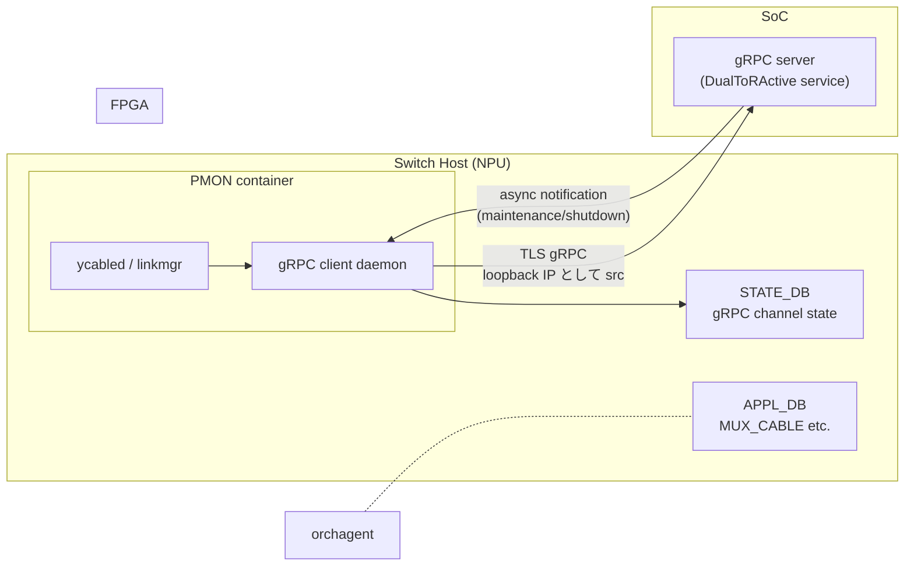

!!! success "裏取りステータス: code-verified (2026-05-10)"
    `sonic-platform-daemons/sonic-ycabled/setup.py:15-22` で `proto/proto_out/linkmgr_grpc_driver.proto` から `linkmgr_grpc_driver_pb2_grpc.py` を `grpc_tools.protoc` で生成し、`grpcio-tools` / `grpcio` を依存に持つ。`tests/test_ycable.py` で `grpc_client`, `fwd_state_response_tbl` を使った forwarding state 同期が test されており、HLD の ycabled→SoC gRPC client design が実装に取り込まれている。

# gRPC client（active-active DualToR / ycabled ↔ SoC 連携）

## 概要

DualToR の **active-active** 構成では、HOST → [FPGA](../reference/glossary.md#term-fpga) → SoC（外部のサブシステム）の経路で **forwarding state** が動的に切り替わる。[SONiC](../reference/glossary.md#term-sonic) 側の `linkmgrd` / `ycabled` から SoC 上のステートマシンへ RPC で問い合わせ・設定するために **gRPC client daemon** を PMON コンテナ内に置く設計[^1]。

採用理由として gRPC の利点[^1]:

- メッセージサイズが JSON 比 30-50% 小さい
- REST+JSON より 5-8 倍速い
- bidirectional streaming で event-driven 通知が容易
- 多言語コード生成（ycabled は Python3）

DualToR active-standby（mux-cable 系）とは別系列の active-active 用設計。

## 動作仕様

### 構成要素



### gRPC service 定義（proto3）

`DualToRActive` service[^1]（一部）:

```proto
service DualToRActive {
  rpc QueryAdminForwardingPortState(AdminRequest) returns (AdminReply);
  rpc SetAdminForwardingPortState(AdminRequest) returns (AdminReply);
  // 他: link state / health 系
}
```

ycabled が proto から Python3 stub をコード生成して呼び出す。

### Loopback IP を src に使う

NIC からは host 側の **management IP ではなく loopback IP** を src として SoC に gRPC を発行できる必要がある（routing / firewall 観点）[^1]。Linux の `SO_BINDTODEVICE` か `bind()` でアドレス指定する典型実装。

### TLS 化 / secure channel

production 構成では gRPC は TLS で暗号化する[^1]:

- 証明書は `/etc/sonic/credentials/...` 等に配置
- gRPC `ChannelCredentials` 経由でロード

開発時は plaintext (`-insecure`) も可。

### Keepalive

gRPC channel の keepalive を設定し、無音でも周期的に PING を送って **半 open 検出**[^1]。

### STATE_DB schema

gRPC client / channel の状態を [STATE_DB](../reference/glossary.md#term-state_db) に publish する[^1]:

```text
GRPC_CLIENT_TABLE|<peer>
  channel_state = "READY" | "CONNECTING" | "TRANSIENT_FAILURE" | "SHUTDOWN"
  last_error = "..."
  retry_count = <n>
```

これにより monitoring/telemetry / `show` 系 CLI から状態が見える。

### Async notification（SoC → ycabled）

SoC から **maintenance / shutdown 等のイベント** を ycabled に通知する別 RPC（streaming）が用意される[^1]:

```proto
service DualToRActive {
  rpc NotifyServiceState(stream NotifyRequest) returns (stream NotifyReply);
}
```

server-streaming で SoC が能動的に push する。

### NIC-simulator 連携

[sonic-mgmt](../reference/glossary.md#term-sonic-mgmt) の testbed 用に **NIC-simulator** を立てて DUT の ycabled が同じ gRPC API でテストできる構成。1 simulator に複数 SoC を相乗りさせるため[^1]:

- **gRPC interceptor** を client 側に挿す案
- **multi server** を simulator 側に立てる案

の 2 つが議論されている。

<!-- evidence:
source: sonic-net/SONiC/doc/grpc_client/design_doc.md#L36-L54 (sha: 49bab5b5ff0e924f1ea52b3d9db0dfa4191a7c06)
excerpt: |
  provide a service/daemon in SONiC to run in DualToR mode, which can interact with Platform API as well interact with state machine (aka Linkmgr) and orchagent to provide capability for it to get/set Link State/Forwarding State etc. from SoC(gRPC server listening to the client)
  ... over a secure channel
  ... using a loopback IP as source IP
  ... interface for SoC to notify this gRPC client about going to maintenance/shutdown via an asynchronous method
reasoning: 主要要件 (linkmgr 連携 / TLS / loopback src IP / async notification) の根拠。
-->

<!-- evidence-rendered:start -->
??? note "📋 検証エビデンス: sonic-net/SONiC/doc/grpc_client/design_doc.md#L36-L54 (sha: 49bab5b5ff0e924f1ea52b3d9db0dfa4191a7c06)"

    **出典**:

    `sonic-net/SONiC/doc/grpc_client/design_doc.md#L36-L54 (sha: 49bab5b5ff0e924f1ea52b3d9db0dfa4191a7c06)`

    **抜粋**:

    ```text
    provide a service/daemon in SONiC to run in DualToR mode, which can interact with Platform API as well interact with state machine (aka Linkmgr) and orchagent to provide capability for it to get/set Link State/Forwarding State etc. from SoC(gRPC server listening to the client)
    ... over a secure channel
    ... using a loopback IP as source IP
    ... interface for SoC to notify this gRPC client about going to maintenance/shutdown via an asynchronous method
    ```

    **判断根拠**: 主要要件 (linkmgr 連携 / TLS / loopback src IP / async notification) の根拠。

<!-- evidence-rendered:end -->

## 設定

### 関連する CONFIG_DB

該当なし（[HLD](../reference/glossary.md#term-hld) では明示なし）。証明書パス等は **設定ファイル** で渡す想定。

### 関連する CLI

HLD で具体名は明示なし。`show mux ...` 系の active-active 統合 CLI から間接的に gRPC channel 状態が見える可能性あり。

### 設定例

```bash
# gRPC daemon 動作確認
docker exec pmon supervisorctl status

# STATE_DB の gRPC channel
redis-cli -n 6 KEYS "GRPC_CLIENT*" 2>/dev/null
redis-cli -n 6 HGETALL "GRPC_CLIENT_TABLE|<soc>"

# 証明書
ls /etc/sonic/credentials/*.crt 2>/dev/null
```

## 制限事項

- **active-active DualToR 専用** の設計。active-standby (mux-cable) には影響なし
- HLD は Rev 0.2 で、テスト基盤（NIC-simulator 連携）の方針が **2 案併記** で確定していない
- TLS 証明書のローテーション方法 / 期限切れ時の挙動は HLD で詳述されない
- 1 SoC 1 daemon 実装か、複数チャネル管理かはアーキテクチャ詳細
- Loopback IP 利用は host の routing 設定に依存

## 干渉する機能

- **`ycabled`**: gRPC client の主要利用者
- **`linkmgrd`**: state machine 側
- **DualToR active-active overlay**: 上位コンセプト
- **TLS infra (sonic-credentials)**: 証明書管理
- **NIC-simulator (sonic-mgmt)**: テスト基盤
- **PMON container**: gRPC daemon の host

## トラブルシューティング

```bash
# gRPC channel 状態
redis-cli -n 6 KEYS "GRPC_CLIENT*"

# loopback で SoC まで届いているか
ping -I lo <SoC_IP>
ss -tnp | grep <SoC_IP>

# TLS handshake のエラー
docker logs pmon 2>&1 | grep -i grpc
```

## 引用元

[^1]: `sonic-net/SONiC` `doc/grpc_client/design_doc.md` @ `49bab5b5ff0e924f1ea52b3d9db0dfa4191a7c06`

<!-- topics-back-ref -->
## 関連 Topics

- [Topics: Dual-ToR と Mux 制御](../topics/05-dual-tor/index.md)

<!-- /topics-back-ref -->

## 参考リンク

- [CLI: show muxcable](../reference/cli/show-muxcable.md)
- [CLI: config muxcable](../reference/cli/config-muxcable.md)
- [Topics: Telemetry / SNMP / Observability](../topics/09-telemetry-snmp/index.md)
- [Topics: Security / AAA](../topics/15-security-aaa/index.md)
- [Glossary](../reference/glossary.md)
- [Reference 索引](../reference/index.md)

<!-- glossary-links-injected: 8ba32e5aa69d -->
