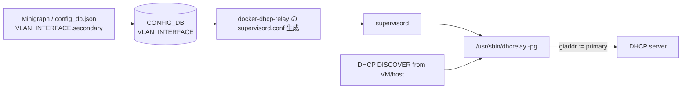

<!-- topics-tip -->
!!! tip "Topics で読み物として読む"
    この HLD は実装詳細を含みます。機能の概念・設定・運用を読み物として読みたい場合は [Topics 16 章: NAT / DHCP / DNS](../topics/16-nat-dhcp-dns/index.md) を参照。
<!-- /topics-tip -->

!!! success "裏取りステータス: Code-verified"
    `sonic-buildimage/src/isc-dhcp/patch/0015-option-to-set-primary-address-in-interface.patch` で dhcrelay の `-pg` オプション実装パッチを確認。`sonic-buildimage/dockers/docker-dhcp-relay/dhcpv4-relay.agents.j2` L27-28 で `VLAN_INTERFACE | get_primary_addr` を回して primary IPv4 のみ `-pg <gateway>` 引数を組み立てる Jinja を確認。`get_primary_addr` フィルタは `sonic-buildimage/src/sonic-config-engine/sonic-cfggen` L168 で定義（secondary を除外して primary のみ返す）、L302 で env.filters に登録。`sonic-utilities/config/main.py` L5680 で `--secondary/-s` フラグ、L5794-L5806 で VLAN_INTERFACE への `secondary: "true"` 書き込みを確認（verified at: 2026-05-09）。

# DHCPv4 Relay の giaddr を Primary サブネットに固定（VLAN_INTERFACE secondary）

## 概要

[VLAN](../reference/glossary.md#term-vlan) に **複数のサブネット** を載せたい運用は珍しくない。例えばベアメタルサーバ上の VM 用に追加 IP プレフィックスを生やすケースや、セキュリティドメインで分離したいケースがそれにあたる。一方、[SONiC](../reference/glossary.md#term-sonic) の DHCPv4 リレーエージェント（ISC `dhcrelay`）は VLAN 配下の複数 IP インタフェースを単純に列挙するだけで、リレー時に **`giaddr` 欄をどのサブネットの IP にするかが事実上ランダム** になる問題があった。サーバ側 DHCP は `giaddr` をもとにスコープを選ぶため、毎回違う `giaddr` が来るとプール選択がブレてしまう[^1]。

本機能は `VLAN_INTERFACE` テーブルに **`secondary` フラグ** を追加し、`dhcrelay` の起動引数に **`-pg <primary-gateway>`** を渡すことで、リレーが常に primary サブネットの IP を `giaddr` に書き込むよう固定する。複数サブネットを持ちつつ DHCP は primary の 1 系統に集約する設計である。**IPv4 限定**[^1]。

## 動作仕様

### Primary / Secondary の意味

VLAN 配下の各 IP プレフィックスは次のいずれかに分類される。

| 種別 | 設定 | DHCP の対象 |
|------|------|-------------|
| Primary | secondary 未設定（既定） | DHCP リレーが処理する |
| Secondary | `secondary: true` | DHCP リレーは処理しない（giaddr に使わない、サーバはこのレンジから払い出さない）|

理想は **VLAN 配下に primary は 1 つ、それ以外を secondary** にする運用。複数 primary がある場合の挙動は [HLD](../reference/glossary.md#term-hld) では定義されないが、`-pg` で渡される 1 つの IP のみが `giaddr` に固定されるため、結局 primary は 1 つに絞られる。

### dhcrelay 起動引数

`docker-dhcp-relay` の supervisord ファイルを生成する jinja で、Primary IP を `-pg` に渡す[^1]。

```text
/usr/sbin/dhcrelay ... -pg <primary_subnet_gateway_ip> ...
```

ISC dhcrelay 側はこの `-pg` オプションをサポートする拡張が必要で、HLD は明示的に「`isc-dhcp/dhcrelay to support '-pg gateway' argument`」を要件として挙げている[^1]。

### 全体経路



### YANG 拡張

`sonic-vlan.yang` の `VLAN_INTERFACE_IPPREFIX_LIST` に boolean leaf `secondary` を追加[^1]。

```yang
list VLAN_INTERFACE_IPPREFIX_LIST {
    leaf secondary {
        description "Optional field to specify if the prefix is secondary subnet";
        type boolean;
    }
}
```

### CONFIG_DB 例

`Vlan1000|20.11.12.13/27` を secondary、`Vlan1000|20.11.10.13/27` を primary と扱う例[^1]:

```json
{
    "VLAN_INTERFACE": {
        "Vlan1000": {},
        "Vlan1000|20.11.10.13/27": {},
        "Vlan1000|20.11.12.13/27": {"secondary": "true"}
    }
}
```

`Vlan1000|<prefix>` のキー単位で個別に `secondary` を持つことに注意。`secondary` 既定は `false`、未設定なら primary 扱い。

### CLI 拡張

```bash
sudo config interface ip add Vlan1000 20.11.12.13/27 20.11.12.254 --secondary
```

ファイル `tests/ip_config_test.py` に対応するテストが追加され、以下が要件として明記されている[^1]:

- `--secondary` / `-s` フラグの解釈
- **primary が既に存在しなければ secondary を追加できない**（一貫性チェック）

### 既存環境からの移行

`secondary` は optional であり、既存 VLAN_INTERFACE にはアクションを取らずアップグレードできる。secondary を使わない場合は何も変わらない[^1]。

<!-- evidence:
source: sonic-net/SONiC/doc/DHCPv4_Gateway/DHCPv4_gateway.md#L37-L47 (sha: 49bab5b5ff0e924f1ea52b3d9db0dfa4191a7c06)
excerpt: |
  1. Support a new member 'secondary' of VLAN_INTERFACE in config_db.
  2. Support parsing and assignment of subnets from minigraph/json/cli to config_db.
  3. Support specifying non-secondary interfaces' gateway address to command line arguments to /usr/sbin/dhcrelay as -pg (primary gateway).
  4. isc-dhcp/dhcrelay to support '-pg gateway' argument.
reasoning: 4 つの要件 (CONFIG_DB / parsing / -pg 渡し / dhcrelay 拡張) の根拠。
-->

<!-- evidence-rendered:start -->
??? note "📋 検証エビデンス: sonic-net/SONiC/doc/DHCPv4_Gateway/DHCPv4_gateway.md#L37-L47 (sha: 49bab5b5ff0e924f1ea52b3d9db0dfa4191a7c06)"

    **出典**:

    `sonic-net/SONiC/doc/DHCPv4_Gateway/DHCPv4_gateway.md#L37-L47 (sha: 49bab5b5ff0e924f1ea52b3d9db0dfa4191a7c06)`

    **抜粋**:

    ```text
    1. Support a new member 'secondary' of VLAN_INTERFACE in config_db.
    2. Support parsing and assignment of subnets from minigraph/json/cli to config_db.
    3. Support specifying non-secondary interfaces' gateway address to command line arguments to /usr/sbin/dhcrelay as -pg (primary gateway).
    4. isc-dhcp/dhcrelay to support '-pg gateway' argument.
    ```

    **判断根拠**: 4 つの要件 (CONFIG_DB / parsing / -pg 渡し / dhcrelay 拡張) の根拠。

<!-- evidence-rendered:end -->

## 設定

### 関連する CONFIG_DB

| Table | Key | フィールド | 説明 |
|-------|-----|-----------|------|
| `VLAN_INTERFACE` | `<vlan>\|<prefix>` | `secondary` | `"true"` で secondary（DHCP 対象外）。既定 `false` |

### 関連する CLI

| Command | 用途 |
|---------|------|
| `config interface ip add <intf> <prefix> <gateway> --secondary` (or `-s`) | secondary IP 追加 |
| `config interface ip add <intf> <prefix> <gateway>` | primary IP 追加（既存挙動）|

### 関連する YANG

`sonic-vlan` モジュール、`VLAN_INTERFACE_IPPREFIX_LIST` に `secondary: boolean` を追加。

### 設定例

```bash
# Vlan1000 に primary とそれ以外を追加
sudo config interface ip add Vlan1000 20.11.10.13/27 20.11.10.1
sudo config interface ip add Vlan1000 20.11.12.13/27 20.11.12.1 --secondary
```

`docker-dhcp-relay` を再生成（`config reload` 等）すると、dhcrelay は `-pg 20.11.10.1` 相当で起動し、すべての DHCP DISCOVER に対し `giaddr=20.11.10.13` を埋め込む。

## 干渉する機能

- **Minigraph**: `SecondarySubnets` 等の minigraph フィールドが追加される。`sonic-config-engine` のテストにそれを取り込む変更が入る[^1]。
- **DHCPv6 Relay**: 本機能は IPv4 限定。IPv6 リレーには影響しない。
- **Routing / [FRR](../reference/glossary.md#term-frr)**: secondary プレフィックスも IP インタフェースとして OS には設定されるため、ルーティングプロトコルから見える経路に変化はない。secondary だからといって OS から消えるわけではない点に注意。
- **Warm/Fast boot**: 影響なし（HLD 明記）。
- **メモリ**: 機能 disabled 時の追加コスト無し（HLD 明記）。

## トラブルシューティング

- VM クライアントだけ DHCP が当たらない: secondary プレフィックスのレンジに居る可能性。サーバ側スコープが primary レンジで定義されていることを確認する。
- DHCP リクエストの giaddr が想定外: `tcpdump -ni <ifc> port 67` で `giaddr` を確認。`-pg` が dhcrelay に正しく渡っているかを `ps -ef | grep dhcrelay` で確認する。
- `config interface ip add ... --secondary` が拒否される: primary の IP が同 VLAN にまだ無い可能性。CLI 側で「primary が無いと secondary を入れられない」一貫性チェックがあると HLD は記述している[^1]。
- 大量の secondary を入れたが反映されない: `docker-dhcp-relay` のサプライザード設定再生成（`systemctl restart dhcp_relay` 等）が必要なケースがある。

### コマンド例: DHCPv4 relay giaddr 指定確認

下記コマンドで関連する CONFIG_DB / APP_DB / [STATE_DB](../reference/glossary.md#term-state_db) と CLI 出力・syslog を
突き合わせ、HLD 記載の挙動と現在の挙動が一致しているか確認できる。

```bash
# DHCPv4 relay の giaddr 指定と counter
show dhcp_relay ipv4 helper
redis-cli -n 4 hgetall 'DHCP_RELAY|Vlan1000'
docker logs dhcp_relay 2>&1 | tail -30
```

## 引用元

[^1]: `sonic-net/SONiC` `doc/DHCPv4_Gateway/DHCPv4_gateway.md` @ `49bab5b5ff0e924f1ea52b3d9db0dfa4191a7c06`

<!-- topics-back-ref -->
## 関連 Topics

- [Topics: NAT / DHCP Relay / Time-DNS Services](../topics/16-nat-dhcp-dns/index.md)

<!-- /topics-back-ref -->

<!-- glossary-links-injected: 800751a0842d -->

<!-- ops-entry -->
## 運用入口

この HLD に対応する運用面の入口（CLI / [CONFIG_DB](../reference/glossary.md#term-config_db) / [YANG](../reference/glossary.md#term-yang) / Runbook）を以下にまとめる。

### 関連 CLI

- `config interface ip add`

### 関連 CONFIG_DB

- [VLAN_INTERFACE](../reference/config-db/vlan-interface.md)

### 関連 YANG

- [sonic-vlan](../reference/yang/sonic-vlan.md)

### 関連 Runbook

- [dhcp-relay](../reference/runbooks/dhcp-relay.md)

<!-- /ops-entry -->

<!-- glossary-links-injected: 8ba32e5aa69d -->
