!!! success "裏取りステータス: Code-verified"
    `sonic-swss/orchagent/portsorch.cpp` L948-953 で `SAI_PORT_ATTR_HOST_TX_SIGNAL_ENABLE` capability query、L959-981 で `SAI_SWITCH_ATTR_PORT_HOST_TX_READY_NOTIFY` の switch attribute 設定、L1366 / L6024-6038 で port 単位の `HOST_TX_SIGNAL_ENABLE` set ロジックを確認（verified 2026-05-09）。

# CMIS モジュール管理拡張（`host_tx_signal` / `host_tx_ready` の同期）

## 概要

[ASIC](../reference/glossary.md#term-asic) 側 [SerDes](../reference/glossary.md#term-serdes) は SWSS の `PortsOrch`（→ vendor [SAI](../reference/glossary.md#term-sai)）が、CMIS モジュール側は PMON の `xcvrd` が制御するという二段構成だが、両者を **「ASIC が high-speed signal を送り始めてからモジュール初期化を始める」** 順で同期させる必要がある。従来は `STATE_DB.PORT.host_tx_ready` フラグを **[PortsOrch](../reference/glossary.md#term-portsorch) が SAI Admin UP の戻りで即立てる** 設計だったが、以下のギャップがあった[^1]:

1. ASIC ポート初期化に時間がかかり、Admin UP 戻り直後に signal が出ていないケース（特に BiDi 等の新世代 transceiver）
2. モジュール未挿入時に ASIC が signal を出しっぱなしになり、隣接ポートへのクロストーク・EMI・transceiver 寿命短縮を招く

本拡張は **Module 挿抜と high-speed signal 送出を SW 側から制御**し、`host_tx_ready` を **SAI 非同期通知**で更新する仕組みを追加する。新 SAI 機能を **対応プラットフォームのみで有効化**し、非対応では従来挙動を維持する後方互換設計[^1]。

## 動作仕様

### 新 SAI 属性 / 通知

| SAI シンボル | 用途 |
|------|------|
| `SAI_PORT_ATTR_HOST_TX_SIGNAL_ENABLE` | port object 属性。SW 側から high-speed signal 送出を許可/禁止 |
| `SAI_PORT_ATTR_HOST_TX_READY_STATUS` | 現在 ASIC が signal を出しているか（warm-boot 後 query 用） |
| `SAI_SWITCH_ATTR_PORT_HOST_TX_READY_NOTIFY` | 非同期通知。signal 開始/停止を SDK→SWSS に伝える |

ASIC FW は **両方 (`HOST_TX_SIGNAL_ENABLE = TRUE` AND `Admin UP`)** が成立して初めて high-speed signal を出す。片方が落ちれば停止する[^1]。

### TRANSCEIVER_INFO 連動

```mermaid
sequenceDiagram
  participant Mod as Module
  participant Pmon as Pmon/xcvrd
  participant State as STATE_DB
  participant POA as PortsOrch
  participant SAI as vendor SAI/SDK
  Mod->>Pmon: 挿抜検知
  Pmon->>State: TRANSCEIVER_INFO entry add/del
  POA->>State: subscribe TRANSCEIVER_INFO
  State-->>POA: INSERTION/REMOVAL
  POA->>SAI: set HOST_TX_SIGNAL_ENABLE = true/false
  Note over SAI: Admin UP 達成時のみ signal 送出
  SAI-->>POA: PORT_HOST_TX_READY_NOTIFY (start/stop)
  POA->>State: PORT.host_tx_ready = true/false
  Note over POA,State: xcvrd は host_tx_ready を購読し<br>CMIS ステートマシン起動
```



PortsOrch は init 時に SAI capability 問い合わせを行い、`HOST_TX_SIGNAL_ENABLE` / `HOST_TX_READY_NOTIFY` のサポート可否を確認する。サポート時のみ TRANSCEIVER_INFO subscribe と通知 consumer を有効化する[^1]。

### バックワード互換挙動

| プラットフォーム | host_tx_ready の立ち方 |
|----------------|----------------------|
| 新拡張サポート | SAI 非同期通知到達後に立てる |
| 非サポート | Admin UP の SAI call が SUCCESS で戻った直後に立てる（旧挙動） |

ポート作成時、新 SAI 属性 default が **TRUE**（互換性のため）なので、サポート platform では PortsOrch が **明示的に FALSE** にセットしてから運用する[^1]。

### warm-boot

warm-boot 後は `HOST_TX_READY_NOTIFY` は再発行されない。`PortsOrch::initializePort()` 内で `SAI_PORT_ATTR_HOST_TX_READY_STATUS` を query して `STATE_DB.PORT.host_tx_ready` を再構築する[^1]:

```cpp
attr.id = SAI_PORT_ATTR_HOST_TX_READY_STATUS;
status = sai_port_api->get_port_attribute(port.m_port_id, 1, &attr);
m_portTable->set(port.m_alias, {{"host_tx_ready", attr.value.u32 ? "true" : "false"}});
```

## 制限事項

- **対応 SDK / FW** が必要。非対応 platform では従来挙動のため、unterminated transmission 問題 / 早すぎる CMIS init 問題は解決しない[^1]
- 既定値が TRUE のため、PortsOrch 側で port 作成時の明示 FALSE 設定が抜けると signal が出っぱなしになる
- module 挿抜検知が `TRANSCEIVER_INFO` 経由に依存するため、xcvrd の振る舞いに連動

## 干渉する機能

- **PortsOrch.AdminStatus**: signal 出現条件は signal_enable AND admin_up。AdminStatus 変更で signal も連動停止
- **xcvrd / CMIS state machine**: `host_tx_ready=true` を待ってモジュール init を開始する設計は変更なし
- **warm-reboot**: 通知ベースから query ベースへフォールバック

## トラブルシューティング

- `redis-cli -n 6 hget "PORT_TABLE|<port>" host_tx_ready`（[STATE_DB](../reference/glossary.md#term-state_db)）
- `redis-cli -n 6 hgetall "TRANSCEIVER_INFO|<port>"` でモジュール挿抜状態
- ASIC 側 capability: vendor SAI のログまたは debug 系コマンドで `HOST_TX_SIGNAL_ENABLE` / `HOST_TX_READY` の値確認

### コマンド例: CMIS module 状態確認

下記コマンドで関連する [CONFIG_DB](../reference/glossary.md#term-config_db) / APP_DB / STATE_DB と CLI 出力・syslog を
突き合わせ、[HLD](../reference/glossary.md#term-hld) 記載の挙動と現在の挙動が一致しているか確認できる。

```bash
# CMIS 対応 transceiver の状態と FW
show interfaces transceiver info Ethernet0
show interfaces transceiver eeprom Ethernet0
redis-cli -n 6 hgetall 'TRANSCEIVER_INFO|Ethernet0'
```

### コマンド例: CMIS module 状態確認

下記コマンドで関連する CONFIG_DB / APP_DB / STATE_DB と CLI 出力・syslog を
突き合わせ、HLD 記載の挙動と現在の挙動が一致しているか確認できる。

```bash
# CMIS 対応 transceiver の状態と FW
show interfaces transceiver info Ethernet0
show interfaces transceiver eeprom Ethernet0
redis-cli -n 6 hgetall 'TRANSCEIVER_INFO|Ethernet0'
```


## 単体テスト[^1]

- `sonic-sairedis/unittest/lib/TestSwitch.cpp` / `meta/TestNotificationFactory.cpp` を新通知に追従
- 新規 `meta/TestNotificationHostTxReadyEvent.cpp` で通知ハンドラ
- `sonic-swss/tests/mock_tests/portsorch_ut.cpp` に PortsOrch の新フロー
- `sonic-swss/tests/test_warm_reboot.py` で warm-reboot 後 host_tx_ready 検証

## 引用元

[^1]: [sonic-net/SONiC doc/cmis-module-enhancement/cmis-module-enhancement.md @ 49bab5b](https://github.com/sonic-net/SONiC/blob/49bab5b5ff0e924f1ea52b3d9db0dfa4191a7c06/doc/cmis-module-enhancement/cmis-module-enhancement.md)

<!-- topics-back-ref -->
## 関連 Topics

- [Topics: Platform / Port / Optics / PHY](../topics/14-platform-port-optics/index.md)

<!-- /topics-back-ref -->

## 参考リンク

- [CONFIG_DB: PORT](../reference/config-db/port.md)
- [CLI: show interfaces](../reference/cli/show-interfaces.md)
- [CLI: show platform](../reference/cli/show-platform.md)
- [CLI: config warm_restart](../reference/cli/config-warm_restart.md)
- [Topics: Reboot / Warm / Fast](../topics/11-reboot/index.md)
- [Glossary](../reference/glossary.md)
- [Reference 索引](../reference/index.md)

<!-- glossary-links-injected: cc9e55db7709 -->
