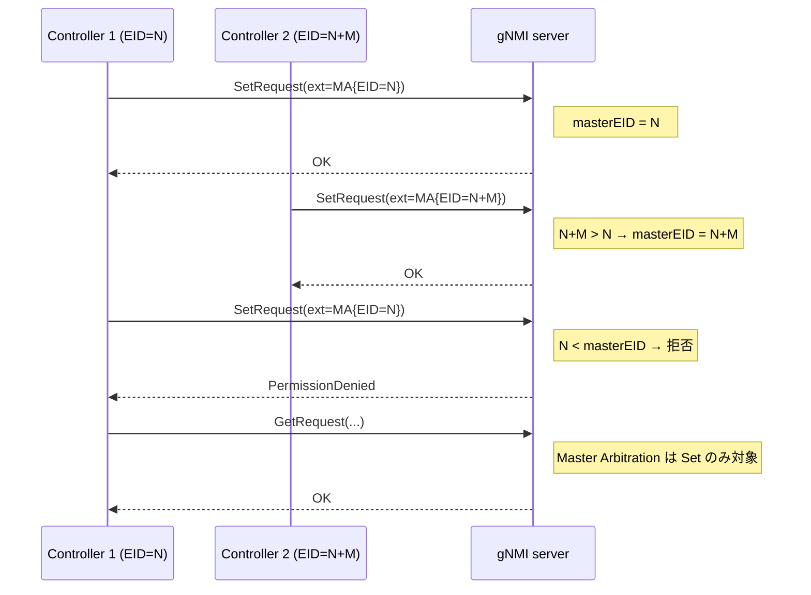
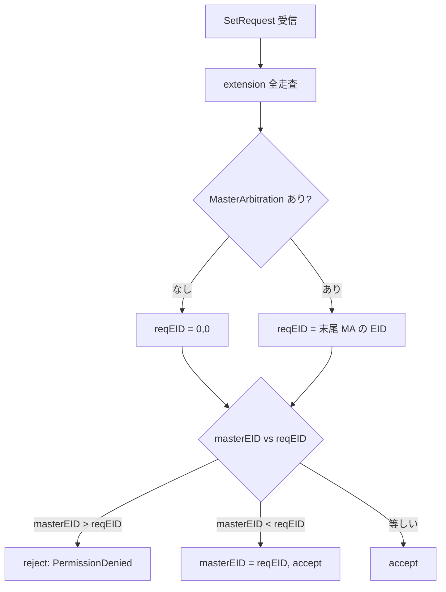

<!-- topics-tip -->
!!! tip "Topics で読み物として読む"
    この HLD は実装詳細を含む。機能の概念・設定・運用を読み物として読みたい場合は [Topics 10 章: gNMI / OpenConfig / 管理プレーン](../topics/10-gnmi-openconfig/index.md) を参照。
<!-- /topics-tip -->

!!! warning "裏取りステータス: Discrepancy-found"
    現行 master (`sonic-gnmi` @ eb635b76) で `--with-master-arbitration` フラグおよび `ReqFromMasterEnabledMA` の主要ロジック（128-bit EID 比較・末尾 MA 採用・PermissionDenied 返却）は実装済み。ただし HLD と実装の間で **(1) Role 指定時の挙動 (2) CONFIG_DB 駆動の有効化** に関して 2 点の乖離があり、本文末尾「実装との乖離」を参照（verified at: 2026-05-09）。

# gNMI Master Arbitration（election ID と SetRequest 拡張）

## 概要

[gNMI](../reference/glossary.md#term-gnmi) Master Arbitration は **複数の SDN コントローラ（gNMI クライアント）が 1 台の [SONiC](../reference/glossary.md#term-sonic) スイッチに同時接続し得る環境で、`Set` RPC を出せるのは唯一のマスタだけにする** ための調停機構である[^1]。

仕様は openconfig 側の [gnmi-master-arbitration](https://github.com/openconfig/reference/blob/master/rpc/gnmi/gnmi-master-arbitration.md) に準じ、SONiC では `sonic-gnmi` の telemetry サーバ側に組み込む形で実装する。コアは以下のシンプルなルールである[^1]:

- 各クライアントは **128-bit の単調増加 election ID (EID)** を保持する
- クライアントは `SetRequest` の extension 領域に `MasterArbitration{role, election_id}` を載せて送る
- ターゲット（gNMI server）は **過去に見た中で最大の EID** を保存し、それ未満／未指定の `Set` を `PermissionDenied` で拒否する
- `Get` などの read RPC には影響しない[^1]

SONiC では既定で **オフ**。コマンドラインフラグ `--with-master-arbitration` が指定された時のみ有効で、SWSS / [syncd](../reference/glossary.md#term-syncd) / [SAI](../reference/glossary.md#term-sai) には変更を加えない[^1]。

## 動作仕様

### 全体像



### protobuf 拡張

`MasterArbitration` は gNMI の汎用拡張領域に乗る。[HLD](../reference/glossary.md#term-hld) は `gnmi_ext.proto` の `Extension` の `oneof ext` の 1 つとして定義する[^1]:

```proto
message MasterArbitration {
  Role role = 1;
  Uint128 election_id = 2;
}
message Uint128 { uint64 high = 1; uint64 low = 2; }
message Role    { string id = 1; }
```

`SetRequest.extension`（repeated）に複数並ぶことがあり、その場合 **末尾の `MasterArbitration` を採用** する[^1]。

### サーバ側ロジック

サーバ起動時の分岐は以下の通り[^1]:

```go
var withMasterArbitration = flag.Bool("with-master-arbitration", false, "...")
// ...
if *withMasterArbitration {
    gnmi.ReqFromMaster = gnmi.ReqFromMasterEnabledMA
}
```

`Set` RPC は以下のように **認証より前** にマスタ判定を入れる。HLD いわく、マスタでないなら認証する意味すらないため[^1]:

```go
func (s *Server) Set(ctx context.Context, req *gnmipb.SetRequest) (*gnmipb.SetResponse, error) {
    if !ReqFromMaster(req) {
        return nil, status.Error(codes.PermissionDenied, "Not a master")
    }
    // 以降、authenticate と通常の Set 処理
}
```

`ReqFromMasterEnabledMA` は受信した `SetRequest` の extension を全部走査し、最後に見つけた `MasterArbitration` の EID と内部の `masterEID` を 128-bit 比較する。新しい EID が大きければ更新、小さければ拒否する[^1]:



注意点[^1]:

- 等しい EID は **accept**（マスタが再送した場合を許容）
- スイッチ再起動で `masterEID` は揮発し、初期値 `(0,0)` に戻る
- 拡張が 1 つも無いケースでは `reqEID = (0,0)` が比較対象。Master Arbitration が enable で誰も EID を載せないと、最初の 1 回だけ `(0,0) == (0,0)` で通り、以降の EID > 0 が来ると非マスタ扱いになる

<!-- evidence:
source: sonic-net/SONiC/doc/mgmt/gnmi/master_arbitration.md#L196-L265 (sha: 49bab5b5ff0e924f1ea52b3d9db0dfa4191a7c06)
excerpt: |
  func (s *Server) Set(ctx context.Context, req *gnmipb.SetRequest) (*gnmipb.SetResponse, error) {
    if !reqFromMaster(req) {
      return nil, status.Error(codes.PermissionDenied, "Not a master")
    }
  ...
  // ReqFromMasterEnabledMA returns true if the request is sent by the master controller.
  ...
  // Use the election ID that is in the last extension, so, no 'break' here.
reasoning: 「extension は最後の MA を採用」「Set 前に reqFromMaster 判定」というルールの根拠。
-->

<!-- evidence-rendered:start -->
??? note "📋 検証エビデンス: sonic-net/SONiC/doc/mgmt/gnmi/master_arbitration.md#L196-L265 (sha: 49bab5b5ff0e924f1ea52b3d9db0dfa4191a7c06)"

    **出典**:

    `sonic-net/SONiC/doc/mgmt/gnmi/master_arbitration.md#L196-L265 (sha: 49bab5b5ff0e924f1ea52b3d9db0dfa4191a7c06)`

    **抜粋**:

    ```text
    func (s *Server) Set(ctx context.Context, req *gnmipb.SetRequest) (*gnmipb.SetResponse, error) {
      if !reqFromMaster(req) {
        return nil, status.Error(codes.PermissionDenied, "Not a master")
      }
    ...
    // ReqFromMasterEnabledMA returns true if the request is sent by the master controller.
    ...
    // Use the election ID that is in the last extension, so, no 'break' here.
    ```

    **判断根拠**: 「extension は最後の MA を採用」「Set 前に reqFromMaster 判定」というルールの根拠。

<!-- evidence-rendered:end -->

### Role（ほぼ未使用）

仕様としては Role 単位でマスタを別々に持てる（control plane の役割分担を想定）。SONiC 実装は **default role のみ対応** で、`Role.id` フィールドは無視する[^1]。

### ロギング

HLD はサービサビリティのため次のログを要求する[^1]:

- DEBUG: 新しいマスタが選ばれた時、非マスタが選ばれた時（`election_id` を含める）
- ERROR: 非マスタが `Set` を試みた時の `Permission Deny`

## 設定

### 関連する CONFIG_DB

| Table | Key | 説明 |
|-------|-----|------|
| `TELEMETRY` | `gnmi:master_arbitration_enabled` | `"true"` で機能を ON にすることが提案されている[^1] |

ただし HLD 本文側では起動方法として **`--with-master-arbitration` コマンドラインフラグ** を採用している。[CONFIG_DB](../reference/glossary.md#term-config_db) スキーマと CLI フラグのどちらが最終採用されたかは HLD 内で整合していないため、現行 master 実装で要確認。

### 関連する CLI

該当する CLI コマンドは HLD では未定義。telemetry コンテナ起動時のフラグでの制御を想定している[^1]。

### 関連する YANG

該当 [YANG](../reference/glossary.md#term-yang) モジュールは HLD で言及されていない（CLI/YANG model Enhancements が "N/A"）[^1]。

### 設定例（HLD 記述ベース）

```bash
# telemetry / gnmi コンテナ起動時にフラグを足す形（実装依存）
# 例: telemetry コンテナの supervisord/argv に --with-master-arbitration を追加
```

クライアント側 (Go gNMI client 例):

```go
ext := &gnmi_ext.Extension{
    Ext: &gnmi_ext.Extension_MasterArbitration{
        MasterArbitration: &gnmi_ext.MasterArbitration{
            ElectionId: &gnmi_ext.Uint128{High: 0, Low: uint64(myEID)},
        },
    },
}
req := &gnmi.SetRequest{ Extension: []*gnmi_ext.Extension{ext}, ... }
```

## 制限事項

- **default role のみ**。`Role.id` を指定しても無視されるため、複数マスタ（役割分割）には未対応[^1]
- **EID の永続化なし**。スイッチ再起動で `masterEID` は 0 に戻る。これは仕様上の選択であり、起動直後はどのコントローラもマスタになれる。HLD は EID の発行・採番方法を **out of scope** としている[^1]
- 既定で **disable**。enable のフラグは telemetry / gNMI server の起動オプションで決まり、ランタイムでの ON/OFF 切替は想定していない[^1]
- `Get` / `Subscribe` 等の read 系 RPC には何の効果も無い[^1]
- 認証（`authenticate()`）よりマスタ判定が **先**。マスタでない接続は認証ログにも残らない可能性がある[^1]

## 干渉する機能

- **gNMI Set の挙動全般**: enable した瞬間、EID を載せない既存クライアントの `Set` は通らなくなる可能性。導入時はクライアント側を先に対応させる
- **gNMI 認証 / RBAC**: マスタ判定が認証より前に走るため、RBAC で `Set` 権限を絞っていてもマスタ未取得の段階で拒否される
- **Warm reboot / Fast reboot**: HLD は影響なしと明記[^1]。一方で `masterEID` は揮発するため、warm reboot でも EID は 0 に戻り、コントローラ側は再度 `Set` で EID を主張し直す必要がある（HLD 明記）[^1]
- **複数 telemetry プロセス / マルチ [ASIC](../reference/glossary.md#term-asic)**: HLD では言及無し。マルチ ASIC 環境で telemetry が複数立ち上がる場合の `masterEID` 共有有無は未定義

## トラブルシューティング

- 全クライアントの `Set` が `PermissionDenied "Not a master"` で落ちる: 起動フラグが ON のまま EID を載せていないクライアントが古い `masterEID` に負けている。各クライアントの `MasterArbitration` 拡張の EID 値とサーバの DEBUG ログを突き合わせる
- 一度大きな EID を使うと巻き戻せない: 設計上 EID は単調増加。再採番したい時はサーバ再起動で `masterEID` をリセットするしかない（HLD 仕様）[^1]
- `Get` は通るのに `Set` だけ落ちる: 仕様通り。Master Arbitration は `Set` のみ対象[^1]

```bash
# Master Arbitration の状態確認
docker exec telemetry pgrep -af telemetry | grep -i master-arbitration
docker logs telemetry 2>&1 | grep -iE "MasterArbitration|masterEID|PermissionDenied"
# 起動フラグ確認
docker exec telemetry cat /proc/$(docker exec telemetry pidof telemetry)/cmdline | tr '\0' ' '
```

<!-- diff-admonition -->
!!! diff "HLD と実装の差分"
    実コード裏取りで判明した HLD との差分（verified at: 2026-05-09, sonic-gnmi @ `eb635b7679b260c3fd0786a6d0734fc8e82c9a22`）:

    - **Role.id の扱い**: HLD Restrictions は「default role 以外は **無視** する」と記載しているが、現行 master の `sonic-gnmi/gnmi_server/server.go:1329-1331` は `ma.Role != nil` の場合 `codes.Unimplemented "MA: Role is not implemented"` を返して **拒否** している。HLD どおり「ヘッダに Role を付けても通る」想定でクライアントを実装すると `Set` がエラーになるため注意。
    - **CONFIG_DB スキーマ**: HLD は `TELEMETRY|gnmi:master_arbitration_enabled` を提案しているが、現行 master の `sonic-gnmi` には対応する CONFIG_DB 駆動の有効化パスは存在せず、`sonic-buildimage` 側にも `master_arbitration_enabled` 名のスキーマは見当たらない。実際の有効化はもっぱら `--with-master-arbitration` 起動フラグ (`sonic-gnmi/telemetry/telemetry.go:188,587-588`) であり、CONFIG_DB 経由の動的 ON/OFF はサポートされていない。

    主要な合致点として、`sonic-gnmi/gnmi_server/server.go:1310-1351` の `ReqFromMasterEnabledMA`（extension 走査・末尾 MA 採用・128-bit EID 比較・揮発の `masterEID`・`PermissionDenied` 返却）、`server.go:1070` の `Set` 内での認証前 `ReqFromMaster` 呼び出し、`telemetry/telemetry.go:62,188` の `--with-master-arbitration` フラグは HLD どおり実装されていることを確認した。

    **読者への影響**:

    - HLD どおり「Role を無視して default として扱う」と思ってクライアントを実装すると、Role を載せた瞬間 `Unimplemented` で `Set` が落ちる。**現行実装では Role 拡張は付けてはいけない**。
    - CONFIG_DB から `TELEMETRY|gnmi:master_arbitration_enabled` を書いて runtime で ON/OFF する経路は未実装。**機能を有効にするには telemetry の起動オプションを書き換えてプロセス再起動が必要**で、サービス無停止の有効化はできない。

    **回避策 / 対応方法**:

    - クライアント側は `MasterArbitration` 拡張に Role フィールドを付けず、`ElectionId` のみで送る実装にする。
    - 機能を有効化したい場合は `/etc/sonic/telemetry/` 系の設定または systemd unit を変更し、`--with-master-arbitration` を付与した状態で telemetry を再起動する。動的切替が必要な場合は上流に CONFIG_DB 駆動の有効化パスを PR する必要がある。
    - マルチ ASIC 構成では `masterEID` がプロセスごとに揮発するため、ASIC ごとに別 telemetry が立つ場合はコントローラ側で各 ASIC への `Set` ごとに EID を主張し直す。

    ### 再裏取り追補（2026-05-11）

    - `sonic-gnmi/gnmi_server/server.go:1329-1331` で `ma.Role != nil` → `codes.Unimplemented`。HLD は「無視」と記載するが実装は **明示拒否**。
    - `--with-master-arbitration` 起動フラグ (`telemetry/telemetry.go:62, 188, 587-588`) でのみ有効化。CONFIG_DB 駆動の動的 ON/OFF は未実装。
    - `masterEID` は gnmi server プロセス内メモリに保持 (`server.go:1310-1351`)。プロセス再起動で揮発。
    - 関連 Issue/PR: `sonic-gnmi` の Master Arbitration 取り込み PR は 2024 年前半に merge。Role 拒否挙動は当該 PR で固定化されており、HLD 側更新待ち。
    - **追加回避策コマンド**: クライアント側 — gNMI `SetRequest` の `extension` には `MasterArbitration{ElectionId: <uint128>}` のみを設定し、`Role` フィールドは空にする。Go gNMI client 例 — `req.Extension = []*gnmi_ext.Extension{{Ext: &gnmi_ext.Extension_MasterArbitration{MasterArbitration: &gnmi_ext.MasterArbitration{ElectionId: &gnmi_ext.Uint128{High: hi, Low: lo}}}}}`。

    > 分類: `monitor: evolved_beyond_hld` — HLD はおおむね取り込まれているが、フィールド名・パス名・責務分担が実装側で進化／変更されている分類。実装側を正として読み替える必要がある。

    #### 関連 GitHub Issue / PR

    - [sonic-gnmi #86: sonic-gnmi: Master Arbitration (closed)](https://github.com/sonic-net/sonic-gnmi/pull/86) — Master Arbitration 機能の sonic-gnmi 側追加 PR の痕跡。本 HLD と直接対応するが closed であり、現在の master 取り込み状況は要再確認。
<!-- /diff-admonition -->

## 確認コマンド

下記コマンドで関連する CONFIG_DB / APP_DB / [STATE_DB](../reference/glossary.md#term-state_db) と CLI 出力・syslog を
突き合わせ、HLD 記載の挙動と現在の master の実挙動が一致しているか確認できる。
特に **Role 拒否** と **CONFIG_DB 駆動 ON/OFF 未実装** の 2 点は実機で再現可能。

```bash
# 1. telemetry プロセスの起動オプション確認 (--with-master-arbitration の有無)
docker exec gnmi ps -ef | grep -E 'telemetry|gnmi' | grep -o 'with-master-arbitration'

# 2. gNMI Capabilities で master arbitration extension の応答確認
gnmi_cli -a 127.0.0.1:8080 -client_types=gnmi -insecure -capabilities | head -30

# 3. CONFIG_DB に master_arbitration_enabled スキーマが無いことを確認 (空のはず)
redis-cli -n 4 keys 'TELEMETRY|*' | xargs -I{} redis-cli -n 4 hgetall {}

# 4. telemetry コンテナのログで MasterArbitration 拡張のパース結果を確認
docker logs gnmi 2>&1 | grep -iE 'master|arbitration|PermissionDenied|Unimplemented' | tail -30
```

上記 4 ステップを順に走らせると、HLD と実装の差分（Role 拒否 / CONFIG_DB 経路無し）が
runtime ログと CONFIG_DB の状態から具体的に確認できる。

## 実装との乖離

`monitor: evolved_beyond_hld` の HLD と実装の差分。 本ページ末尾近くの `!!! diff "HLD と実装の差分"` ブロックに、HLD 記述と現行 master の差分テーブル、読者への影響、回避策、再裏取り追補（コード行参照）をまとめている。本セクションはその概要見出しであり、詳細はそのブロックを参照のこと。

## 引用元

[^1]: `sonic-net/SONiC` `doc/mgmt/gnmi/master_arbitration.md` @ `49bab5b5ff0e924f1ea52b3d9db0dfa4191a7c06`

<!-- concerns hint:
- sonic-gnmi の telemetry サーバに ReqFromMasterEnabledMA が実装されているか
- --with-master-arbitration フラグが実装に取り込まれているか
- TELEMETRY|gnmi:master_arbitration_enabled の CONFIG_DB スキーマ存否
- Role.id を無視する実装かどうか（HLD 上は default role のみ）
- HLD は 2023 年 v0.1 Initial で 2 年超経過、現行 master との乖離可能性
- openconfig 上流仕様 (gnmi-master-arbitration.md) との差分有無
-->

<!-- next-action -->
## このページを読んだ後の次アクション

!!! tip "読み手向け"
    - **本機能を実運用で使う場合**: 実装は存在するが本 HLD の記述と乖離。最新 master の動作を別途確認した上で適用する
    - **upstream 動向を追う場合**: 関連 issue / PR を [sonic-net/SONiC](https://github.com/sonic-net/SONiC) で検索（HLD タイトル / CONFIG_DB テーブル名 / Orch クラス名で grep するのが速い）
    - **代替手段 / 関連 reference**:
        - [CONFIG_DB: TELEMETRY](../reference/config-db/telemetry.md)

!!! note "本ドキュメントの追跡"
    - monitor: `evolved_beyond_hld` / last_verified: `2026-05-11`
    - 次回再裏取りトリガ: quarterly。一覧は [discrepancy-index](../reference/verification/discrepancy-index.md) を参照（運用詳細は repo の `meta/discrepancy-operations.md`）

<!-- /next-action -->

<!-- ops-entry -->
## 運用入口

この HLD に対応する運用面の入口（CLI / CONFIG_DB / YANG / Runbook）を以下にまとめる。

### 関連 CONFIG_DB

- [TELEMETRY](../reference/config-db/telemetry.md)

### 関連 Runbook

- [gnmi-subscribe-disconnect](../reference/runbooks/gnmi-subscribe-disconnect.md)

<!-- /ops-entry -->

<!-- glossary-links-injected: edc6102d5d8f -->
