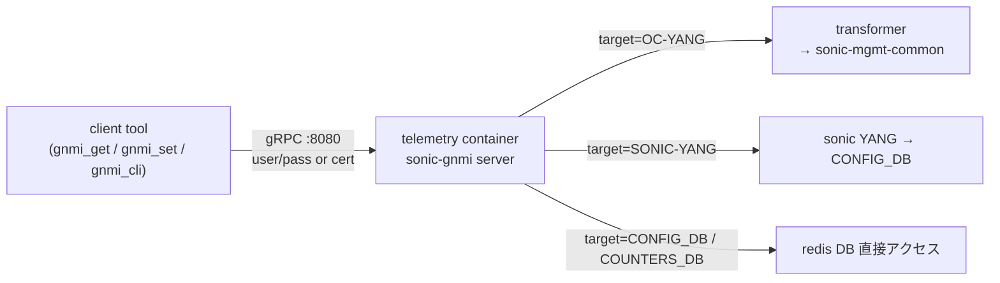
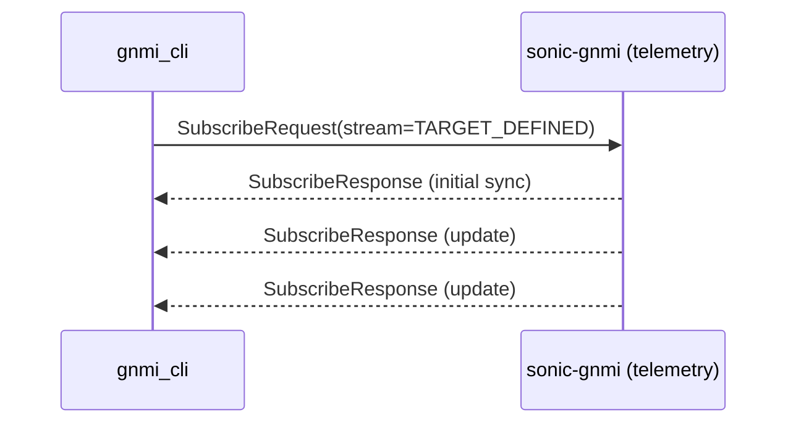

<!-- topics-tip -->
!!! tip "Topics で読み物として読む"
    この HLD は実装詳細を含みます。機能の概念・設定・運用を読み物として読みたい場合は [Topics 10 章: gNMI / OpenConfig / 管理プレーン](../topics/10-gnmi-openconfig/index.md) を参照。
<!-- /topics-tip -->

!!! success "裏取りステータス: Code-verified"
    `sonic-gnmi/patches/gnmi_get.patch` L25 で `pathTarget = flag.String("xpath_target", "", "name of the target for which the path is a member")` を確認（`gnmi_set.patch` / `gnmi_cli.all.patch` も同等）。サーバ側 `sonic-gnmi/gnmi_server/server.go` L975-988 で `target == "OPERATIONAL" / "OTHERS" / "SHOW"` の特殊分岐と `sdc.IsTargetDb(target)` による `CONFIG_DB / COUNTERS_DB` 等 SONiC DB 名分岐を確認。`sonic-gnmi/sonic_data_client/db_client.go` L647 で `COUNTERS_DB` 専用処理を確認 (verified at: 2026-05-09)。

# gNMI クライアントツールの使い方（gnmi_get / gnmi_set / gnmi_cli）

## 概要

[SONiC](../reference/glossary.md#term-sonic) の telemetry コンテナには **3 つの [gNMI](../reference/glossary.md#term-gnmi) クライアントツール** が `/usr/bin` に同梱されており、運用検証や疎通確認に使う[^1]:

- `gnmi_get`: 単一または複数パスの取得（`Get` RPC）
- `gnmi_set`: `update` / `replace` / `delete` 操作（`Set` RPC）
- `gnmi_cli`: `Subscribe` RPC（streaming / polling / once）と `Capabilities` 取得

これらは upstream の [google/gnxi](https://github.com/google/gnxi) と [openconfig/gnmi](https://github.com/openconfig/gnmi) のツールに、SONiC 用の追加機能を載せた **patched 版** である。パッチは `sonic-gnmi/patches/` で管理される[^1]。

ターゲットモデルとして以下を `-xpath_target` で切り替えられる[^1]:

- `OC-YANG`: OpenConfig [YANG](../reference/glossary.md#term-yang) モデル
- `SONIC-YANG`: SONiC 独自 YANG（[CONFIG_DB](../reference/glossary.md#term-config_db) を YANG で抽象化したもの）
- 非 YANG: `CONFIG_DB` / `COUNTERS_DB` などの **redis DB を直接** 参照するモード（YANG なしの raw アクセス）

## 動作仕様

### 全体構成



### 認証

例ではすべて `-insecure -username admin -password sonicadmin` で TLS 無し + Basic 認証を使っている[^1]。本番では証明書ベースの認証を使う想定で、`-insecure` は検証用フラグ。

### Get

OpenConfig YANG パス指定で `Get` する例[^1]:

```bash
gnmi_get -insecure -username admin -password sonicadmin \
  -xpath /openconfig-interfaces:interfaces/interface[name=Ethernet0]/config \
  -target_addr 127.0.0.1:8080 -xpath_target OC-YANG
```

レスポンスは `JSON_IETF` エンコードで返り、`mtu` / `name` / `enabled` / `type` が含まれる[^1]。

### Set

ペイロードは **JSON ファイル** として渡す。`-update <path>:@<file>` の構文を使う[^1]:

```bash
echo '{"mtu": 9108}' > mtu.json
gnmi_set -insecure -username admin -password sonicadmin \
  -update /openconfig-interfaces:interfaces/interface[name=Ethernet0]/config/mtu:@./mtu.json \
  -target_addr localhost:8080 -xpath_target OC-YANG
```

`Set` RPC の戻りは `op: UPDATE`（または `REPLACE` / `DELETE`）と該当パスのみで、内容は返さない[^1]。

### Capabilities

サーバが対応する YANG モデル一覧と encoding を取得する[^1]:

```bash
gnmi_cli -insecure -with_user_pass -capabilities -address 127.0.0.1:8080
```

例の応答には `openconfig-acl 1.0.2` / `openconfig-system-ext 0.10.0` / `openconfig-lacp 1.1.1` / `openconfig-platform 0.12.3` などが並ぶ[^1]。実環境のバージョンは telemetry コンテナのビルド時点に依存する。

### Subscribe

`Subscribe` は streaming / polling / once の 3 種類を `-query_type` と `-streaming_type` で指定する[^1]:

```bash
gnmi_cli -insecure -logtostderr -address 127.0.0.1:8080 \
  -query_type s -streaming_type TARGET_DEFINED \
  -q /openconfig-interfaces:interfaces/interface[name=Ethernet0]/state/oper-status \
  -target OC-YANG -with_user_pass
```

オプション意味[^1]:

- `-query_type s`: streaming (`o` = once, `p` = polling)
- `-streaming_type TARGET_DEFINED`: ターゲット側がモード（ON_CHANGE / SAMPLE）を選ぶ
- `-with_user_pass`: 標準入力から user/pass を促す



## 設定

### 関連する CONFIG_DB

ツール側は CONFIG_DB を **直接読まない**（gNMI 経由）。`-xpath_target CONFIG_DB` を指定した場合、サーバ側で redis から読み出す。telemetry サーバの認証 / 証明書設定 (`TELEMETRY` テーブル等) は本ページのスコープ外。

### 関連する CLI

| Command | 用途 |
|---------|------|
| `gnmi_get` | 単一/複数パスの `Get`。`-xpath` を複数回指定可 |
| `gnmi_set` | `-update` / `-replace` / `-delete` で書き込み・削除 |
| `gnmi_cli` | `Subscribe` (streaming/polling/once) と `Capabilities` |

すべて telemetry コンテナの `/usr/bin` 配下にインストールされる[^1]。

### 関連する YANG

該当 YANG モジュールは特定のものに紐付かない（gNMI 全モデル横断の操作ツール）。

## 制限事項

- **patched 版**: SONiC 用にいくつかの拡張が当たった派生バイナリで、upstream の `google/gnxi` / `openconfig/gnmi` のリリース版とフラグや挙動が一致しない可能性がある[^1]
- **`-insecure` は検証用**: 本番では TLS + 証明書認証を使う想定
- **target 切り替えが必須**: `-xpath_target` 未指定で OC-YANG のパスを叩くと target 解決に失敗する
- **JSON_IETF 固定**: 例はすべて `json_ietf_val`。`json_val` / `proto_val` 等の他 encoding は別途 capabilities の応答に依存

## 干渉する機能

- **gNMI Master Arbitration**: `gnmi_set` を使う場合、サーバが Master Arbitration を有効化していると `MasterArbitration` 拡張なしの `Set` は `PermissionDenied` で落ちる
- **gNMI 認証 / RBAC**: `-username` / `-password` のロールに応じて `Set` 権限が制限される
- **CONFIG_DB / [COUNTERS_DB](../reference/glossary.md#term-counters_db) の [sonic-mgmt](../reference/glossary.md#term-sonic-mgmt)-common 経由アクセス**: `-xpath_target SONIC-YANG` を使うと sonic-mgmt-common の transformer 経路を経由する

## トラブルシューティング

- `Unimplemented` 系エラー: 指定 `-xpath_target` が telemetry サーバで有効化されていない
- `Connection refused`: telemetry コンテナが起動していない／ポート 8080 が他用途
- `Capabilities` の応答にあるモデルバージョンと、クライアントが期待するバージョンが食い違う場合、telemetry コンテナのビルドバージョンを確認

### コマンド例: gNMI 動作確認

下記コマンドで関連する CONFIG_DB / APP_DB / [STATE_DB](../reference/glossary.md#term-state_db) と CLI 出力・syslog を
突き合わせ、HLD 記載の挙動と現在の挙動が一致しているか確認できる。

```bash
# gNMI capabilities / get / subscribe をローカルから確認
gnmic -a 127.0.0.1:8080 --skip-verify capabilities
gnmic -a 127.0.0.1:8080 --skip-verify get --path '/sonic-port:sonic-port/PORT'
docker logs gnmi 2>&1 | tail -30
```

### コマンド例: gNMI 動作確認

下記コマンドで関連する CONFIG_DB / APP_DB / STATE_DB と CLI 出力・syslog を
突き合わせ、HLD 記載の挙動と現在の挙動が一致しているか確認できる。

```bash
# gNMI capabilities / get / subscribe をローカルから確認
gnmic -a 127.0.0.1:8080 --skip-verify capabilities
gnmic -a 127.0.0.1:8080 --skip-verify get --path '/sonic-port:sonic-port/PORT'
docker logs gnmi 2>&1 | tail -30
```


## 引用元

[^1]: `sonic-net/sonic-gnmi` `doc/gNMI_usage_examples.md` @ `eb635b7679b260c3fd0786a6d0734fc8e82c9a22`

<!-- concerns hint:
- patched 版バイナリの差分（gnmi_get/set/cli）の内容
- -xpath_target の有効値リスト（CONFIG_DB / COUNTERS_DB / OC-YANG / SONIC-YANG ほか）
- telemetry コンテナでの実際のインストールパスと bin 名（master 現行）
- sonic-mgmt-common transformer の現行 OpenConfig モデル対応状況
- TLS / 証明書認証経路の標準的な手順（このドキュメントは insecure 例のみ）
-->

<!-- topics-back-ref -->
## 関連 Topics

- [Topics: P4 / PINS / Programmable Pipeline](../topics/18-p4-pins/index.md)

<!-- /topics-back-ref -->

<!-- glossary-links-injected: c3f4e76fa339 -->

<!-- ops-entry -->
## 運用入口

この [HLD](../reference/glossary.md#term-hld) に対応する運用面の入口（CLI / CONFIG_DB / YANG / Runbook）を以下にまとめる。

### 関連 CLI

- `gnmi_get`
- `gnmi_set`
- `gnmi_cli`

### 関連 Runbook

- [gnmi-subscribe-disconnect](../reference/runbooks/gnmi-subscribe-disconnect.md)

<!-- /ops-entry -->

<!-- glossary-links-injected: 8ba32e5aa69d -->
