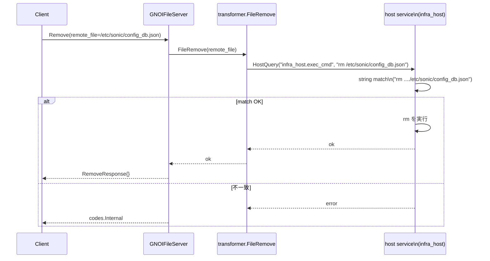
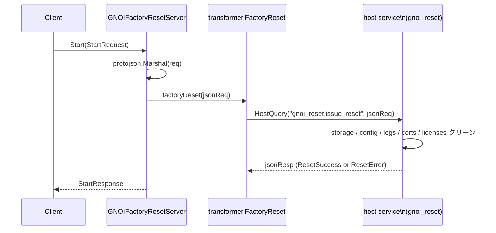

!!! warning "裏取りステータス: HLD-only"
    本ページは公式 HLD（Rev 0.1, 2025-01）のみを根拠に書かれている。`infra_host` / `gnoi_reset` ホストサービスモジュールの実装、`gnoi_client` CLI、`config_db.json` のみを許す string match の取り扱いは未確認。

# gNOI File.Remove と FactoryReset.Start（gNMI/UMF + DBUS host service）

## 概要

gNOI（gRPC Network Operations Interface）は CLI の代替として **gRPC マイクロサービスで運用コマンドを実行** するための仕様で、protobuf 定義は [openconfig/gnoi](https://github.com/openconfig/gnoi) にある。SONiC では gNMI/telemetry サーバ（UMF: Unified Management Framework）が gNOI も同じ TCP ポート（標準 9339）で受け、認証認可後にバックエンドへ振り分ける[^1]。

本 HLD はそのうち以下 2 つの RPC を SONiC に追加する設計を定める[^1]:

- `gnoi.file.File.Remove`: target のファイルを削除（**現状は `config_db.json` 限定**）
- `gnoi.factory_reset.FactoryReset.Start`: 工場出荷状態に戻す

バックエンドは host service（python ベース、プラグイン構成）に対し DBUS で要求を投げる形を取る。詳細は [SONiC GNMI Server Interface Design](https://github.com/sonic-net/SONiC/blob/master/doc/mgmt/gnmi/SONiC_GNMI_Server_Interface_Design.md) と [Docker to Host communication](https://github.com/sonic-net/SONiC/blob/master/doc/mgmt/Docker%20to%20Host%20communication.md) を参照[^1]。

## 動作仕様

### 全体構成

```mermaid
flowchart LR
    CL[gNOI client] -->|gRPC :9339\nauthn/authz| UMF[gNMI/UMF サーバ\n(telemetry container)]
    UMF -->|FE: protobuf 受領| FE[GNOI*Server]
    FE -->|JSON / 文字列| TR[transformer\nFileRemove / FactoryReset]
    TR -->|HostQuery| DBUS[(DBUS)]
    DBUS --> HS[SONiC Host Service\n(host process, plugin: infra_host / gnoi_reset)]
    HS -->|exec_cmd / issue_reset| OS[Linux host]
```

要点:

- gNOI と gNMI は **同じ TCP ポート 9339** で受ける[^1]
- container（telemetry）から host への到達手段として DBUS + host service を使う
- 危険な操作（factory reset / ファイル削除）はホスト側で実行する

### gNOI File.Remove

protobuf（[openconfig/gnoi/file](https://github.com/openconfig/gnoi/blob/main/file/file.proto)）:

```proto
service File {
  rpc Remove(RemoveRequest) returns (RemoveResponse) {}
}
message RemoveRequest { string remote_file = 1; }
message RemoveResponse {}
```

SONiC 実装の特徴[^1]:

- **`config_db.json` のみ削除可**。host service backend で `rm ..../etc/sonic/config_db.json` の文字列マッチで検証し、それ以外は失敗させる
- フロントエンド（gNMI UMF サーバの `GNOIFileServer.Remove`）は `transformer.FileRemove(req.GetRemoteFile())` を呼ぶ
- `transformer.FileRemove` 内では `HostQuery("infra_host.exec_cmd", "rm "+remoteFile)` で host service に DBUS でコマンドを投げる
- `fileMu` ロックで同時実行を抑制



> 注: 「`config_db.json` 以外を削除させない」を **string match** で守るのは脆弱な実装に見える。実コード上で正規表現や allow list がどうなっているか要検証。

### gNOI FactoryReset.Start

protobuf（[openconfig/gnoi/factory_reset](https://github.com/openconfig/gnoi/blob/main/factory_reset/factory_reset.proto)）抜粋:

```proto
message StartRequest {
  bool factory_os = 1;   // OS を出荷時イメージにロールバック
  bool zero_fill = 2;    // 永続ストレージをゼロ埋め
  bool retain_certs = 3; // 証明書を保持
}
message StartResponse {
  oneof response {
    ResetSuccess reset_success = 1;
    ResetError   reset_error   = 2;
  }
}
```

`Start` の意味は強烈で、**storage / configuration / logs / certificates / licenses を全消去** し、出荷状態で再起動する[^1]。`retain_certs` だけ証明書を残すなど例外を許す。

#### 実装フロー



ポイント[^1]:

- フロントエンドはリクエストを **JSON シリアライズ** してホスト側へ渡す
- バックエンドも JSON で応答を返す
- `resetMu` ロックで同時実行を抑制
- フラグが指定されたが未対応の場合、`INVALID_ARGUMENT` + `ResetError` で返す（gNOI 仕様準拠）

<!-- evidence:
source: sonic-net/SONiC/doc/mgmt/gnmi/gnoi_file_factory_reset_hld.md#L154-L176 (sha: 49bab5b5ff0e924f1ea52b3d9db0dfa4191a7c06)
excerpt: |
  The front end implementation marshals the request, and sends it to the sonic-host-service via the host module `gnoi_reset`.
  The back end is expected to return the response in JSON format.
  ...
  func FactoryReset(reqStr string) (string, error) {
      resetMu.Lock()
      defer resetMu.Unlock()
      return checkQueryOutput(HostQuery("gnoi_reset.issue_reset", reqStr))
  }
reasoning: 「FE が JSON 化して DBUS 経由 gnoi_reset.issue_reset に渡す + ロック」という実装ルールの根拠。
-->

### SAI / Warmboot / Fastboot

- SAI API の変更なし[^1]
- Warmboot / Fastboot への影響なし[^1]

## 設定

### 関連する CONFIG_DB

専用 CONFIG_DB スキーマは無い。gNMI 認証認可・証明書配置などの既存の telemetry 経路を再利用する。

### 関連する CLI

| Command | 用途 |
|---------|------|
| `gnoi_client ...` | UMF が提供する gNOI 呼び出し用クライアント。JSON / proto いずれの形式もサポート予定[^1] |

UMF 同梱の `gnoi_client` はテスト・運用検証向け。`go-grpc` ベースの汎用 gNOI クライアントでも当然呼べる。

### 関連する YANG

該当 YANG モジュールは HLD で言及されていない。

### 設定例（呼び出しイメージ）

```bash
# config_db.json 削除（target が許可した場合）
gnoi_client file remove --remote_file /etc/sonic/config_db.json

# factory reset（証明書だけ残す）
gnoi_client factory_reset start \
  --factory_os=false --zero_fill=false --retain_certs=true
```

## 制限事項

- `File.Remove` は **`/etc/sonic/config_db.json` 限定**。それ以外のパスは host service が拒否する[^1]
- `File.Remove` の path 検証が **string match** ベースなのは表現として脆い。`../` 系の path traversal で抜けないか実装で要確認
- `FactoryReset.Start` は **デバイス上の状態を破壊する重操作**。誤実行防止のために認可ロールを最小限に絞る運用が必須
- 各種フラグ（`factory_os`, `zero_fill`, `retain_certs`）の **対応状況はベンダ依存**。未対応の場合 `INVALID_ARGUMENT` で返す[^1]
- 同時実行は `fileMu` / `resetMu` で防がれる

## 干渉する機能

- **gNMI / telemetry**: 同じ 9339 ポート・同じ認証経路。証明書設定や RBAC が共通
- **SONiC Host Service / DBUS**: docker → host 通信の汎用機構を共有[^1]
- **`config save` / `config reload`**: `config_db.json` 削除直後の挙動（再生成・初期化）と整合させる必要
- **証明書管理（gNMI 用）**: `retain_certs=true` のとき残るのは何か（gNMI 用の `/etc/sonic/telemetry/...` を含むか）が運用上の要点

## トラブルシューティング

- `Remove` が `INTERNAL` で失敗する場合、host service ログで `infra_host.exec_cmd` の string match 結果を確認
- `FactoryReset` が `INVALID_ARGUMENT` で返る場合、未対応フラグ（`zero_fill` 等）が指定されていないか確認
- DBUS 経由の host service が応答しない場合、`SONiC Host Service` が host で動いているかと、container ↔ host の DBUS proxy 設定を確認

## 引用元

[^1]: `sonic-net/SONiC` `doc/mgmt/gnmi/gnoi_file_factory_reset_hld.md` @ `49bab5b5ff0e924f1ea52b3d9db0dfa4191a7c06`

<!-- concerns hint:
- File.Remove の path 検証実装 (string match か allow list か)
- gnoi_reset.issue_reset の host service 実装
- gnoi_client CLI の sonic-mgmt-common / sonic-utilities への取り込み
- factory_os / zero_fill / retain_certs フラグのベンダ実装状況
- 認証認可 (RBAC) と factory reset 権限の分離
- HLD 後の他 gNOI RPC (System / OS) 拡張との関係
-->
