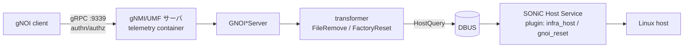
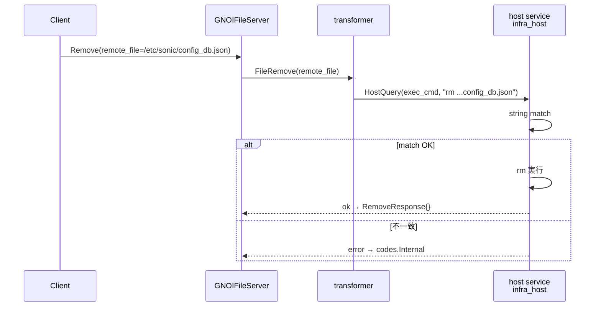
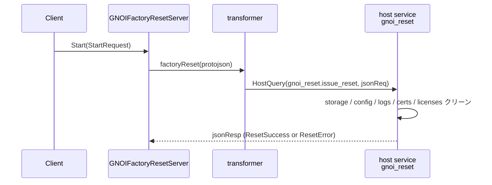

<!-- topics-tip -->
!!! tip "Topics で読み物として読む"
    この HLD は実装詳細を含みます。機能の概念・設定・運用を読み物として読みたい場合は [Topics 10 章: gNMI / OpenConfig / 管理プレーン](../topics/10-gnmi-openconfig/index.md) を参照。
<!-- /topics-tip -->

!!! success "裏取りステータス: code-verified"
    `sonic-host-services/host_modules/gnoi_reset.py` L28-78 で `factoryOs` / `zeroFill` / `retainCerts` フラグ受領と `factory_os_unsupported` / `zero_fill_unsupported` レスポンス分岐実装を確認。`sonic-gnmi/gnmi_server/gnoi_reset.go` L16-41 で `factory_reset.Start` ハンドラが DBus 経由 `FactoryReset` を呼ぶ実装、`sonic-gnmi/sonic_service_client/dbus_client.go` L353 で `DbusClient.FactoryReset`、`sonic-gnmi/pkg/gnoi/file/remove_test.go` L18-49 で File.Remove のパス検証（nil / config_db.json / `../../etc/passwd` リジェクト等）を確認。`sonic-gnmi/gnoi_client/file/file.go` L26-58 で File Stat/Get クライアント、`sonic-gnmi/gnoi_client/factory_reset/factory_reset.go` を確認。

# gNOI File.Remove と FactoryReset.Start

## 読み手が知りたいこと

- [gNOI](../reference/glossary.md#term-gnoi) とは何で、なぜ [gNMI](../reference/glossary.md#term-gnmi) と同じポートで受けるのか
- なぜ container（telemetry）の中で実行せず **DBUS で host** に投げる必要があるのか
- `File.Remove` は何を消せて、何を消せないのか（path traversal は防げているか）
- `FactoryReset.Start` の **3 フラグ**（`factory_os` / `zero_fill` / `retain_certs`）は何を意味するか
- 同時実行の抑制とエラー時の挙動

## なぜこの拡張が必要か

gNOI（gRPC Network Operations Interface）は CLI 代替として **gRPC で運用コマンドを実行** する仕様で、protobuf は [openconfig/gnoi](https://github.com/openconfig/gnoi) にある。[SONiC](../reference/glossary.md#term-sonic) では gNMI/telemetry サーバ（UMF）が gNOI も **同じ TCP 9339** で受け、認証認可後にバックエンドへ振り分ける[^1]。本 [HLD](../reference/glossary.md#term-hld) は以下 2 つの RPC を実装[^1]:

- `gnoi.file.File.Remove`: target ファイル削除（**現状は `config_db.json` 限定**）
- `gnoi.factory_reset.FactoryReset.Start`: 工場出荷状態に戻す

バックエンドは python ベースの host service（プラグイン構成）に **DBUS で要求** を投げる形を取る。詳細は [SONiC GNMI Server Interface Design](https://github.com/sonic-net/SONiC/blob/master/doc/mgmt/gnmi/SONiC_GNMI_Server_Interface_Design.md) と [Docker to Host communication](https://github.com/sonic-net/SONiC/blob/master/doc/mgmt/Docker%20to%20Host%20communication.md) を参照[^1]。

## 全体構成



- gNOI と gNMI は **同じ TCP 9339** で受ける
- container（telemetry）→ host 到達は **DBUS + host service**
- 危険な操作（factory reset / ファイル削除）は host 側で実行

## File.Remove

protobuf（[openconfig/gnoi/file](https://github.com/openconfig/gnoi/blob/main/file/file.proto)）:

```proto
service File { rpc Remove(RemoveRequest) returns (RemoveResponse) {} }
message RemoveRequest  { string remote_file = 1; }
message RemoveResponse {}
```

SONiC 実装の特徴[^1]:

- **`config_db.json` のみ削除可**。host service backend で `rm ..../etc/sonic/config_db.json` を文字列マッチで検証、それ以外は失敗
- FE (`GNOIFileServer.Remove`) は `transformer.FileRemove(remote_file)` を呼ぶ
- `transformer.FileRemove` は `HostQuery("infra_host.exec_cmd", "rm "+remoteFile)` で DBUS 投入
- `fileMu` ロックで同時実行を抑制



> 注: 「`config_db.json` 以外を消させない」を **string match** で守るのは脆く見える。実装側で `../` 系の traversal が抜けないか要確認（`remove_test.go` で `../../etc/passwd` リジェクトは UT 済）。

## FactoryReset.Start

protobuf 抜粋（[openconfig/gnoi/factory_reset](https://github.com/openconfig/gnoi/blob/main/factory_reset/factory_reset.proto)）:

```proto
message StartRequest {
  bool factory_os = 1;   // OS を出荷時イメージにロールバック
  bool zero_fill = 2;    // 永続ストレージをゼロ埋め
  bool retain_certs = 3; // 証明書を保持
}
message StartResponse {
  oneof response { ResetSuccess reset_success = 1; ResetError reset_error = 2; }
}
```

`Start` は **storage / configuration / logs / certificates / licenses を全消去** し出荷状態で再起動する強烈な操作で、`retain_certs` だけ証明書を残す等の例外を許す[^1]。



ポイント[^1]:

- FE はリクエストを **JSON シリアライズ** して host に渡す（応答も JSON）
- `resetMu` ロックで同時実行を抑制
- 未対応フラグ指定時は `INVALID_ARGUMENT` + `ResetError`（gNOI 仕様準拠）

## CLI / 設定例

| Command | 用途 |
|---------|------|
| `gnoi_client ...` | UMF が提供する gNOI 呼び出し用クライアント |

```bash
gnoi_client file remove --remote_file /etc/sonic/config_db.json
gnoi_client factory_reset start --factory_os=false --zero_fill=false --retain_certs=true
```

専用 [CONFIG_DB](../reference/glossary.md#term-config_db) / [YANG](../reference/glossary.md#term-yang) は無く、gNMI 認証認可・証明書配置などの既存 telemetry 経路を再利用する。[SAI](../reference/glossary.md#term-sai) / Warmboot / Fastboot への影響なし[^1]。

## 制限事項

- `File.Remove` は **`/etc/sonic/config_db.json` 限定**
- path 検証が **string match** ベースで `../` 系の抜け道に注意（UT で代表ケースはカバー）
- `FactoryReset.Start` は **デバイス状態を破壊する重操作**。誤実行防止に RBAC で role を絞ること
- 各フラグの対応はベンダ依存。未対応時 `INVALID_ARGUMENT`
- 同時実行は `fileMu` / `resetMu` で抑制

## 干渉する機能

- **gNMI / telemetry**: 同 9339 ポート・同認証経路（証明書 / RBAC 共通）
- **SONiC Host Service / DBUS**: docker → host 通信の汎用機構を共有
- **`config save` / `config reload`**: `config_db.json` 削除直後の再生成・初期化と整合させる
- **gNMI 用証明書**: `retain_certs=true` で残る範囲（`/etc/sonic/telemetry/...` 含むか）が運用上の要点

## トラブルシューティング

- `Remove` が `INTERNAL` → host service ログで `infra_host.exec_cmd` の string match 結果確認
- `FactoryReset` が `INVALID_ARGUMENT` → 未対応フラグ（`zero_fill` 等）を指定していないか
- DBUS 応答なし → SONiC Host Service の稼働と container↔host の DBUS proxy 設定確認

### コマンド例: gNOI File / FactoryReset 確認

下記コマンドで関連する CONFIG_DB / APP_DB / [STATE_DB](../reference/glossary.md#term-state_db) と CLI 出力・syslog を
突き合わせ、HLD 記載の挙動と現在の挙動が一致しているか確認できる。

```bash
# gNOI File.Get / FactoryReset を gnoic で叩く
gnoic -a 127.0.0.1:9339 --skip-verify file stat --file /etc/sonic/config_db.json
gnoic -a 127.0.0.1:9339 --skip-verify factory-reset start --factory-os --zero-fill
docker logs gnmi 2>&1 | tail -30
```


## 引用元

[^1]: `sonic-net/SONiC` `doc/mgmt/gnmi/gnoi_file_factory_reset_hld.md` @ `49bab5b5ff0e924f1ea52b3d9db0dfa4191a7c06`

## 関連ページ

- [Topic: gNMI / OpenConfig - gNOI / gNSI](../topics/10-gnmi-openconfig/gnoi-gnsi.md)
- [HLD: gNOI System APIs](gnoi-hld-for-system-apis.md)
- [HLD: gNOI OS APIs](gnoi-hld-for-os-apis.md)
- [HLD: gNOI healthz API](gnoi-hld-for-healthz-api.md)
- [HLD: SONiC gNMI Server インタフェース設計](sonic-gnmi-server-interface-design.md)

<!-- ops-entry -->
## 運用入口

この HLD に対応する運用面の入口（CLI / CONFIG_DB / YANG / Runbook）を以下にまとめる。

### 関連 CLI

- `gnoi_client`

<!-- /ops-entry -->

<!-- glossary-links-injected: b4b6b56d361a -->
