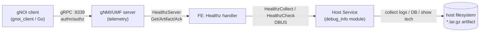
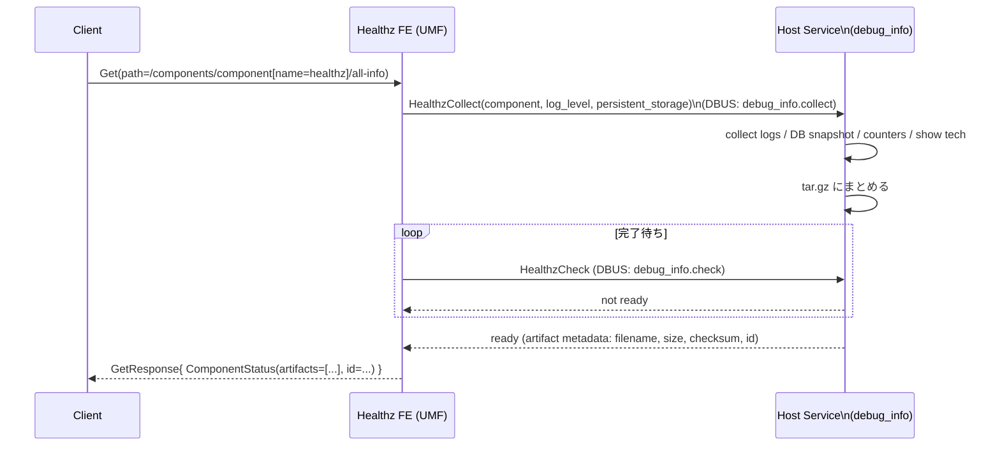

<!-- topics-tip -->
!!! tip "Topics で読み物として読む"
    この HLD は実装詳細を含みます。機能の概念・設定・運用を読み物として読みたい場合は [Topics 10 章: gNMI / OpenConfig / 管理プレーン](../topics/10-gnmi-openconfig/index.md) を参照。
<!-- /topics-tip -->

!!! success "裏取りステータス: Code-verified"
    `sonic-gnmi/gnmi_server/gnoi_healthz.go` L25-29 で `ddComponentAll = "all"` / `ddLogLvlAlert = "alert"` / `ddLogLvlCritical = "critical"` / `ddLogLvlAll = "all"` を定義、L39 `isDebugData(p)` / L91 `getDebugData(p)` / L191 `Get RPC` でパス解釈を確認。`sonic-host-services/host_modules/debug_info.py` L47 `class DebugArtifactCollector` の `collect_artifacts` / `_collect_counter_artifacts` / `_collect_teamdctl_data` / `_collect_host_files` 実装、`sonic-gnmi/sonic_service_client/dbus_client.go` の `HealthzClient` DBUS 経路、`gnoi_client/healthz/healthz.go` と `gnoi_client.go` L89-100 で `Get` / `Artifact` / `Acknowledge` / `List` / `Check` サブコマンドを確認（verified at: 2026-05-09）。

# gNOI Healthz API（Get / Acknowledge / Artifact + DBUS host service）

## 概要

[gNOI](../reference/glossary.md#term-gnoi) Healthz は **コンポーネント単位のヘルスチェック結果と関連アーティファクト（log / DB snapshot / show tech 出力等）を gRPC 経由で取得する** ためのサービスである[^1]。OpenConfig の `components` モデルと連携し、telemetry で「unhealthy」を検知したコンポーネントの追加調査を行う想定。

[SONiC](../reference/glossary.md#term-sonic) では既存の [gNMI](../reference/glossary.md#term-gnmi)/UMF サーバ（telemetry コンテナ、TCP 9339）に gNOI Healthz をマウントし、バックエンドの artifact 収集は **SONiC Host Service** の `debug_info` モジュールに DBUS 経由で委譲する[^1]。

本 [HLD](../reference/glossary.md#term-hld) は OpenConfig [`Healthz` proto](https://github.com/openconfig/gnoi/blob/main/healthz/healthz.proto) のうち以下 3 つの RPC を **初期サポート対象** と定める[^1]:

- `Get`: 指定 path のヘルス event 一覧（`ComponentStatus`）を返す
- `Artifact`: event に紐付いた artifact ファイル/proto を **stream** で返す
- `Acknowledge`: event を ack し、以降の `Get` に出さない

`Check` と `List` は初期サポート対象外[^1]。

## 動作仕様

### 全体構成



要点[^1]:

- gNOI と gNMI は **同じ TCP 9339** を共有
- artifact 収集は host 側で実施（container 越境）
- `*.tar.gz` 形式で host のディレクトリに固める。DBUS 越しに container にストリームで返す

### Healthz.Get の流れ

`GetRequest` は対象 component の path（例: `/components/component[name=healthz]/all-info`）。FE は path をログレベル（`alert-info` / `critical-info` / `all-info`）に解釈し、host 側に収集を依頼する[^1]。



サポートされる Get path[^1]:

- `/components/component[name=healthz]/alert-info`
- `/components/component[name=healthz]/critical-info`
- `/components/component[name=healthz]/all-info`

### Healthz.Artifact

`Get` で返ってきた `ArtifactHeader.id` を指定して **streaming** で取得する[^1]。応答は `oneof`:

- `header`: artifact メタ（`FileArtifactType` / `ProtoArtifactType` / `custom`）
- `bytes`: ファイル本体のチャンク
- `proto`: proto アーティファクトの場合
- `trailer`: 終端

```proto
message FileArtifactType {
  string name = 1; string path = 2; string mimetype = 3;
  int64 size = 4; gnoi.types.HashType hash = 5;
}
```

FE は host 上の `*.tar.gz` を読みつつ chunk で返す[^1]。

### Healthz.Acknowledge

`AcknowledgeRequest{path, id}` で event を ack。host service は対応する artifact を削除し、`Get` の結果から除外する。**冪等**[^1]。

ack されていない event でも、リソース管理のために device 側が GC してよい。逆に「再起動を跨いでも保持」が期待されるが、resource 不足時はその限りでない[^1]。

<!-- evidence:
source: sonic-net/SONiC/doc/mgmt/gnmi/gnoi_healthz_hld.md#L181-L186 (sha: 49bab5b5ff0e924f1ea52b3d9db0dfa4191a7c06)
excerpt: |
  1. The Get RPC handler translates the incoming gNMI Path in the Get request to the correct component...
  2. For the above supported paths, a call to HealthzCollect is made through the DBUS client with the component name, log level, and a persistent_storage flag...
  3. The host service module debug_info.collect collects all the artifacts...
  4. In. the meantime, the frontend keeps polling for the artifact to be ready with a call to HealthzCheck through the DBUS client debug_info.check.
  5. Once the artifact tar file is ready, the artifact details (filename, size, checksum) with the unique ID string are sent in the Get response back to the client.
reasoning: collect → poll → ready の DBUS 経路と persistent_storage フラグの存在の根拠。
-->

<!-- evidence-rendered:start -->
??? note "📋 検証エビデンス: sonic-net/SONiC/doc/mgmt/gnmi/gnoi_healthz_hld.md#L181-L186 (sha: 49bab5b5ff0e924f1ea52b3d9db0dfa4191a7c06)"

    **出典**:

    `sonic-net/SONiC/doc/mgmt/gnmi/gnoi_healthz_hld.md#L181-L186 (sha: 49bab5b5ff0e924f1ea52b3d9db0dfa4191a7c06)`

    **抜粋**:

    ```text
    1. The Get RPC handler translates the incoming gNMI Path in the Get request to the correct component...
    2. For the above supported paths, a call to HealthzCollect is made through the DBUS client with the component name, log level, and a persistent_storage flag...
    3. The host service module debug_info.collect collects all the artifacts...
    4. In. the meantime, the frontend keeps polling for the artifact to be ready with a call to HealthzCheck through the DBUS client debug_info.check.
    5. Once the artifact tar file is ready, the artifact details (filename, size, checksum) with the unique ID string are sent in the Get response back to the client.
    ```

    **判断根拠**: collect → poll → ready の DBUS 経路と persistent_storage フラグの存在の根拠。

<!-- evidence-rendered:end -->

### コンポーネントステータスのデータモデル

`ComponentStatus`（HLD と OpenConfig 共通）[^1]:

| フィールド | 内容 |
|----------|------|
| `path` | 対象 sub-component の gNMI path |
| `subcomponents` | 集約される子 status |
| `status` | unhealthy / healthy 等 |
| `artifacts` | `ArtifactHeader[]`、`Artifact` RPC の入力 ID 元 |
| `id` | event の一意キー |
| `acknowledged` | ack 状態 |
| `created` / `expires` | 作成・GC 予定時刻 |
| `healthz` (deprecated) | 任意の vendor 定義 proto |

ベンダ固有のヘルス情報は `Any` に詰める想定で、フォーマットは vendor 任せ[^1]。

## 設定

### 関連する CONFIG_DB

専用 [CONFIG_DB](../reference/glossary.md#term-config_db) スキーマは無い。telemetry の認証認可（`TELEMETRY` 等）と RBAC 設定を再利用する。

### 関連する CLI

| Command | 用途 |
|---------|------|
| `gnoi_client healthz get ...` | `Healthz.Get` 呼び出し（JSON / proto 形式対応予定）[^1] |
| `gnoi_client healthz artifact ...` | `Healthz.Artifact` 呼び出し |
| `gnoi_client healthz acknowledge ...` | `Healthz.Acknowledge` 呼び出し |

### 関連する YANG

OpenConfig `components` モデルが対応する想定。SONiC [YANG](../reference/glossary.md#term-yang) 拡張は HLD で言及無し。

### 設定例

```bash
# all-info の health event 取得
gnoi_client healthz get \
  --path /components/component[name=healthz]/all-info

# 取れた artifact id でファイル取得
gnoi_client healthz artifact --id <event-id> > artifact.tar.gz

# event ack
gnoi_client healthz acknowledge \
  --path /components/component[name=healthz]/all-info --id <event-id>
```

## 制限事項

- 初期サポートは `Get` / `Artifact` / `Acknowledge` のみ。**`Check` / `List` は対象外**[^1]
- artifact フォーマットは **`*.tar.gz` ファイル前提**。proto 形式での artifact ストリームは初期実装の想定外
- Get path は `/components/component[name=healthz]/{alert,critical,all}-info` の **3 種固定**[^1]
- artifact GC は device 任せ。永続化は努力義務であり、ack されていない artifact も resource 管理上 GC され得る[^1]
- vendor 固有の healthz データ（`Any` proto）の取り扱いは vendor 実装依存

## 干渉する機能

- **gNMI Master Arbitration**: Healthz は `Set` ではないため Master Arbitration の対象外
- **OpenConfig `components` モデル**: telemetry stream で送られる `oper-status` などと連動する想定
- **show tech-support**: Healthz は内部で `show tech` 相当のスナップショットを取り得る。CLI 起動と並行実行した場合の負荷干渉に注意
- **SONiC Host Service / DBUS**: `gnoi_file` / `gnoi_reset` 等の他 gNOI host service モジュールと同じ DBUS 経路を共有

## トラブルシューティング

- `Get` がタイムアウト: `debug_info.collect` の `*.tar.gz` 生成が長引いている可能性。host service ログを確認
- `Artifact` がストリーム途中で切れる: gRPC max message size と DBUS chunk サイズの不整合
- `Acknowledge` が冪等にならない: host service 側の id 管理（GC 順序）を確認

### コマンド例: gNOI Healthz 確認

下記コマンドで関連する CONFIG_DB / APP_DB / [STATE_DB](../reference/glossary.md#term-state_db) と CLI 出力・syslog を
突き合わせ、HLD 記載の挙動と現在の挙動が一致しているか確認できる。

```bash
# Healthz API でサブシステム状態取得
gnoic -a 127.0.0.1:8080 --skip-verify healthz get --path '/components/component[name=PSU1]'
redis-cli -n 6 hgetall 'PSU_INFO|PSU 1'
docker logs gnmi 2>&1 | tail -30
```

### コマンド例: gNOI Healthz 確認

下記コマンドで関連する CONFIG_DB / APP_DB / STATE_DB と CLI 出力・syslog を
突き合わせ、HLD 記載の挙動と現在の挙動が一致しているか確認できる。

```bash
# Healthz API でサブシステム状態取得
gnoic -a 127.0.0.1:8080 --skip-verify healthz get --path '/components/component[name=PSU1]'
redis-cli -n 6 hgetall 'PSU_INFO|PSU 1'
docker logs gnmi 2>&1 | tail -30
```

## 参考リンク

- [Topics: gNMI / OpenConfig](../topics/10-gnmi-openconfig/index.md)
- [CLI: show system-health](../reference/cli/show-system-health.md)
- [HLD: gnoi-hld-for-system-apis](gnoi-hld-for-system-apis.md)

## 引用元

[^1]: `sonic-net/SONiC` `doc/mgmt/gnmi/gnoi_healthz_hld.md` @ `49bab5b5ff0e924f1ea52b3d9db0dfa4191a7c06`

<!-- concerns hint:
- UMF Healthz FE 実装存在確認 (sonic-gnmi telemetry)
- host service の debug_info.collect / debug_info.check モジュール実装確認
- 3 つのサポートパス (alert-info / critical-info / all-info) の解釈実装確認
- gnoi_client CLI への healthz サブコマンド追加状況
- artifact GC ポリシーの現行実装
- HLD 2025-06 v0.1 と現行 master の差分有無
-->

## 参考リンク

本ページに関連する参照ドキュメント:

- [`TELEMETRY` CONFIG_DB スキーマ](../reference/config-db/telemetry.md)
- [management カテゴリ目次](index.md)
- [用語集 (Glossary)](../reference/glossary.md)

<!-- augmented-links: v1 -->

<!-- glossary-links-injected: c671e32e187d -->

<!-- ops-entry -->
## 運用入口

この HLD に対応する運用面の入口（CLI / CONFIG_DB / YANG / Runbook）を以下にまとめる。

### 関連 CLI

- `gnoi_client`

<!-- /ops-entry -->

<!-- glossary-links-injected: 8ba32e5aa69d -->
