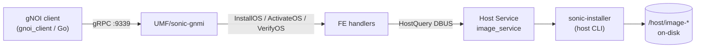
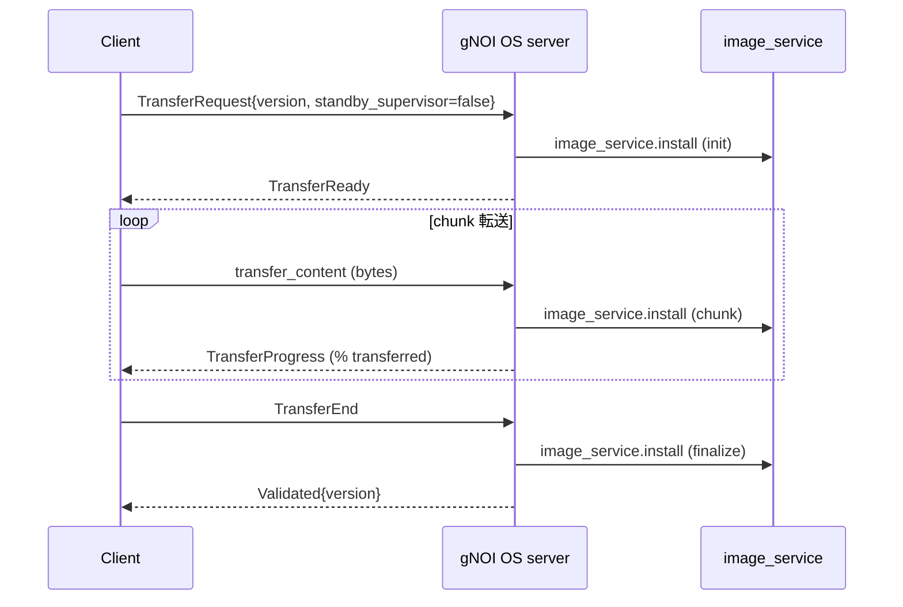

<!-- topics-tip -->
!!! tip "Topics で読み物として読む"
    この HLD は実装詳細を含む。機能の概念・設定・運用を読み物として読みたい場合は [Topics 10 章: gNMI / OpenConfig / 管理プレーン](../topics/10-gnmi-openconfig/index.md) を参照。
<!-- /topics-tip -->

!!! success "裏取りステータス: code-verified"
    `sonic-gnmi/gnmi_server/gnoi_os.go` L25-441 で `OSServer.processTransferReq` / `processTransferEnd` / `Activate` / `Verify` のサーバ実装を確認。`sonic-gnmi/gnoi_client/os/os.go` L20-72 で OS Verify / Activate / Install のクライアント実装を、`sonic-gnmi/gnoi_client/gnoi_client.go` L73-77 で `--module OS --rpc {Verify,Activate,Install}` ディスパッチを確認。`sonic-host-services/host_modules/image_service.py` L81-99 で DBUS の `install` メソッド（`/usr/local/bin/sonic-installer install -y` 呼び出し）と L165 `set_next_boot` 実装を確認（verified at: 2026-05-09）。HostModule 側の gNOI 統合（L229-251 `installos`）は現行 master では `ERROR_UNIMPLEMENTED` だが、別経路の `OSServer` （sonic-gnmi 側）で機能する。

# gNOI OS API（Install / Activate / Verify と sonic-installer 連携）

## 概要

[gNOI](../reference/glossary.md#term-gnoi) OS は **スイッチの OS イメージを gRPC ストリームで配布・有効化・検証する** ための API である[^1]。3 つの RPC で構成される:

- `Install`: イメージを target へ **streaming** で転送（クライアント・サーバ双方向 stream）
- `Activate`: 転送済みのバージョンを **次回起動イメージとして設定**（オプションで即時 reboot）
- `Verify`: 現行稼働中のバージョンを返す。デュアル SUP 構成では standby 側のステータスも返す

[SONiC](../reference/glossary.md#term-sonic) では既存の [gNMI](../reference/glossary.md#term-gnmi)/UMF サーバ（telemetry, TCP 9339）に gNOI をマウントし、バックエンドは **SONiC Host Service** の `image_service` モジュール（python、`sonic-installer` を内部呼び出し）を DBUS 経由で叩く[^1][^2]。

## 動作仕様

### 全体構成



DBUS エンドポイント[^1]:

```go
// FE 側 (UMF)
func InstallOS(reqStr string)  (string, error) { return HostQuery("image_service.install",  reqStr) }
func ActivateOS(reqStr string) (string, error) { return HostQuery("image_service.activate", reqStr) }
func VerifyOS(reqStr string)   (string, error) { return HostQuery("image_service.verify",   reqStr) }
```

`image_service` モジュールは [sonic-host-services/host_modules/image_service.py](https://github.com/sonic-net/sonic-host-services/blob/master/host_modules/image_service.py) に既存。[HLD](../reference/glossary.md#term-hld) はこれを **OS 操作の集約点として再利用** する方針[^1][^2]。

### Install RPC（双方向 stream）

`gnoi.os.OS.Install` は **client streaming + server streaming** で、`InstallRequest` の oneof で 3 段階のメッセージを送る[^1]。



要点[^1]:

- 同じ target に対して **同時 Install は禁止**（プロトコルレベルで担保）
- standby supervisor 側は `standby_supervisor=true` で `TransferRequest` を送ると、target が **primary から standby へ image を sync** する。応答は `SyncProgress` で `percentage_transferred` を返し、最後に `Validated` を返す
- `Validated.version` は `TransferRequest.version` と一致する想定

### Activate RPC

```proto
ActivateRequest {
  string version = 1;
  bool   no_reboot = 2;
  bool   standby_supervisor = 3;
}
```

挙動[^1]:

- 指定 `version` を **次回起動イメージ** として設定
- `no_reboot=false` なら即座に reboot。デュアル SUP では `standby_supervisor` を分けて呼ぶ運用
- 起動失敗時は **直前の OS にロールバック**（gNOI 仕様）

デュアル SUP の推奨フロー[^1]:

1. primary に Install → Activate(`no_reboot=true`)
2. standby に Install (`standby_supervisor=true`、image sync 待ち) → Activate(`no_reboot=true, standby_supervisor=true`)
3. **`gnoi.system.Reboot`** で reboot
4. `Verify` で primary / `verify_standby` の version を確認

### Verify RPC

`VerifyRequest` は空。`VerifyResponse` に現行 version と、デュアル SUP の場合は `verify_standby`（`StandbyState UNAVAILABLE` 等）を返す[^1]。

reboot 中は gRPC `UNAVAILABLE` が返り、クライアントは **reachable になるまでリトライ** する想定[^1]。

### 設定検証フロー（推奨）

OS 更新後の sanity check として HLD は次を推奨[^1]:

1. `gNMI.Set(replace, ...)` でテスト構成を push
2. `gNMI.Get` で読み戻し
3. push 内容と一致しなければ失敗扱い

<!-- evidence:
source: sonic-net/SONiC/doc/mgmt/gnmi/gnoi_os_hld.md#L161-L180 (sha: 49bab5b5ff0e924f1ea52b3d9db0dfa4191a7c06)
excerpt: |
  There is an existing interface to sonic-installer ... host_modules/image_service.py which can be used to consolidate all OS operations in one place.
  func ActivateOS / VerifyOS / InstallOS ... HostQuery("image_service.activate"|"image_service.verify"|"image_service.install", reqStr)
reasoning: 3 RPC が image_service の 3 DBUS endpoint に 1:1 対応する根拠。
-->

<!-- evidence-rendered:start -->
??? note "📋 検証エビデンス: sonic-net/SONiC/doc/mgmt/gnmi/gnoi_os_hld.md#L161-L180 (sha: 49bab5b5ff0e924f1ea52b3d9db0dfa4191a7c06)"

    **出典**:

    `sonic-net/SONiC/doc/mgmt/gnmi/gnoi_os_hld.md#L161-L180 (sha: 49bab5b5ff0e924f1ea52b3d9db0dfa4191a7c06)`

    **抜粋**:

    ```text
    There is an existing interface to sonic-installer ... host_modules/image_service.py which can be used to consolidate all OS operations in one place.
    func ActivateOS / VerifyOS / InstallOS ... HostQuery("image_service.activate"|"image_service.verify"|"image_service.install", reqStr)
    ```

    **判断根拠**: 3 RPC が image_service の 3 DBUS endpoint に 1:1 対応する根拠。

<!-- evidence-rendered:end -->

## 設定

### 関連する CONFIG_DB

専用 [CONFIG_DB](../reference/glossary.md#term-config_db) スキーマ無し。telemetry 認証認可と RBAC を再利用。

### 関連する CLI

| Command | 用途 |
|---------|------|
| `gnoi_client os install ...` | Install RPC（JSON / proto 双方サポート予定）[^1] |
| `gnoi_client os activate ...` | Activate RPC |
| `gnoi_client os verify` | Verify RPC |
| `sonic-installer ...` | host 側で実行される。バックエンドの `image_service` 経由で利用[^2] |

### 関連する YANG

該当 [YANG](../reference/glossary.md#term-yang) モジュールは HLD で言及無し（OS 操作は OpenConfig 側の `system` / `components` モデル流用想定）。

### 設定例

```bash
# Install: tar.gz バイナリを stream 転送
gnoi_client os install --version 20240801.45 --image ./sonic.bin

# Activate: 次回起動 image としてセット（reboot は別 RPC）
gnoi_client os activate --version 20240801.45 --no_reboot

# 反映のため reboot
gnoi_client system reboot

# 確認
gnoi_client os verify
```

## 制限事項

- **同時 Install は不可**。複数クライアントが同時に Install を投げると後発が拒否される[^1]
- `Activate` 後の起動失敗時のロールバックは gNOI 仕様準拠で、SONiC 実装側で sonic-installer の next image pointer を巻き戻す[^1]
- HLD は **デュアル SUP（chassis）** を主シナリオとして書かれている。シングル SUP では `standby_supervisor=true` のステップは不要
- reboot 自体は OS API ではなく **`gnoi.system.Reboot`** に分離されている[^1]
- 設定 push verify は別途 `gNMI.Set/Get` を組み合わせる運用（OS API 内では検証しない）[^1]

## 干渉する機能

- **gNOI System Reboot**: Activate(no_reboot=true) と組み合わせて使う[^1]
- **gNMI Master Arbitration**: Activate / Install のような mutate 操作も Set ではないため Master Arbitration の対象外（HLD 明記なし、Set RPC のみが対象）
- **sonic-installer**: image_service が内部で叩く host CLI。直接 OS イメージファイル（`/host/image-*`）と GRUB エントリを操作する
- **warm/fast boot**: HLD 上「影響なし」だが、Install 後の `Activate(no_reboot)` → `system.Reboot` は cold boot を想定。fast/warm は別途 reboot type の指定が必要

## トラブルシューティング

- `Install` が `TransferReady` で止まる: `image_service.install` の DBUS 応答を host service ログで確認
- standby SUP の sync が 100% に届かない: chassis SUP 間の sync 経路（control plane / SCP / DBUS リレー）を確認
- `Verify` が `UNAVAILABLE` を返し続ける: reboot 完了待ち。gRPC リトライを継続する
- 起動失敗で旧 image にロールバック: `sonic-installer list` / GRUB の `last_boot` を確認

確認コマンド例:

```bash
# gNOI/gNSI/gNMI クライアント疎通と server 状態
gnmi_cli -a 127.0.0.1:9339 -capabilities -insecure
docker exec gnmi ps aux | grep -E 'telemetry|gnmi'
docker logs gnmi 2>&1 | tail
redis-cli -n 4 hgetall 'GNMI|certs'
```

## 引用元

[^1]: `sonic-net/SONiC` `doc/mgmt/gnmi/gnoi_os_hld.md` @ `49bab5b5ff0e924f1ea52b3d9db0dfa4191a7c06`
[^2]: `sonic-net/sonic-host-services` `host_modules/image_service.py` @ `master`

<!-- concerns hint:
- UMF / sonic-gnmi の OS RPC handler 実装存在確認
- image_service.py の install / activate / verify エンドポイント現行実装確認
- standby_supervisor sync (chassis) の実コード経路確認
- gnoi_client の os サブコマンド実装状況
- 起動失敗時のロールバック挙動 (sonic-installer next image pointer)
- HLD 2025-01 v0.1 と現行 master の差分有無
-->

<!-- topics-back-ref -->
## 関連 Topics

- [Topics: DASH と SmartSwitch](../topics/13-dash-smartswitch/index.md)

<!-- /topics-back-ref -->

<!-- ops-entry -->
## 運用入口

この HLD に対応する運用面の入口（CLI / CONFIG_DB / YANG / Runbook）を以下にまとめる。

### 関連 CLI

- `gnoi_client`
- [`sonic-installer`](../reference/cli/sonic-installer.md)

<!-- /ops-entry -->

<!-- glossary-links-injected: c671e32e187d -->
