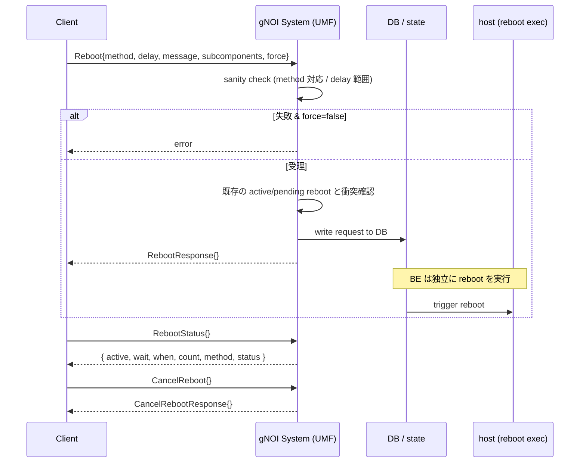

!!! warning "裏取りステータス: HLD-only"
    HLD は v0.2 (2025-01) で v0.1 (2024-07) から「Reboot 以外の System API を削除」と縮小済み。Time RPC や force 失敗時のサニティチェック実装、warm/NSF reboot の経路は別 HLD（[Warmboot Manager HLD](https://github.com/akarshgupta25/SONiC-NSF-Mgr-HLD/blob/9dd1ade0b48ce96d513468a54bf794efa43a9f54/doc/warm-reboot/Warmboot_Manager_HLD.md)）に分離しているため、master 実装での経路は要確認。

# gNOI System Reboot / RebootStatus / CancelReboot（reboot method と sanity check）

## 概要

`gnoi.system.System` のうち SONiC が初期サポートする RPC は **Reboot / RebootStatus / CancelReboot** の 3 つ[^1]。OpenConfig の [system.proto](https://github.com/openconfig/gnoi/blob/main/system/system.proto) 定義をそのまま利用する。

reboot method は仕様上以下の 6 種類[^1]（COLD のみ全 target で必須）:

| method | 意味 |
|--------|------|
| `COLD` | OS とハードウェア全体を再起動。**全 target 必須サポート** |
| `POWERDOWN` | 可能なら停止 + 電源 off |
| `HALT` | 停止のみ |
| `WARM` | 構成のみ再ロード（ハードウェア維持）。NSF と同等扱いかは vendor 依存 |
| `NSF` | Non-Stop-Forwarding reboot |
| `POWERUP` | 電源を入れる（既に on なら no-op） |

`RESET` は **deprecated**（FactoryReset RPC 側へ移行）[^1]。

## 動作仕様

### 全体フロー



### Reboot RPC の仕様

`RebootRequest` の主要フィールド[^1]:

```proto
message RebootRequest {
  RebootMethod method = 1;
  uint64       delay = 2;          // ns 単位の遅延
  string       message = 3;        // 監査ログ向け理由
  repeated types.Path subcomponents = 4; // optional: 部分 reboot
  bool         force = 5;          // sanity check fail でも実行
}
```

サニティチェック（`force=false` で fail すると拒否）[^1]:

- platform で **未対応の method** が指定された
- パラメータが範囲外（例: 1 年後の delay 等）

受理条件[^1]:

1. リクエスト validation 成功
2. **active / pending な reboot が無い**
3. DB への書き込み成功

active control processor への reboot が pending な状態で **更なる reboot 要求** が来たら、必ず reject する[^1]。

### RebootStatus RPC

`RebootStatusResponse` で返るフィールド[^1]:

| フィールド | 内容 |
|----------|------|
| `active` | reboot が進行/予約中か |
| `wait` | 残り時間（ns） |
| `when` | epoch 基準の reboot 時刻（ns） |
| `reason` | 理由（`message` 由来） |
| `count` | active になってからの reboot 回数 |
| `method` | `RebootMethod` |
| `status` | `active=false` の時のみ意味あり: SUCCESS / RETRIABLE_FAILURE / FAILURE / UNKNOWN |

### CancelReboot RPC

`CancelRebootRequest{message, subcomponents}` で **pending な reboot を取消** する。subcomponents 指定時は該当部分のみキャンセル[^1]。応答は空。

### subcomponent 指定の reboot

`subcomponents: []types.Path` で **特定の component のみ reboot** することを許可（例: `/components/component[name=ASIC0]`）。platform が対応していなければ sanity check で拒否される[^1]。

### warm / NSF reboot との関係

`WARM` / `NSF` の挙動は **vendor 定義**。HLD 本文では「`WARM` と `NSF` が同じかは実装次第」と明記[^1]。SONiC での具体実装は別 HLD（Warmboot Manager HLD、リンク先は upstream / fork のドラフト段階）に委ねており、本 HLD 自体には warm reboot 経路の詳細記載は無い[^1]。

<!-- evidence:
source: sonic-net/SONiC/doc/mgmt/gnmi/gnoi_system_hld.md#L176-L188 (sha: 49bab5b5ff0e924f1ea52b3d9db0dfa4191a7c06)
excerpt: |
  The gNOI server performs sanity checks after receiving the requests, and rejects if it fails (and `force` is not set).
  ...
  The Reboot Request Succeeds when:
  - The gNOI server validates the request,
  - checks that no requests are pending/ active, and
  - writes the data successfully to the DB.
  - Once notified, the back end will act on the operation independently.
reasoning: 受理条件が「validation OK + 既存 reboot 無し + DB 書込成功」、BE は独立実行という記述の根拠。
-->

## 設定

### 関連する CONFIG_DB

専用スキーマは HLD 上明記無し。「DB に書き込む」だけ抽象化されているため、現行 master では `STATE_DB` / `CONFIG_DB` のどこに書くか実装に委ねられる。

### 関連する CLI

| Command | 用途 |
|---------|------|
| `gnoi_client system reboot ...` | Reboot RPC（JSON / proto 双方サポート予定）[^1] |
| `gnoi_client system reboot_status` | RebootStatus RPC |
| `gnoi_client system cancel_reboot` | CancelReboot RPC |

### 関連する YANG

該当 YANG モジュールは HLD で言及無し。

### 設定例

```bash
# 即時 cold reboot
gnoi_client system reboot --method COLD --message "scheduled maintenance"

# 30 秒後 reboot
gnoi_client system reboot --method COLD --delay 30000000000

# 状態確認
gnoi_client system reboot_status

# 取消
gnoi_client system cancel_reboot --message "delayed by SRE"
```

## 制限事項

- **`COLD` のみ全 target 必須**[^1]。それ以外（POWERDOWN / HALT / WARM / NSF / POWERUP）は platform 依存
- `RESET` は **deprecated**。代わりに `gnoi.factory_reset.FactoryReset.Start` を使う[^1]
- active control processor への reboot pending 中は別の reboot 要求は **reject**[^1]
- `Time` RPC は initial scope **対象外**（v0.2 で削除）[^1]
- subcomponent 指定 reboot の対応は platform 依存
- warm / NSF reboot の意味（同一視するか別物にするか）は **vendor 定義**[^1]

## 干渉する機能

- **gNOI OS Activate**: `Activate(no_reboot=true)` 後の本 RPC で実 reboot を発火する想定[^1]
- **gNOI FactoryReset.Start**: `RESET` の代替。reboot とは別のセマンティクス
- **Warm / Fast reboot 機構**: SONiC 標準の `warm-reboot` / `fast-reboot` スクリプトとの連携経路は別 HLD 側で詳細化
- **`config save` / `config reload`**: reboot で揮発する設定が無いか事前確認

## トラブルシューティング

- `INVALID_ARGUMENT` で reject: `RebootMethod` が platform 非対応か `delay` が範囲外。`force=true` で再試行可だが推奨されない
- `Reboot` 受理後に `RebootStatus.active=false`: 既に reboot 完了したか、BE が DB 書き込みを処理しなかった
- `CancelReboot` が効かない: subcomponents 指定が unmatched、または既に reboot が走り始めている

## 引用元

[^1]: `sonic-net/SONiC` `doc/mgmt/gnmi/gnoi_system_hld.md` @ `49bab5b5ff0e924f1ea52b3d9db0dfa4191a7c06`

<!-- concerns hint:
- UMF / sonic-gnmi の System Reboot/RebootStatus/CancelReboot handler 実装存在確認
- reboot 要求を書き込む DB スキーマ (STATE_DB / CONFIG_DB) の現行実装確認
- COLD 以外 (WARM / NSF / POWERDOWN / HALT / POWERUP) の platform サポート状況
- subcomponent 指定 reboot の実装存否
- Warmboot Manager HLD（別 HLD）と本 HLD の連携経路実装確認
- gnoi_client の system サブコマンド実装状況
-->
