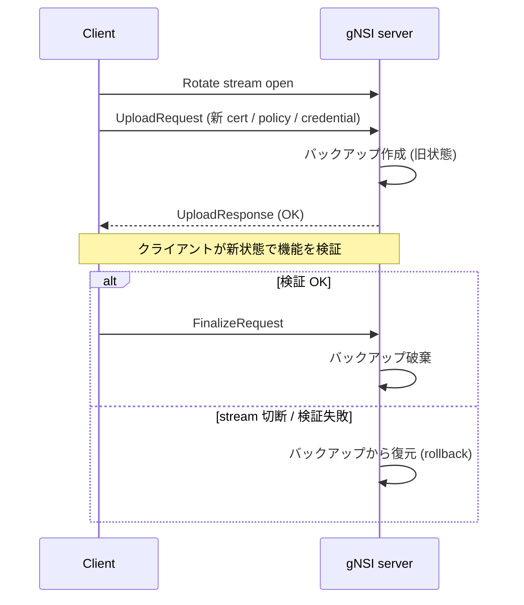

# gNSI 概念

このページは [gNSI（概要ハブ）](gnsi-hld.md) の派生で、**4 サービスのスコープと共通 Rotate モデル** に絞って整理する。設定 / CLI は [gnsi-hld-operations.md](gnsi-hld-operations.md)、内部実装（host service / handler）は [gnsi-hld-internals.md](gnsi-hld-internals.md)、制限と HLD 乖離は [gnsi-hld-limitations.md](gnsi-hld-limitations.md) を参照。

## 1. gNSI とは

gNSI（gRPC Network Security Interface）は、ネットワーク機器の **セキュリティクレデンシャルを gRPC 経由で安全にローテーションする** ためのマイクロサービス群である[^1]。SONiC では [gNMI](../reference/glossary.md#term-gnmi)/UMF サーバ（`sonic-gnmi`）と `sonic-mgmt-common` に組み込み、対応する OpenConfig [YANG](../reference/glossary.md#term-yang) モデルを公開する設計[^1]。

## 2. 主要 4 サービス

| サービス | 対象 | 主要 RPC |
|---------|------|---------|
| **Certz** | PKI（証明書 / Trust Bundle / CRL / Auth Policy） | `Rotate` / `GetProfileList` / `AddProfile` / `DeleteProfile` / `CanGenerateCSR` |
| **Authz** | gRPC アクセス制御ポリシー（[gRPC A43](https://github.com/grpc/proposal/blob/master/A43-grpc-authorization-api.md)） | `Rotate` / `Probe` |
| **Pathz** | gNMI パス単位の read/write 認可 | `Rotate` / `Probe` |
| **Credentialz** | コンソール / SSH のユーザ・鍵管理 | `RotateAccountCredentials` / `RotateHostParameters` |

全サービスに共通する **「Rotate モデル」**: 新ペイロードを送る → 旧状態のバックアップを取る → クライアントが `Finalize` を出さなければ自動ロールバック[^1]。

## 3. Rotate の共通フロー

**Finalize を送らずに stream を閉じれば必ずロールバック** されるのが gNSI の安全機構の核[^1]。

## 引用元

[^1]: `sonic-net/SONiC` `doc/mgmt/gnmi/gnsi.md` @ `49bab5b5ff0e924f1ea52b3d9db0dfa4191a7c06`
