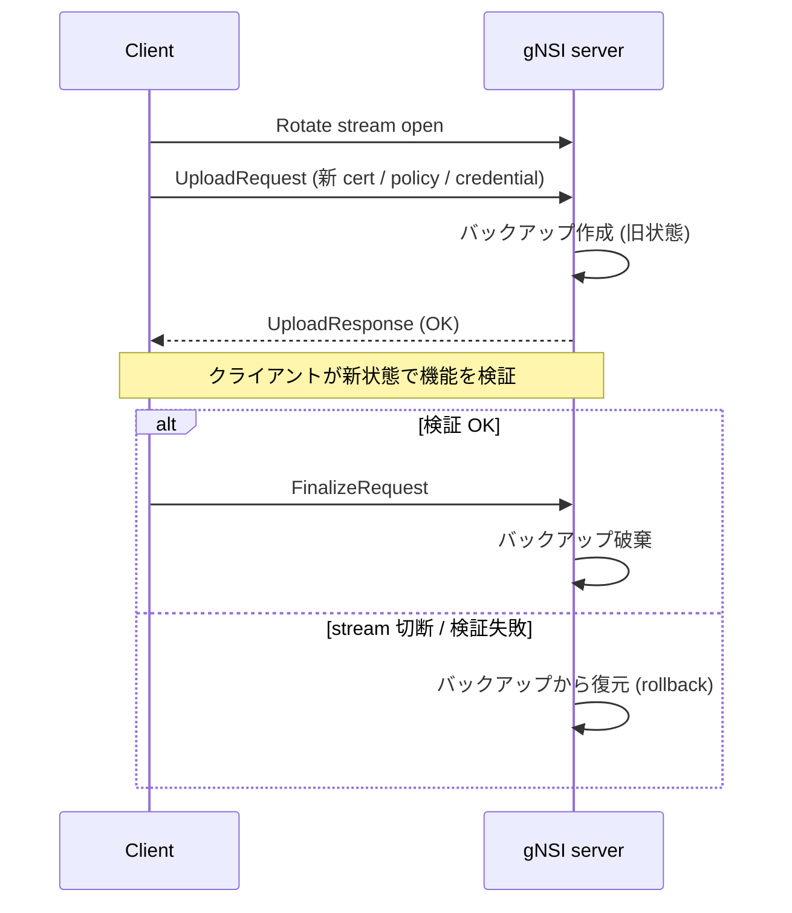

# gNSI 概念

このページは [gNSI（概要ハブ）](gnsi-hld.md) の派生で、**4 サービスのスコープと共通 Rotate モデル** に絞って整理する。設定 / CLI は [gnsi-hld-operations.md](gnsi-hld-operations.md)、内部実装（host service / handler）は [gnsi-hld-internals.md](gnsi-hld-internals.md)、制限と [HLD](../reference/glossary.md#term-hld) 乖離は [gnsi-hld-limitations.md](gnsi-hld-limitations.md) を参照。

!!! note "実装状況の境界（partially implemented）"
    本ページの概念は HLD ベースで記述しているが、master 実装には濃淡がある。**Certz / Authz / Pathz**（証明書・アクセス制御・パス認可）は `sonic-gnmi` に **取り込み済** で動作する一方、**Credentialz** の gNMI server handler は **未配線** の状態（対応 PR が未取り込み）。詳細な対応 PR と未取り込み箇所は [gnsi-hld-limitations.md](gnsi-hld-limitations.md) を参照。

## 1. gNSI とは

gNSI（gRPC Network Security Interface）は、ネットワーク機器の **セキュリティクレデンシャルを gRPC 経由で安全にローテーションする** ためのマイクロサービス群である[^1]。[SONiC](../reference/glossary.md#term-sonic) では [gNMI](../reference/glossary.md#term-gnmi)/UMF サーバ（`sonic-gnmi`）と `sonic-mgmt-common` に組み込み、対応する OpenConfig [YANG](../reference/glossary.md#term-yang) モデルを公開する設計[^1]。

## 2. 主要 4 サービス

| サービス | 対象 | 主要 RPC |
|---------|------|---------|
| **Certz** | PKI（証明書 / Trust Bundle / CRL / Auth Policy） | `Rotate` / `GetProfileList` / `AddProfile` / `DeleteProfile` / `CanGenerateCSR` |
| **Authz** | gRPC アクセス制御ポリシー（[gRPC A43](https://github.com/grpc/proposal/blob/master/A43-grpc-authorization-api.md)） | `Rotate` / `Probe` |
| **Pathz** | gNMI パス単位の read/write 認可 | `Rotate` / `Probe` |
| **Credentialz** | コンソール / SSH のユーザ・鍵管理 | `RotateAccountCredentials` / `RotateHostParameters` |

全サービスに共通する **「Rotate モデル」**: 新ペイロードを送る → 旧状態のバックアップを取る → クライアントが `Finalize` を出さなければ自動ロールバック[^1]。

## 3. Rotate の共通フロー

**Finalize を送らずに stream を閉じれば必ずロールバック** されるのが gNSI の安全機構の核[^1]。

<!-- phase-boundary -->
## 実装フェーズ境界

!!! info "gNSI サービス別の取り込み状況"
    冒頭の note と同じ事実を、HLD の 4 サービスを軸に整理する。詳細な PR / コード
    根拠は [gnsi-hld-limitations.md](gnsi-hld-limitations.md) を、横断索引は
    [discrepancy-index](../reference/verification/discrepancy-index.md) を参照。

    | フェーズ | 対象サービス | 実装済 (master 取り込み済) | 未実装 / 未配線 |
    |---|---|---|---|
    | Phase 1 — gNMI server handler 取り込み済 | Certz / Authz / Pathz | `sonic-gnmi/gnmi_server/gnsi_certz.go` / `gnsi_authz.go` / `gnsi_pathz.go` が存在し、Rotate / Probe / Profile 操作を提供[^2] | — |
    | Phase 2 — dbus client のみ存在、server handler 未配線 | Credentialz | `sonic-gnmi/sonic_service_client/dbus_client.go` の Credentialz dbus API 部分のみ準備済[^3] | gNMI server 側の `gnsi_credentialz.go` 相当が未配置。Credentialz.Rotate は現状 `Unimplemented` |
    | Phase 3 — HLD 上の host service 仕様待ち | Credentialz の `console_mgmt` / `ssh_mgmt` host service | — | HLD §5.5 / §5.6 で API 定義のみ[^1]。`sonic-host-services` 側の実装と gNMI dispatch の双方が必要 |

    凡例: 「実装済」=現行 master のコードに存在しテストがある範囲 / 「未配線」=コードの一部は存在するが他の経路（server dispatch、host service 等）が未実装で end-to-end では動かない範囲。
<!-- /phase-boundary -->

## 実装との乖離

`monitor: partially_implemented` — 部分実装 — HLD の中核は実装済みだが、フィールド / API / 制約のいくつかが上流に未取り込み、または挙動が緩和されている。 本ページは split-child のため、差分の主要根拠 / 影響 / 回避策は親ページ [gNSI 概念 親ページ](gnsi-hld.md) の同セクション（`## 実装との乖離` または `!!! diff` ブロック）を参照のこと。

## 引用元

[^1]: `sonic-net/SONiC` `doc/mgmt/gnmi/gnsi.md` @ `49bab5b5ff0e924f1ea52b3d9db0dfa4191a7c06`
[^2]: `sonic-net/sonic-gnmi` `gnmi_server/gnsi_certz.go` / `gnmi_server/gnsi_authz.go` / `gnmi_server/gnsi_pathz.go`（同階層に `*_test.go` も存在）
[^3]: `sonic-net/sonic-gnmi` `sonic_service_client/dbus_client.go` の `//Credentialz service APIs` ブロック（53 行目付近〜）

<!-- glossary-links-injected: 8ba32e5aa69d -->
