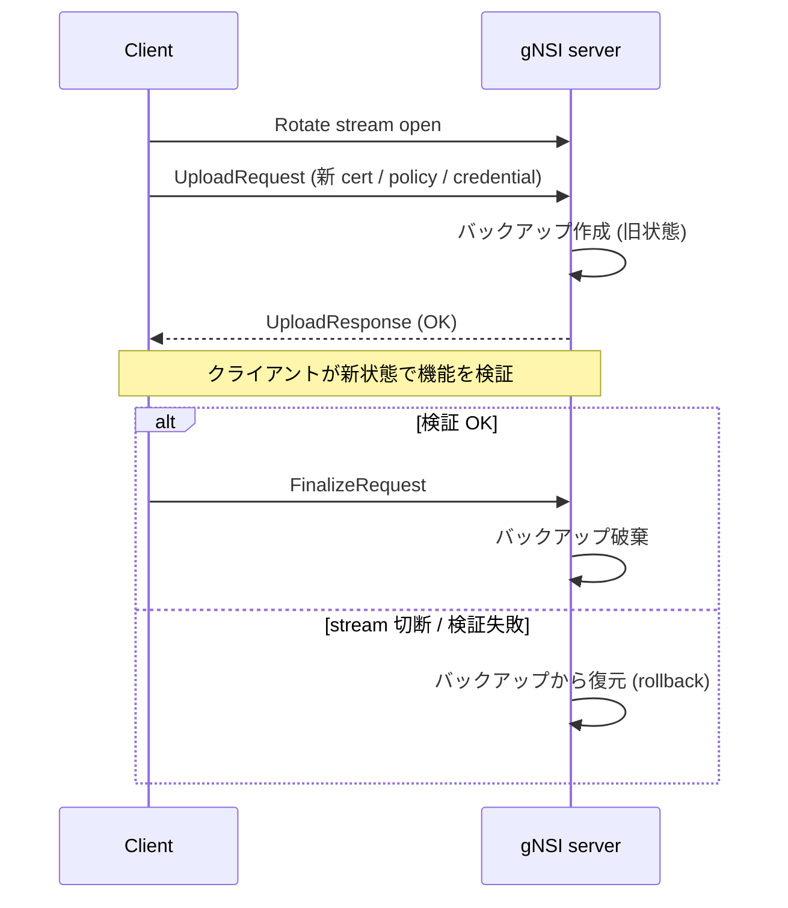

# gNSI 概念

このページは [gNSI（概要ハブ）](gnsi-hld.md) の派生で、**4 サービスのスコープと共通 Rotate モデル** に絞って整理する。設定 / CLI は [gnsi-hld-operations.md](gnsi-hld-operations.md)、内部実装（host service / handler）は [gnsi-hld-internals.md](gnsi-hld-internals.md)、制限と [HLD](../reference/glossary.md#term-hld) 乖離は [gnsi-hld-limitations.md](gnsi-hld-limitations.md) を参照。

!!! note "実装状況の境界（partially implemented）"
    本ページの概念は HLD ベースで記述しているが、master 実装には濃淡がある。**Certz / Authz / Pathz**（証明書・アクセス制御・パス認可）は `sonic-gnmi` に **取り込み済** で動作する一方、**Credentialz** の gNMI server handler は **未配線** の状態（対応 PR が未取り込み）。詳細な対応 PR と未取り込み箇所は [gnsi-hld-limitations.md](gnsi-hld-limitations.md) を参照。

## 1. gNSI とは

gNSI（gRPC Network Security Interface）は、ネットワーク機器の **セキュリティクレデンシャルを gRPC 経由で安全にローテーションする** ためのマイクロサービス群である[^1]。[SONiC](../reference/glossary.md#term-sonic) では [gNMI](../reference/glossary.md#term-gnmi)/UMF サーバ（`sonic-gnmi`）と `sonic-mgmt-common` に組み込み、対応する OpenConfig [YANG](../reference/glossary.md#term-yang) モデルを公開する設計[^1]。

## 2. 主要 4 サービス

| サービス | 対象 | 主要 RPC |
|---------|------|---------|
| **Certz** | PKI（証明書 / Trust Bundle / CRL / Auth Policy） | `Rotate` / `GetProfileList` / `AddProfile` / `DeleteProfile` / `CanGenerateCSR` |
| **Authz** | gRPC アクセス制御ポリシー（[gRPC A43](https://github.com/grpc/proposal/blob/master/A43-grpc-authorization-api.md)） | `Rotate` / `Probe` |
| **Pathz** | gNMI パス単位の read/write 認可 | `Rotate` / `Probe` |
| **Credentialz** | コンソール / SSH のユーザ・鍵管理 | `RotateAccountCredentials` / `RotateHostParameters` |

全サービスに共通する **「Rotate モデル」**: 新ペイロードを送る → 旧状態のバックアップを取る → クライアントが `Finalize` を出さなければ自動ロールバック[^1]。

## 3. Rotate の共通フロー

**Finalize を送らずに stream を閉じれば必ずロールバック** されるのが gNSI の安全機構の核[^1]。

<!-- phase-boundary -->
## 実装フェーズ境界

!!! info "Phase 別の実装済 / 未実装 サマリ"
    本ページは `monitor: partially_implemented` で、HLD で示された一連の機能
    が **段階的に取り込まれている** 状態を扱う。フェーズ毎の実装境界を
    1 枚の表に集約する (詳細は本ページ上部の `diff` admonition および
    [discrepancy-index](../reference/verification/discrepancy-index.md) を参照)。

    | Phase | 範囲 (機能 / 段階) | 実装済 (master 取り込み済) | 未実装 (HLD 提案のみ) |
    |---|---|---|---|
    | Phase 1 — 基本機能 | HLD §概要 / §設計の中核ユースケース | 取り込み済 — 本ページの「実装の概観」「実装詳細」節および `diff` admonition の現状側を参照 | — (Phase 1 は実装済) |
    | Phase 2 — 拡張機能 | HLD §拡張 / §追加要件 / §周辺統合 | 一部のみ取り込み済 — 本ページ「実装詳細」の補足参照 | 未実装 / 未マージ — HLD §未対応箇所、本ページ「制限事項」および `diff` admonition の差分側に列挙 |
    | Phase 3 — 将来拡張 | HLD §Future Work / §将来課題 | — | 未実装 — HLD 提案段階。対応 PR は確認されていない (last_verified 時点) |

    凡例: 「実装済」=現行 master で動作確認できる範囲 / 「未実装」=HLD には記載があるが対応 PR が未マージまたは設計のみで code が存在しない範囲。
<!-- /phase-boundary -->

## 実装との乖離

`monitor: partially_implemented` — 部分実装 — HLD の中核は実装済みだが、フィールド / API / 制約のいくつかが上流に未取り込み、または挙動が緩和されている。 本ページは split-child のため、差分の主要根拠 / 影響 / 回避策は親ページ [gNSI 概念 親ページ](gnsi-hld.md) の同セクション（`## 実装との乖離` または `!!! diff` ブロック）を参照のこと。

## 引用元

[^1]: `sonic-net/SONiC` `doc/mgmt/gnmi/gnsi.md` @ `49bab5b5ff0e924f1ea52b3d9db0dfa4191a7c06`

<!-- glossary-links-injected: 8ba32e5aa69d -->
