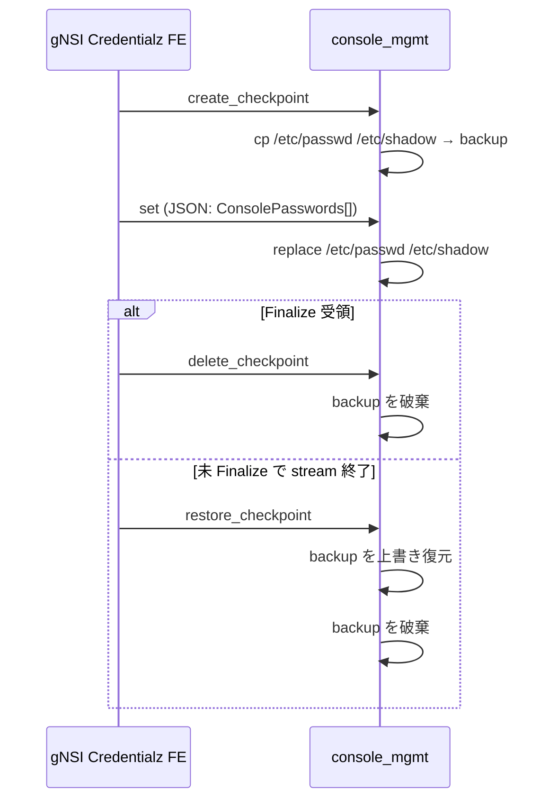

# gNSI 内部実装

このページは [gNSI（概要ハブ）](gnsi-hld.md) の派生で、**4 サービスの内部実装と host service** に絞る。概念は [gnsi-hld-concepts.md](gnsi-hld-concepts.md)、設定 / 運用は [gnsi-hld-operations.md](gnsi-hld-operations.md)、制限と HLD 乖離は [gnsi-hld-limitations.md](gnsi-hld-limitations.md) を参照。

## 1. Certz

`Certz.Rotate` は **bidirectional streaming RPC** で以下を入れ替える[^1]:

- Server Certificate
- Root Certificate Bundle (Trust Bundle)
- Certificate Revocation List (CRL)
- Authentication Policy

### Profile

PKI 群を **SSL profile** 単位で束ねる。デフォルトは `gnxi` プロファイル（gNMI / [gNOI](../reference/glossary.md#term-gnoi) / gNSI 自身が使う）[^1]:

| RPC | 用途 |
|-----|------|
| `GetProfileList` | プロファイル列挙 |
| `AddProfile` | 新規追加 |
| `DeleteProfile` | 削除（**`gnxi` は削除不可**）[^1] |

### CSR

server がオプションで対応すれば、`Rotate` ストリーム内で CSR を生成し、外部 CA に署名させて取り込める[^1]:

- `CanGenerateCSR()` で能力照会
- `Rotate(GenerateCSRRequest)` で CSR 取得 → 外部署名 → `Rotate` で証明書取り込み

## 2. Authz

gRPC アクセスのポリシーベース認可。policy は **JSON 文字列**（[gRPC A43](https://github.com/grpc/proposal/blob/master/A43-grpc-authorization-api.md) スキーマ）で記述し、gRPC server に file watcher + Interceptor で適用する[^1]。

- `Authz.Rotate()`: ポリシー差し替え（Certz と同じ Finalize/rollback 動作）
- `Authz.Probe()`: 現行ポリシーで指定リクエストが通るかテスト

## 3. Pathz

**gNMI パス単位** で read/write を絞り込む認可。ポリシープロセッサが gNMI request の冒頭で評価する[^1]。

- `Pathz.Rotate()` / `Pathz.Probe()`

## 4. Credentialz

コンソールユーザと SSH の鍵・パスワード管理。host service モジュール経由で `/etc/passwd` / `/etc/shadow` / `/etc/sshd/...` 等を直接書き換える[^1]。

### Console (`console_mgmt` host service module)



`set` の payload[^1]:

```json
{ "ConsolePasswords": [ {"name": "alice", "password": "..."} ] }
```

### SSH (`ssh_mgmt` host service module)

`console_mgmt` と同じ checkpoint / set / restore / delete 構造。バックアップ対象ファイルが SSH 系全般（`sshd_config`、host key、各 home の `authorized_keys` / `authorized_users`、CA 公開鍵）に拡大される[^1]。

`set` のリクエスト種別[^1]:

| 種別 | キー | 動作 |
|------|------|------|
| 認可鍵 | `SshAccountKeys` | `/home/<account>/.ssh/authorized_keys` を置換 + sshd 再起動 |
| 認可ユーザ | `SshAccountUsers` | `/home/<account>/.ssh/authorized_users` を置換 + sshd 再起動 |
| CA 公開鍵 | `SshCaPublicKey` | `/etc/sshd/ssh_ca_pub_key` を置換 + sshd 再起動 |

`options` には OpenSSH の `from=...` 等の鍵オプションをそのまま渡せる[^1]。

## 引用元

[^1]: `sonic-net/SONiC` `doc/mgmt/gnmi/gnsi.md` @ `49bab5b5ff0e924f1ea52b3d9db0dfa4191a7c06`
