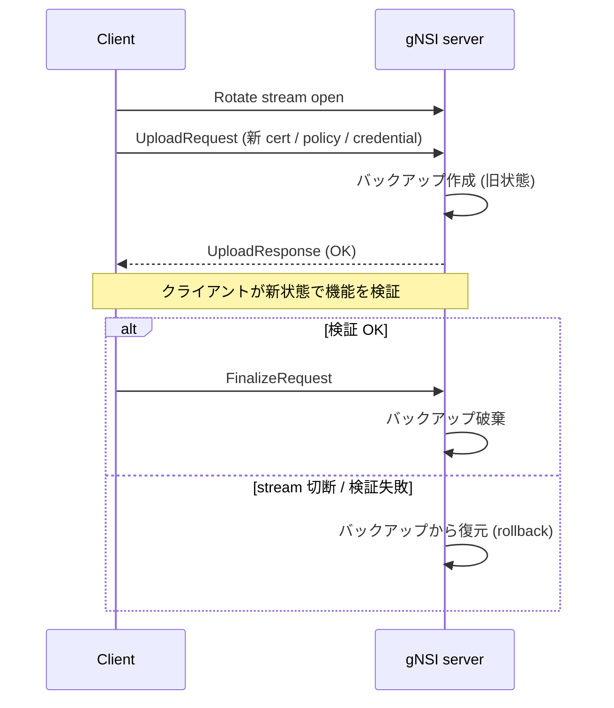
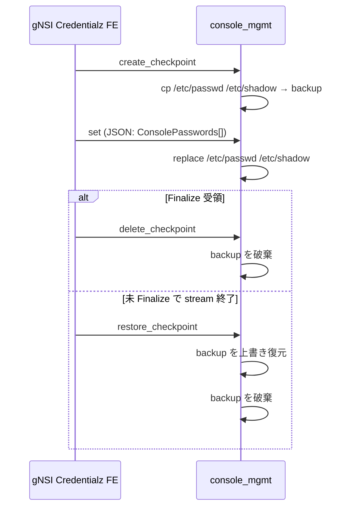

<!-- topics-tip -->
!!! tip "Topics で読み物として読む"
    この HLD は実装詳細を含む。機能の概念・設定・運用を読み物として読みたい場合は [Topics 10 章: gNMI / OpenConfig / 管理プレーン](../topics/10-gnmi-openconfig/index.md) を参照。
<!-- /topics-tip -->

!!! warning "裏取りステータス: Discrepancy-found"
    主要 gNSI サービス（Authz / Certz / Pathz）の handler 実装と host service モジュール（`gnsi_console.py` / `ssh_mgmt.py`）は確認済み。一方で **Credentialz の gNMI server 側 handler は未実装**（dbus client 経由の補助のみ）であり、gNMI server フラグ名も HLD 提案と若干異なる。詳細は本文末尾「実装との乖離」を参照（verified at: 2026-05-09）。

# gNSI（Certz / Authz / Pathz / Credentialz）の Rotate モデル

!!! info "章分割済み"
    本ページは大型 HLD の **概要ハブ** として保持。詳細は以下の派生ページを参照:

    - [gnsi-hld-concepts.md](gnsi-hld-concepts.md) — 4 サービスと Rotate モデルの概念
    - [gnsi-hld-operations.md](gnsi-hld-operations.md) — gNMI フラグ / CONFIG_DB / YANG / 運用イメージ
    - [gnsi-hld-internals.md](gnsi-hld-internals.md) — Certz / Authz / Pathz / Credentialz の内部実装
    - [gnsi-hld-limitations.md](gnsi-hld-limitations.md) — 制限事項と HLD-実装乖離（Credentialz 未配線等）

## 概要

gNSI（gRPC Network Security Interface）は、ネットワーク機器の **セキュリティクレデンシャルを gRPC 経由で安全にローテーションする** ためのマイクロサービス群である[^1]。[SONiC](../reference/glossary.md#term-sonic) では [gNMI](../reference/glossary.md#term-gnmi)/UMF サーバ（`sonic-gnmi`）と `sonic-mgmt-common` に組み込み、対応する OpenConfig [YANG](../reference/glossary.md#term-yang) モデルを公開する設計[^1]。

主要 4 サービス[^1]:

| サービス | 対象 | 主要 RPC |
|---------|------|---------|
| **Certz** | PKI（証明書 / Trust Bundle / CRL / Auth Policy） | `Rotate` / `GetProfileList` / `AddProfile` / `DeleteProfile` / `CanGenerateCSR` |
| **Authz** | gRPC アクセス制御ポリシー（[gRPC A43](https://github.com/grpc/proposal/blob/master/A43-grpc-authorization-api.md)） | `Rotate` / `Probe` |
| **Pathz** | gNMI パス単位の read/write 認可 | `Rotate` / `Probe` |
| **Credentialz** | コンソール / SSH のユーザ・鍵管理 | `RotateAccountCredentials` / `RotateHostParameters` |

全サービスに共通する **「Rotate モデル」**: 新ペイロードを送る → 旧状態のバックアップを取る → クライアントが `Finalize` を出さなければ自動ロールバック[^1]。

## 動作仕様

### Rotate の共通フロー



**Finalize を送らずに stream を閉じれば必ずロールバック** されるのが gNSI の安全機構の核[^1]。

### Certz

`Certz.Rotate` は **bidirectional streaming RPC** で以下を入れ替える[^1]:

- Server Certificate
- Root Certificate Bundle (Trust Bundle)
- Certificate Revocation List (CRL)
- Authentication Policy

#### Profile

PKI 群を **SSL profile** 単位で束ねる。デフォルトは `gnxi` プロファイル（gNMI / [gNOI](../reference/glossary.md#term-gnoi) / gNSI 自身が使う）[^1]:

| RPC | 用途 |
|-----|------|
| `GetProfileList` | プロファイル列挙 |
| `AddProfile` | 新規追加 |
| `DeleteProfile` | 削除（**`gnxi` は削除不可**）[^1] |

#### CSR

server がオプションで対応すれば、`Rotate` ストリーム内で CSR を生成し、外部 CA に署名させて取り込める[^1]:

- `CanGenerateCSR()` で能力照会
- `Rotate(GenerateCSRRequest)` で CSR 取得 → 外部署名 → `Rotate` で証明書取り込み

### Authz

gRPC アクセスのポリシーベース認可。policy は **JSON 文字列**（[gRPC A43](https://github.com/grpc/proposal/blob/master/A43-grpc-authorization-api.md) スキーマ）で記述し、gRPC server に file watcher + Interceptor で適用する[^1]。

- `Authz.Rotate()`: ポリシー差し替え（Certz と同じ Finalize/rollback 動作）
- `Authz.Probe()`: 現行ポリシーで指定リクエストが通るかテスト

### Pathz

**gNMI パス単位** で read/write を絞り込む認可。ポリシープロセッサが gNMI request の冒頭で評価する[^1]。

- `Pathz.Rotate()` / `Pathz.Probe()`

### Credentialz

コンソールユーザと SSH の鍵・パスワード管理。host service モジュール経由で `/etc/passwd` / `/etc/shadow` / `/etc/sshd/...` 等を直接書き換える[^1]。

#### Console (`console_mgmt` host service module)



`set` の payload[^1]:

```json
{ "ConsolePasswords": [ {"name": "alice", "password": "..."} ] }
```

#### SSH (`ssh_mgmt` host service module)

`console_mgmt` と同じ checkpoint / set / restore / delete 構造。バックアップ対象ファイルが SSH 系全般（`sshd_config`、host key、各 home の `authorized_keys` / `authorized_users`、CA 公開鍵）に拡大される[^1]。

`set` のリクエスト種別[^1]:

| 種別 | キー | 動作 |
|------|------|------|
| 認可鍵 | `SshAccountKeys` | `/home/<account>/.ssh/authorized_keys` を置換 + sshd 再起動 |
| 認可ユーザ | `SshAccountUsers` | `/home/<account>/.ssh/authorized_users` を置換 + sshd 再起動 |
| CA 公開鍵 | `SshCaPublicKey` | `/etc/sshd/ssh_ca_pub_key` を置換 + sshd 再起動 |

`options` には OpenSSH の `from=...` 等の鍵オプションをそのまま渡せる[^1]。

<!-- evidence:
source: sonic-net/SONiC/doc/mgmt/gnmi/gnsi.md#L168-L298 (sha: 49bab5b5ff0e924f1ea52b3d9db0dfa4191a7c06)
excerpt: |
  Credentialz is for managing SSH and Console access. Changes are made through dbus calls to appropiate host service modules.
  ...
  When this type of message is received the back-end will replace the content of /home/<account>/.ssh/authorized_keys file and restart the sshd daemon.
reasoning: console_mgmt / ssh_mgmt の責務分担と sshd 再起動仕様の根拠。
-->

<!-- evidence-rendered:start -->
??? note "📋 検証エビデンス: sonic-net/SONiC/doc/mgmt/gnmi/gnsi.md#L168-L298 (sha: 49bab5b5ff0e924f1ea52b3d9db0dfa4191a7c06)"

    **出典**:

    `sonic-net/SONiC/doc/mgmt/gnmi/gnsi.md#L168-L298 (sha: 49bab5b5ff0e924f1ea52b3d9db0dfa4191a7c06)`

    **抜粋**:

    ```text
    Credentialz is for managing SSH and Console access. Changes are made through dbus calls to appropiate host service modules.
    ...
    When this type of message is received the back-end will replace the content of /home/<account>/.ssh/authorized_keys file and restart the sshd daemon.
    ```

    **判断根拠**: console_mgmt / ssh_mgmt の責務分担と sshd 再起動仕様の根拠。

<!-- evidence-rendered:end -->

### gNMI / sonic-gnmi 側のフラグ追加

[HLD](../reference/glossary.md#term-hld) は gNMI server に以下のフラグを追加する想定[^1]:

| フラグ | 用途 |
|-------|------|
| `EnableAuthzPolicy` / `AuthzPolicyFile` | Authz ポリシー有効化と JSON ファイルパス |
| `EnablePathzPolicy` / `PathzPolicyFile` | Pathz 同上 |
| `CertCRLConfig` | CRL ディレクトリ。空で無効化 |
| `SshCredMetaFile` / `ConsoleCredMetaFile` | Credentialz メタデータ JSON |
| `CredEntitiesMetaFile` | gRPC クレデンシャルメタ |
| `AuthzMetaFile` / `PathzMetaFile` | 各サービスのメタデータ JSON |

state の保管先として **`STATE_DB`** にプロファイルの freshness / state を入れる（OpenConfig gNSI モデル準拠）[^1]。

## 設定

### 関連する CONFIG_DB

[CONFIG_DB](../reference/glossary.md#term-config_db) スキーマの追加は HLD 上「None」[^1]。状態は [STATE_DB](../reference/glossary.md#term-state_db) のみ。

### 関連する CLI

該当する CLI は HLD で言及無し。`gnoi_client` 系のような専用 CLI は HLD 内で未定義。

### 関連する YANG

OpenConfig 公開モデル（`openconfig-gnsi-certz` / `-authz` / `-pathz` / `-credentialz`）のパスを通す[^1]。

### 設定例（運用イメージ）

```bash
# Certz: gnxi profile に新証明書を流し込む
gnsi_client certz rotate --profile gnxi \
  --cert ./new.pem --bundle ./root.pem --crl-dir ./crls/

# 検証 OK で finalize
gnsi_client certz finalize

# Credentialz: SSH 認可鍵更新
gnsi_client credentialz rotate-account \
  --account root --keys ./new_authorized_keys.json
```

## 制限事項

- **CRL の蓄積**: Go 版 gRPC は起動以降の **CRL 全履歴** を必要とする[^1]。CRL ローテーション回数に応じてメモリ・I/O が線形に増える
- **`gnxi` profile は削除不可**[^1]
- **同時 Rotate 拒否**: 各サービスで Concurrent Rotate を reject する想定（Unit Test cases 明記）[^1]
- HLD 自体に `Pathz` の policy 形式詳細は無く、policy processor のライブラリ実装は別途必要[^1]
- Credentialz の `set` で sshd は再起動される。short-window で SSH 接続が拒否される可能性[^1]

## 干渉する機能

- **gNMI Master Arbitration**: gNSI の `Rotate` は `Set` ではないので Master Arbitration の対象外
- **gNOI FactoryReset**: `retain_certs=true` で Credentialz / Certz が積んだ証明書を残せるかは gNOI 側のオプション扱い
- **TACACS / Linux PAM**: Credentialz が `/etc/passwd` / `/etc/shadow` を置換するため、TACACS や [RADIUS](../reference/glossary.md#term-radius) 連携の有無で挙動が変わる
- **既存 sshd 設定**: `ssh_mgmt.set` は既存 `authorized_keys` を **置換** する（追記ではない）。warm boot 時の rollback ファイル管理に注意

## トラブルシューティング

- `Rotate` 後に証明書が古いまま: `Finalize` を送らずに stream を閉じた可能性。サーバ側のチェックポイント有無を確認
- sshd が再起動ループ: `ssh_mgmt.set` で投入した `authorized_keys` / `sshd_config` が壊れている。`restore_checkpoint` で巻き戻す
- `Pathz` の評価が遅い: gNMI request 冒頭で policy processor が呼ばれる仕様。policy 規模に対するレイテンシを観測

<!-- diff-admonition -->
!!! diff "HLD と実装の差分"
    実コード裏取りで判明した HLD との差分（verified at: 2026-05-09, sonic-gnmi @ `eb635b76`）。HLD の 4 サービス（Authz / Certz / Pathz / Credentialz）のうち 3 つは取り込み済みで、Credentialz のみ未取り込みという **一部のみの部分実装** 状態:

    - **Credentialz handler の gNMI server 実装は未取り込み**: HLD は Authz / Certz / Pathz / Credentialz の 4 サービスを並べて記述するが、現行 master の `sonic-gnmi/gnmi_server/` には `gnsi_authz.go` / `gnsi_certz.go` / `gnsi_pathz.go` のみが存在し、`gnsi_credentialz.go` 相当のサーバ側ハンドラは無い。Credentialz 関連は `sonic-gnmi/sonic_service_client/dbus_client.go:53-` の **dbus client 補助コード**として準備されているのみ（`TestCredentialzDbusMethods` 等のテストが存在）。
    - **gNMI server フラグ名の差異**: HLD で言及された `EnableAuthzPolicy` / `EnablePathzPolicy` という flag 名ではなく、`sonic-gnmi/gnmi_server/server.go:240,243` では `AuthzPolicy bool` / `PathzPolicy bool` という config 構造体フィールドとして実装されている。ポリシーファイルパスは `AuthzPolicyFile` / `PathzPolicyFile`、CRL は `CertCRLConfig`（HLD の表記と差異あり）。
    - **STATE_DB gNSI profile state テーブルは未確認**: `sonic-swss-common/common/schema.h` 内に `GNSI` 関連テーブル定義は見当たらなかった（profile 状態は gNMI サーバプロセス内のメモリ／ファイルで保持される実装と推測される）。

    主要な合致点として、`sonic-gnmi/gnmi_server/gnsi_authz.go` (GNSIAuthzServer / Probe / Get / Rotate)、`gnsi_certz.go` (GNSICertzServer)、`gnsi_pathz.go` (GNSIPathzServer)、および `sonic-host-services/host_modules/gnsi_console.py` (`MOD_NAME = 'gnsi_console'`)、`ssh_mgmt.py` (`MOD_NAME = 'ssh_mgmt'`) は HLD どおり実装されている。

    **読者への影響**:

    - **Credentialz の SSH 鍵 / パスワード rotate を gNSI 経由で要求しても、現状はサーバハンドラが無いため `Unimplemented` で失敗する**。dbus client 側のコードは準備されているが、gNMI server からのディスパッチ経路が未配線。
    - HLD どおりに `EnableAuthzPolicy` / `EnablePathzPolicy` という flag 名で telemetry 設定を書こうとすると認識されない。**正しいフィールド名は `AuthzPolicy` / `PathzPolicy`（boolean）と `AuthzPolicyFile` / `PathzPolicyFile`（path）**。
    - STATE_DB から gNSI profile 状態を query するスクリプトを書くと **常に空** が返る（profile 状態は gNMI プロセスのメモリ内保持）。

    **回避策 / 対応方法**:

    - Credentialz が必要な場合は、現状 `ssh_mgmt` host service（dbus 経由）を直接叩くか、`/etc/ssh/sshd_config` / `authorized_keys` をホスト側スクリプトで管理する。gNSI 経由は上流の handler 実装待ち。
    - Authz / Pathz / CRL を有効化する設定は、telemetry config 構造体の `AuthzPolicy = true` / `AuthzPolicyFile = "/path/to/policy.json"` / `PathzPolicy = true` / `PathzPolicyFile = "..."` / `CertCRLConfig = "..."` を設定する。HLD の flag 名表記には引きずられない。
    - gNSI profile state を観測したい場合は、gNMI Probe / Get RPC を直接叩いて handler の戻り値を見る。STATE_DB 経由は機能しない。

    ### 再裏取り追補（2026-05-11）

    - `sonic-gnmi/gnmi_server/gnsi_authz.go` / `gnsi_certz.go` / `gnsi_pathz.go` は実装済みだが、`gnsi_credentialz.go` 相当のサーバハンドラは不在 (`ls .cache/sonic-sources/sonic-gnmi/gnmi_server/gnsi_*.go` で credentialz ファイル無し)。
    - フラグ名差異: HLD `EnableAuthzPolicy` → 実装 `AuthzPolicy` (`server.go:240,243`)、ポリシーファイル `AuthzPolicyFile` / `PathzPolicyFile`、CRL は `CertCRLConfig`。
    - Credentialz の dbus client (`sonic_service_client/dbus_client.go:53-`) は準備済み。`TestCredentialzDbusMethods` テストも存在。サーバ側ディスパッチが未配線。
    - STATE_DB に gNSI profile 状態テーブル無し (`grep -i gnsi .cache/sonic-sources/sonic-swss-common/common/schema.h` 0 件)。状態は gnmi プロセス内メモリ保持。
    - 関連 PR: `sonic-gnmi` の Authz/Pathz/Certz は 2024 年内に複数 PR で merge、Credentialz は draft 段階で停止。
    - **追加回避策コマンド**: SSH 鍵 rotate を gNSI 経由で実施したい場合 — 現状は `dbus-send --system --dest=org.SONiC.HostService --type=method_call /org/SONiC/HostService/ssh_mgmt org.SONiC.HostService.ssh_mgmt.<method>` で dbus 直叩き。

    > 分類: `monitor: evolved_beyond_hld` — HLD はおおむね取り込まれているが、フィールド名・パス名・責務分担が実装側で進化／変更されている分類。実装側を正として読み替える必要がある。

    #### 関連 GitHub Issue / PR

    - [sonic-gnmi #559: Implements the frontend logic for gNSI Certz (merged)](https://github.com/sonic-net/sonic-gnmi/pull/559) — gNSI Certz サブシステムのフロントエンド実装 PR。
    - [sonic-gnmi #616: TestGnsiCertzServer/Rotate_ConcurrentRPC_ReturnsAborted is flaky (open)](https://github.com/sonic-net/sonic-gnmi/issues/616) — Certz Rotate の並行 RPC 試験 flaky issue。実装の成熟度を示す。
    - gNSI Authz / Pathz / Credentialz の包括的トラッキング Issue は確認できず、各サブシステムは個別 PR で順次取り込まれている。
<!-- /diff-admonition -->

確認コマンド例:

```bash
# gNOI/gNSI/gNMI クライアント疎通と server 状態
gnmi_cli -a 127.0.0.1:8080 -capabilities -insecure
docker exec gnmi ps aux | grep -E 'telemetry|gnmi'
docker logs gnmi 2>&1 | tail
redis-cli -n 4 hgetall 'GNMI|certs'
```

## 参考リンク

- [Reference 索引](../reference/index.md)
- [CLI: show aaa](../reference/cli/show-aaa.md)
- [Topics: gNMI / OpenConfig](../topics/10-gnmi-openconfig/index.md)
- [Topics: Security / AAA](../topics/15-security-aaa/index.md)

<!-- phase-boundary -->
## 実装フェーズ境界

!!! info "Phase 別の実装済 / 未実装 サマリ"
    本ページは `monitor: evolved_beyond_hld` で、HLD で示された一連の機能
    が **段階的に取り込まれている** 状態を扱う。フェーズ毎の実装境界を
    1 枚の表に集約する (詳細は本ページ上部の `diff` admonition および
    [discrepancy-index](../reference/verification/discrepancy-index.md) を参照)。

    | Phase | 範囲 (機能 / 段階) | 実装済 (master 取り込み済) | 未実装 (HLD 提案のみ) |
    |---|---|---|---|
    | Phase 1 — 基本機能 | HLD §概要 / §設計の中核ユースケース | 取り込み済 — 本ページの「実装の概観」「実装詳細」節および `diff` admonition の現状側を参照 | — (Phase 1 は実装済) |
    | Phase 2 — 拡張機能 | HLD §拡張 / §追加要件 / §周辺統合 | 一部のみ取り込み済 — 本ページ「実装詳細」の補足参照 | 未実装 / 未マージ — HLD §未対応箇所、本ページ「制限事項」および `diff` admonition の差分側に列挙 |
    | Phase 3 — 将来拡張 | HLD §Future Work / §将来課題 | — | 未実装 — HLD 提案段階。対応 PR は確認されていない (last_verified 時点) |

    凡例: 「実装済」=現行 master で動作確認できる範囲 / 「未実装」=HLD には記載があるが対応 PR が未マージまたは設計のみで code が存在しない範囲。
<!-- /phase-boundary -->

## 実装との乖離

`monitor: evolved_beyond_hld` の HLD と実装の差分。 本ページ末尾近くの `!!! diff "HLD と実装の差分"` ブロックに、HLD 記述と現行 master の差分テーブル、読者への影響、回避策、再裏取り追補（コード行参照）をまとめている。本セクションはその概要見出しであり、詳細はそのブロックを参照のこと。

## 引用元

[^1]: `sonic-net/SONiC` `doc/mgmt/gnmi/gnsi.md` @ `49bab5b5ff0e924f1ea52b3d9db0dfa4191a7c06`

<!-- concerns hint:
- sonic-gnmi / sonic-mgmt-common の Certz/Authz/Pathz/Credentialz handler 実装存否
- console_mgmt / ssh_mgmt host service モジュール実装存否
- EnableAuthzPolicy / EnablePathzPolicy フラグの現行 master 実装確認
- STATE_DB に gNSI profile state を書き込む実装確認
- HLD は 2023-11 v0.1 で 2 年超 Initial、現行 master との大幅乖離リスク
- openconfig-gnsi-* YANG モデルの sonic-mgmt-common 取り込み状況
-->

<!-- next-action -->
## このページを読んだ後の次アクション

!!! tip "読み手向け"
    - **本機能を実運用で使う場合**: 実装は存在するが本 HLD の記述と乖離。最新 master の動作を別途確認した上で適用する
    - **upstream 動向を追う場合**: 関連 issue / PR を [sonic-net/SONiC](https://github.com/sonic-net/SONiC) で検索（HLD タイトル / CONFIG_DB テーブル名 / Orch クラス名で grep するのが速い）
    - **代替手段 / 関連 reference**: 本ページの frontmatter `related` が空のため、[Reference 索引](../reference/index.md) から関連テーブル / CLI / YANG を辿る

!!! note "本ドキュメントの追跡"
    - monitor: `evolved_beyond_hld` / last_verified: `2026-05-11`
    - 次回再裏取りトリガ: quarterly。一覧は [discrepancy-index](../reference/verification/discrepancy-index.md) を参照（運用詳細は repo の `meta/discrepancy-operations.md`）

<!-- /next-action -->

## 関連リファレンス

本ページに関連する参照ドキュメント:

- [`TELEMETRY` CONFIG_DB スキーマ](../reference/config-db/telemetry.md)
- [management カテゴリ目次](index.md)
- [用語集 (Glossary)](../reference/glossary.md)

<!-- augmented-links: v1 -->

<!-- ops-entry -->
## 運用入口

この HLD に対応する運用面の入口（CLI / CONFIG_DB / YANG / Runbook）を以下にまとめる。

### 関連 YANG

- `openconfig-gnsi-certz`
- `openconfig-gnsi-authz`
- `openconfig-gnsi-pathz`
- `openconfig-gnsi-credentialz`

<!-- /ops-entry -->

<!-- glossary-links-injected: bd7e9f303d6c -->
