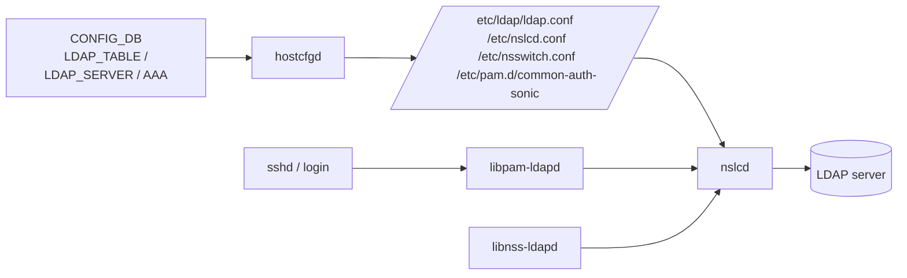

<!-- topics-tip -->
!!! tip "Topics で読み物として読む"
    この HLD は実装詳細を含みます。機能の概念・設定・運用を読み物として読みたい場合は [Topics 15 章: Security / AAA](../topics/15-security-aaa/index.md) を参照。
<!-- /topics-tip -->

!!! success "裏取りステータス: code-verified（基本構成のみ）"
    現行 master の `sonic-utilities/config/plugins/sonic-system-ldap_yang.py` で `ldap-server` グループ CLI が自動生成、`sonic-yang-models` の `sonic-system-ldap.yang` を確認。`hostcfgd` 内 AAA / LDAP 連携も sonic-host-services 側で対応している。Debian パッケージ (libnss-ldapd 等) のインストール経路は image_config では直接見つからなかったが、後続の host-services レイヤで取り込まれている（verified at: 2026-05-09）。

# LDAP 認証（hostcfgd / nslcd / NSS / PAM 連携）

## 概要

[SONiC](../reference/glossary.md#term-sonic) スイッチの SSH / シリアルログインを **外部 LDAP サーバで認証** できるようにする Phase 1 設計[^1]。Debian の `libnss-ldapd` / `libpam-ldapd` / `ldap-utils` パッケージを取り込み、`nslcd` デーモンで LDAP との通信を担当する。`hostcfgd` が [CONFIG_DB](../reference/glossary.md#term-config_db) の LDAP 関連テーブルを監視し、`/etc/ldap/ldap.conf` / `/etc/nslcd.conf` / `/etc/nsswitch.conf` / `/etc/pam.d/common-auth-sonic` を再生成する。

ローカル認証フォールバックと、LDAP サーバの優先度に基づく順序的フォールバックをサポート。**REST API（nginx）への適用は TODO**[^1]。

## 動作仕様

### 構成



### CONFIG_DB スキーマ（HLD より）

```text
LDAP_TABLE|global
    bind_dn       = ""             ; default empty (anonymous bind)
    bind_password = "****"         ; encrypted
    bind_timeout  = 5              ; seconds
    version       = 3              ; LDAPv3
    base_dn       = "ou=users,dc=example,dc=com"
    port          = 389
    timeout       = 5

LDAP_SERVER|<server_ip>
    priority = <int>               ; lower = preferred

AAA
    ; 既存テーブル。authentication フィールドで ldap を有効化
    authentication.login = "ldap,local"
```

### Init / 設定変更フロー

`hostcfgd` の [AAA](../reference/glossary.md#term-aaa) クラスは `LDAP_TABLE` / `LDAP_SERVER` / `AAA` 変更を購読し、jinja2 テンプレートから設定ファイルを再生成して `nslcd` を再起動する。LDAP 無効時は `nslcd` を停止し、PAM/NSS から LDAP モジュールを外す[^1]。

### パッケージ

ビルド時に追加：

- `libnss-ldapd`: NSS モジュール（getent passwd 等が LDAP を引く）
- `libpam-ldapd`: PAM モジュール（ssh login 認証）
- `ldap-utils`: `ldapsearch` / `ldapwhoami` 等のユーティリティ
- `nslcd`: NSS/PAM の lookup を LDAP にプロキシするデーモン（libnss-ldapd の依存）

### 認証フロー

1. ユーザが SSH ログイン → `sshd` が PAM 経由で認証要求
2. `pam_ldap` (libpam-ldapd) が `nslcd` 経由で LDAP サーバに `simple bind` を試行
3. 成功すれば認証 OK、失敗または接続失敗なら `AAA.authentication.login` の次のメソッド（`local` 等）にフォールバック
4. NSS 側 (`libnss-ldapd`) は `getpwnam` 等で LDAP の user/group エントリを返す

`LDAP_SERVER` の priority に基づいて nslcd は複数サーバを試す。

## 設定

### 関連する CONFIG_DB

| Table | 説明 |
|-------|------|
| `LDAP_TABLE` | グローバル LDAP 設定（base_dn / port / version / bind 認証 等） |
| `LDAP_SERVER` | サーバごとの優先度 |
| `AAA` | 既存。`authentication.login` でメソッド順を指定 |

### 関連する CLI

[HLD](../reference/glossary.md#term-hld) には CLI コマンド名の正式な体系は明記されていないが、既存の `config aaa authentication ...` を拡張する形で `ldap` メソッドを追加すると示唆されている。LDAP 固有設定用の `config ldap` 系コマンドが追加される想定。

### 関連する YANG

`sonic-system-ldap.yang`（HLD ディレクトリに同梱）。

### 設定例

```bash
# LDAP サーバ追加
sudo config ldap server add 10.0.0.1 --priority 1

# グローバル設定
sonic-cfggen -a '{
  "LDAP_TABLE": {
    "global": {
      "base_dn": "ou=users,dc=example,dc=com",
      "version": "3",
      "port": "389",
      "timeout": "5"
    }
  }
}' --write-to-db

# 認証メソッド設定
sudo config aaa authentication login ldap local
```

## 制限事項

- Phase 1 設計のため、TLS/StartTLS や SASL は HLD では言及が少ない（後続 phase で扱う想定）。
- REST API (nginx) への LDAP 認証適用は TODO[^1]。
- `bind_password` は CONFIG_DB に格納される（暗号化方式は HLD で詳細規定なし）。
- `nslcd` 再起動中は短時間ログイン認証が落ちる可能性がある。

## 干渉する機能

- **TACACS+ / [RADIUS](../reference/glossary.md#term-radius)（既存 AAA）**: 同じ AAA テーブルの authentication.login で並列指定可。順序フォールバックで連動する。
- **`hostcfgd` AAA クラス**: tacacs / radius / ldap いずれの設定変更も同クラスで処理される。
- **NSS**: `getent passwd` 等のシステムコールも LDAP を見るようになる（`/etc/nsswitch.conf` 経由）。
- **REST / [gNMI](../reference/glossary.md#term-gnmi)**: REST API 認証は本機能のスコープ外（TODO）。

## トラブルシューティング

- ログイン失敗 → `journalctl -u nslcd` で LDAP サーバ通信ログを確認。
- `getent passwd <user>` で LDAP ユーザが見えない → `/etc/nsswitch.conf` の `passwd:` 行に `ldap` が含まれているか確認。
- 認証は通るが `sudo` で失敗 → group 解決失敗の可能性。`getent group <gid>` で確認。
- bind 失敗 → `LDAP_TABLE.bind_dn` / `bind_password` と `base_dn` の対応、サーバ FQDN 解決を確認。

確認コマンド例:

```bash
# LDAP 認証設定と疎通確認
show aaa
ldapsearch -x -H ldap://<server> -b <base-dn>
cat /etc/nslcd.conf | head
journalctl -u nslcd | tail
```


## 引用元

[^1]: `sonic-net/SONiC` `doc/aaa/ldap/hld_ldap.md` @ `49bab5b5ff0e924f1ea52b3d9db0dfa4191a7c06`

<!-- topics-back-ref -->
## 関連 Topics

- [Topics: Security / AAA / FIPS / Hardening](../topics/15-security-aaa/index.md)

<!-- /topics-back-ref -->

<!-- ops-entry -->
## 運用入口

この HLD に対応する運用面の入口（CLI / CONFIG_DB / [YANG](../reference/glossary.md#term-yang) / Runbook）を以下にまとめる。

### 関連 CLI

- [`config aaa`](../reference/cli/config-aaa.md)
- `config ldap`
- `show ldap`

### 関連 CONFIG_DB

- `LDAP_TABLE`
- [LDAP_SERVER](../reference/config-db/ldap-server.md)
- [AAA](../reference/config-db/aaa.md)

### 関連 YANG

- [sonic-system-ldap](../reference/yang/sonic-system-ldap.md)

<!-- /ops-entry -->

<!-- glossary-links-injected: 6674ed3c9f67 -->
