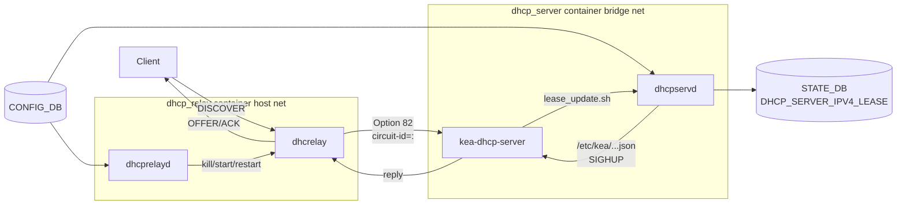

<!-- topics-tip -->
!!! tip "Topics で読み物として読む"
    この HLD は実装詳細を含む。機能の概念・設定・運用を読み物として読みたい場合は [Topics 16 章: NAT / DHCP / DNS](../topics/16-nat-dhcp-dns/index.md) を参照。
<!-- /topics-tip -->

!!! success "裏取りステータス: code-verified"
    `sonic-buildimage/dockers/docker-dhcp-server/` で dhcp_server コンテナ（Dockerfile.j2 / kea-dhcp4.conf.j2 / lease_update.sh / docker_init.sh / supervisord.conf）を確認。`sonic-buildimage/src/sonic-dhcp-utilities/dhcp_utilities/dhcpservd/dhcpservd.py` で dhcpservd daemon、`dhcp_utilities/dhcprelayd/dhcprelayd.py` で dhcprelayd を確認。`sonic-buildimage/dockers/docker-dhcp-relay/docker-dhcp-relay.supervisord.conf.j2` L92-93 で `[program:dhcprelayd]` の supervisord 起動を確認。`sonic-buildimage/src/sonic-yang-models/yang-models/sonic-dhcp-server-ipv4.yang` で YANG を確認（verified 2026-05-09）。

# ポートベース IPv4 DHCP Server（`kea-dhcp-server` + `dhcrelay` Option 82 連携）

## 概要

[SONiC](../reference/glossary.md#term-sonic) に **組み込み IPv4 DHCP Server** を持つ。MAC でも DHCP option でもなく **入ってきた物理 / [LAG](../reference/glossary.md#term-lag) ポート** で IP を割り当てる "port-based" モード[^1]。利点は[^1]:

- 設定外のポートからの request には IP を払い出さないため安全
- 外部ホスト情報を仕込まず、ポート単位で予約 IP / 範囲だけ書けば自走する小規模 NW 構築に向く

実体は **ISC kea-dhcp-server** に **既存の dhcrelay (`dhcrelay` の `-id <vlan>` で Option 82 を付ける機能)** を組み合わせる構成[^1]。

## 動作仕様

### 機能境界

- **per switch で enable/disable**。`FEATURE.dhcp_server.state` で制御し、デフォルトは disabled[^1]
- **同一スイッチで dhcp_relay と共存しない**。共存させたい (vlan 別 enable) 構想は将来課題[^1]
- 現状 **relay された DHCP request への応答は未対応**（option 82 を持って戻ってきたパケット処理は将来）[^1]

### コンテナ / プロセス構成



`dhcprelayd` は `VLAN` / `VLAN_MEMBER` / `DHCP_SERVER_IPV4*` を [CONFIG_DB](../reference/glossary.md#term-config_db) から subscribe し、関連変更や `dhcp_relay` container 起動時に `dhcrelay` プロセスを起動・再起動する[^1]。

### kea-dhcp-server の設定（dhcpservd が生成）

`dhcrelay` の Option 82 に **circuit-id = `<hostname>:<port_alias>` (例 `hostname:etp1`)** が乗ることを使い、kea 側で `client-classes` でクライアントを分類し、対応 pool から払い出す[^1]:

```json
{
  "Dhcp4": {
    "interfaces-config": { "interfaces": ["eth0"] },
    "client-classes": [
      { "name": "hostname-etp1", "test": "relay4[1].hex == 'hostname:etp1'" }
    ],
    "subnet4": [
      {
        "subnet": "192.168.0.0/24",
        "pools": [
          { "pool": "192.168.0.2 - 192.168.0.2", "client-class": "hostname-etp1" }
        ],
        "option-data": [
          { "name": "dhcp-server-identifier", "data": "192.168.0.1" }
        ]
      }
    ]
  }
}
```

`dhcp-server-identifier` (Option 54) は **DHCP インタフェース（dhcrelay 下流）IP** に書き換える。client が unicast RELEASE を投げる先を relay に向け、relay から server へ転送させるため[^1]。

### dhcrelay の起動例

```bash
./dhcrelay -d -m discard -a %h:%p %P \
  --name-alias-map-file /tmp/port-name-alias-map.txt \
  -id Vlan1000 -iu docker0 240.127.1.2
```

dhcp_server コンテナ側 IP は `240.127.1.2`（`DHCP_SERVER_IPV4_IP` テーブルで管理）[^1]。

### lease の STATE_DB 反映

kea の `libdhcp_run_script.so` フック経由で `/tmp/lease_update.sh` が走り、`/tmp/kea-lease.csv` を読んだ `dhcpservd` が `STATE_DB` の `DHCP_SERVER_IPV4_LEASE` を更新する[^1]:

```text
address,hwaddr,client_id,valid_lifetime,expire,subnet_id,...
192.168.0.2,aa:bb:cc:dd:ee:ff,,3600,1694000905,1,...
```

### Customized DHCP option

option 60 等を per-DHCP-interface で配るテーブル `DHCP_SERVER_IPV4_CUSTOMIZED_OPTIONS` を持つ[^1]。**禁止 option** は `1`（Subnet Mask）/ `3`（Router）/ `51`（Lease Time）/ `53`（Message Type）/ `54`（Server ID）。型は `binary` / `boolean` / `string` / `ipv4-address` / `uint8/16/32`[^1]。

## 設定

### CONFIG_DB

| Table | Key | 説明 |
|-------|-----|------|
| `DHCP_SERVER_IPV4` | `<vlan>` | mode=`PORT` / gateway / netmask / lease_time / state / customized_options 配列 |
| `DHCP_SERVER_IPV4_RANGE` | `<range_name>` | `ranges: [start, end]`（要素 1〜2） |
| `DHCP_SERVER_IPV4_PORT` | `<vlan>\|<port>` | `ips: [...]` または `ranges: [<range_name>...]` |
| `DHCP_SERVER_IPV4_CUSTOMIZED_OPTIONS` | `<name>` | `id` / `type` / `value` |
| `FEATURE.dhcp_server` | - | `state: enabled\|disabled` |

[YANG](../reference/glossary.md#term-yang) `must` 制約で **`ips` と `ranges` を同時指定不可**、`ranges` 配列は 1〜2 要素[^1]。

### CLI

| Command | 用途 |
|---------|------|
| `config dhcp_server ipv4 add/del/update --mode PORT [--dup_gw_nm] [--lease_time] [--gateway] [--netmask] <if>` | DHCP server 追加・削除・更新 |
| `config dhcp_server ipv4 enable/disable <if>` | 有効化（追加直後は disabled） |
| `config dhcp_server ipv4 range add/del/update <name> <start> [<end>]` | 範囲管理 |
| `config dhcp_server ipv4 bind/unbind <vlan> <port> (--range <list> \| <ip_list>)` | ポート → IP/範囲 紐付け |
| `config dhcp_server ipv4 option add/del/bind/unbind` | customized DHCP option 管理 |
| `show dhcp_server ipv4 info\|range\|option\|lease\|port` | 表示系 |

### 設定例

```bash
config dhcp_server ipv4 add --mode PORT --dup_gw_nm --lease_time 300 Vlan1000
config dhcp_server ipv4 range add range1 192.168.0.2 192.168.0.10
config dhcp_server ipv4 bind Vlan1000 Ethernet1 --range range1
config dhcp_server ipv4 enable Vlan1000
```

## 制限事項

- **モードは `PORT` のみ**。`DYNAMIC` 等は将来予定[^1]
- dhcp_server enable 中は dhcp_relay と同一スイッチで併用不可。CLI 側で拒否される[^1]
- ポート移動時の lease 振替は無く、**lease 期限切れまで旧ポートからの新規割当が止まる**ケースあり（[FDB](../reference/glossary.md#term-fdb) 連動の release は将来）[^1]
- `ranges` は 1〜2 要素 (start[, end])
- option 1/3/51/53/54 は customized で上書き不可

## 干渉する機能

- **dhcp_relay**: 同時 enable 不可。CLI 拒否
- **[VLAN](../reference/glossary.md#term-vlan) / [PortChannel](../reference/glossary.md#term-portchannel) / Port**: `DHCP_SERVER_IPV4_PORT` の参照先で leafref。VLAN 削除には連動チェックが必要

## トラブルシューティング

- `show dhcp_server ipv4 info` で per-VLAN state/gateway 確認
- lease 状況: `show dhcp_server ipv4 lease [<vlan>]`
- kea 直: `/tmp/kea-lease.csv` と `journalctl -u dhcp_server`
- relay 側: `dhcrelay -d` で foreground 起動して Option 82 内容を観察

確認コマンド例:

```bash
# DHCP server 状態とリース確認
show dhcp_server ipv4
docker exec dhcp_server ps aux | grep kea
redis-cli -n 4 hgetall 'DHCP_SERVER_IPV4|Vlan1000'
```


## 引用元

[^1]: [sonic-net/SONiC doc/dhcp_server/port_based_dhcp_server_high_level_design.md @ 49bab5b](https://github.com/sonic-net/SONiC/blob/49bab5b5ff0e924f1ea52b3d9db0dfa4191a7c06/doc/dhcp_server/port_based_dhcp_server_high_level_design.md)

<!-- topics-back-ref -->
## 関連 Topics

- [Topics: NAT / DHCP Relay / Time-DNS Services](../topics/16-nat-dhcp-dns/index.md)

<!-- /topics-back-ref -->

<!-- ops-entry -->
## 運用入口

この [HLD](../reference/glossary.md#term-hld) に対応する運用面の入口（CLI / CONFIG_DB / YANG / Runbook）を以下にまとめる。

### 関連 CLI

- `config dhcp_server ipv4`
- `show dhcp_server ipv4`

### 関連 CONFIG_DB

- [DHCP_SERVER_IPV4](../reference/config-db/dhcp-server-ipv4.md)
- `DHCP_SERVER_IPV4_RANGE`
- `DHCP_SERVER_IPV4_PORT`
- `DHCP_SERVER_IPV4_CUSTOMIZED_OPTIONS`
- [FEATURE](../reference/config-db/feature.md)

### 関連 YANG

- `sonic-dhcp-server-ipv4`

<!-- /ops-entry -->

<!-- glossary-links-injected: 987cec9fd0c5 -->
