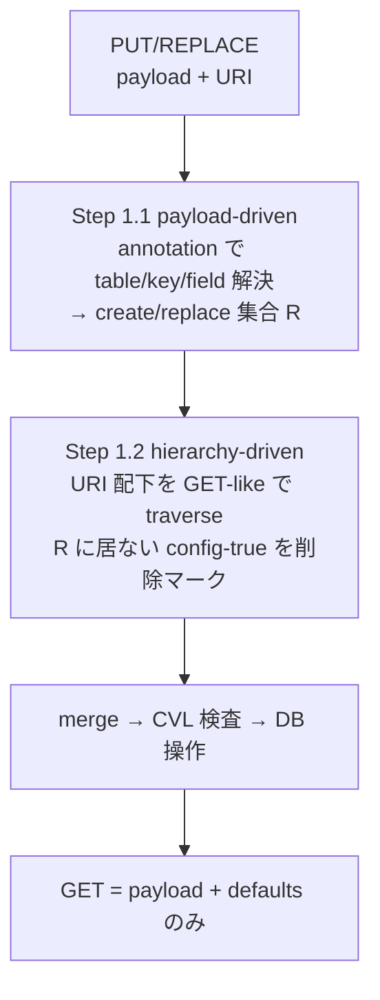

<!-- topics-tip -->
!!! tip "Topics で読み物として読む"
    この HLD は実装詳細を含みます。機能の概念・設定・運用を読み物として読みたい場合は [Topics 10 章: gNMI / OpenConfig / 管理プレーン](../topics/10-gnmi-openconfig/index.md) を参照。
<!-- /topics-tip -->

!!! success "裏取りステータス: code-verified (2026-05-10)"
    `sonic-mgmt-common/translib/transformer/` に transformer 本体と `xspec.go:941 case "validate-xfmr"` の処理、`models/yang/annotations/sonic-extensions.yang:78-79 extension validate-xfmr { argument "validate-xfmr-name"; }` で extension 定義公開。テスト用 `openconfig-test-xfmr-annot.yang` でも `sonic-ext:validate-xfmr` を実 annotation として使用。HLD で改名された validate-xfmr 名が現行 master に取り込み済み。

# Mgmt-Framework Transformer の model-based PUT/REPLACE と DELETE

## 読み手が知りたいこと

- 既存 PUT/DELETE の何が「自然じゃない」のか
- 「model 由来の自然な replace/delete」とは具体的にどんな挙動か
- payload と [YANG](../reference/glossary.md#term-yang) hierarchy traversal の **2 段階処理** はどう協調するか
- 新しい `validate-xfmr` annotation は何のためで、旧 `get-validate` とどう違うか
- defaults と DELETE が組み合わさったときの罠

## なぜ拡張が必要か

[SONiC](../reference/glossary.md#term-sonic) の Management Framework Transformer は **YANG（OpenConfig 等）↔ 内部 ABNF / [CONFIG_DB](../reference/glossary.md#term-config_db)** を変換するコンポーネント。これまで RESTCONF の **PUT/REPLACE と DELETE は YANG 階層の任意深さで正しく動かない** 問題があった[^1]:

- `PUT`: payload に無い兄弟ノードを残してしまう（純粋な replace ではない）
- `DELETE`: target だけ削除し、配下を残す

本 [HLD](../reference/glossary.md#term-hld) はこれを **任意深さで** 自然に動くようにする[^1]:

- **PUT 完了後**: GET で取れるのは **payload + defaults のみ**（同階層の他データは消える）
- **DELETE 完了後**: GET で配下も含めて空になる
- 親 instance に **無関係な兄弟階層** は影響なし

対象は **OpenConfig YANG 系**。SONiC YANG への展開は future[^1]。

## PUT/REPLACE は 2 段階処理



要点[^1]:

1. **Step 1.1 (payload)**:
    - list は payload の各要素を create/replace、存在しない list instance はキーで新規作成
    - container は entry 単位で create/replace
    - **defaults は payload で運ばれた key instance + その配下の同 table 範囲のみ** 適用（別 table に切れたら scope を抜ける）
    - 「複数 owner で 1 table」では target tree 配下の field だけ更新し外側は触らない
2. **Step 1.2 (hierarchy)**:
    - URI から下の `config true` を GET-like traversal
    - R に該当が無ければ delete マーク
    - **non-table-owner**: 該当 field のみ削除 / **table-owner**: instance ごと削除
    - **virtual table** は traversal にのみ使い削除対象から除外
    - subtree callback は path 上で呼ばれ結果を merge

## DELETE は Step 1.2 だけを適用

PUT の **Step 1.2 削除フロー** を URI 配下に適用する。Step 1.1 系の payload 処理は無い。例外: **leaf にデフォルト値が定義されている** 場合の DELETE は既存挙動を維持し、**leaf を消すのではなく default にリセット**[^1]。

## `validate-xfmr` annotation（`get-validate` から改名）

旧来 GET 専用だった `get-validate` annotation を **`validate-xfmr`** に改名し、CRUD 全般で使えるようにする[^1]。PUT / DELETE traversal 中に呼ばれ、ノードが **request 文脈で valid でない** と判定されたら、そのノードと配下は処理 skip される。

例: 機能 disable 中の配下細設定は、`validate-xfmr` で「対象外」を返せば PUT/DELETE で勝手に触られない。

## Defaults と DELETE の組合せ（罠）

[^1] の制限事項:

1. **defaults は PUT payload に存在する node とその配下の同 table 範囲のみ** 適用
2. **GET-like delete flow で削除対象になった field/table instance の defaults は適用されない**（明示削除 → default に戻らず完全消去）
3. ただし **leaf-only DELETE** で default 値があるなら default にリセット（既存仕様維持）

## 設定例

```bash
# RESTCONF PUT で deep replace
curl -k -X PUT -H "Content-Type: application/yang-data+json" \
  -d '{"openconfig-acl:acl-set":[{"name":"BLOCK","type":"ACL_IPV4", ...}]}' \
  https://<dut>/restconf/data/openconfig-acl:acl/acl-sets/acl-set=BLOCK,ACL_IPV4

# DELETE で配下ごと削除
curl -k -X DELETE \
  https://<dut>/restconf/data/openconfig-acl:acl/acl-sets/acl-set=BLOCK,ACL_IPV4
```

関連する **CONFIG_DB / CLI は無し**（transformer infra の挙動変更）。

## 制限事項

- 対象は OpenConfig YANG 系のみ、SONiC YANG への展開は future
- defaults 適用範囲は payload 存在 node + 同 table 配下
- アプリ側 callback（特に post transformer）が独自削除をしていた場合、新挙動と整合させる必要
- `get-validate` → `validate-xfmr` への移行はアプリ側 YANG 注釈更新が必要

## 干渉する機能

- **CVL**（Config Validation Library）: 既存通り呼ばれる
- **subtree / post-transformer callback**: アプリ実装次第でカバー範囲が変わる
- **[gNMI](../reference/glossary.md#term-gnmi) / RESTCONF**: PUT / DELETE セマンティクス変更の影響先
- **OpenConfig YANG models**: 主対象 / **SONiC YANG**: future

## トラブルシューティング

```bash
docker logs mgmt-framework 2>&1 | tail
sudo journalctl -u mgmt-framework
curl -i -k -X PUT ... | head -1
```

## 引用元

[^1]: `sonic-net/SONiC` `doc/mgmt/Management_Framework_Transformer_Component_Support_For_Model_based_Replace_And_Delete.md` @ `49bab5b5ff0e924f1ea52b3d9db0dfa4191a7c06`

## 関連ページ

- [Topic: gNMI / OpenConfig](../topics/10-gnmi-openconfig/index.md)
- [HLD: SONiC gNMI Server インタフェース設計](sonic-gnmi-server-interface-design.md)
- [HLD: SONiC Management Framework](sonic-management-framework.md)

<!-- glossary-links-injected: 8ba32e5aa69d -->
