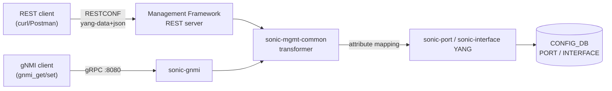

<!-- topics-tip -->
!!! tip "Topics で読み物として読む"
    この HLD は実装詳細を含む。機能の概念・設定・運用を読み物として読みたい場合は [Topics 10 章: gNMI / OpenConfig / 管理プレーン](../topics/10-gnmi-openconfig/index.md) を参照。
<!-- /topics-tip -->

!!! success "裏取りステータス: code-verified"
    `sonic-mgmt-common/models/yang/openconfig-if-ethernet.yang` L162 `identity SPEED_400GB` / L172 `identity SPEED_800GB` を確認（200/600GB も同 yang 内）。`sonic-mgmt-common/translib/transformer/xfmr_intf.go` L3796-3828 で `ipv6_use_link_local_only` フィールドの YangToDb / DbToYang transformer 実装を確認（`oc-ip:enabled` ↔ `ipv6_use_link_local_only` mapping）。`sonic-mgmt-common/models/yang/annotations/openconfig-interfaces-annot.yang` L54-90 で `oc-eth:ethernet/state/oc-lag:aggregate-id` の deviation と PortChannel min-links field-transformer を確認。translib transformer 配下に統合済み（verified at: 2026-05-09）。

# OpenConfig Interfaces YANG（Ethernet 設定の REST/gNMI 対応と sonic-mgmt-common transformer）

## 概要

`openconfig-interfaces` / `openconfig-if-ethernet` / `openconfig-if-ip` を **REST (RESTCONF) と [gNMI](../reference/glossary.md#term-gnmi)** で配信する仕組みを [SONiC](../reference/glossary.md#term-sonic) の Management Framework に追加する設計[^1]。

ポイント[^1]:

- **CLI（KLISH）はスコープ外**。REST と gNMI のみ
- subinterface は **index 0 のみ** をエミュレート（subinterfaces 構成自体は対象外）
- gNMI **subscription** は対象外（GET / SET / DELETE のみ）
- secondary IP 構成は対象外
- 既存の **translib App ベース実装を transformer ベース実装に置き換える** 方向性
- **[CONFIG_DB](../reference/glossary.md#term-config_db) / APP_DB / [STATE_DB](../reference/glossary.md#term-state_db) / [ASIC_DB](../reference/glossary.md#term-asic_db) / COUNTER_DB のスキーマ追加なし**[^1]。OpenConfig [YANG](../reference/glossary.md#term-yang) → 既存 SONiC YANG への mapping だけで処理する

実装は `sonic-mgmt-common` リポジトリの **Management Framework コンテナ**（REST server + gnmi コンテナ）に入る[^1]。

## 動作仕様

### 全体構成



OpenConfig パスを受けた Management Framework / sonic-gnmi は、`sonic-mgmt-common` の **transformer** に流す。transformer が attribute mapping（次節）で SONiC YANG（`sonic-port` / `sonic-interface`）に変換し、最終的に CONFIG_DB に書く[^1]。

### 対応する OpenConfig YANG

スコープにある主要ノード[^1]:

```text
module: openconfig-interfaces
+--rw interfaces
   +--rw interface* [name]
      +--rw config { name, type, mtu, description, enabled }
      +--ro state  { 上記 + ifindex, admin-status, oper-status, last-change, ... + counters }
      +--rw subinterfaces/subinterface[index=0]
      |  +--rw oc-ip:ipv4 { addresses/address[ip] { config/state ip,prefix-length } }
      |  +--rw oc-ip:ipv6 { addresses + config { enabled (default false) } }
      +--rw oc-eth:ethernet
      |  +--rw config { auto-negotiate, port-speed, oc-lag:aggregate-id }
      +--rw oc-lag:aggregation { config/state min-links }
```

### Attribute mapping

OpenConfig → SONiC YANG の対応[^1]:

**`openconfig-interfaces` ⇄ `sonic-port`**:

| OpenConfig | sonic-port |
|-----------|-----------|
| `name` | `name` |
| `auto-negotiate` | `autoneg` |
| `port-speed` | `speed` |
| `description` | `description` |
| `mtu` | `mtu` |
| `enabled` | `admin_status` |
| `ifindex` | `index` |
| `oper-status` | `oper_status` |
| `last-change` | `last_up/down_time` |

**`openconfig-if-ip` ⇄ `sonic-interface`**:

| OpenConfig | sonic-interface |
|-----------|----------------|
| `name` | `name` |
| `oc-ip:ipv6/config/enabled` | `ipv6_use_link_local_only` |
| `subinterface index` | `index`（0 のみ） |
| `prefix-length` | `ip-prefix` 内の長さ |

### 速度 identity の拡張

`openconfig-if-ethernet.yang` に upstream OpenConfig コミュニティの speed identity を取り込む[^1]:

- `SPEED_200GB`
- `SPEED_400GB`
- `SPEED_600GB`
- `SPEED_800GB`

### REST/gNMI 操作

GET / PATCH / DELETE はすべて **leaf レベルまで** サポート。例[^1]:

```bash
# GET (leaf)
curl -k "https://<dut>/restconf/data/openconfig-interfaces:interfaces/interface=Ethernet104/config/mtu" \
  -H "accept: application/yang-data+json"

# PATCH (leaf)
curl -X PATCH -k "https://<dut>/restconf/data/openconfig-interfaces:interfaces/interface=Ethernet104/config/mtu" \
  -H "Content-Type: application/yang-data+json" \
  -d '{"openconfig-interfaces:mtu": 9150}'

# DELETE (leaf)
curl -X DELETE -k "https://<dut>/restconf/data/openconfig-interfaces:interfaces/interface=Ethernet104/config/mtu"
```

gNMI 側は GET / SET / DELETE のみ対応（Subscribe は **対象外**）[^1]。

<!-- evidence:
source: sonic-net/SONiC/doc/mgmt/OpenConfig_Interfaces.md#L271-L290 (sha: 49bab5b5ff0e924f1ea52b3d9db0dfa4191a7c06)
excerpt: |
  Mapping attributes between OpenConfig YANG and SONiC YANG:
  | OpenConfig YANG | Sonic-port YANG |
  | name | name |
  | auto-negotiate | autoneg |
  | port-speed | speed |
  ...
  | enabled | ipv6_use_link_local_only |
reasoning: transformer の attribute mapping ルールの根拠。
-->

<!-- evidence-rendered:start -->
??? note "📋 検証エビデンス: sonic-net/SONiC/doc/mgmt/OpenConfig_Interfaces.md#L271-L290 (sha: 49bab5b5ff0e924f1ea52b3d9db0dfa4191a7c06)"

    **出典**:

    `sonic-net/SONiC/doc/mgmt/OpenConfig_Interfaces.md#L271-L290 (sha: 49bab5b5ff0e924f1ea52b3d9db0dfa4191a7c06)`

    **抜粋**:

    ```text
    Mapping attributes between OpenConfig YANG and SONiC YANG:
    | OpenConfig YANG | Sonic-port YANG |
    | name | name |
    | auto-negotiate | autoneg |
    | port-speed | speed |
    ...
    | enabled | ipv6_use_link_local_only |
    ```

    **判断根拠**: transformer の attribute mapping ルールの根拠。

<!-- evidence-rendered:end -->

### Negative ケース（仕様上は禁止）

[HLD](../reference/glossary.md#term-hld) の Negative Test Cases から派生する不可操作[^1]:

- `interfaces` / `interface` / `interface/name` コンテナそのものへの **DELETE 不可**
- Ethernet interface への `REPLACE` 不可（PATCH のみ）
- `port-speed` の **DELETE は not supported**（再設定で上書き）
- subinterface index > 0 の GET は **empty** を返す
- 別 interface に既に振られている IP の **重複設定不可**
- `ipv4` / `ipv6` コンテナそのものへの DELETE 不可

## 設定

### 関連する CONFIG_DB

| Table | Key | OpenConfig 由来フィールド |
|-------|-----|---------------------------|
| `PORT` | `<Ethernet>` | `mtu`, `admin_status`, `description`, `autoneg`, `speed`, `oper_status` |
| `INTERFACE` | `<Ethernet>\|<ip-prefix>` | IPv4 / IPv6 アドレス, `ipv6_use_link_local_only` |

CONFIG_DB **スキーマ自体の変更は無い**[^1]。既存テーブルへの read/write を transformer 経由で実施する。

### 関連する CLI

このページは REST/gNMI 専用。SONiC KLISH CLI は **スコープ外**[^1]。

### 関連する YANG

OpenConfig 公開モデル + 既存 SONiC YANG。マッピング先 / マッピング元の両方を記載。

### 設定例（gNMI）

```bash
# auto-negotiate を true に設定
echo '{"openconfig-if-ethernet:config":{"auto-negotiate":true}}' > an.json
gnmi_set -insecure -username admin -password sonicadmin \
  -update /openconfig-interfaces:interfaces/interface[name=Ethernet0]/openconfig-if-ethernet:ethernet/config:@./an.json \
  -target_addr localhost:8080 -xpath_target OC-YANG
```

## 制限事項

- **subinterface index は 0 のみ**[^1]。RFC 8343 のような 1+ 個の subinterface は非対応
- **gNMI Subscribe 非対応**[^1]
- **Secondary IP 非対応**[^1]
- KLISH CLI 経由ではこれらの OC YANG は呼べない（REST/gNMI 限定）[^1]
- `port-speed` は DELETE できない[^1]
- IPv6 `enabled` は **デフォルト `false`**[^1]。OpenConfig の通常解釈と異なるので注意

## 干渉する機能

- **既存 SONiC CLI / `config interface ...`**: KLISH は別経路で同じ CONFIG_DB を変更する。並行設定で競合する場合は最後の write が勝つ
- **[portsyncd](../reference/glossary.md#term-portsyncd) / IntfMgr**: CONFIG_DB の `PORT` / `INTERFACE` を監視する既存 daemon。OpenConfig 経由の変更も同経路で APP_DB / kernel に反映される
- **SONiC YANG validation ([sonic-mgmt](../reference/glossary.md#term-sonic-mgmt)-common)**: transformer は SONiC YANG の制約を後段で適用するため、OpenConfig 側で valid でも SONiC YANG 側で reject される可能性
- **gNSI Pathz**: 有効化されていれば、OC path 単位で gNMI read/write が認可で絞られる

## トラブルシューティング

- `Resource Not Found` が `auto-negotiate` で返る: HLD いわく DELETE 後の GET は意図的に Not Found を返す[^1]
- `port-speed` を消そうとすると `not supported`: 仕様通り。代わりに上書き PATCH を使う
- subinterface index > 0 で GET → 空配列: 仕様通り、`empty` を返す[^1]
- 重複 IP エラー: 別の interface に既に存在している。validation で reject される

確認コマンド例:

```bash
# OpenConfig YANG path / gNMI 確認
gnmi_cli -a 127.0.0.1:8080 -get 'openconfig-interfaces:interfaces' -insecure
show runningconfiguration all | jq .INTERFACE
```

## 引用元

[^1]: `sonic-net/SONiC` `doc/mgmt/OpenConfig_Interfaces.md` @ `49bab5b5ff0e924f1ea52b3d9db0dfa4191a7c06`

<!-- concerns hint:
- sonic-mgmt-common 内の transformer が openconfig-interfaces / -if-ethernet / -if-ip を実装しているか
- subinterface index 0 のみ対応の実装方針確認
- ipv6/config/enabled → ipv6_use_link_local_only マッピングの実装確認
- SPEED_200/400/600/800GB identity の YANG 取り込み済みか
- translib App から transformer への移行進捗
- 重複 IP 検出の実装位置（transformer / SONiC YANG validator）
-->

<!-- ops-entry -->
## 運用入口

この HLD に対応する運用面の入口（CLI / CONFIG_DB / YANG / Runbook）を以下にまとめる。

### 関連 CONFIG_DB

- [PORT](../reference/config-db/port.md)
- [INTERFACE](../reference/config-db/interface.md)

### 関連 YANG

- `openconfig-interfaces`
- `openconfig-if-ethernet`
- `openconfig-if-ip`
- `openconfig-if-aggregate`
- [sonic-port](../reference/yang/sonic-port.md)
- [sonic-interface](../reference/yang/sonic-interface.md)

<!-- /ops-entry -->

<!-- glossary-links-injected: 34da0d5f7679 -->
