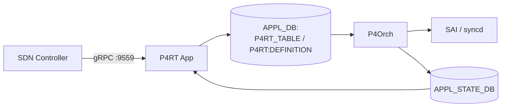

<!-- topics-tip -->
!!! tip "Topics で読み物として読む"
    この HLD は実装詳細を含みます。機能の概念・設定・運用を読み物として読みたい場合は [Topics 10 章: gNMI / OpenConfig / 管理プレーン](../topics/10-gnmi-openconfig/index.md) を参照。
<!-- /topics-tip -->

!!! warning "裏取りステータス: Discrepancy-found"
    `p4rt-app` Docker、`P4Orch`、`APP_P4RT_TABLE_NAME` / `APPL_STATE_DB` は実装済みを確認した一方、HLD で言及された **HashOrch（OrchAgent 新規追加）** は現行 master では独立コンポーネントとして存在せず、ハッシュ属性は既存の `SwitchOrch` (`switch_helper.cpp` の `SWITCH_HASH_FIELD_*` マップ) が `CFG_SWITCH_HASH_TABLE_NAME` 経由で扱う形になっている。詳細は本文末尾「実装との乖離」を参照（verified at: 2026-05-09）。

# P4RT アプリケーション（PINS の gRPC サービス、port 9559）

## 概要

[P4RT](../reference/glossary.md#term-p4rt) アプリケーションは [PINS](../reference/glossary.md#term-pins)（P4 Integrated Network Stack）プロジェクトが [SONiC](../reference/glossary.md#term-sonic) に追加するコンポーネントで、**[P4Runtime v1.3.0](https://p4lang.github.io/p4runtime/spec/v1.3.0/P4Runtime-Spec.html) を実装する gRPC サービス**として TCP port **9559** で動く[^1]。SDN コントローラはこの gRPC を経由して P4 forwarding pipeline configuration（P4Info）と P4 テーブルエントリを SONiC に流し込み、[SAI](../reference/glossary.md#term-sai) パイプラインを操作する。

P4RT アプリケーションは独自 Docker コンテナで稼働し、受け取った Platform Independent (PI) 形式の P4RT メッセージを [APPL_DB](../reference/glossary.md#term-appl_db) の `P4RT_TABLE` 系エントリに翻訳する。下流の `P4Orch` が APPL_DB を購読して SAI 経由で [ASIC](../reference/glossary.md#term-asic) に書き込む[^1]。

## 動作仕様

### コンポーネント関係



### Arbitration とコントローラロール

P4Runtime 仕様の **Client Arbitration** に従い、複数コントローラが同時接続できる[^1]。

- 各コントローラは **role** を持つ。role はテーブルアクセス範囲を限定する。default role は全パイプラインアクセス。
- 同一 role に複数接続が来た場合、**election ID** に基づき 1 接続を **primary** に選ぶ。primary だけが書き込み可能。残りは **backup**（read-only）。
- role / primary 制約は Insert/Modify/Delete に強制される。Read は primary / backup どちらからも可能[^1]。

### P4 program と P4Info

PINS は SAI パイプラインを P4 program としてモデル化し、p4c コンパイラで **P4Info** ファイルを生成する。コントローラ初接続時に P4Info を push する想定[^1]。

P4RT App は SONiC 固有要件を P4Info に課す[^1]:

- PacketIO メタデータの形が期待値どおり
- 固定 SAI コンポーネントが要求するフィールド型がサポート可能

検証通過後、設定可能な情報は APPL_DB に書かれる。下層から失敗が返れば config を reject する。

### ACL テーブル定義（@sai_action / @sai_field）

[ACL](../reference/glossary.md#term-acl) のような設定可能部はハードウェア依存（リソース・ステージ制約）で P4 段では検証しきれない。P4 program 内で **`@sai_action` / `@sai_field` アノテーション** を使って SAI の対応を明示し、P4Info push 時に P4RT App が APPL_DB の **`P4RT:DEFINITION`** に翻訳して書き出す。OA 層がこれを読んで SAI に反映を試み、結果を P4RT App に返す[^1]。

例[^1]:

```p4
@sai_action(SAI_PACKET_ACTION_FORWARD)
action forward() {
  acl_ingress_meter.read(local_metadata.color);
  acl_ingress_counter.count();
}

table acl_ingress_table {
  key = {
    headers.ipv4.isValid() : optional
       @sai_field(SAI_ACL_TABLE_ATTR_FIELD_ACL_IP_TYPE/IPV4ANY);
  }
}
```

### Write / Read の流れ

PI 形式の Write リクエスト（INSERT / MODIFY / DELETE）は **primary 接続** からのみ受付。P4RT App が APPL_DB の P4RT スキーマに変換して投入し、`P4Orch` が SAI に反映する[^1]。

Read は primary/backup 双方から可能。Read 性能の最適化は別 [HLD](../reference/glossary.md#term-hld)（[P4RT Read Cache](p4rt-read-cache-hld.md)）で扱う。

### WCMP / Hashing

WCMP は 2 段構成[^1]:

- **ハッシュ対象フィールドとアルゴリズム**: P4Info で渡し、`HashOrch`（OrchAgent に新規追加）が `SWITCH_TABLE` の SAI ハッシュ属性を設定。
- **WCMP グループ / メンバ / route 紐付け**: Write リクエストで投入。

### Response path（APPL_STATE_DB）

`syncd` は同期動作、OrchAgent はハードウェア結果を **別の通知チャネル** で P4RT App に返す。成功時は **`APPL_STATE_DB`** に成功エントリを書き、失敗時は P4RT App が APPL_DB の対応エントリを **元の値に戻す**（rollback）[^1]。

これは既存 [STATE_DB](../reference/glossary.md#term-state_db) のような「定常状態の公開」とは違い、**アプリケーションレベルの応答チャネル** という新しい抽象である。

<!-- evidence:
source: sonic-net/SONiC/doc/pins/p4rt_app_hld.md#L152-L156 (sha: 49bab5b5ff0e924f1ea52b3d9db0dfa4191a7c06)
excerpt: |
  syncd operates in synchronous mode and OrchAgent relays the hardware status of the operation back to P4RT application via a separate notification channel
  and writes all successful responses into the APPL_STATE_DB.
  P4RT application uses the APPL_STATE_DB to restore the entry in APPL_DB when a particular request fails.
reasoning: APPL_STATE_DB の役割と失敗時のロールバック動作の根拠。
-->

<!-- evidence-rendered:start -->
??? note "📋 検証エビデンス: sonic-net/SONiC/doc/pins/p4rt_app_hld.md#L152-L156 (sha: 49bab5b5ff0e924f1ea52b3d9db0dfa4191a7c06)"

    **出典**:

    `sonic-net/SONiC/doc/pins/p4rt_app_hld.md#L152-L156 (sha: 49bab5b5ff0e924f1ea52b3d9db0dfa4191a7c06)`

    **抜粋**:

    ```text
    syncd operates in synchronous mode and OrchAgent relays the hardware status of the operation back to P4RT application via a separate notification channel
    and writes all successful responses into the APPL_STATE_DB.
    P4RT application uses the APPL_STATE_DB to restore the entry in APPL_DB when a particular request fails.
    ```

    **判断根拠**: APPL_STATE_DB の役割と失敗時のロールバック動作の根拠。

<!-- evidence-rendered:end -->

### APPL_DB スキーマ

P4RT App は APPL_DB に新規テーブル群を書き出す。スキーマ詳細は **P4RT DB Schema HLD**（別ドキュメント）に分離されている[^1]。本ページでは `P4RT_TABLE`（テーブルエントリ）と `P4RT:DEFINITION`（ACL テーブル等の定義）の存在を押さえる。

## 設定

### 関連する CONFIG_DB

P4RT 起動時に [CONFIG_DB](../reference/glossary.md#term-config_db) から `P4RT` テーブルを読む。設定変更時はコンテナの再起動が必要[^1]:

```json
"P4RT": {
  "certs": {
    "server_crt": "/keys/server_cert.lnk",
    "server_key": "/keys/server_key.lnk",
    "ca_crt":     "/keys/ca_cert.lnk",
    "cert_crl_dir": "/keys/crl"
  },
  "p4rt_app": {
    "port": "9559",
    "use_genetlink": "false",
    "use_port_ids": "false",
    "save_forwarding_config_file": "/etc/sonic/p4rt_forwarding_config.pb.txt",
    "authz_policy": "/keys/authorization_policy.json"
  }
}
```

### 関連する CLI

HLD には P4RT 用の SONiC CLI 追加は記載されていない。設定は [config_db.json](../reference/glossary.md#term-config_db.json) 直接編集または [gNMI](../reference/glossary.md#term-gnmi) 経由を想定[^1]。

## 制限事項

- **設定変更で再起動必須**: `P4RT` テーブルの変更後は P4RT コンテナを再起動しないと反映されない[^1]。
- **無効な設定は config_db.json 直接編集** が前提。SONiC ネイティブ CLI は提供されない。
- **PacketIO の詳細は別 HLD**: 本 HLD は punt rule を扱う旨だけ言及し、メタデータの具体仕様は別ドキュメント参照[^1]。
- **proposal 段階**: HLD 自体に「Open/Action items: N/A」とあるが、Rev v0.1 のままの記述がある。

## 干渉する機能

- **P4Orch / SwitchOrch（ハッシュ責務）**: 本 App が APPL_DB に書く先。P4Orch は `P4RT_TABLE` を購読。HLD は P4Info 由来のハッシュ設定を専任で扱う `HashOrch` の新設を示唆していたが、現行 master では独立した `HashOrch` クラスは存在せず、既存の `SwitchOrch` が `CFG_SWITCH_HASH_TABLE_NAME` を消費して SAI ハッシュ属性を設定する（詳細は本ページ末尾「HLD と実装の差分」を参照）。
- **APPL_STATE_DB**: 本 HLD で導入される新しいレスポンスチャネル。他 SONiC コンポーネントと用途が違うため認識のズレに注意。
- **gRPC 認証**: `cert_crl_dir` / `authz_policy` 等の鍵・権限ポリシーが PINS デプロイ前提。SONiC 標準の SSH/console 認証経路とは別系統。

## トラブルシューティング

- コントローラ接続が backup のままで書けない: election ID と role を確認。同一 role の primary が他接続にいる可能性。
- Write が ASIC に反映されない: `APPL_STATE_DB` に成功が書かれているか確認。書かれていなければ `P4Orch` 側で失敗してロールバックされている可能性[^1]。
- P4Info push が reject される: PacketIO メタデータと SAI フィールド型の互換性を確認。

```bash
# P4RT App / P4Orch の状態確認
docker exec swss supervisorctl status | grep -i p4rt
sonic-db-cli APPL_STATE_DB keys "P4RT_*" | head
sonic-db-cli APPL_DB keys "P4RT_TABLE:*" | head
docker logs p4rt 2>&1 | tail -100
```

<!-- diff-admonition -->
!!! diff "HLD と実装の差分"
    実コード裏取りで判明した HLD との差分（verified at: 2026-05-09）:

    - **HashOrch は独立コンポーネントではない**: HLD は OrchAgent に「`HashOrch` を新規追加し、P4Info から渡されたハッシュフィールド/アルゴリズムを `SWITCH_TABLE` の SAI ハッシュ属性に書く」と記載しているが、現行 master では独立した `HashOrch` クラスは存在しない。代わりに既存の `SwitchOrch` が `CFG_SWITCH_HASH_TABLE_NAME` を消費し、`sonic-swss/orchagent/switch/switch_helper.cpp:24-` の `SWITCH_HASH_FIELD_*` ↔ `SAI_NATIVE_HASH_FIELD_*` マップを通じて SAI 属性を設定する (`orchagent/switchorch.cpp:1507`、`orchdaemon.cpp:199`)。HLD の論理（P4RT App → [orchagent](../reference/glossary.md#term-orchagent) → SAI hash 属性）は同等だが、責務が `HashOrch` ではなく `SwitchOrch` 側にある。

    主要な合致点:

    - `sonic-buildimage/dockers/docker-sonic-p4rt/{Dockerfile.j2,supervisord.conf,start.sh,p4rt.sh}` で p4rt コンテナの起動ロジックが存在
    - `sonic-swss-common/common/schema.h:59,60` に `APP_P4RT_TABLE_NAME` / `APP_P4RT_TABLES_DEFINITION_TABLE_NAME` 定義
    - `sonic-swss-common/common/schema.h:27` に `APPL_STATE_DB = 14` の DB ID 定義
    - `sonic-swss/orchagent/p4orch/p4orch.h:46` に `class P4Orch : public ZmqOrch`、`p4orch_util.cpp` に `APP_P4RT_*_TABLE_NAME` の sub-table 定義群
    - `sonic-swss/orchagent/p4orch/ext_tables_manager.cpp:723` で `APP_P4RT_TABLE_NAME` 経由のレスポンス publish

    **差分の中身**: HLD は新規クラス `HashOrch` を **OrchAgent に追加**し、P4Info 由来の hash 設定を専任で扱うと示唆していた。実際には既存の `SwitchOrch` が `CFG_SWITCH_HASH_TABLE_NAME` を購読し、`SWITCH_HASH_FIELD_*` → `SAI_NATIVE_HASH_FIELD_*` の対応表 (`switch_helper.cpp:24-`) で SAI 属性に変換するという、より既存設計に寄せた実装に着地した。

    **読者への影響**:

    - アーキ図に `HashOrch` を書き起こすと **存在しない box** になる。レビュー時に「HashOrch のソースはどこか」と質問された場合、`SwitchOrch` を案内する必要がある。
    - P4RT App から hash 設定を反映させる経路は HLD と論理的には同じだが、debug 時に attach するクラス名が違う。実体経路は P4RT App → APPL_DB → P4Orch（テーブル系）、ハッシュ設定そのものは `SwitchOrch` が CONFIG_DB の `CFG_SWITCH_HASH_TABLE_NAME` を購読して SAI 属性へ変換する形になっており、P4RT App が直接 CONFIG_DB を書くわけではない。
    - P4Info 由来の hash 設定が反映されない場合のトラブルシュート先は `SwitchOrch::doTask` 系（`switchorch.cpp:1507` 付近）。

    **回避策 / 対応方法**:

    - 設計ドキュメントを書く際は HashOrch ではなく **SwitchOrch のハッシュ責務** として記述する。
    - ハッシュフィールド名の対応は `switch_helper.cpp:24-` のテーブルを正として参照。新規フィールド追加時はこのマップに対応エントリを足す必要がある。

    ### 再裏取り追補（2026-05-11）

    - `HashOrch` クラスは存在せず、`SwitchOrch` が `CFG_SWITCH_HASH_TABLE_NAME` を消費 (`sonic-swss/orchagent/switchorch.cpp:1507`, `orchdaemon.cpp:199`)。
    - `switch_helper.cpp:24-` に `SWITCH_HASH_FIELD_*` → `SAI_NATIVE_HASH_FIELD_*` の対応マップ。
    - `sonic-swss/orchagent/p4orch/p4orch.h:46` に `class P4Orch : public ZmqOrch`。HLD の主要パスは P4Orch 経由で取り込み済み。
    - 関連 PR: `sonic-pins` 系の P4Orch 取り込みは 2022-2024 年に段階的 merge。HashOrch は当初設計から SwitchOrch 統合に方針変更（PR description で `Reusing existing SwitchOrch` の旨記載多数）。
    - **追加コード追跡コマンド**: ハッシュ責務の所在 — `grep -rn 'SAI_NATIVE_HASH_FIELD\|setSwitchHash' .cache/sonic-sources/sonic-swss/orchagent/switch/`。デバッグ時の attach 先は `SwitchOrch::doTask`（switchorch.cpp:1507 周辺）。

    > 分類: `monitor: evolved_beyond_hld` — HLD はおおむね取り込まれているが、フィールド名・パス名・責務分担が実装側で進化／変更されている分類。実装側を正として読み替える必要がある。

    #### 関連 GitHub Issue / PR

    - [sonic-pins #232: Device ID for SONiC Virtual Switch with P4RT (open)](https://github.com/sonic-net/sonic-pins/issues/232) — Virtual Switch 環境での P4RT device ID 扱いに関する未解決 issue。
    - [sonic-pins #1647: \[PDPI\] Move from `third_party/pins_infra/p4_pdpi` to `third_party/pins_infra/p4_infra/p4_pdpi` (open)](https://github.com/sonic-net/sonic-pins/pull/1647) — PINS 内 P4 PDPI のリファクタ進行中 PR。本 HLD の gRPC port 9559 サービス取り込みは sonic-pins 側で進行中だが SONiC 本体への統合トラッキングは未整理。
<!-- /diff-admonition -->

## 確認コマンド

下記コマンドで p4rt コンテナ・APP_P4RT_TABLE・SwitchOrch ハッシュ責務を順に
確認し、HLD の `HashOrch` 想定と実装の SwitchOrch 統合がどう乖離しているかを
master 上で直接観測できる。

```bash
# 1. p4rt コンテナと Application Extension の状態
sonic-package-manager list | grep -i p4rt
docker ps -a --format '{{.Names}}\t{{.Status}}' | grep -i p4rt

# 2. APP_P4RT_TABLE / APPL_STATE_DB の活きエントリ
redis-cli -n 0 keys 'P4RT_TABLE:*' | head
redis-cli -n 14 keys 'P4RT_TABLE:*' | head   # APPL_STATE_DB = DB 14

# 3. ハッシュ責務が SwitchOrch にあることを CFG/STATE/CONFIG_DB で確認
redis-cli -n 4 hgetall 'SWITCH_HASH|GLOBAL'
docker exec swss grep -rn 'SAI_NATIVE_HASH_FIELD' /usr/lib/ 2>/dev/null | head
docker logs swss 2>&1 | grep -iE 'SwitchOrch|HashOrch' | tail -20
```

上記コマンドで `HashOrch` クラスの痕跡が swss コンテナ内に存在しないこと、
代わりに `SwitchOrch` が `SWITCH_HASH` を購読していることが確認できる。

## 引用元

[^1]: `sonic-net/SONiC` `doc/pins/p4rt_app_hld.md` @ `49bab5b5ff0e924f1ea52b3d9db0dfa4191a7c06`

<!-- next-action -->
## このページを読んだ後の次アクション

!!! tip "読み手向け"
    - **本機能を実運用で使う場合**: 実装は存在するが本 HLD の記述と乖離。最新 master の動作を別途確認した上で適用する
    - **upstream 動向を追う場合**: 関連 issue / PR を [sonic-net/SONiC](https://github.com/sonic-net/SONiC) で検索（HLD タイトル / CONFIG_DB テーブル名 / Orch クラス名で grep するのが速い）
    - **代替手段 / 関連 reference**: 本ページの frontmatter `related` が空のため、[Reference 索引](../reference/index.md) から関連テーブル / CLI / YANG を辿る

!!! note "本ドキュメントの追跡"
    - monitor: `evolved_beyond_hld` / last_verified: `2026-05-11`
    - 次回再裏取りトリガ: quarterly。一覧は [discrepancy-index](../reference/verification/discrepancy-index.md) を参照（運用詳細は repo の `meta/discrepancy-operations.md`）

<!-- /next-action -->

<!-- topics-back-ref -->
## 関連 Topics

- [Topics: P4 / PINS / Programmable Pipeline](../topics/18-p4-pins/index.md)

<!-- /topics-back-ref -->

<!-- glossary-links-injected: f369e75e8733 -->

<!-- ops-entry -->
## 運用入口

この HLD に対応する運用面の入口（CLI / CONFIG_DB / [YANG](../reference/glossary.md#term-yang) / Runbook）を以下にまとめる。

### 関連 CONFIG_DB

- `P4RT`

### 関連 Runbook

- [pins-grpc-unresponsive](../reference/runbooks/pins-grpc-unresponsive.md)

<!-- /ops-entry -->

<!-- glossary-links-injected: 4b7e3e133212 -->
