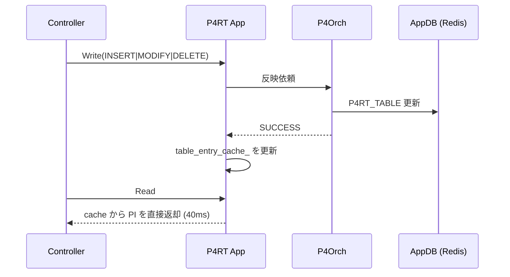

<!-- topics-tip -->
!!! tip "Topics で読み物として読む"
    この HLD は実装詳細を含みます。機能の概念・設定・運用を読み物として読みたい場合は [Topics 10 章: gNMI / OpenConfig / 管理プレーン](../topics/10-gnmi-openconfig/index.md) を参照。
<!-- /topics-tip -->

!!! success "裏取りステータス: code-verified（命名差分あり）"
    `sonic-pins/p4rt_app/p4runtime/p4runtime_impl.cc` および `p4runtime_read.cc` で実装を確認。HLD の `table_entry_cache_` は実装では `entity_cache_`（type は `absl::flat_hash_map<pdpi::EntityKey, p4::v1::Entity>`）に汎化されており、TableEntry に加え PacketReplicationEngineEntry も保持する。Write 連動更新は `UpdateCacheAndUtilizationState`（INSERT/MODIFY 反映 + DELETE で `erase`）、Read は `entity_cache_` 走査で AppDb を見ない経路 (`p4runtime_read.cc` AppendTableEntryReads)、検証ロジックは `P4RuntimeImpl::VerifyState()` で `VerifyP4rtTableWithCacheEntities` を呼ぶ実装を確認。warm boot は `warm_boot_state_adapter_` でフレームワーク化済み（HLD 記載の事前充填案を踏まえた基盤）(verified at: 2026-05-09)。

# P4RT App の Read キャッシュ（PI 形式の table_entry_cache_）

## 概要

P4 Runtime ([P4RT](../reference/glossary.md#term-p4rt)) サーバはコントローラから 3 種の操作（Stream / Write / Read）を受ける。[SONiC](../reference/glossary.md#term-sonic) の P4RT App は **1 リクエスト同時実行** モデルで動くため、Read が遅いと Write を含む他リクエストが詰まる[^1]。

実測では 16,000 フローの Read で **約 1.30s** を要し、その大半（1.28s）が AppDb ([Redis](../reference/glossary.md#term-redis)) の `HGETALL` を 16,000 回叩く時間で消える。さらに Redis の生データを Platform Independent (PI) 形式へ変換する処理にも一定時間がかかる[^1]。

本機能は P4RT App プロセス内に **PI 形式そのままを保持するキャッシュ** を持たせ、Read 時には Redis にアクセスせずキャッシュから直接返す。実測では同等のフロー数で Read が **40ms**（約 40 倍高速化）に短縮される[^1]。

## 動作仕様

### キャッシュ実体

```cpp
absl::flat_hash_map<TableEntryKey, p4::v1::TableEntry> table_entry_cache_;
```

Key は `TableEntryKey`（テーブル + match key の合成）、値は **PI 形式の `p4::v1::TableEntry`**。Read リクエスト時の翻訳コストをゼロにするため、書き込み時点で PI に変換した状態で持つ[^1]。

### Write 連動

P4Orch から成功応答が返ったら、Write 種別に応じてキャッシュを更新する[^1]:

| Write 種別 | 結果 | キャッシュ操作 |
|-----------|------|---------------|
| any       | FAIL | 何もしない |
| INSERT    | SUCCESS | 新規 PI エントリ追加 |
| MODIFY    | SUCCESS | 既存 PI エントリ更新 |
| DELETE    | SUCCESS | 既存 PI エントリ削除 |



### Read

Read リクエストは Redis を見ずキャッシュを直接走査して返す。これにより `KEYS P4RT_TABLE:*` + `HGETALL` ループの O(N) Redis 往復が消える[^1]。

### キャッシュと AppDb の同期検証

P4Orch は P4 エントリを **独自に書き換えない** 想定なので、定常的なポーリングは不要[^1]。ただし「2 つの Source of Truth」が原理的に存在するため、[HLD](../reference/glossary.md#term-hld) は明示的に **検証ロジック** を組み込むと述べる[^1]:

1. Redis の全 `P4RT_TABLE` エントリを読む
2. 各エントリを PI 形式に変換
3. キャッシュと比較
4. 差分（片方にしかない / 値違い）をレポート

実行頻度はオペレータが設定する。

### Warm boot

P4RT App は現時点で warm boot 未対応だが、対応する際は **既存の Redis 読み出し経路を再利用してキャッシュを事前充填** する設計を HLD は提示している[^1]。

<!-- evidence:
source: sonic-net/SONiC/doc/pins/p4rt_app_read_cache_hld.md#L40-L58 (sha: 49bab5b5ff0e924f1ea52b3d9db0dfa4191a7c06)
excerpt: |
  The cache will be updated for each P4RT App write request based on the P4Orch agents response.
  ... INSERT/SUCCESS -> Create a new PI entry; MODIFY/SUCCESS -> Update; DELETE/SUCCESS -> Remove
  ... we will also implement verification logic that ensures the cache and AppDb entries are in sync.
reasoning: Write 連動更新ルールと検証ロジックの根拠。
-->

<!-- evidence-rendered:start -->
??? note "📋 検証エビデンス: sonic-net/SONiC/doc/pins/p4rt_app_read_cache_hld.md#L40-L58 (sha: 49bab5b5ff0e924f1ea52b3d9db0dfa4191a7c06)"

    **出典**:

    `sonic-net/SONiC/doc/pins/p4rt_app_read_cache_hld.md#L40-L58 (sha: 49bab5b5ff0e924f1ea52b3d9db0dfa4191a7c06)`

    **抜粋**:

    ```text
    The cache will be updated for each P4RT App write request based on the P4Orch agents response.
    ... INSERT/SUCCESS -> Create a new PI entry; MODIFY/SUCCESS -> Update; DELETE/SUCCESS -> Remove
    ... we will also implement verification logic that ensures the cache and AppDb entries are in sync.
    ```

    **判断根拠**: Write 連動更新ルールと検証ロジックの根拠。

<!-- evidence-rendered:end -->

### 性能測定（HLD 添付）

| 実験 | 内容 | Read 時間 |
|------|------|----------|
| Exp.1 (cache 無し) | 16,000 フロー end-to-end Read | ~1.30s（うち 1.28s が Redis 読み）|
| Exp.2 (cache 無し) | 22,152 フロー、種別混在。Redis 読み 1.27s + PI 変換 0.29s | ~1.60s |
| Exp.3 (cache 有り) | 22,152 フロー（[VRF](../reference/glossary.md#term-vrf) 64, [RIF](../reference/glossary.md#term-rif) 64, Neighbor 512, Nexthop 512, IPv4 10000, IPv6 10000, WCMP 1000×2）| **40ms** |

PI 形式キャッシュのメモリ占有[^1]:

| エントリ種別 | 1 件あたり | 合計（Exp.3 の規模）|
|-------------|-----------|----------------------|
| VRF       | ~29 B  | ~1.8 KB |
| RIF       | ~61 B  | ~4 KB   |
| Neighbor  | ~79 B  | ~40 KB  |
| Nexthop   | ~91 B  | ~47 KB  |
| IPv4      | ~68 B  | ~685 KB |
| IPv6      | ~80 B  | ~805 KB |
| WCMP      | ~100 B | ~100 KB |

数十万エントリ規模でも MB オーダの追加メモリで済む見積。

## 設定

### 関連する CONFIG_DB / CLI / YANG

本機能はプロセス内最適化であり、[CONFIG_DB](../reference/glossary.md#term-config_db) / CLI / [YANG](../reference/glossary.md#term-yang) への外部表面は持たない。設定項目は HLD 上では言及されていない（オン/オフのフラグや検証頻度の設定有無は実装依存）。

### 設定例

該当なし（コードビルド時の機能）。

## 制限事項

- **2 つの Source of Truth リスク**: cache と AppDb がずれる可能性は構造上ゼロにできない。HLD は検証ロジックでの突合を必須としている[^1]。
- **Warm boot は未対応**: 現時点で P4RT App が warm boot 未対応のため、再起動でキャッシュは消える。前述の事前充填策は将来の対応案[^1]。
- **メモリ消費**: PI 形式の保持で常駐メモリが増える。HLD の見積では数十万エントリで数 MB だが、[ACL](../reference/glossary.md#term-acl) 等で大規模化するとさらに増える。

## 干渉する機能

- **P4Orch / SWSS**: P4Orch が P4RT App を経由せずに `P4RT_TABLE` を書き換えると cache が古くなる。HLD は P4Orch が独自書き換えしない前提を置く[^1]。
- **P4RT 同時 1 リクエスト制約**: cache 化は本質的に「1 リクエスト直列処理ゆえに Read 遅延が他を阻害する」ことへの対症療法。同時実行モデルへの移行は別議論。
- **ACL counters**: 既存実装は ACL エントリの counter を CountersDb から読みに行く。cache がこれをどうカバーするか HLD は明記していない（counter は別経路で取得する想定と読める）。

## トラブルシューティング

- 検証ロジックが差分を報告する: P4Orch 側が独自に AppDb を書き換えていないか確認。または cache 更新タイミングの race を疑う。
- Read が依然遅い: cache 自体が無効化されている、または初回起動時で cache 未充填の可能性。
- メモリ増加が想定外: エントリ種別ごとの 1 件サイズ（前掲表）を参考に、実際のフロー数と突き合わせる。

確認コマンド例:

```bash
# P4RT controller 接続/cache 状態
docker ps | grep p4rt
docker logs p4rt 2>&1 | tail
redis-cli -n 0 keys 'P4RT_TABLE:*' | head
```

## 引用元

[^1]: `sonic-net/SONiC` `doc/pins/p4rt_app_read_cache_hld.md` @ `49bab5b5ff0e924f1ea52b3d9db0dfa4191a7c06`

<!-- topics-back-ref -->
## 関連 Topics

- [Topics: P4 / PINS / Programmable Pipeline](../topics/18-p4-pins/index.md)

<!-- /topics-back-ref -->

<!-- ops-entry -->
## 運用入口

この HLD に対応する運用面の入口（CLI / CONFIG_DB / YANG / Runbook）を以下にまとめる。

### 関連 Runbook

- [pins-grpc-unresponsive](../reference/runbooks/pins-grpc-unresponsive.md)

<!-- /ops-entry -->

<!-- glossary-links-injected: f235cb0ee2df -->
