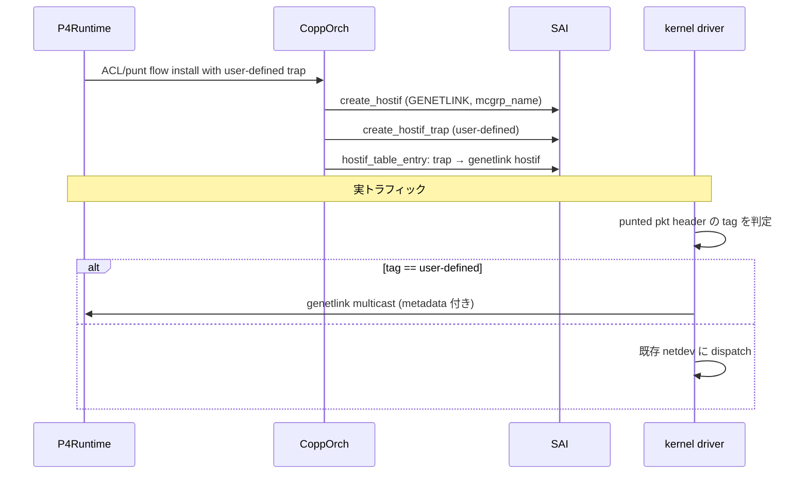
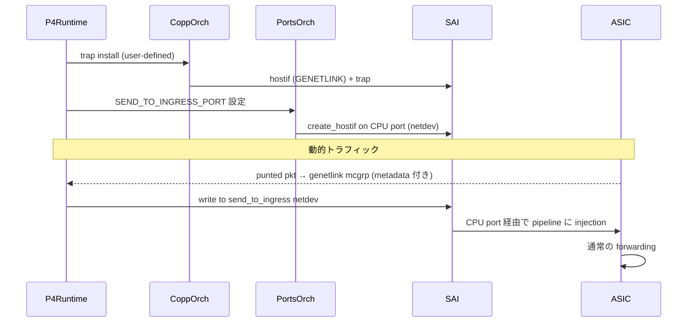

!!! success "裏取りステータス: Code-verified（SONiC 共通基盤）"
    `sonic-swss/orchagent/copporch.h` L44-46 で `genetlink_name` / `genetlink_mcgrp_name` フィールドを確認、`copporch.cpp` L446 (`SAI_HOSTIF_TABLE_ENTRY_CHANNEL_TYPE_GENETLINK`)、L657-669 `CoppOrch::createGenetlinkHostIf()`、L833-844 で trap_group ごとに genetlink hostif 作成する経路を確認。`sonic-swss/orchagent/portsorch.cpp` L771 (`APP_SEND_TO_INGRESS_PORT_TABLE_NAME` の Table 登録)、L7106-7120 `PortsOrch::addSendToIngressHostIf()`、`orchdaemon.cpp` L219 でテーブル登録優先度も確認。`sonic-buildimage/files/image_config/copp/copp_cfg.j2` L76-83 で `queue2_group1` に `genetlink_mcgrp_name: "packets"` / `genetlink_name: "psample"` の trap group 定義を確認。ベンダ依存の kernel `genl_packet` filter 実装は SONiC リポジトリ範囲外で本ページのスコープ外 (verified at: 2026-05-09)。

# P4Runtime PacketIO（generic netlink + send_to_ingress）

## 概要

SONiC は通常の netdev 経由の Packet I/O をサポートしているが、**P4Runtime（PINS / SDN コントローラ）** には固有の要件があり、それを満たすための拡張を本 HLD が定義する[^1]。

要件[^1]:

- **Receive**:
    - controller が install した punt flow に **マッチするパケットだけ** が届く専用チャネル
    - パケットの **input port + target egress port (= switch pipeline で出ていたであろう port)** をメタデータとして取得
- **Transmit**:
    - 任意の設定済み port に直接 packet を出す **directed transmit**
    - **`send_to_ingress`** 機能で「ASIC の forwarding pipeline に再注入」して egress 選択を ASIC に任せる送信モード

## 動作仕様

### Receive 側設計

#### genetlink hostif 利用

通常の netdev port は **すべての punt パケット** を受信し、メタデータも input port のみ。P4Runtime はこれを区別したいため、**`SAI_HOSTIF_TYPE_GENETLINK` 型の hostif** を使う[^1]:

| SAI 属性 | 用途 |
|----------|------|
| `SAI_HOSTIF_TYPE_GENETLINK` | hostif 種別 = generic netlink |
| `SAI_HOSTIF_ATTR_GENETLINK_MCGRP_NAME` | 受信側が listen する multicast group 名 |

これは sFlow の sample 配信と同じ仕組み。

#### user-defined trap → genetlink hostif

P4Runtime は **user-defined trap** を作成し、これを genetlink hostif に bind する。`HOSTIF_TABLE_ENTRY` で trap → hostif マッピングを programming する[^1]:



#### CoppOrch の役割

CoppOrch は **CPU queue ごとの新 trap group** を処理し[^1]、ACL entry ごとに user-defined trap を作る:

- 受信 punt パケットの **CPU QoS queue を ACL entry 単位で制御**
- trap → hostif マッピングを CONFIG_DB の `copp_cfg.j2` 由来で生成

### ベンダドライバ側の Receive 実装

ASIC ベンダの kernel ドライバ（DMA 受信側）に 3 つの責務[^1]:

#### 1. パケット経路判定

各 punt パケットの header に含まれる識別子を見て、**netdev へ送るか genetlink へ送るか** を判定:

```c
#define GENL_PACKET_NAME "genl_packet"

static int knet_filter_cb(uint8_t *pkt, int size, int dev_no, void *meta,
                          int chan, kcom_filter_t *kf)
{
    if (strncmp(kf->desc, PSAMPLE_CB_NAME, KCOM_FILTER_DESC_MAX) == 0)
        return psample_filter_cb(pkt, size, dev_no, meta, chan, kf);
    if (strncmp(kf->desc, GENL_PACKET_NAME, KCOM_FILTER_DESC_MAX) == 0)
        return generic_filter_cb(pkt, size, dev_no, meta, chan, kf);
    return strip_tag_filter_cb(pkt, size, dev_no, meta, chan, kf);
}
```

#### 2. メタデータ抽出と汎用形式化

ベンダ固有 (unit / port number) を **`ifindex` 等の汎用表現** に変換。sFlow 実装の流用が想定される。

#### 3. genetlink で送出

`ingress_ifindex` / `egress_ifindex` 等の属性をパックし、generic netlink multicast socket に送る。SONiC 側に **vendor-independent な submodule** が用意されている[^1]。

### Transmit 側設計

#### Directed transmit

特別な変更は不要。P4Runtime は init 時に各 netdev port の socket を作り、対応 socket に `write()` する。

#### `send_to_ingress`

新しい **CPU port 紐づけ netdev port** を作り、そこに書いたパケットが **ASIC の forwarding pipeline の入口** に注入される[^1]。

```mermaid
graph LR
    P4[P4Runtime app] -->|write socket| NDV[send_to_ingress<br/>netdev port]
    NDV --> CPU[CPU port (ASIC)]
    CPU --> PIPE[ASIC forwarding pipeline]
    PIPE --> EGR[egress port 自動選択]
```

設定は `CONFIG_DB` の **`SEND_TO_INGRESS_PORT`** table[^1]:

```json
{
  "SEND_TO_INGRESS_PORT": {
    "send_to_ingress": {}
  }
}
```

`PortsOrch` がこれを購読し、SAI の `create_hostif` を CPU port に対して呼び **netdev type hostif を CPU port に紐づけて作る**[^1]。

#### ベンダ Transmit 拡張

[^1]:

- 通常 SAI の hostif (netdev) は **physical port / VLAN / LAG にのみ作れる**。CPU port 用に作れるよう拡張が必要
- packet が **CPU port から ingress** したときに ASIC が forward するためのベンダ固有設定（通常 CPU port は egress 側のみ）

### イベントフロー（receive + transmit 統合）



## 設定

### 関連する CONFIG_DB

| Table | Key | フィールド | 説明 |
|-------|-----|-----------|------|
| `SEND_TO_INGRESS_PORT` | `send_to_ingress` | (空) | CPU port を ingress として使う netdev port を作る |

### 関連する SAI

| 機能 | 利用 |
|------|------|
| `SAI_HOSTIF_TYPE_GENETLINK` | generic netlink hostif 作成 |
| `SAI_HOSTIF_ATTR_GENETLINK_MCGRP_NAME` | listen するマルチキャストグループ名 |
| `create_hostif (CPU port)` | send_to_ingress の netdev hostif 作成（ベンダ拡張） |

### 関連する CLI

本 HLD は **CLI 拡張を伴わない**[^1]。P4Runtime / PINS スタック側の設定経路を使う。

### 設定例

```json
// /etc/sonic/config_db.json 抜粋
{
  "SEND_TO_INGRESS_PORT": {
    "send_to_ingress": {}
  }
}
```

実運用は P4Runtime コントローラが punt flow / send_to_ingress 操作を行うため、ユーザがコマンドで触る場面は少ない。

## 制限事項

- **ベンダ kernel driver の対応必須**[^1]。`generic_filter_cb` 等の実装が無い ASIC では receive metadata が出ない
- send_to_ingress は **SAI hostif の CPU port 対応** が必要。community SAI / ベンダ SAI 双方の対応次第
- P4Runtime / PINS スタック前提の設計であり、汎用 SDN 用ではない
- `SEND_TO_INGRESS_PORT` の table 名 / フィールドが固定（`send_to_ingress` 単一エントリ）
- punt パケットへのメタデータ付与は **ベンダ独自の packet header tag** に依存。標準フォーマット未定
- HLD 当時 (2021) は P4Runtime + PINS が新興。current master の取り込み状況は別途確認

## 干渉する機能

- **`CoppOrch`**: user-defined trap + genetlink hostif の生成主体
- **`PortsOrch`**: `SEND_TO_INGRESS_PORT` の処理 + CPU port 用 netdev hostif 作成
- **既存 sFlow / `psample` 系**: genetlink 仕様を流用するため共存可能
- **ベンダ ASIC SDK / kernel driver**: receive 経路と CPU port ingress を実装する責務
- **P4Runtime daemon**: コントローラ側 endpoint
- **既存 CoPP (`copp_cfg.j2`)**: trap group / queue マッピングの拡張

## トラブルシューティング

- punt パケットが genetlink に出ない → `dmesg` で kernel driver の filter が登録されているか、user-defined trap が SAI に作られているか確認
- `send_to_ingress` から送ったパケットが forwarding されない → ベンダ SAI が CPU port ingress を許可しているか、ASIC で `SEND_TO_INGRESS_PORT` 配下の netdev port が見えるか (`ip link`)
- メタデータ ifindex が 0 → ベンダ kernel driver の metadata 抽出ロジックが未実装の可能性
- 通常 netdev とのパケット重複受信 → user-defined trap → genetlink hostif マッピングが正しく適用されているか確認

## 引用元

[^1]: `sonic-net/SONiC` `doc/pins/Packet_io.md` @ `49bab5b5ff0e924f1ea52b3d9db0dfa4191a7c06`

<!-- concerns hint:
- CoppOrch の user-defined trap + GENETLINK hostif 生成の現行実装確認
- SEND_TO_INGRESS_PORT table の PortsOrch 処理 + CPU port netdev hostif 作成実装確認
- SAI_HOSTIF_TYPE_GENETLINK / SAI_HOSTIF_ATTR_GENETLINK_MCGRP_NAME の community SAI 取り込み確認
- ベンダ kernel driver の genl_packet filter 実装と generic netlink 送信 submodule の現行 sonic-buildimage への取り込み確認
- copp_cfg.j2 の per-CPU-queue trap group 設定の現行確認
- P4Runtime / PINS スタックの SONiC master 取り込み状況確認
-->
