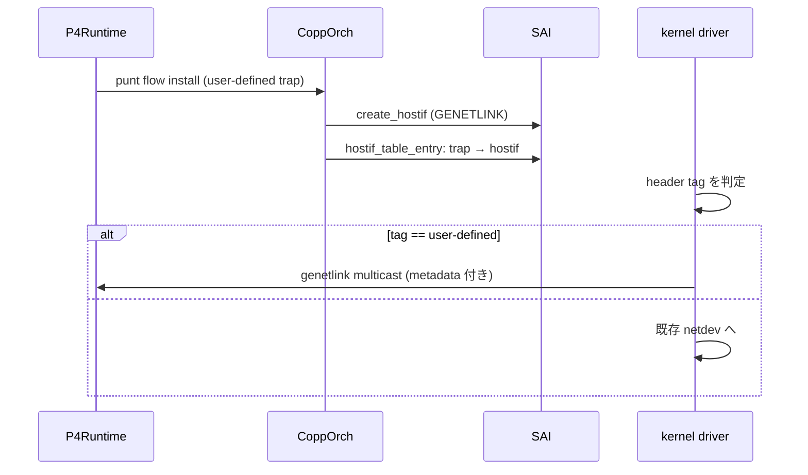
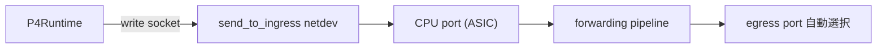

<!-- topics-tip -->
!!! tip "Topics で読み物として読む"
    この HLD は実装詳細を含みます。機能の概念・設定・運用を読み物として読みたい場合は [Topics 10 章: gNMI / OpenConfig / 管理プレーン](../topics/10-gnmi-openconfig/index.md) を参照。
<!-- /topics-tip -->

!!! success "裏取りステータス: code-verified（SONiC 共通基盤）"
    `copporch` の `genetlink_name` / `genetlink_mcgrp_name` フィールドと `createGenetlinkHostIf()`、`portsorch` の `APP_SEND_TO_INGRESS_PORT_TABLE_NAME` 登録と `addSendToIngressHostIf()`、`copp_cfg.j2` の `queue2_group1` に `genetlink_mcgrp_name: "packets"` / `genetlink_name: "psample"` を確認。kernel `genl_packet` filter のベンダ側実装はリポジトリ外でスコープ外 (verified at: 2026-05-09)。

# P4Runtime PacketIO

## 読み手が知りたいこと

- 通常の netdev PacketIO で何が足りなくて、なぜ別経路が必要なのか
- 受信側で **input port + 期待 egress port** メタデータをどう運ぶか
- `send_to_ingress` とは何で、どこで設定するか
- ベンダ [ASIC](../reference/glossary.md#term-asic) ドライバに何を実装してもらう必要があるか

## なぜ PacketIO に拡張が要るか

通常 netdev では **すべての punt パケット** が同じ経路に来てしまい、メタデータも input port のみ。P4Runtime（[PINS](../reference/glossary.md#term-pins) / SDN コントローラ）は次が必要[^1]:

- Receive: controller が install した punt flow にマッチする **専用チャネル**、**input port + target egress port** のメタデータ付き
- Transmit: 任意 port への directed transmit、および **`send_to_ingress`**（ASIC pipeline 再注入で egress 選択を ASIC に任せる送信モード）

## Receive 側設計（generic netlink + user-defined trap）

通常 netdev とは別に **`SAI_HOSTIF_TYPE_GENETLINK`** 型 hostif を作り、user-defined trap を `HOSTIF_TABLE_ENTRY` で bind する[^1]。

| [SAI](../reference/glossary.md#term-sai) 属性 | 用途 |
|----------|------|
| `SAI_HOSTIF_TYPE_GENETLINK` | generic netlink hostif |
| `SAI_HOSTIF_ATTR_GENETLINK_MCGRP_NAME` | listen する multicast group 名 |

sFlow / psample と同じ仕組みを流用。



CoppOrch は **CPU queue ごとの新 trap group** を処理し、[ACL](../reference/glossary.md#term-acl) entry 単位で trap を作る[^1]。

## ベンダ kernel driver の責務（3 つ）

以下の 3 点をベンダ kernel driver が実装する[^1]。

1. **経路判定**: punt パケット header の識別子で netdev か genetlink か振り分け。`knet_filter_cb` で `GENL_PACKET_NAME` を分岐:

    ```c
    if (strncmp(kf->desc, GENL_PACKET_NAME, ...) == 0)
        return generic_filter_cb(...);
    ```

2. **メタデータ正規化**: ベンダ固有 (unit / port) を `ifindex` 等の汎用表現に変換（sFlow 実装の流用想定）。
3. **generic netlink で送出**: `ingress_ifindex` / `egress_ifindex` をパックし multicast socket へ。

## Transmit 側設計

### Directed transmit

特別な変更不要。P4Runtime が init 時に各 netdev port socket を作り `write()`[^1]。

### `send_to_ingress`

**CPU port に紐づく新 netdev port** を作り、そこに書いたパケットを **ASIC pipeline の入口** に再注入する[^1]:



設定は [CONFIG_DB](../reference/glossary.md#term-config_db) の `SEND_TO_INGRESS_PORT`:

```json
{"SEND_TO_INGRESS_PORT": {"send_to_ingress": {}}}
```

`PortsOrch` がこれを購読し、SAI `create_hostif` を **CPU port に対して** 呼ぶ（netdev type hostif を CPU port に紐づける）[^1]。

### ベンダ Transmit 拡張

通常 SAI hostif (netdev) は **physical port / [VLAN](../reference/glossary.md#term-vlan) / [LAG](../reference/glossary.md#term-lag) にのみ作成可能**。CPU port 用に作れるようベンダ SAI の拡張が必要[^1]。CPU port ingress を ASIC が forward するベンダ固有設定もセットで要る。

## 設定

### CONFIG_DB

| Table | Key | フィールド | 説明 |
|-------|-----|-----------|------|
| `SEND_TO_INGRESS_PORT` | `send_to_ingress` | (空) | CPU port を ingress として使う netdev port を作る |

### SAI

| 機能 | 利用 |
|------|------|
| `SAI_HOSTIF_TYPE_GENETLINK` | Receive チャネル |
| `SAI_HOSTIF_ATTR_GENETLINK_MCGRP_NAME` | multicast group 名 |
| `create_hostif (CPU port)` | send_to_ingress netdev（ベンダ拡張）|

### CLI

本 [HLD](../reference/glossary.md#term-hld) は CLI 拡張を伴わない[^1]。P4Runtime / PINS コントローラ経由で操作する。

### 設定例

```json
// /etc/sonic/config_db.json 抜粋
{"SEND_TO_INGRESS_PORT": {"send_to_ingress": {}}}
```

## 制限事項

- **ベンダ kernel driver の対応必須**。`generic_filter_cb` が無い ASIC では receive metadata が出ない[^1]
- send_to_ingress は SAI hostif の **CPU port 対応** が前提
- P4Runtime / PINS スタック前提、汎用 SDN 用途ではない
- `SEND_TO_INGRESS_PORT` の table 名 / フィールドが固定
- punt パケットへのメタデータ付与は **ベンダ独自 packet header tag** に依存（標準フォーマット未定）

## 干渉する機能

- **CoppOrch**: user-defined trap + genetlink hostif 生成主体
- **PortsOrch**: `SEND_TO_INGRESS_PORT` 処理 + CPU port netdev 作成
- **既存 sFlow / `psample`**: genetlink 仕様を共有
- **ベンダ [ASIC SDK](../reference/glossary.md#term-asic-sdk) / kernel driver**: receive 経路と CPU port ingress を実装
- **既存 [CoPP](../reference/glossary.md#term-copp) (`copp_cfg.j2`)**: trap group / queue マッピングの拡張

## トラブルシューティング

- punt が genetlink に出ない → kernel driver filter 登録、user-defined trap の SAI 作成を `dmesg` で確認
- send_to_ingress から forward されない → ベンダ SAI の CPU port ingress 対応、`ip link` で netdev 確認
- メタデータ ifindex が 0 → kernel driver の metadata 抽出未実装の可能性
- 通常 netdev と重複受信 → trap → hostif マッピング適用確認

確認コマンド例:

```bash
# Host-CPU packet I/O / send-to-ingress 確認
ip -s -s link show eth0
redis-cli -n 4 hgetall 'HOST_INTERFACE|<name>'
docker logs swss 2>&1 | grep -i 'hostif' | tail
```


## 引用元

[^1]: `sonic-net/SONiC` `doc/pins/Packet_io.md` @ `49bab5b5ff0e924f1ea52b3d9db0dfa4191a7c06`

## 関連ページ

- [Topic: ACL / CoPP / Mirror](../topics/07-acl-copp-mirror/index.md)
- [HLD: send_to_ingress](send-to-ingress-hld.md)

<!-- concerns hint:
- CoppOrch の user-defined trap + GENETLINK hostif 生成の現行実装確認
- SEND_TO_INGRESS_PORT の PortsOrch 処理 + CPU port netdev hostif 作成確認
- SAI_HOSTIF_TYPE_GENETLINK / GENETLINK_MCGRP_NAME の community SAI 取り込み確認
- ベンダ kernel driver の genl_packet filter 実装の現行確認
- copp_cfg.j2 の per-CPU-queue trap group 設定の現行確認
-->

<!-- topics-back-ref -->
## 関連 Topics

- [Topics: P4 / PINS / Programmable Pipeline](../topics/18-p4-pins/index.md)

<!-- /topics-back-ref -->

<!-- glossary-links-injected: 334f0ec53f10 -->

<!-- ops-entry -->
## 運用入口

この HLD に対応する運用面の入口（CLI / CONFIG_DB / [YANG](../reference/glossary.md#term-yang) / Runbook）を以下にまとめる。

### 関連 CONFIG_DB

- `SEND_TO_INGRESS_PORT`

<!-- /ops-entry -->

<!-- glossary-links-injected: c006405759d8 -->
